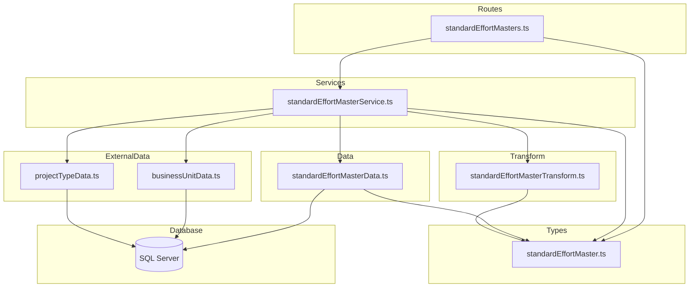
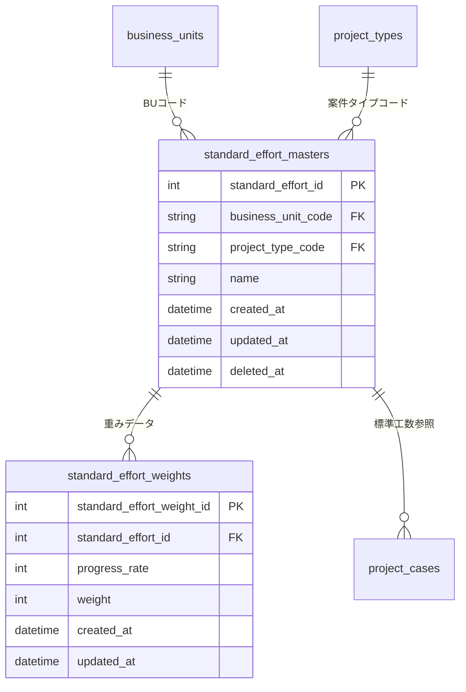

# Design Document: standard-effort-masters-crud-api

## Overview

**Purpose**: 標準工数マスタ（standard_effort_masters）のCRUD APIを提供し、事業部リーダーがBU×案件タイプごとの標準工数パターン（Sカーブ・バスタブカーブ等）の登録・参照・更新・削除を行えるようにする。

**Users**: 事業部リーダー、フロントエンド開発者が、標準工数パターンの管理画面やAPI連携で利用する。

**Impact**: 既存CRUDエンティティに続く新規実装。子テーブル（standard_effort_weights）との親子操作パターンを新たに導入する点が、既存実装との主な差異となる。

### Goals
- standard_effort_masters テーブルに対する完全なCRUD操作（一覧・単一取得・作成・更新・論理削除・復元）の提供
- standard_effort_weights の同時取得・作成・全置換の実現
- 既存のレイヤードアーキテクチャパターン（routes → services → data → transform → types）への準拠

### Non-Goals
- standard_effort_weights の個別CRUD操作（個別の weight レコードの追加・更新・削除エンドポイント）
- フロントエンド実装
- 標準工数パターンに基づく工数計算ロジック

## Architecture

### Existing Architecture Analysis

既存のバックエンドは、マスタテーブル（businessUnits / projectTypes / workTypes）とエンティティテーブル（projects / projectCases / headcountPlanCases / capacityScenarios / indirectWorkCases / chartViews）に対するCRUD APIを実装済み。すべて以下のパターンに従う：

- **レイヤード構成**: routes → services → data + transform + types
- **ソフトデリート**: deleted_at カラムによる論理削除
- **RFC 9457**: エラーレスポンスは Problem Details 形式

standard_effort_masters の実装では、既存エンティティとの差異は以下：
- **複数FK**: business_units と project_types への外部キー → projects パターンに準拠
- **複合ユニーク制約**: (business_unit_code, project_type_code, name) の3カラム → 新規チェックロジック
- **子テーブル操作**: standard_effort_weights の同時管理 → **新規パターン**（トランザクション導入）

### Architecture Pattern & Boundary Map



**Architecture Integration**:
- **Selected pattern**: 既存のレイヤードアーキテクチャを踏襲。data 層にトランザクション管理を追加
- **Domain/feature boundaries**: standardEffortMaster の各層ファイルが責務を分離。FK検証のため businessUnitData / projectTypeData への依存あり（projects パターンと同一）
- **Existing patterns preserved**: validate ミドルウェア、problemResponse ヘルパー、paginationQuerySchema
- **New components rationale**: 5ファイル（types, data, transform, service, routes）は既存パターンの拡張。data 層のみトランザクション付きメソッドを追加
- **Steering compliance**: レイヤー間の依存方向（routes → services → data）を厳守

### Technology Stack

| Layer | Choice / Version | Role in Feature | Notes |
|-------|------------------|-----------------|-------|
| Backend | Hono v4 | ルーティング・ミドルウェア | 既存と同一 |
| Validation | Zod + @hono/zod-validator | リクエストバリデーション | weights 配列のネストバリデーション |
| Data | mssql | SQL Server クエリ実行 | **トランザクション（sql.Transaction）を新規使用** |
| Test | Vitest | ユニットテスト | 既存と同一 |

## Requirements Traceability

| Requirement | Summary | Components | Interfaces | Notes |
|-------------|---------|------------|------------|-------|
| 1.1, 1.2, 1.3, 1.4, 1.5, 1.6 | 一覧取得（ページネーション・BU/PTフィルタ・ソフトデリートフィルタ） | Data, Transform, Service, Routes | API: GET / | weights は含まない |
| 2.1, 2.2, 2.3 | 単一取得（weights 含む・404処理） | Data, Transform, Service, Routes | API: GET /:id | weights を別クエリで取得 |
| 3.1, 3.2, 3.3, 3.4, 3.5, 3.6, 3.7, 3.8 | 新規作成（FK検証・ユニーク制約・weights同時作成） | Data, Service, Routes, Types | API: POST / | トランザクション使用 |
| 4.1, 4.2, 4.3, 4.4, 4.5, 4.6 | 更新（部分更新・weights全置換） | Data, Service, Routes, Types | API: PUT /:id | トランザクション使用 |
| 5.1, 5.2, 5.3, 5.4 | 論理削除（参照チェック） | Data, Service, Routes | API: DELETE /:id | project_cases 参照チェック |
| 6.1, 6.2, 6.3, 6.4 | 復元（ユニーク重複チェック） | Data, Service, Routes | API: POST /:id/actions/restore | 複合ユニーク再チェック |
| 7.1, 7.2, 7.3, 7.4, 7.5, 7.6 | レスポンス形式 | Transform, Routes | 全エンドポイント | RFC 9457、camelCase、weights配列 |
| 8.1, 8.2, 8.3, 8.4, 8.5 | バリデーション | Types, Routes | Zod スキーマ | weights 配列バリデーション含む |
| 9.1, 9.2, 9.3, 9.4 | テスト | テストファイル | Vitest | トランザクションモックを追加 |

## Components and Interfaces

| Component | Domain/Layer | Intent | Req Coverage | Key Dependencies | Contracts |
|-----------|-------------|--------|--------------|------------------|-----------|
| standardEffortMaster.ts | Types | Zodスキーマ・型定義 | 7, 8 | pagination.ts (P0) | State |
| standardEffortMasterData.ts | Data | SQLクエリ実行（トランザクション含む） | 1, 2, 3, 4, 5, 6 | database/client (P0) | Service |
| standardEffortMasterTransform.ts | Transform | Row→Response変換 | 7 | types (P0) | — |
| standardEffortMasterService.ts | Service | ビジネスロジック | 1–6 | Data (P0), Transform (P0), businessUnitData (P1), projectTypeData (P1) | Service |
| standardEffortMasters.ts | Routes | HTTPエンドポイント | 1–8 | Service (P0), Types (P0), validate (P0) | API |

### Types Layer

#### standardEffortMaster.ts

| Field | Detail |
|-------|--------|
| Intent | Zodバリデーションスキーマとリクエスト・レスポンス・DB行のTypeScript型を定義 |
| Requirements | 7.4, 7.5, 7.6, 8.1, 8.2, 8.3, 8.4, 8.5 |

**Contracts**: State [x]

##### State Management

```typescript
// --- Zod スキーマ ---

/** 重み要素スキーマ */
// weightItemSchema
// - progressRate: number, int, min(0), max(100) — 必須
// - weight: number, int, min(0) — 必須

/** 作成用スキーマ */
// createStandardEffortMasterSchema
// - businessUnitCode: string, min(1), max(20), regex(/^[a-zA-Z0-9_-]+$/) — 必須
// - projectTypeCode: string, min(1), max(20), regex(/^[a-zA-Z0-9_-]+$/) — 必須
// - name: string, min(1), max(100) — 必須
// - weights: array(weightItemSchema), optional — 任意

/** 更新用スキーマ */
// updateStandardEffortMasterSchema
// - name: string, min(1), max(100), optional — 任意
// - weights: array(weightItemSchema), optional — 任意

/** 一覧取得クエリスキーマ */
// standardEffortMasterListQuerySchema = paginationQuerySchema.extend({
//   'filter[includeDisabled]': z.coerce.boolean().default(false),
//   'filter[businessUnitCode]': z.string().optional(),
//   'filter[projectTypeCode]': z.string().optional(),
// })

// --- TypeScript 型 ---

type WeightItem = z.infer<typeof weightItemSchema>
type CreateStandardEffortMaster = z.infer<typeof createStandardEffortMasterSchema>
type UpdateStandardEffortMaster = z.infer<typeof updateStandardEffortMasterSchema>
type StandardEffortMasterListQuery = z.infer<typeof standardEffortMasterListQuerySchema>

/** DB行型 — マスタ（snake_case） */
type StandardEffortMasterRow = {
  standard_effort_id: number
  business_unit_code: string
  project_type_code: string
  name: string
  created_at: Date
  updated_at: Date
  deleted_at: Date | null
}

/** DB行型 — 重み（snake_case） */
type StandardEffortWeightRow = {
  standard_effort_weight_id: number
  standard_effort_id: number
  progress_rate: number
  weight: number
  created_at: Date
  updated_at: Date
}

/** APIレスポンス型 — マスタ（camelCase、一覧用） */
type StandardEffortMasterSummary = {
  standardEffortId: number
  businessUnitCode: string
  projectTypeCode: string
  name: string
  createdAt: string   // ISO 8601
  updatedAt: string   // ISO 8601
}

/** APIレスポンス型 — 重み（camelCase） */
type StandardEffortWeight = {
  standardEffortWeightId: number
  progressRate: number
  weight: number
}

/** APIレスポンス型 — マスタ詳細（camelCase、単一取得用・weights含む） */
type StandardEffortMasterDetail = StandardEffortMasterSummary & {
  weights: StandardEffortWeight[]
}
```

**Implementation Notes**:
- 一覧取得では `StandardEffortMasterSummary`（weights なし）、単一取得・作成・更新レスポンスでは `StandardEffortMasterDetail`（weights 含む）を使用
- `businessUnitCode` / `projectTypeCode` は作成時のみ必須。更新時は変更不可（マスタの所属変更は削除→再作成で対応）

---

### Data Layer

#### standardEffortMasterData.ts

| Field | Detail |
|-------|--------|
| Intent | standard_effort_masters / standard_effort_weights テーブルへのSQLクエリ実行。weights 操作時はトランザクションを使用 |
| Requirements | 1.1–1.6, 2.1–2.3, 3.1, 3.7, 4.1, 4.3, 5.1–5.4, 6.1–6.4 |

**Dependencies**:
- Inbound: standardEffortMasterService — CRUDオペレーション (P0)
- External: mssql / database/client — DB接続 (P0)

**Contracts**: Service [x]

##### Service Interface

```typescript
interface StandardEffortMasterDataInterface {
  findAll(params: {
    page: number
    pageSize: number
    includeDisabled: boolean
    businessUnitCode?: string
    projectTypeCode?: string
  }): Promise<{ items: StandardEffortMasterRow[]; totalCount: number }>

  findById(id: number): Promise<StandardEffortMasterRow | undefined>

  findByIdIncludingDeleted(id: number): Promise<StandardEffortMasterRow | undefined>

  findByCompositeKey(
    businessUnitCode: string,
    projectTypeCode: string,
    name: string,
  ): Promise<StandardEffortMasterRow | undefined>

  findWeightsByMasterId(masterId: number): Promise<StandardEffortWeightRow[]>

  create(data: {
    businessUnitCode: string
    projectTypeCode: string
    name: string
    weights?: WeightItem[]
  }): Promise<StandardEffortMasterRow>
  // トランザクション使用: INSERT master → INSERT weights

  update(id: number, data: {
    name?: string
    weights?: WeightItem[]
  }): Promise<StandardEffortMasterRow | undefined>
  // weights 指定時: トランザクション使用: UPDATE master → DELETE weights → INSERT weights

  softDelete(id: number): Promise<StandardEffortMasterRow | undefined>

  restore(id: number): Promise<StandardEffortMasterRow | undefined>

  hasReferences(id: number): Promise<boolean>
  // project_cases.standard_effort_id の EXISTS チェック（deleted_at IS NULL 条件付き）
}
```

- **Preconditions**: DB接続が確立されていること
- **Postconditions**: 各メソッドは指定された条件に合致するレコードを返す。見つからない場合は undefined
- **Invariants**: すべてのクエリはパラメータ化されている（SQLインジェクション防止）。weights 操作を含むメソッドはトランザクション内で実行

**Implementation Notes**:
- `findAll`: 単一テーブル SELECT。JOINなし。`filter[businessUnitCode]` / `filter[projectTypeCode]` による動的 WHERE 句構築
- `findById`: `deleted_at IS NULL` 条件付きで単一レコード取得
- `findByCompositeKey`: ユニーク制約チェック用。`deleted_at IS NULL` 条件付き
- `findWeightsByMasterId`: standard_effort_weights から `progress_rate ASC` でソートして取得
- `create`: `sql.Transaction` を使用。master INSERT → (weights があれば) 各 weight を INSERT。トランザクション失敗時はロールバック
- `update`: name のみの場合はトランザクション不要（既存パターン）。weights が含まれる場合は `sql.Transaction` で master UPDATE → weights DELETE ALL → weights INSERT。name と weights の両方が指定された場合も同一トランザクション内
- `softDelete` / `restore`: 既存パターンと同一。OUTPUT 句で直接返却
- `hasReferences`: `project_cases` テーブルに対する EXISTS チェック（`deleted_at IS NULL` 条件付き）

---

### Transform Layer

#### standardEffortMasterTransform.ts

| Field | Detail |
|-------|--------|
| Intent | StandardEffortMasterRow / StandardEffortWeightRow → API レスポンス型の変換 |
| Requirements | 7.4, 7.5, 7.6 |

**Implementation Notes**:
- `toSummaryResponse(row: StandardEffortMasterRow): StandardEffortMasterSummary` — 一覧用変換
- `toDetailResponse(row: StandardEffortMasterRow, weights: StandardEffortWeightRow[]): StandardEffortMasterDetail` — 詳細用変換（weights 含む）
- `toWeightResponse(row: StandardEffortWeightRow): StandardEffortWeight` — 重み単体の変換
- `created_at` / `updated_at` を `.toISOString()` で ISO 8601 文字列に変換

---

### Service Layer

#### standardEffortMasterService.ts

| Field | Detail |
|-------|--------|
| Intent | CRUD操作のビジネスロジック。FK検証・ユニーク制約チェック・参照整合性チェック・エラーハンドリングを担当 |
| Requirements | 1.1–1.6, 2.1–2.3, 3.1–3.8, 4.1–4.6, 5.1–5.4, 6.1–6.4 |

**Dependencies**:
- Inbound: standardEffortMasters route — HTTPハンドラ (P0)
- Outbound: standardEffortMasterData — DB操作 (P0)
- Outbound: standardEffortMasterTransform — レスポンス変換 (P0)
- Outbound: businessUnitData.findByCode — BU存在チェック (P1)
- Outbound: projectTypeData.findByCode — PT存在チェック (P1)

**Contracts**: Service [x]

##### Service Interface

```typescript
interface StandardEffortMasterServiceInterface {
  findAll(params: {
    page: number
    pageSize: number
    includeDisabled: boolean
    businessUnitCode?: string
    projectTypeCode?: string
  }): Promise<{ items: StandardEffortMasterSummary[]; totalCount: number }>

  findById(id: number): Promise<StandardEffortMasterDetail>
  // throws HTTPException(404) if not found

  create(data: CreateStandardEffortMaster): Promise<StandardEffortMasterDetail>
  // throws HTTPException(422) if businessUnitCode not found
  // throws HTTPException(422) if projectTypeCode not found
  // throws HTTPException(409) if composite key conflict

  update(id: number, data: UpdateStandardEffortMaster): Promise<StandardEffortMasterDetail>
  // throws HTTPException(404) if not found
  // throws HTTPException(409) if name conflict within same BU+PT

  delete(id: number): Promise<void>
  // throws HTTPException(404) if not found
  // throws HTTPException(409) if has references

  restore(id: number): Promise<StandardEffortMasterDetail>
  // throws HTTPException(404) if not found or not deleted
  // throws HTTPException(409) if composite key conflict after restore
}
```

- **Preconditions**: 各メソッドの引数がバリデーション済みであること（ルート層で実施）
- **Postconditions**: 成功時は変換済みレスポンスを返す。失敗時は適切な HTTPException をスロー
- **Invariants**: FK 存在チェックは businessUnitData / projectTypeData に委譲。ユニーク制約チェックは standardEffortMasterData.findByCompositeKey に委譲

**Implementation Notes**:
- `findAll`: data 層の結果を `toSummaryResponse` で変換。weights は含めない
- `findById`: data 層で master 取得 → `findWeightsByMasterId` で weights 取得 → `toDetailResponse` で結合
- `create`: (1) businessUnitData.findByCode で BU 存在チェック → (2) projectTypeData.findByCode で PT 存在チェック → (3) findByCompositeKey でユニーク制約チェック → (4) data.create → (5) findWeightsByMasterId → (6) toDetailResponse
- `update`: (1) findById で存在チェック → (2) name 変更時は findByCompositeKey でユニーク制約チェック（自身を除外）→ (3) data.update → (4) findWeightsByMasterId → (5) toDetailResponse
- `delete`: (1) findById で存在チェック → (2) hasReferences で参照チェック → (3) data.softDelete
- `restore`: (1) findByIdIncludingDeleted で存在チェック → (2) deleted_at 確認 → (3) findByCompositeKey で復元後のユニーク制約チェック → (4) data.restore → (5) findWeightsByMasterId → (6) toDetailResponse

---

### Routes Layer

#### standardEffortMasters.ts

| Field | Detail |
|-------|--------|
| Intent | HTTPエンドポイント定義。バリデーション・レスポンス整形を担当 |
| Requirements | 1.1–1.6, 2.1–2.3, 3.1–3.2, 4.1, 5.1, 6.1, 7.1–7.3, 8.1–8.5 |

**Contracts**: API [x]

##### API Contract

| Method | Endpoint | Request | Response | Status | Errors |
|--------|----------|---------|----------|--------|--------|
| GET | / | StandardEffortMasterListQuery (query) | `{ data: StandardEffortMasterSummary[], meta: { pagination } }` | 200 | 422 |
| GET | /:id | id: number (path) | `{ data: StandardEffortMasterDetail }` | 200 | 404 |
| POST | / | CreateStandardEffortMaster (json) | `{ data: StandardEffortMasterDetail }` + Location header | 201 | 409, 422 |
| PUT | /:id | id: number (path) + UpdateStandardEffortMaster (json) | `{ data: StandardEffortMasterDetail }` | 200 | 404, 409, 422 |
| DELETE | /:id | id: number (path) | (no body) | 204 | 404, 409 |
| POST | /:id/actions/restore | id: number (path) | `{ data: StandardEffortMasterDetail }` | 200 | 404, 409 |

**Implementation Notes**:
- ルートを `app.route('/standard-effort-masters', standardEffortMasters)` で index.ts にマウント
- メソッドチェーンでルートを定義し、`StandardEffortMastersRoute` 型をエクスポート
- パスパラメータ `:id` は各ハンドラ内で `Number(c.req.param('id'))` で取得

## Data Models

### Domain Model



**Business Rules & Invariants**:
- standard_effort_id は自動採番（IDENTITY）、変更不可
- (business_unit_code, project_type_code, name) の組み合わせは deleted_at IS NULL のレコード間でユニーク
- business_unit_code / project_type_code は作成時に確定し、更新では変更不可
- weights の progress_rate は同一 standard_effort_id 内でユニーク（DB制約: UQ_standard_effort_weights_master_rate）
- standard_effort_weights は ON DELETE CASCADE で物理削除される（親レコードの物理削除時のみ。論理削除では weights は残存）
- 論理削除前に project_cases からの参照がないことを確認

### Physical Data Model

対象テーブル `standard_effort_masters` / `standard_effort_weights` のスキーマは `docs/database/table-spec.md` に定義済み。新規テーブル作成やスキーマ変更は不要。

### Data Contracts & Integration

**API Data Transfer**:

レスポンス例（単一取得）:
```json
{
  "data": {
    "standardEffortId": 1,
    "businessUnitCode": "BU001",
    "projectTypeCode": "PT001",
    "name": "Sカーブパターン",
    "createdAt": "2026-01-31T00:00:00.000Z",
    "updatedAt": "2026-01-31T00:00:00.000Z",
    "weights": [
      { "standardEffortWeightId": 1, "progressRate": 0, "weight": 0 },
      { "standardEffortWeightId": 2, "progressRate": 5, "weight": 1 },
      { "standardEffortWeightId": 3, "progressRate": 10, "weight": 3 },
      { "standardEffortWeightId": 4, "progressRate": 50, "weight": 10 },
      { "standardEffortWeightId": 5, "progressRate": 100, "weight": 0 }
    ]
  }
}
```

レスポンス例（一覧取得）:
```json
{
  "data": [
    {
      "standardEffortId": 1,
      "businessUnitCode": "BU001",
      "projectTypeCode": "PT001",
      "name": "Sカーブパターン",
      "createdAt": "2026-01-31T00:00:00.000Z",
      "updatedAt": "2026-01-31T00:00:00.000Z"
    }
  ],
  "meta": {
    "pagination": {
      "currentPage": 1,
      "pageSize": 20,
      "totalItems": 1,
      "totalPages": 1
    }
  }
}
```

リクエスト例（作成）:
```json
{
  "businessUnitCode": "BU001",
  "projectTypeCode": "PT001",
  "name": "Sカーブパターン",
  "weights": [
    { "progressRate": 0, "weight": 0 },
    { "progressRate": 5, "weight": 1 },
    { "progressRate": 10, "weight": 3 },
    { "progressRate": 50, "weight": 10 },
    { "progressRate": 100, "weight": 0 }
  ]
}
```

リクエスト例（更新）:
```json
{
  "name": "バスタブカーブパターン",
  "weights": [
    { "progressRate": 0, "weight": 5 },
    { "progressRate": 50, "weight": 1 },
    { "progressRate": 100, "weight": 5 }
  ]
}
```

## Error Handling

### Error Strategy

既存のグローバルエラーハンドラ（index.ts の `app.onError`）と RFC 9457 Problem Details 形式に従う。サービス層から HTTPException をスローし、グローバルハンドラが統一的に処理する。

### Error Categories and Responses

| Status | Type | Trigger | Detail |
|--------|------|---------|--------|
| 404 | resource-not-found | ID不存在、論理削除済み | `Standard effort master with ID '{id}' not found` |
| 409 | conflict | ユニーク制約違反（作成・更新・復元時） | `Standard effort master with name '{name}' already exists for business unit '{buCode}' and project type '{ptCode}'` |
| 409 | conflict | 参照整合性違反（削除時） | `Standard effort master with ID '{id}' is referenced by other resources and cannot be deleted` |
| 422 | validation-error | Zodバリデーション失敗 | errors 配列にフィールド別詳細 |
| 422 | validation-error | FK存在チェック失敗 | `Business unit with code '{code}' not found` / `Project type with code '{code}' not found` |

## Testing Strategy

### Unit Tests

テストファイルの配置は既存パターンに従い `src/__tests__/` にソース構造をミラーする。

#### routes/standardEffortMasters.test.ts
- GET / — 一覧取得（200、ページネーション検証、空リスト、BU/PTフィルタ）
- GET /:id — 単一取得（200 + weights 配列検証、404）
- POST / — 作成（201 + Location ヘッダ + weights、422 バリデーションエラー、409 ユニーク制約違反）
- PUT /:id — 更新（200 + weights 全置換、404、409、422）
- DELETE /:id — 削除（204、404、409 参照整合性）
- POST /:id/actions/restore — 復元（200、404、409 ユニーク制約）

#### services/standardEffortMasterService.test.ts
- findAll — データ層呼び出しと toSummaryResponse 適用の検証
- findById — 正常系（master + weights）と404例外の検証
- create — FK存在チェック（422）、ユニーク制約チェック（409）、正常系の検証
- update — 部分更新（name のみ / weights のみ / 両方）の検証、ユニーク制約チェック
- delete — 参照チェックと409例外の検証
- restore — 削除状態チェック・ユニーク制約チェックの検証

#### data/standardEffortMasterData.test.ts
- findAll — SQL実行とページネーション、動的WHERE句（BU/PTフィルタ）
- findById — パラメータ化クエリの検証
- findByCompositeKey — 複合ユニーク検索の検証
- findWeightsByMasterId — weights 取得とソート順
- create — トランザクション使用の検証（master INSERT + weights INSERT）
- update — 動的SET句の生成、weights 全置換（トランザクション）
- softDelete / restore — deleted_at の操作
- hasReferences — EXISTS チェック（project_cases）

#### transform/standardEffortMasterTransform.test.ts
- toSummaryResponse — snake_case → camelCase 変換、ISO 8601 日時
- toDetailResponse — weights 配列を含む変換
- toWeightResponse — 重み単体の変換

#### types/standardEffortMaster.test.ts
- createStandardEffortMasterSchema — 必須フィールド・文字数制限・regex・weights配列
- updateStandardEffortMasterSchema — 部分更新フィールド
- standardEffortMasterListQuerySchema — ページネーション・フィルタパラメータ

**テストパターン**:
- `vi.mock()` でサービス層・データ層をモック
- `app.request()` でHTTPリクエストをシミュレート
- mssql の `getPool` / `request` / `input` / `query` をモック
- **新規**: トランザクション（`sql.Transaction`）のモック — `begin` / `commit` / `rollback` / `request` をモック
