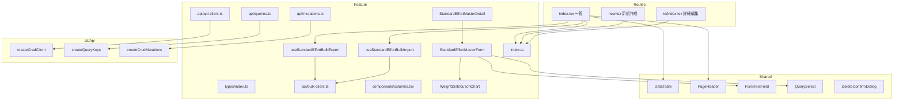
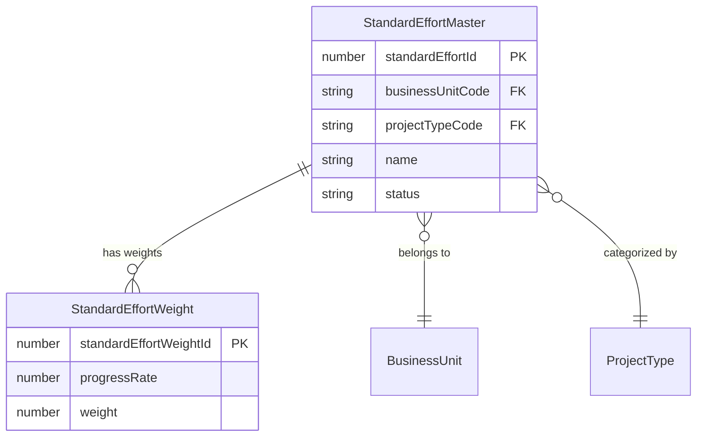

# Design Document: standard-effort-masters-ui

## Overview

**Purpose**: 標準工数マスタのメンテナンス画面（一覧・新規作成・詳細/編集）をフロントエンドに提供し、マスタ管理者が工数カーブパターンの登録・参照・更新・削除を行えるようにする。

**Users**: 事業部リーダー・マスタ管理者が、BU × 案件タイプごとの標準工数パターン（Sカーブ・バスタブカーブ等）の管理に使用する。

**Impact**: 既存マスタ画面群（ビジネスユニット / 案件タイプ / 作業種類 / 案件）に新しいマスタエンティティの UI を追加。CRUD バックエンド API は実装済み。Bulk エクスポート/インポート API はフロントエンドと合わせて新規実装する。

### Goals
- 既存マスタ画面と一貫した操作体験を提供する
- 重み分布をエリアチャートでリアルタイムに可視化する
- 既存ファクトリパターン・共通コンポーネントを最大限再利用する
- Excel 一括エクスポート/インポートで BU 単位の効率的なデータ管理を提供する

### Non-Goals
- 他マスタ画面のリファクタリング
- 重み値の自動計算・テンプレートプリセット機能
- スパークライン（一覧画面でのミニグラフ）

## Architecture

### Existing Architecture Analysis

既存マスタ画面は以下のパターンで統一されている:

- **Feature 構造**: `features/[entity]/` に api / components / types / index.ts を配置
- **API 層**: `createCrudClient` → `createQueryKeys` → `createListQueryOptions` / `createDetailQueryOptions` → `createCrudMutations` のファクトリチェーン
- **ルート**: `routes/master/[entity]/` に index.tsx（一覧）、new.tsx（新規作成）、$id/index.tsx（詳細）を配置
- **共通コンポーネント**: DataTable / PageHeader / FormTextField / QuerySelect / DeleteConfirmDialog 等

本 feature はこのパターンを踏襲し、以下の新規パターンを導入する:
- **重みテーブル入力**: TanStack Form `mode="array"` による 21 行固定テーブル
- **詳細/編集モード切替**: `isEditing` state による同一コンポーネント内切替（projects master の detail/edit 分離パターンとは異なる）
- **エリアチャート**: Recharts AreaChart による重み分布可視化

### Architecture Pattern & Boundary Map



**Architecture Integration**:
- **Selected pattern**: Feature-first + Factory パターン。既存マスタ画面と同一の構造
- **Domain boundaries**: `features/standard-effort-masters/` に全コードを凝集。feature 間依存なし
- **Existing patterns preserved**: createCrudClient / createQueryKeys / createCrudMutations ファクトリチェーン、DataTable 一覧パターン、PageHeader + フォームパターン
- **New components rationale**: WeightDistributionChart（重み可視化の専用チャート）、StandardEffortMasterDetail（モード切替パターン）、Bulk hooks + bulk-client（一括エクスポート/インポート）

### Technology Stack

| Layer | Choice / Version | Role in Feature | Notes |
|-------|------------------|-----------------|-------|
| UI Framework | React 19 | コンポーネント描画 | 既存と同一 |
| Routing | TanStack Router | ファイルベースルーティング | 3 ルート追加 |
| Data Fetching | TanStack Query | API データ管理 | ファクトリパターン使用 |
| Form | TanStack Form v1 | フォーム状態管理 | `mode="array"` で重み配列管理 |
| Validation | Zod v3 | スキーマバリデーション | フロントエンド標準 |
| Chart | Recharts v3.7.0 | エリアチャート | 既存 WorkloadChart と同一ライブラリ |
| UI Primitives | shadcn/ui + Radix UI | 入力コンポーネント | 既存と同一 |
| Styling | Tailwind CSS v4 | スタイリング | 既存と同一 |

## Requirements Traceability

| Requirement | Summary | Components | Interfaces | Flows |
|-------------|---------|------------|------------|-------|
| 1.1 | 一覧表示（DataTable） | ListRoute, columns, api-client, queries | CrudClient.fetchList | — |
| 1.2 | パターン名検索 | ListRoute, DataTableToolbar | globalFilter | — |
| 1.3 | BU/PT フィルタ | ListRoute, DataTableToolbar | ListParams.businessUnitCode/projectTypeCode | — |
| 1.4 | 無効データ表示切替 | ListRoute, DataTableToolbar | ListParams.includeDisabled | — |
| 1.5 | ページネーション | ListRoute, DataTable | ListParams.page/pageSize | — |
| 1.6 | 行クリック → 詳細遷移 | ListRoute | DataTable.onRowClick | — |
| 1.7 | 新規作成遷移 | ListRoute | DataTableToolbar.newItemHref | — |
| 2.1 | 新規作成フォーム | CreateRoute, StandardEffortMasterForm | FormProps | — |
| 2.2 | リアルタイムチャート | StandardEffortMasterForm, WeightDistributionChart | WeightDistributionChartProps | — |
| 2.3 | フォーム送信 | CreateRoute, mutations | CrudMutations.useCreate | — |
| 2.4 | バリデーションエラー | StandardEffortMasterForm | Zod schema | — |
| 2.5 | API エラー通知 | CreateRoute | ApiError | — |
| 3.1 | 閲覧モード表示 | DetailRoute, StandardEffortMasterDetail | queries.detail | — |
| 3.2 | 編集モード切替 | StandardEffortMasterDetail | isEditing state | — |
| 3.3 | 編集時チャート更新 | StandardEffortMasterDetail, WeightDistributionChart | WeightDistributionChartProps | — |
| 3.4 | 保存（PUT） | DetailRoute, mutations | CrudMutations.useUpdate | — |
| 3.5 | キャンセル | StandardEffortMasterDetail | isEditing state reset | — |
| 3.6 | 削除確認ダイアログ | DetailRoute, DeleteConfirmDialog | — | — |
| 3.7 | 論理削除 | DetailRoute, mutations | CrudMutations.useDelete | — |
| 3.8 | 復元 | DetailRoute, RestoreConfirmDialog, mutations | CrudMutations.useRestore | — |
| 3.9 | API エラー通知 | DetailRoute | ApiError | — |
| 4.1 | AreaChart 表示 | WeightDistributionChart | WeightDistributionChartProps | — |
| 4.2 | 再利用可能コンポーネント | WeightDistributionChart | WeightDistributionChartProps | — |
| 4.3 | リアルタイム更新 | WeightDistributionChart | weights prop | — |
| 5.1 | サイドバーメニュー表示 | SidebarNav | menuItems 配列 | — |
| 5.2 | メニュークリック遷移 | SidebarNav | href | — |
| 7.1 | エクスポートボタン | ListRoute, useStandardEffortBulkExport | bulk-client.fetchExportData | — |
| 7.2 | BU フィルタ連動エクスポート | ListRoute, useStandardEffortBulkExport | ListParams.businessUnitCode | — |
| 7.3 | インポートダイアログ表示 | ListRoute, ExcelImportDialog | — | — |
| 7.4 | ファイル解析・プレビュー | useStandardEffortBulkImport, ExcelImportDialog | excel-utils | — |
| 7.5 | バリデーションエラー表示 | ExcelImportDialog | ImportPreviewData | — |
| 7.6 | インポート実行 | useStandardEffortBulkImport | bulk-client.postBulkImport | — |
| 7.7 | インポート API エラー | ListRoute | ApiError | — |
| 8.1 | 共通コンポーネント再利用 | 全コンポーネント | — | — |
| 8.2 | API パターン準拠 | api-client, queries, mutations | ファクトリ関数 | — |
| 8.3 | カラムヘルパー使用 | columns | createDateTimeColumn, createStatusColumn | — |
| 8.4 | TypeScript エラーなし | 全ファイル | — | — |
| 8.5 | 既存テスト非破壊 | — | — | — |

## Components and Interfaces

| Component | Domain/Layer | Intent | Req Coverage | Key Dependencies | Contracts |
|-----------|-------------|--------|--------------|------------------|-----------|
| types/index.ts | Types | Zod スキーマ・型定義 | 6.2, 6.4 | Zod (P0) | — |
| api/api-client.ts | API | CRUD API クライアント | 6.2 | createCrudClient (P0) | Service |
| api/queries.ts | API | queryOptions 定義 | 6.2 | createQueryKeys (P0) | State |
| api/mutations.ts | API | mutation hooks 定義 | 6.2 | createCrudMutations (P0) | State |
| columns.tsx | UI | DataTable カラム定義 | 1.1, 6.3 | column-helpers (P0) | — |
| StandardEffortMasterForm | UI | フォーム（マスタ情報 + 重みテーブル + チャート） | 2.1-2.5, 3.2-3.3 | TanStack Form (P0), Recharts (P1) | State |
| StandardEffortMasterDetail | UI | 詳細/編集モード切替 | 3.1-3.9 | StandardEffortMasterForm (P0) | State |
| WeightDistributionChart | UI | 重み分布エリアチャート | 4.1-4.3 | Recharts (P0) | — |
| ListRoute | Route | 一覧画面ルート | 1.1-1.7 | DataTable (P0), queries (P0) | — |
| CreateRoute | Route | 新規作成画面ルート | 2.1-2.5 | StandardEffortMasterForm (P0) | — |
| DetailRoute | Route | 詳細/編集画面ルート | 3.1-3.9 | StandardEffortMasterDetail (P0) | — |
| api/bulk-client.ts | API | Bulk エクスポート/インポート API クライアント | 7.1, 7.6 | handleResponse (P0) | Service |
| useStandardEffortBulkExport | Hook | Excel エクスポート | 7.1, 7.2 | bulk-client (P0), excel-utils (P0) | — |
| useStandardEffortBulkImport | Hook | Excel インポート（解析 + 送信） | 7.4, 7.6 | bulk-client (P0), excel-utils (P0) | — |
| SidebarNav | Navigation | メニュー項目追加 | 5.1-5.2 | — | — |

### Types Layer

#### types/index.ts

| Field | Detail |
|-------|--------|
| Intent | 標準工数マスタの Zod スキーマ・TypeScript 型・定数を定義 |
| Requirements | 6.2, 6.4 |

**Responsibilities & Constraints**
- API レスポンス型、フォーム入力型、一覧パラメータ型を提供
- Zod スキーマから TypeScript 型を導出（`z.infer`）
- 重み配列は 21 要素固定（progressRate: 0, 5, 10, ..., 100）

**Contracts**: State [x]

##### State Management

```typescript
// --- エンティティ型 ---
// NOTE: API レスポンスに businessUnitName / projectTypeName / status は含まれない。
// 一覧表示時は BU/PT Select クエリのデータからコード→名前の lookup map を作成して解決する。
// status は deleted_at の有無で判定する（一覧 API は includeDisabled=true 時のみ deleted_at 付きレコードを返す）。
type StandardEffortMaster = {
  standardEffortId: number
  businessUnitCode: string
  projectTypeCode: string
  name: string
  createdAt: string
  updatedAt: string
  deletedAt: string | null  // includeDisabled=true 時のみ存在
}

type StandardEffortWeight = {
  standardEffortWeightId: number
  progressRate: number
  weight: number
}

type StandardEffortMasterDetail = StandardEffortMaster & {
  weights: StandardEffortWeight[]
}

// --- 入力型 ---
type WeightInput = {
  progressRate: number  // 0-100, 5刻み
  weight: number        // 0以上の整数
}

type CreateStandardEffortMasterInput = {
  businessUnitCode: string
  projectTypeCode: string
  name: string
  weights: WeightInput[]
}

type UpdateStandardEffortMasterInput = {
  name: string
  weights: WeightInput[]
}

// --- 一覧パラメータ型 ---
type StandardEffortMasterListParams = {
  page: number
  pageSize: number
  search: string
  includeDisabled: boolean
  businessUnitCode: string
  projectTypeCode: string
}

// --- 定数 ---
const PROGRESS_RATES: number[]  // [0, 5, 10, 15, ..., 100]

const DEFAULT_WEIGHTS: WeightInput[]  // 21要素、全 weight: 0

// --- Zod スキーマ ---
// createStandardEffortMasterSchema: businessUnitCode(必須) + projectTypeCode(必須) + name(1-100文字) + weights(21要素)
// updateStandardEffortMasterSchema: name(1-100文字) + weights(21要素)
// weightInputSchema: progressRate(0-100整数) + weight(0以上整数)
// standardEffortMasterSearchSchema: page, pageSize, search, includeDisabled, businessUnitCode, projectTypeCode のデフォルト値付き
```

**Implementation Notes**
- API レスポンスには `businessUnitCode` / `projectTypeCode` のみ含まれ、名前は含まれない。一覧画面では BU/PT Select クエリのキャッシュデータから `useMemo` で `Map<string, string>` (code → name) の lookup map を作成し、カラム表示時に名前解決する
- `status` フィールドは API に存在しない。`deletedAt` の null 判定で active/deleted を導出する
- `PROGRESS_RATES` 定数で 21 区間を生成: `Array.from({ length: 21 }, (_, i) => i * 5)`
- `DEFAULT_WEIGHTS` は `PROGRESS_RATES.map(rate => ({ progressRate: rate, weight: 0 }))`

### API Layer

#### api/api-client.ts

| Field | Detail |
|-------|--------|
| Intent | createCrudClient を使用した CRUD API クライアント + BU/PT Select 用 fetch 関数 |
| Requirements | 6.2 |

**Responsibilities & Constraints**
- `createCrudClient` ファクトリで標準 CRUD 操作を生成
- BU/PT Select 用の fetch 関数を feature 内に定義（feature 間依存回避）

**Dependencies**
- Outbound: createCrudClient — CRUD 操作生成 (P0)
- Outbound: handleResponse — レスポンスパース (P0)
- External: Backend API `/standard-effort-masters` (P0)

**Contracts**: Service [x]

##### Service Interface

```typescript
// fetchList はカスタム実装（filter[businessUnitCode] / filter[projectTypeCode] 対応）
function fetchStandardEffortMasters(params: StandardEffortMasterListParams): Promise<PaginatedResponse<StandardEffortMaster>>

// createCrudClient が生成するメソッド（fetchList 以外）
interface StandardEffortMasterClient {
  fetchDetail(id: number): Promise<SingleResponse<StandardEffortMasterDetail>>
  create(input: CreateStandardEffortMasterInput): Promise<SingleResponse<StandardEffortMasterDetail>>
  update(id: number, input: UpdateStandardEffortMasterInput): Promise<SingleResponse<StandardEffortMasterDetail>>
  delete(id: number): Promise<void>
  restore(id: number): Promise<SingleResponse<StandardEffortMasterDetail>>
}

// BU/PT Select 用
function fetchBusinessUnitsForSelect(): Promise<SingleResponse<Array<{ businessUnitCode: string; name: string }>>>
function fetchProjectTypesForSelect(): Promise<SingleResponse<Array<{ projectTypeCode: string; name: string }>>>
```

**Implementation Notes**
- `createCrudClient` の `resourcePath: "standard-effort-masters"` を指定。ただし `fetchList` は **カスタム実装が必要**（`createCrudClient` は `includeDisabled` のみ対応し、`filter[businessUnitCode]` / `filter[projectTypeCode]` パラメータを送信できないため）
- カスタム fetchList は `case-study/api/api-client.ts` の `fetchStandardEffortMasters` パターンを参考に、`URLSearchParams` で手動構築する。`createCrudClient` は fetchDetail / create / update / delete / restore のみ使用し、fetchList は独立関数として定義する
- BU/PT Select の fetch 関数は既存の projects feature と同一のエンドポイント（`/business-units?fields=select`, `/project-types?fields=select`）を使用

#### api/queries.ts

| Field | Detail |
|-------|--------|
| Intent | queryKeys ファクトリ + queryOptions 定義 |
| Requirements | 6.2 |

**Contracts**: State [x]

##### State Management

```typescript
// Query Keys
const standardEffortMasterKeys: QueryKeys<number, StandardEffortMasterListParams>

// List Query Options
function standardEffortMastersQueryOptions(params: StandardEffortMasterListParams): QueryOptions

// Detail Query Options
function standardEffortMasterQueryOptions(id: number): QueryOptions

// Select Query Options（BU/PT ドロップダウン用）
function businessUnitsForSelectQueryOptions(): QueryOptions<SelectOption[]>
function projectTypesForSelectQueryOptions(): QueryOptions<SelectOption[]>
```

**Implementation Notes**
- `createQueryKeys("standard-effort-masters")` でキー生成
- `createListQueryOptions` / `createDetailQueryOptions` ファクトリ使用
- `staleTime: STALE_TIMES.LONG`（マスタデータは更新頻度が低い）
- BU/PT Select クエリの queryKey は `["business-units", "select"]` / `["project-types", "select"]` で既存 projects feature とキャッシュ共有

#### api/mutations.ts

| Field | Detail |
|-------|--------|
| Intent | createCrudMutations ファクトリによる mutation hooks |
| Requirements | 6.2 |

**Contracts**: State [x]

##### State Management

```typescript
// ファクトリ生成
const mutations: CrudMutations<
  StandardEffortMasterDetail,
  CreateStandardEffortMasterInput,
  UpdateStandardEffortMasterInput,
  number,
  StandardEffortMasterListParams
>

// エクスポート
function useCreateStandardEffortMaster(): UseMutationResult
function useUpdateStandardEffortMaster(id: number): UseMutationResult
function useDeleteStandardEffortMaster(): UseMutationResult
function useRestoreStandardEffortMaster(): UseMutationResult
```

**Implementation Notes**
- `createCrudMutations` が自動的にキャッシュ無効化（lists / detail）を処理

### UI Layer

#### components/columns.tsx

| Field | Detail |
|-------|--------|
| Intent | DataTable カラム定義 |
| Requirements | 1.1, 6.3 |

**Responsibilities & Constraints**
- カラム: パターン名（Link）/ ビジネスユニット / 案件タイプ / ステータス / 更新日時
- パターン名カラムは `Link to="/master/standard-effort-masters/$standardEffortId"` で詳細画面へ遷移
- BU 名・PT 名カラムはコード→名前の lookup map を `accessorFn` で参照して表示
- column-helpers（`createStatusColumn`, `createDateTimeColumn`, `createRestoreActionColumn`）を使用
- ステータスカラムは `deletedAt` の null 判定で active/deleted を表示

```typescript
function createColumns(options: {
  onRestore?: (id: number) => void
  buNameMap: Map<string, string>
  ptNameMap: Map<string, string>
}): ColumnDef<StandardEffortMaster>[]
```

#### components/WeightDistributionChart.tsx

| Field | Detail |
|-------|--------|
| Intent | 重み分布をエリアチャートで可視化する再利用可能コンポーネント |
| Requirements | 4.1, 4.2, 4.3 |

**Responsibilities & Constraints**
- Recharts AreaChart で横軸: 進捗率（0%-100%）、縦軸: 重みを表示
- 新規作成画面と詳細/編集画面の両方で使用
- props で weights データを受け取る純粋な表示コンポーネント

**Dependencies**
- External: Recharts v3.7.0 — AreaChart, ResponsiveContainer, Area, XAxis, YAxis, Tooltip, CartesianGrid (P0)

```typescript
type WeightDistributionChartProps = {
  weights: Array<{ progressRate: number; weight: number }>
}
```

**Implementation Notes**
- 既存 WorkloadChart のパターン踏襲: ResponsiveContainer + AreaChart + linearGradient
- XAxis の dataKey は `progressRate`、フォーマッタで `${value}%` 表示
- YAxis の dataKey は `weight`
- カスタムツールチップ: `進捗率: XX% / 重み: YY`
- CSS variables（`var(--color-primary)`）でテーマ統合
- 空データ（全 weight が 0）時もチャート領域を表示（フラットライン）

#### components/StandardEffortMasterForm.tsx

| Field | Detail |
|-------|--------|
| Intent | マスタ情報入力 + 重みテーブル入力 + エリアチャートプレビューの統合フォーム |
| Requirements | 2.1, 2.2, 2.4, 3.2, 3.3 |

**Responsibilities & Constraints**
- TanStack Form でフォーム状態を管理
- マスタ情報: businessUnitCode（QuerySelect）、projectTypeCode（QuerySelect）、name（FormTextField）
- 重みテーブル: `mode="array"` で 21 行の重み入力
- エリアチャート: `form.useStore` でフォーム値を監視し WeightDistributionChart に渡す
- `mode` prop で create / edit を切替（edit 時は BU/PT 変更不可）

**Dependencies**
- Inbound: StandardEffortMasterDetail — 編集モードの初期値提供 (P0)
- Outbound: WeightDistributionChart — 重み分布可視化 (P1)
- Outbound: FormTextField — テキスト/数値入力 (P0)
- Outbound: QuerySelect — BU/PT 選択 (P0)
- Outbound: FieldWrapper — ラベル/エラー表示 (P0)

**Contracts**: State [x]

##### State Management

```typescript
type StandardEffortMasterFormProps = {
  mode: "create" | "edit"
  defaultValues?: {
    businessUnitCode: string
    projectTypeCode: string
    name: string
    weights: WeightInput[]
  }
  onSubmit: (values: CreateStandardEffortMasterInput | UpdateStandardEffortMasterInput) => Promise<void>
  isSubmitting?: boolean
}
```

**Implementation Notes**
- defaultValues が未指定の場合、DEFAULT_WEIGHTS（全 weight: 0）を使用
- 重みテーブルの各行: progressRate を読み取り専用ラベル（`${rate}%`）で表示、weight を `<Input type="number">` で入力
- `form.useStore({ selector: (state) => state.values.weights })` でチャートデータをリアクティブに取得
- edit モード時、businessUnitCode / projectTypeCode の QuerySelect を `disabled` に設定
- 重みテーブルは `<table>` 要素で構造化。各行は `form.Field name={`weights[${i}].weight`}` でサブフィールド管理

#### components/StandardEffortMasterDetail.tsx

| Field | Detail |
|-------|--------|
| Intent | 詳細/編集モード切替を管理する統合コンポーネント |
| Requirements | 3.1, 3.2, 3.4, 3.5 |

**Responsibilities & Constraints**
- `isEditing` state で閲覧/編集モードを切替
- 閲覧モード: DetailRow でマスタ情報表示 + 読み取り専用重みテーブル + WeightDistributionChart
- 編集モード: StandardEffortMasterForm を `mode="edit"` で表示
- キャンセル時は `isEditing = false` にリセット

**Dependencies**
- Inbound: DetailRoute — データとイベントハンドラの提供 (P0)
- Outbound: StandardEffortMasterForm — 編集フォーム (P0)
- Outbound: WeightDistributionChart — チャート表示 (P1)
- Outbound: DetailRow — 閲覧モード表示 (P0)

**Contracts**: State [x]

##### State Management

```typescript
type StandardEffortMasterDetailProps = {
  data: StandardEffortMasterDetail
  onSave: (values: UpdateStandardEffortMasterInput) => Promise<void>
  isSaving?: boolean
}
```

**Implementation Notes**
- 閲覧モードの重みテーブルは `<table>` 要素で読み取り専用表示（Input なし）
- 編集モード開始時、`data.weights` を StandardEffortMasterForm の defaultValues に変換
- 保存成功後、`isEditing = false` にリセット

### Bulk Layer

#### api/bulk-client.ts

| Field | Detail |
|-------|--------|
| Intent | Bulk エクスポート/インポート API エンドポイントへのクライアント |
| Requirements | 7.1, 7.6 |

**Dependencies**
- Outbound: handleResponse — レスポンスパース (P0)
- External: Backend Bulk API (P0)

**Contracts**: Service [x]

##### Service Interface

```typescript
// エクスポートデータ型
type StandardEffortExportRow = {
  standardEffortId: number
  name: string
  businessUnitCode: string
  projectTypeCode: string
  weights: Array<{ progressRate: number; weight: number }>
}

type StandardEffortExportResponse = {
  data: StandardEffortExportRow[]
}

// インポートデータ型
type StandardEffortBulkImportItem = {
  standardEffortId: number
  weights: Array<{ progressRate: number; weight: number }>
}

type StandardEffortBulkImportResult = {
  data: { updatedMasters: number; updatedWeights: number }
}

function fetchExportData(params?: { businessUnitCode?: string }): Promise<StandardEffortExportResponse>
function postBulkImport(items: StandardEffortBulkImportItem[]): Promise<StandardEffortBulkImportResult>
```

**Implementation Notes**
- エクスポート: `GET /standard-effort-masters/actions/export?filter[businessUnitCode]=XXX`
- インポート: `POST /standard-effort-masters/actions/import` with `{ items: [...] }`
- バックエンド API は本 feature で新規実装する

#### hooks/useStandardEffortBulkExport.ts

| Field | Detail |
|-------|--------|
| Intent | 標準工数マスタの重みデータを Excel エクスポート |
| Requirements | 7.1, 7.2 |

**Responsibilities & Constraints**
- 一覧画面の現在の BU フィルタ値を受け取り、エクスポート範囲を制限
- `fetchExportData` で API からデータ取得
- `buildBulkExportWorkbook` + `downloadWorkbook` で Excel 生成・ダウンロード

**Contracts**: State [x]

##### State Management

```typescript
function useStandardEffortBulkExport(): {
  exportToExcel: (businessUnitCode?: string) => Promise<void>
  isExporting: boolean
}
```

**Implementation Notes**
- Excel 構成:
  - シート名: `標準工数パターン一括`
  - 固定カラム: ID（キーコード）/ パターン名 / BU コード / 案件タイプコード
  - 値カラム: 0%, 5%, 10%, ..., 100%（21列）
  - 各行: 1 つの標準工数マスタの重み値
- ファイル名: `標準工数パターン一括_YYYYMMDD.xlsx`
- `exportToExcel` 呼び出し時に `businessUnitCode` を渡す（一覧画面の BU フィルタ値）
- データなし時は `toast.warning` で通知
- 既存の `excel-utils.ts` の `buildBulkExportWorkbook` / `downloadWorkbook` を使用

#### hooks/useStandardEffortBulkImport.ts

| Field | Detail |
|-------|--------|
| Intent | Excel ファイルの解析・バリデーション・API 送信 |
| Requirements | 7.4, 7.6 |

**Responsibilities & Constraints**
- ExcelImportDialog の `onFileParsed` / `onConfirm` コールバックを提供
- `parseExcelFile` + `parseBulkImportSheet` で解析・バリデーション
- `postBulkImport` で API 送信
- 成功時にクエリキャッシュを無効化

**Contracts**: State [x]

##### State Management

```typescript
function useStandardEffortBulkImport(): {
  parseFile: (file: File) => Promise<ImportPreviewData>
  confirmImport: (data: ImportPreviewData) => Promise<void>
  isImporting: boolean
}
```

**Implementation Notes**
- パース設定:
  - `fixedColumnCount: 4`（ID / パターン名 / BU コード / 案件タイプコード）
  - 値カラム: 0%, 5%, ..., 100% のヘッダーを期待
  - カスタムバリデータ: キーコード（standardEffortId）が正の整数であること
- 値バリデーション: 各セルの重みが 0 以上の整数
- 確認時: preview データから `{ standardEffortId, weights: [{ progressRate, weight }] }` 配列を構築
- 成功後: `queryClient.invalidateQueries({ queryKey: standardEffortMasterKeys.all })` でキャッシュ全無効化
- 既存の `excel-utils.ts` の `parseExcelFile` / `parseBulkImportSheet` を使用

### Route Layer

#### routes/master/standard-effort-masters/index.tsx (ListRoute)

| Field | Detail |
|-------|--------|
| Intent | 一覧画面ルート |
| Requirements | 1.1-1.7, 7.1-7.7 |

**Implementation Notes**
- `validateSearch: standardEffortMasterSearchSchema` で search params をバリデーション
- `Route.useSearch()` で検索・フィルタ・ページネーション状態を管理
- `useQuery(standardEffortMastersQueryOptions(params))` でデータ取得
- DataTableToolbar に BU/PT フィルタ用の QuerySelect を追加配置（既存の DataTableToolbar に追加の Filter コンポーネントとして）
- 行ホバー時に `queryClient.ensureQueryData(standardEffortMasterQueryOptions(id))` でプリフェッチ
- **Bulk 統合**: ツールバー右側に「エクスポート」「インポート」ボタンを配置（案件マスタと同一パターン）
  - エクスポート: `exportToExcel(search.businessUnitCode)` で現在の BU フィルタ値を渡す
  - インポート: `setImportDialogOpen(true)` でダイアログ表示
- レイアウト: PageHeader + DataTableToolbar（+ BU/PT フィルタ + Export/Import ボタン）+ DataTable + ExcelImportDialog + RestoreConfirmDialog

#### routes/master/standard-effort-masters/new.tsx (CreateRoute)

| Field | Detail |
|-------|--------|
| Intent | 新規作成画面ルート |
| Requirements | 2.1-2.5 |

**Implementation Notes**
- StandardEffortMasterForm を `mode="create"` で描画
- `useCreateStandardEffortMaster` で POST 実行
- 成功時: `toast.success` + `/master/standard-effort-masters` へ遷移
- ApiError 処理: 409（重複）→ トースト通知、422（FK 不存在）→ トースト通知
- レイアウト: PageHeader（パンくずリスト付き）+ StandardEffortMasterForm

#### routes/master/standard-effort-masters/$standardEffortId/index.tsx (DetailRoute)

| Field | Detail |
|-------|--------|
| Intent | 詳細/編集画面ルート |
| Requirements | 3.1-3.9 |

**Implementation Notes**
- `useQuery(standardEffortMasterQueryOptions(id))` でデータ取得
- PageHeader の actions に「編集」「削除」ボタン配置（閲覧モード時）
- 論理削除済みレコードの場合、「復元」ボタンを表示
- StandardEffortMasterDetail に data と onSave を渡す
- 削除: `useDeleteStandardEffortMaster` → DeleteConfirmDialog → 成功時に一覧遷移
- 復元: `useRestoreStandardEffortMaster` → RestoreConfirmDialog → 成功時にデータ再取得
- ApiError 処理: 404 → NotFoundState、409（参照あり）→ トースト通知
- レイアウト: PageHeader（パンくずリスト + アクションボタン）+ StandardEffortMasterDetail + DeleteConfirmDialog + RestoreConfirmDialog

### Navigation

#### SidebarNav（変更）

| Field | Detail |
|-------|--------|
| Intent | マスタ管理セクションに「標準工数パターン」メニュー項目を追加 |
| Requirements | 5.1, 5.2 |

**Implementation Notes**
- `menuItems` の「マスタ管理」children に `{ label: "標準工数パターン", href: "/master/standard-effort-masters", icon: TrendingUp }` を追加
- `TrendingUp` アイコン（lucide-react）を使用（工数カーブの視覚的表現）

## Data Models

### Domain Model



**Business Rules & Invariants**:
- 重みは進捗率 0-100%（5%刻み・21区間）で固定
- (businessUnitCode, projectTypeCode, name) はアクティブレコード間でユニーク
- businessUnitCode / projectTypeCode は作成時に確定、更新では変更不可
- weights は PUT 時に全置換（部分更新なし）

### Data Contracts & Integration

**API Data Transfer**

リクエスト/レスポンスの型定義は Types Layer の State Management セクションに記載。

フロントエンドからバックエンドへの変換:
- フォーム値 → API リクエスト: `weights` 配列から `standardEffortWeightId` を除去し `{ progressRate, weight }` のみ送信
- API レスポンス → フォーム初期値: `weights` 配列から `{ progressRate, weight }` を抽出

## Backend Bulk API（新規実装）

本 feature で追加するバックエンドエンドポイント。既存の `bulk.ts` ルートパターンを踏襲する。

### API Contract

| Method | Endpoint | Request | Response | Errors |
|--------|----------|---------|----------|--------|
| GET | /standard-effort-masters/actions/export | `filter[businessUnitCode]` (query, optional) | `{ data: StandardEffortExportRow[] }` | — |
| POST | /standard-effort-masters/actions/import | `{ items: StandardEffortBulkImportItem[] }` (json) | `{ data: { updatedMasters, updatedWeights } }` | 422 |

### Export エンドポイント

- 全アクティブマスタと weights を JOIN して取得
- `filter[businessUnitCode]` 指定時はその BU のみ
- レスポンス: 各マスタに `weights` 配列を含む
- 既存ルート `/standard-effort-masters` に `actions/export` として追加

### Import エンドポイント

- リクエスト: `{ items: [{ standardEffortId, weights: [{ progressRate, weight }] }] }`
- 各 item の `standardEffortId` が存在することを検証（不在なら 422）
- weights は全置換（既存 weights DELETE → 新規 INSERT）
- トランザクション内で全 item を処理
- 既存ルート `/standard-effort-masters` に `actions/import` として追加

### ファイル構成

| ファイル | 説明 |
|---------|------|
| `routes/standardEffortMasters.ts` | 既存ルートに export/import アクション追加 |
| `services/standardEffortMasterService.ts` | Bulk ロジック追加 |
| `data/standardEffortMasterData.ts` | Bulk クエリ追加 |
| `types/standardEffortMaster.ts` | Bulk 用 Zod スキーマ追加 |

## Error Handling

### Error Categories and Responses

| Category | Status | Trigger | UI Response |
|----------|--------|---------|-------------|
| Not Found | 404 | 存在しない/削除済み ID | NotFoundState コンポーネント表示 |
| Conflict | 409 | ユニーク制約違反（BU+PT+name） | `toast.error("同一パターン名が既に存在します")` |
| Conflict | 409 | 参照整合性違反（削除時） | `toast.error("このパターンは他のデータから参照されているため削除できません")` |
| Validation | 422 | FK 不存在 / 入力値不正 | `toast.error` + フィールドレベルエラー表示 |
| Validation | 422 | Bulk インポート — 無効な standardEffortId | `toast.error("存在しない標準工数パターンが含まれています")` |
| Network | — | ネットワーク障害 | ErrorState コンポーネント表示（リトライボタン付き） |

エラーハンドリングは既存マスタ画面の `ApiError` + `problemDetails.status` パターンに準拠。

## Testing Strategy

### TypeScript 型チェック
- `pnpm --filter frontend build` でコンパイルエラーがないこと
- 全新規ファイルが strict mode に準拠

### 既存テスト回帰
- `pnpm test` で既存テストが全パスすること
- SidebarNav の変更が既存テストに影響しないこと

### 手動検証項目
- 一覧画面: 表示・検索・BU/PT フィルタ・無効データ切替・ページネーション・行クリック遷移
- 新規作成: フォーム入力・重みテーブル入力・チャートリアルタイム更新・バリデーション・送信成功
- 詳細/編集: 閲覧モード表示・編集モード切替・重み編集・チャート更新・保存・キャンセル
- 削除/復元: 削除確認ダイアログ・論理削除・復元確認・復元処理
- エクスポート: 全件エクスポート・BU フィルタ適用エクスポート・データなし時の警告
- インポート: ファイル選択・プレビュー表示・バリデーションエラー・正常インポート・キャッシュ更新
- サイドバー: メニュー表示・クリック遷移
