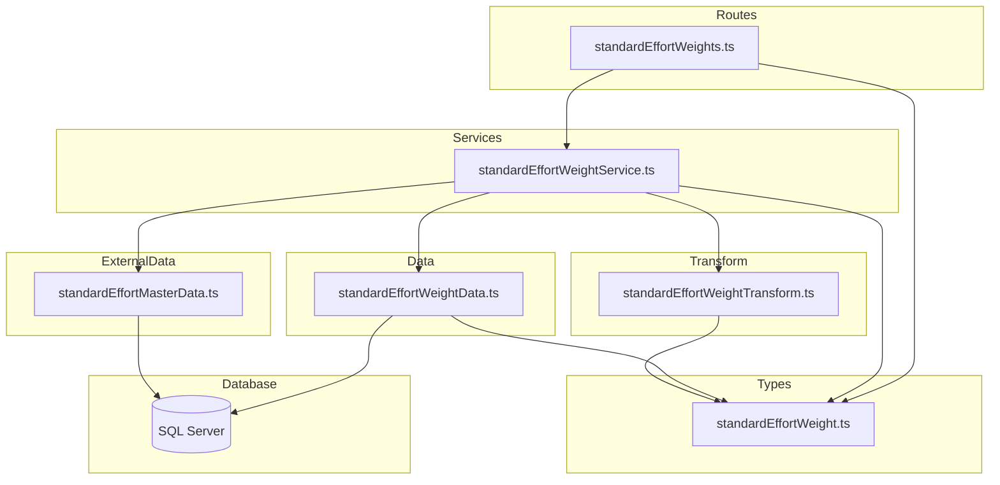
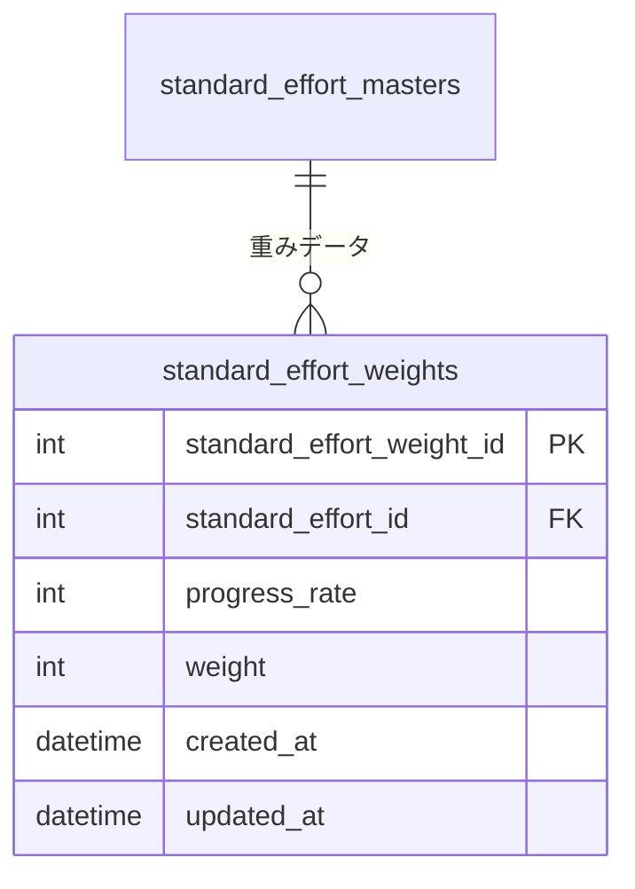

# Design Document: standard-effort-weights-crud-api

## Overview

**Purpose**: 標準工数ウェイト（standard_effort_weights）のCRUD APIを提供し、事業部リーダーが標準工数マスタに紐づく進捗率ごとの重み値を個別・一括で管理できるようにする。

**Users**: 事業部リーダーが標準工数パターンの詳細設定に、フロントエンド開発者がAPI連携で利用する。

**Impact**: 既存のファクトテーブルCRUDパターン（projectLoads, monthlyCapacities, indirectWorkTypeRatios等）に準拠した新規実装。既存のレイヤードアーキテクチャを拡張する。

### Goals
- standard_effort_weights テーブルに対する完全なCRUD操作（一覧・個別取得なし・個別追加・個別更新・個別削除）の提供
- PUT /bulk による一括 upsert の実現
- 既存ファクトテーブルパターン（routes → services → data → transform → types）への準拠

### Non-Goals
- standard_effort_weights の単一レコード詳細取得エンドポイント（一覧取得で十分）
- フロントエンド実装
- 標準工数パターンに基づく工数計算ロジック

## Architecture

### Existing Architecture Analysis

既存のバックエンドは、ファクトテーブル（projectLoads, monthlyHeadcountPlans, monthlyCapacities, monthlyIndirectWorkLoads, indirectWorkTypeRatios）に対するネストされたCRUD APIを実装済み。すべて以下のパターンに従う：

- **ネストルート**: `/parent/:parentId/children` の形式
- **物理削除**: deleted_at なし、ON DELETE CASCADE
- **Bulk Upsert**: PUT /bulk エンドポイントで SQL MERGE を使用した一括更新
- **親所有権チェック**: 個別操作時に子レコードの親IDを検証

standard_effort_weights の実装は indirectWorkTypeRatios パターンに最も近い：
- **複合ユニーク制約**: (standard_effort_id, progress_rate) — indirectWorkTypeRatios の (indirect_work_case_id, work_type_code, fiscal_year) と同構造
- **外部キー参照なし**: progress_rate / weight は純粋な値型（FK検証不要）— indirectWorkTypeRatios よりシンプル
- **親テーブルが論理削除対応**: standard_effort_masters は deleted_at を持つため、親の論理削除状態チェックが必要

### Architecture Pattern & Boundary Map



**Architecture Integration**:
- **Selected pattern**: 既存ファクトテーブルパターン踏襲（indirectWorkTypeRatios 準拠）
- **Domain/feature boundaries**: standardEffortWeight の各層ファイルが責務を分離。親テーブル存在チェックのため standardEffortMasterData への依存あり
- **Existing patterns preserved**: parseIntParam ヘルパー、validate ミドルウェア、problemResponse ヘルパー、bulk upsert（SQL MERGE）
- **New components rationale**: 5ファイル（types, data, transform, service, routes）は既存ファクトテーブルパターンの拡張
- **Steering compliance**: レイヤー間の依存方向（routes → services → data）を厳守

### Technology Stack

| Layer | Choice / Version | Role in Feature | Notes |
|-------|------------------|-----------------|-------|
| Backend | Hono v4 | ルーティング・ミドルウェア | 既存と同一 |
| Validation | Zod + @hono/zod-validator | リクエストバリデーション | 既存と同一 |
| Data | mssql | SQL Server クエリ実行 | SQL MERGE を bulk upsert に使用（既存パターン） |
| Test | Vitest | ユニットテスト | 既存と同一 |

## Requirements Traceability

| Requirement | Summary | Components | Interfaces | Notes |
|-------------|---------|------------|------------|-------|
| 1.1, 1.2, 1.3, 1.4 | 一覧取得（progress_rate 昇順・親存在チェック・空配列） | Data, Transform, Service, Routes | API: GET / | ページネーションなし |
| 2.1, 2.2, 2.3, 2.4, 2.5, 2.6, 2.7 | 一括更新（全置換） | Data, Service, Routes, Types | API: PUT /bulk | SQL MERGE + DELETE 不在分 |
| 3.1, 3.2, 3.3, 3.4, 3.5, 3.6 | 個別追加 | Data, Service, Routes, Types | API: POST / | ユニーク制約チェック |
| 4.1, 4.2, 4.3, 4.4, 4.5 | 個別更新 | Data, Service, Routes, Types | API: PUT /:weightId | weight 値のみ更新 |
| 5.1, 5.2, 5.3 | 個別削除（物理削除） | Data, Service, Routes | API: DELETE /:weightId | 親所有権チェック |
| 6.1, 6.2, 6.3, 6.4, 6.5 | レスポンス形式 | Transform, Routes | 全エンドポイント | RFC 9457、camelCase |
| 7.1, 7.2, 7.3, 7.4, 7.5, 7.6 | バリデーション | Types, Routes | Zod スキーマ | parseIntParam + Zod |
| 8.1, 8.2, 8.3, 8.4 | テスト | テストファイル | Vitest | 既存パターン踏襲 |

## Components and Interfaces

| Component | Domain/Layer | Intent | Req Coverage | Key Dependencies | Contracts |
|-----------|-------------|--------|--------------|------------------|-----------|
| standardEffortWeight.ts | Types | Zodスキーマ・型定義 | 6, 7 | — | State |
| standardEffortWeightData.ts | Data | SQLクエリ実行（MERGE含む） | 1, 2, 3, 4, 5 | database/client (P0) | Service |
| standardEffortWeightTransform.ts | Transform | Row→Response変換 | 6 | types (P0) | — |
| standardEffortWeightService.ts | Service | ビジネスロジック | 1–5 | Data (P0), Transform (P0), standardEffortMasterData (P1) | Service |
| standardEffortWeights.ts | Routes | HTTPエンドポイント | 1–7 | Service (P0), Types (P0), validate (P0) | API |

### Types Layer

#### standardEffortWeight.ts

| Field | Detail |
|-------|--------|
| Intent | Zodバリデーションスキーマとリクエスト・レスポンス・DB行のTypeScript型を定義 |
| Requirements | 6.4, 6.5, 7.1, 7.2, 7.3, 7.4, 7.5, 7.6 |

**Contracts**: State [x]

##### State Management

```typescript
// --- Zod スキーマ ---

/** 個別追加用スキーマ */
// createStandardEffortWeightSchema
// - progressRate: z.number().int().min(0).max(100) — 必須
// - weight: z.number().int().min(0) — 必須

/** 個別更新用スキーマ */
// updateStandardEffortWeightSchema
// - weight: z.number().int().min(0) — 必須

/** 一括 upsert 用アイテムスキーマ */
// bulkUpsertItemSchema
// - progressRate: z.number().int().min(0).max(100) — 必須
// - weight: z.number().int().min(0) — 必須

/** 一括 upsert 用スキーマ */
// bulkUpsertStandardEffortWeightSchema
// - items: z.array(bulkUpsertItemSchema).min(0) — 必須（空配列許可）

// --- TypeScript 型 ---

type CreateStandardEffortWeight = z.infer<typeof createStandardEffortWeightSchema>
type UpdateStandardEffortWeight = z.infer<typeof updateStandardEffortWeightSchema>
type BulkUpsertStandardEffortWeight = z.infer<typeof bulkUpsertStandardEffortWeightSchema>

/** DB行型（snake_case） */
type StandardEffortWeightRow = {
  standard_effort_weight_id: number
  standard_effort_id: number
  progress_rate: number
  weight: number
  created_at: Date
  updated_at: Date
}

/** APIレスポンス型（camelCase） */
type StandardEffortWeight = {
  standardEffortWeightId: number
  standardEffortId: number
  progressRate: number
  weight: number
  createdAt: string   // ISO 8601
  updatedAt: string   // ISO 8601
}
```

**Implementation Notes**:
- 親ID（standardEffortId）はリクエストボディに含めない（ルートパラメータから取得）
- bulkUpsertStandardEffortWeightSchema の items は空配列を許可（全削除に対応）
- progressRate の重複チェックはアプリケーション層で実施（bulk upsert 時）

---

### Data Layer

#### standardEffortWeightData.ts

| Field | Detail |
|-------|--------|
| Intent | standard_effort_weights テーブルへのSQLクエリ実行。bulk upsert は SQL MERGE を使用 |
| Requirements | 1.1, 2.1, 3.1, 3.5, 4.1, 4.4, 5.1, 5.3 |

**Dependencies**:
- Inbound: standardEffortWeightService — CRUDオペレーション (P0)
- External: mssql / database/client — DB接続 (P0)

**Contracts**: Service [x]

##### Service Interface

```typescript
interface StandardEffortWeightDataInterface {
  findAll(standardEffortId: number): Promise<StandardEffortWeightRow[]>
  // progress_rate ASC でソート

  findById(standardEffortWeightId: number): Promise<StandardEffortWeightRow | undefined>

  create(data: {
    standardEffortId: number
    progressRate: number
    weight: number
  }): Promise<StandardEffortWeightRow>
  // OUTPUT句で作成レコードを返却

  update(
    standardEffortWeightId: number,
    data: { weight: number }
  ): Promise<StandardEffortWeightRow | undefined>
  // OUTPUT句で更新レコードを返却

  deleteById(standardEffortWeightId: number): Promise<boolean>
  // 物理削除。影響行数 > 0 で true

  bulkUpsert(
    standardEffortId: number,
    items: Array<{ progressRate: number; weight: number }>
  ): Promise<StandardEffortWeightRow[]>
  // トランザクション内で:
  // 1. items が空なら DELETE ALL → 空配列を返却
  // 2. items が非空なら:
  //    a. SQL MERGE で各 item を upsert
  //    b. items に含まれない progress_rate のレコードを DELETE
  //    c. 結果を progress_rate ASC で SELECT して返却

  compositeKeyExists(
    standardEffortId: number,
    progressRate: number,
    excludeId?: number
  ): Promise<boolean>
  // ユニーク制約チェック用。excludeId 指定時は該当レコードを除外

  masterExists(standardEffortId: number): Promise<boolean>
  // standard_effort_masters の存在チェック（deleted_at IS NULL 条件付き）
}
```

- **Preconditions**: DB接続が確立されていること
- **Postconditions**: 各メソッドは指定された条件に合致するレコードを返す。見つからない場合は undefined / false
- **Invariants**: すべてのクエリはパラメータ化（SQLインジェクション防止）。bulk upsert はトランザクション内で実行

**Implementation Notes**:
- `findAll`: `WHERE standard_effort_id = @standardEffortId ORDER BY progress_rate ASC`
- `bulkUpsert`: SQL MERGE の ON 句は `(standard_effort_id, progress_rate)`。MATCHED 時は `weight, updated_at` を UPDATE、NOT MATCHED 時は INSERT。MERGE 後に items に含まれない progress_rate を DELETE
- `masterExists`: `SELECT 1 FROM standard_effort_masters WHERE standard_effort_id = @id AND deleted_at IS NULL`。standardEffortMasterData の既存メソッド（findById）を利用する代わりに、Data 層内で直接チェックする方が依存が少ない。ただし既存パターン（indirectWorkTypeRatios → indirectWorkCaseData.findById）を確認して選択する

---

### Transform Layer

#### standardEffortWeightTransform.ts

| Field | Detail |
|-------|--------|
| Intent | StandardEffortWeightRow → StandardEffortWeight（APIレスポンス型）の変換 |
| Requirements | 6.4, 6.5 |

**Implementation Notes**:
- `toStandardEffortWeightResponse(row: StandardEffortWeightRow): StandardEffortWeight`
- snake_case → camelCase 変換
- `created_at` / `updated_at` を `.toISOString()` で ISO 8601 文字列に変換

---

### Service Layer

#### standardEffortWeightService.ts

| Field | Detail |
|-------|--------|
| Intent | CRUD操作のビジネスロジック。親存在チェック・ユニーク制約チェック・親所有権チェック・エラーハンドリングを担当 |
| Requirements | 1.1–1.4, 2.1–2.7, 3.1–3.6, 4.1–4.5, 5.1–5.3 |

**Dependencies**:
- Inbound: standardEffortWeights route — HTTPハンドラ (P0)
- Outbound: standardEffortWeightData — DB操作 (P0)
- Outbound: standardEffortWeightTransform — レスポンス変換 (P0)
- Outbound: standardEffortMasterData.findById — 親テーブル存在チェック (P1)

**Contracts**: Service [x]

##### Service Interface

```typescript
interface StandardEffortWeightServiceInterface {
  findAll(standardEffortId: number): Promise<StandardEffortWeight[]>
  // throws HTTPException(404) if master not found or deleted

  create(standardEffortId: number, data: CreateStandardEffortWeight): Promise<StandardEffortWeight>
  // throws HTTPException(404) if master not found or deleted
  // throws HTTPException(409) if composite key conflict

  update(
    standardEffortId: number,
    standardEffortWeightId: number,
    data: UpdateStandardEffortWeight
  ): Promise<StandardEffortWeight>
  // throws HTTPException(404) if master not found, or weight not found, or parent mismatch

  delete(standardEffortId: number, standardEffortWeightId: number): Promise<void>
  // throws HTTPException(404) if master not found, or weight not found, or parent mismatch

  bulkUpsert(
    standardEffortId: number,
    data: BulkUpsertStandardEffortWeight
  ): Promise<StandardEffortWeight[]>
  // throws HTTPException(404) if master not found or deleted
  // throws HTTPException(422) if duplicate progressRate in items
}
```

- **Preconditions**: 各メソッドの引数がバリデーション済みであること（ルート層で実施）
- **Postconditions**: 成功時は変換済みレスポンスを返す。失敗時は適切な HTTPException をスロー
- **Invariants**: 親テーブル存在チェックは standardEffortMasterData.findById に委譲（deleted_at IS NULL 条件付き）。ユニーク制約チェックは standardEffortWeightData.compositeKeyExists に委譲

**Implementation Notes**:
- `findAll`: (1) 親テーブル存在チェック → (2) data.findAll → (3) toStandardEffortWeightResponse で変換
- `create`: (1) 親テーブル存在チェック → (2) compositeKeyExists でユニーク制約チェック → (3) data.create → (4) toStandardEffortWeightResponse
- `update`: (1) 親テーブル存在チェック → (2) data.findById で存在チェック → (3) 親所有権チェック（row.standard_effort_id !== standardEffortId → 404）→ (4) data.update → (5) toStandardEffortWeightResponse
- `delete`: (1) 親テーブル存在チェック → (2) data.findById で存在チェック → (3) 親所有権チェック → (4) data.deleteById
- `bulkUpsert`: (1) 親テーブル存在チェック → (2) items 内の progressRate 重複チェック → (3) data.bulkUpsert → (4) toStandardEffortWeightResponse で各要素変換

---

### Routes Layer

#### standardEffortWeights.ts

| Field | Detail |
|-------|--------|
| Intent | HTTPエンドポイント定義。バリデーション・レスポンス整形を担当 |
| Requirements | 1.1, 2.1, 3.1–3.3, 4.1, 5.1, 6.1–6.3, 7.1–7.5 |

**Contracts**: API [x]

##### API Contract

| Method | Endpoint | Request | Response | Status | Errors |
|--------|----------|---------|----------|--------|--------|
| GET | / | standardEffortId: number (path param) | `{ data: StandardEffortWeight[] }` | 200 | 404 |
| PUT | /bulk | standardEffortId (path) + BulkUpsertStandardEffortWeight (json) | `{ data: StandardEffortWeight[] }` | 200 | 404, 422 |
| POST | / | standardEffortId (path) + CreateStandardEffortWeight (json) | `{ data: StandardEffortWeight }` + Location header | 201 | 404, 409, 422 |
| PUT | /:standardEffortWeightId | standardEffortId + weightId (path) + UpdateStandardEffortWeight (json) | `{ data: StandardEffortWeight }` | 200 | 404, 422 |
| DELETE | /:standardEffortWeightId | standardEffortId + weightId (path) | (no body) | 204 | 404 |

**Implementation Notes**:
- ルートを `app.route('/standard-effort-masters/:standardEffortId/weights', standardEffortWeights)` で index.ts にマウント
- PUT /bulk は `/:standardEffortWeightId` よりも先に定義（パスコンフリクト回避）
- メソッドチェーンでルートを定義し、`StandardEffortWeightsRoute` 型をエクスポート
- パスパラメータは各ハンドラ内で `parseIntParam(c.req.param('...'), '...')` で取得・検証
- POST 成功時に `c.header('Location', '/standard-effort-masters/${standardEffortId}/weights/${weightId}')` を設定

## Data Models

### Domain Model



**Business Rules & Invariants**:
- standard_effort_weight_id は自動採番（IDENTITY）、変更不可
- (standard_effort_id, progress_rate) の組み合わせはユニーク（DB制約: UQ_standard_effort_weights_master_rate）
- progress_rate は 0〜100 の整数
- weight は 0以上の整数（非負）
- standard_effort_weights は ON DELETE CASCADE で物理削除される（親 standard_effort_masters の物理削除時）
- 親テーブルが論理削除済み（deleted_at IS NOT NULL）の場合、子テーブルへの全操作を拒否（404）

### Physical Data Model

対象テーブル `standard_effort_weights` のスキーマは `docs/database/table-spec.md` に定義済み。新規テーブル作成やスキーマ変更は不要。

### Data Contracts & Integration

**API Data Transfer**:

レスポンス例（一覧取得）:
```json
{
  "data": [
    {
      "standardEffortWeightId": 1,
      "standardEffortId": 1,
      "progressRate": 0,
      "weight": 0,
      "createdAt": "2026-01-31T00:00:00.000Z",
      "updatedAt": "2026-01-31T00:00:00.000Z"
    },
    {
      "standardEffortWeightId": 2,
      "standardEffortId": 1,
      "progressRate": 5,
      "weight": 1,
      "createdAt": "2026-01-31T00:00:00.000Z",
      "updatedAt": "2026-01-31T00:00:00.000Z"
    }
  ]
}
```

リクエスト例（個別追加）:
```json
{
  "progressRate": 50,
  "weight": 10
}
```

リクエスト例（個別更新）:
```json
{
  "weight": 15
}
```

リクエスト例（一括 upsert）:
```json
{
  "items": [
    { "progressRate": 0, "weight": 0 },
    { "progressRate": 5, "weight": 1 },
    { "progressRate": 10, "weight": 3 },
    { "progressRate": 50, "weight": 10 },
    { "progressRate": 100, "weight": 0 }
  ]
}
```

リクエスト例（全削除）:
```json
{
  "items": []
}
```

## Error Handling

### Error Strategy

既存のグローバルエラーハンドラ（index.ts の `app.onError`）と RFC 9457 Problem Details 形式に従う。サービス層から HTTPException をスローし、グローバルハンドラが統一的に処理する。

### Error Categories and Responses

| Status | Type | Trigger | Detail |
|--------|------|---------|--------|
| 404 | resource-not-found | 親 standard_effort_master が存在しない・論理削除済み | `Standard effort master with ID '{id}' not found` |
| 404 | resource-not-found | 子 standard_effort_weight が存在しない | `Standard effort weight with ID '{id}' not found` |
| 404 | resource-not-found | 子レコードが指定された親に属していない | `Standard effort weight with ID '{id}' not found` |
| 409 | conflict | ユニーク制約違反（同一 standardEffortId + progressRate） | `Standard effort weight with progress rate '{rate}' already exists for standard effort master '{id}'` |
| 422 | validation-error | Zodバリデーション失敗 | errors 配列にフィールド別詳細 |
| 422 | validation-error | bulk upsert の items 内に progressRate 重複 | `Duplicate progress rate values found in items` |
| 422 | validation-error | パスパラメータが正の整数でない | `Invalid standardEffortId: must be a positive integer` |

## Testing Strategy

### Unit Tests

テストファイルの配置は既存パターンに従い `src/__tests__/` にソース構造をミラーする。

#### routes/standardEffortWeights.test.ts
- GET / — 一覧取得（200 + progress_rate 昇順検証、404 親なし、空配列）
- PUT /bulk — 一括 upsert（200 + 全置換検証、200 + 空配列で全削除、404 親なし、422 progressRate 重複、422 バリデーションエラー）
- POST / — 個別追加（201 + Location ヘッダ、404 親なし、409 ユニーク制約違反、422 バリデーションエラー）
- PUT /:weightId — 個別更新（200、404 親なし、404 子なし、404 親子不一致、422 バリデーションエラー）
- DELETE /:weightId — 個別削除（204、404 親なし、404 子なし、404 親子不一致）

#### services/standardEffortWeightService.test.ts
- findAll — 親存在チェックと toStandardEffortWeightResponse 適用の検証
- create — 親存在チェック（404）、ユニーク制約チェック（409）、正常系の検証
- update — 親存在チェック、子存在チェック、親所有権チェックの検証
- delete — 親存在チェック、子存在チェック、親所有権チェックの検証
- bulkUpsert — 親存在チェック、progressRate 重複チェック（422）、正常系の検証

#### data/standardEffortWeightData.test.ts
- findAll — SQL実行と progress_rate ASC ソート
- findById — パラメータ化クエリの検証
- create — INSERT と OUTPUT 句
- update — UPDATE と OUTPUT 句
- deleteById — DELETE と影響行数チェック
- bulkUpsert — SQL MERGE の検証、空配列での全削除、不在 progress_rate の DELETE
- compositeKeyExists — 複合ユニーク検索、excludeId の検証
- masterExists — 親テーブル存在チェック（deleted_at IS NULL 条件）

#### transform/standardEffortWeightTransform.test.ts
- toStandardEffortWeightResponse — snake_case → camelCase 変換、ISO 8601 日時

#### types/standardEffortWeight.test.ts
- createStandardEffortWeightSchema — progressRate 範囲・weight 非負
- updateStandardEffortWeightSchema — weight のみ必須
- bulkUpsertStandardEffortWeightSchema — items 配列（空配列許可）

**テストパターン**:
- `vi.mock()` でサービス層・データ層をモック
- `app.request()` でHTTPリクエストをシミュレート
- mssql の `getPool` / `request` / `input` / `query` をモック
