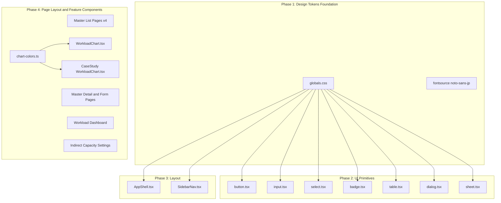

# Design Document: ui-improvement-oasis

## Overview

**Purpose**: Oasis Light Design System に基づき、操業管理システムのフロントエンド UI スタイルを包括的に改善する。「Soft-Bento, High-Clarity, Tech-Minimalist」の美的原則に従い、プロフェッショナルなビジネスデスクトップ UI を実現する。

**Users**: 事業部リーダー、プロジェクトマネージャー、経営層が日常的に使用するダッシュボードおよびマスタ管理画面の視覚品質を向上させる。

**Impact**: 既存の shadcn/ui + Tailwind CSS v4 アーキテクチャを維持しつつ、globals.css のデザイントークンと各 UI コンポーネントのスタイルクラスを Oasis Light 仕様に書き換える。

### Goals
- Oasis Light Design System のカラー・タイポグラフィ・角丸・シャドウトークンを全面適用
- 4 フェーズの段階的適用により、各フェーズで視覚的に検証可能な状態を維持
- 既存の機能・ロジック・コンポーネント構造に変更を加えない（スタイルのみの変更）

### Non-Goals
- コンポーネントのロジック変更やビジネスロジックのリファクタリング
- 新機能の追加（KPI カード等の新規コンポーネント作成は本 spec のスコープ外）
- ダークモード対応
- アクセシビリティの大幅な改善（色のコントラスト比の向上は含むが WCAG 準拠の全面監査は対象外）
- バックエンド・API の変更

## Architecture

> 詳細な調査経緯は `research.md` を参照。

### Existing Architecture Analysis

現行システムは以下のパターンで構成されており、すべて維持される:

- **デザイントークン**: `globals.css` の `@theme` ディレクティブで CSS 変数を定義。全コンポーネントが Tailwind ユーティリティクラス経由で参照
- **UI コンポーネント**: shadcn/ui ベース + CVA（class-variance-authority）でバリアント管理
- **レイアウト**: `AppShell` + `SidebarNav` による Sidebar + Main 構成
- **スタイリング**: Tailwind CSS v4 ユーティリティクラス + `cn()` ヘルパー
- **チャート**: Recharts + カスタムカラーパレット（`chart-colors.ts`）

**制約**: コンポーネントは `rounded-xl` 等の Tailwind クラスを直接指定しており、`--radius-*` CSS 変数を参照していない。そのため、角丸の変更はコンポーネント単位での書き換えが必要。

### Architecture Pattern & Boundary Map



**Architecture Integration**:
- **Selected pattern**: 既存アーキテクチャの延長（スタイルトークンの差し替え + コンポーネントクラスの書き換え）
- **Domain boundaries**: 変更は `apps/frontend/src/` 内に完全に閉じる
- **Existing patterns preserved**: shadcn/ui + CVA バリアント管理、Tailwind ユーティリティクラス、`cn()` パターン
- **New components**: なし（既存コンポーネントの修正のみ）
- **Steering compliance**: フロントエンド feature-first 構成、`@` エイリアスインポートを維持

### Technology Stack

| Layer | Choice / Version | Role in Feature | Notes |
|-------|------------------|-----------------|-------|
| Styling | Tailwind CSS v4.1 | デザイントークン定義・ユーティリティクラス | `@theme` で hex カラー定義 |
| Font | @fontsource/noto-sans-jp | 日本語フォント追加 | 400/700 ウェイトのみ |
| UI Components | shadcn/ui + CVA | コンポーネントバリアント | スタイルクラス書き換え |
| Charts | Recharts v3.7 | グラデーション塗り適用 | SVG `<linearGradient>` 活用 |

## Requirements Traceability

| Requirement | Summary | Components | Notes |
|-------------|---------|------------|-------|
| 1.1–1.6 | カラーシステム更新 | GlobalCSS | hex 値で全 CSS 変数を再定義 |
| 2.1 | Noto Sans JP 追加 | GlobalCSS, FontPkg | @fontsource npm パッケージ |
| 2.2–2.4 | タイポグラフィスケール | GlobalCSS | Tailwind ユーティリティ参照 |
| 3.1–3.3 | 角丸更新 | Button, Input, Select, Dialog, Sheet | 各コンポーネントのクラス直接書き換え |
| 3.4–3.5 | ホバーシャドウ | GlobalCSS, feature コンポーネント | カード要素に `hover:shadow-*` 追加 |
| 3.6 | カードラッピング | 全ページコンポーネント | 下記「カードラッピング対象マップ」参照 |
| 4.1–4.3 | Bento Grid | 全ページコンポーネント | 下記「Bento Grid 適用マップ」参照 |
| 5.1–5.5 | サイドバー更新 | AppShell, SidebarNav | 幅変更・トランジション追加 |
| 6.1–6.6 | ボタン・フォーム更新 | Button, Input, Select | CSS 変数変更 + クラス書き換え |
| 7.1–7.4 | テーブル更新 | TableUI | ヘッダースタイル・ホバー行 |
| 8.1–8.4 | チャート更新 | WorkloadChart, CaseChart, ChartColors | グラデーション・グリッド色・ツールチップ |
| 9.1–9.3 | バッジ更新 | Badge | ティントスタイル・フォント調整 |
| 10.1–10.3 | トランジション統一 | Dialog, Sheet, 全インタラクティブ要素 | `transition-all duration-200 ease-in-out` 標準化 |

## Components and Interfaces

| Component | Domain/Layer | Intent | Req Coverage | Key Dependencies | Contracts |
|-----------|-------------|--------|--------------|------------------|-----------|
| GlobalCSS | Foundation | デザイントークン定義 | 1.1–1.6, 2.1–2.4 | @fontsource (P1) | State |
| Button | UI Primitive | ボタンスタイル | 3.3, 6.1–6.3, 6.6 | GlobalCSS (P0) | State |
| Input | UI Primitive | 入力要素スタイル | 3.2, 6.4–6.5 | GlobalCSS (P0) | State |
| Select | UI Primitive | セレクトスタイル | 3.2 | GlobalCSS (P0) | State |
| Badge | UI Primitive | バッジスタイル | 9.1–9.3 | GlobalCSS (P0) | State |
| TableUI | UI Primitive | テーブルスタイル | 7.1–7.4 | GlobalCSS (P0) | State |
| Dialog | UI Primitive | ダイアログスタイル | 10.2–10.3 | GlobalCSS (P0) | State |
| Sheet | UI Primitive | シートスタイル | 10.2–10.3 | GlobalCSS (P0) | State |
| AppShell | Layout | サイドバーレイアウト | 5.1–5.3, 5.5 | GlobalCSS (P0) | State |
| SidebarNav | Layout | ナビスタイル | 5.4 | GlobalCSS (P0) | State |
| MasterListPages | Page Layout | 一覧ページの Grid + カード化 | 3.6, 4.1–4.3 | TableUI (P0) | State |
| MasterDetailPages | Page Layout | 詳細・フォームのカード角丸統一 | 3.1, 3.4–3.5 | GlobalCSS (P0) | State |
| WorkloadPage | Page Layout | ダッシュボードの Grid + カード化 | 3.6, 4.1–4.3 | WorkloadChart (P0) | State |
| IndirectPage | Page Layout | 設定画面の Grid + カード化 | 3.6, 4.1–4.3 | GlobalCSS (P0) | State |
| WorkloadChart | Feature | チャートグラデーション | 8.1–8.4 | ChartColors (P1) | State |
| CaseChart | Feature | チャートスタイル | 8.2–8.3 | GlobalCSS (P0) | State |

### Foundation Layer

#### GlobalCSS (globals.css)

| Field | Detail |
|-------|--------|
| Intent | Oasis Light Design System のデザイントークンを CSS 変数として定義する |
| Requirements | 1.1–1.6, 2.1–2.4 |

**Responsibilities & Constraints**
- 全カラーパレット（background, card, primary, accent, text, semantic）の CSS 変数定義
- 角丸変数（`--radius-*`）の更新
- フォントファミリーに Noto Sans JP を追加
- `@layer base` でのデフォルトスタイル設定

**Dependencies**
- External: `@fontsource/noto-sans-jp` — 日本語フォントファイル提供 (P1)

**Contracts**: State [x]

##### State Management

**カラートークン定義**（hex 形式）:

```typescript
// Design Token Interface（概念的定義）
interface OasisLightTokens {
  // Surface
  background: '#F8FAFC'
  card: '#FFFFFF'
  popover: '#FFFFFF'

  // Primary (Indigo)
  primary: '#6366F1'
  primaryForeground: '#FFFFFF'

  // Secondary
  secondary: '#F1F5F9'
  secondaryForeground: '#475569'

  // Accent
  accent: '#F8FAFC'
  accentForeground: '#1E293B'

  // Muted
  muted: '#F1F5F9'
  mutedForeground: '#94A3B8'

  // Text
  foreground: '#1E293B'

  // Border
  border: '#E2E8F0'
  input: '#E2E8F0'
  ring: '#6366F1'

  // Semantic
  destructive: '#EF4444'
  success: '#10B981'
  warning: '#F59E0B'
  info: '#38BDF8'

  // Sidebar
  sidebar: '#FFFFFF'
  sidebarBorder: '#F1F5F9'

  // Oasis Accent Palette
  indigo: '#6366F1'
  emerald: '#10B981'
  sky: '#38BDF8'
  purple: '#A78BFA'
}
```

**フォントスタック**:
```
"Inter", "Noto Sans JP", ui-sans-serif, system-ui, sans-serif
```

**Implementation Notes**
- `@theme` ディレクティブ内で全カラーを hex 形式で再定義
- oklch → hex への一括置換。opacity modifier（`bg-primary/10`）は `color-mix()` 経由で動作確認済み（`research.md` 参照）
- `@fontsource/noto-sans-jp` は CSS `@import` で 400/700 ウェイトのみ読み込む
- Oasis Accent カラー（indigo, emerald, sky, purple）はカスタム CSS 変数として追加定義

### UI Primitive Layer

#### Button (button.tsx)

| Field | Detail |
|-------|--------|
| Intent | Oasis Light のボタンスタイル（角丸・カラー）を適用 |
| Requirements | 3.3, 6.1–6.3, 6.6 |

**変更内容**:
- 基底クラス: `rounded-xl` → `rounded-lg`（8px）
- `size.sm`: `rounded-lg` 維持
- `shadow-sm` → 静止時シャドウなし
- `transition-all duration-200` → `transition-all duration-200 ease-in-out` で統一
- `variant.default`: primary カラー変更は GlobalCSS で自動適用
- `variant.secondary`: GlobalCSS の secondary 変数変更で自動適用
- `variant.ghost`: GlobalCSS の accent 変数変更で自動適用

#### Input (input.tsx)

| Field | Detail |
|-------|--------|
| Intent | Oasis Light の入力要素スタイルを適用 |
| Requirements | 3.2, 6.4–6.5 |

**変更内容**:
- `rounded-xl` → `rounded-2xl`（16px）
- `bg-background` はそのまま（GlobalCSS で `#F8FAFC` に変更されるため入力背景として適切）
- ただし入力フィールドの背景は白（`#FFFFFF`）が望ましい場合は `bg-card` に変更を検討
- フォーカスリングは `ring-ring` → GlobalCSS で ring を Indigo に変更済み
- `transition-colors` → `transition-all duration-200 ease-in-out`

#### Select (select.tsx)

| Field | Detail |
|-------|--------|
| Intent | Oasis Light のセレクト要素スタイルを適用 |
| Requirements | 3.2 |

**変更内容**:
- SelectTrigger: `rounded-xl` → `rounded-2xl`
- SelectContent: `rounded-xl` → `rounded-2xl`
- SelectItem: `rounded-lg` 維持

#### Badge (badge.tsx)

| Field | Detail |
|-------|--------|
| Intent | Oasis Light のティントバッジスタイルを適用 |
| Requirements | 9.1–9.3 |

**変更内容**:
- 基底クラス: `text-xs font-semibold` → `text-xs font-medium`
- `variant.default`: `bg-primary text-primary-foreground` → `bg-primary/10 text-primary border-transparent`（ティントスタイル）
- `variant.secondary`: 既存維持
- `variant.destructive`: `bg-destructive/10 text-destructive` 維持（既に Oasis パターンに近い）
- `variant.success`: `bg-emerald-100 text-emerald-700` → Oasis の emerald アクセント 10% 透過に統一

#### TableUI (table.tsx)

| Field | Detail |
|-------|--------|
| Intent | Oasis Light のデータテーブルスタイルを適用 |
| Requirements | 7.1–7.4 |

**変更内容**:
- TableHead: `font-medium text-muted-foreground` → `bg-accent text-xs font-medium text-muted-foreground uppercase tracking-wider`
- TableRow: `hover:bg-muted/50` → `hover:bg-accent`（GlobalCSS で accent=#F8FAFC に変更済み）
- TableCell: `px-4 py-3` 維持（既に 12px 16px 相当）
- ボーダー色は GlobalCSS の border 変数変更で自動対応

#### Dialog (dialog.tsx)

| Field | Detail |
|-------|--------|
| Intent | Oasis Light のダイアログスタイルを適用 |
| Requirements | 10.2–10.3 |

**変更内容**:
- DialogOverlay: `bg-black/80` → `bg-black/40 backdrop-blur-sm`
- DialogContent: `shadow-lg` → `shadow-[0_25px_50px_-12px_rgb(0_0_0/0.1)]`
- `rounded-2xl` → `rounded-3xl`（24px）

#### Sheet (sheet.tsx)

| Field | Detail |
|-------|--------|
| Intent | Oasis Light のシートスタイルを適用 |
| Requirements | 10.2–10.3 |

**変更内容**:
- SheetOverlay: `bg-black/80` → `bg-black/40 backdrop-blur-sm`
- SheetContent: `shadow-lg` → `shadow-[0_25px_50px_-12px_rgb(0_0_0/0.1)]`

### Layout Layer

#### AppShell (AppShell.tsx)

| Field | Detail |
|-------|--------|
| Intent | Oasis Light のサイドバーレイアウト仕様を適用 |
| Requirements | 5.1–5.3, 5.5 |

**変更内容**:
- サイドバー展開幅: `lg:w-72`（288px）→ `lg:w-60`（240px）
- `border-r border-border` → `border-r border-sidebar-border`（GlobalCSS で #F1F5F9）
- サイドバー aside に `transition-all duration-200 ease-in-out` を追加（幅変更アニメーション）

#### SidebarNav (SidebarNav.tsx)

| Field | Detail |
|-------|--------|
| Intent | Oasis Light のナビゲーションスタイルを適用 |
| Requirements | 5.4 |

**変更内容**:
- アクティブ項目: `bg-primary/10 text-primary` は GlobalCSS で primary が Indigo に変わるため自動適用
- 変更不要（GlobalCSS の primary 変更で対応済み）

### Page Layout Layer

#### カードラッピング対象マップ（Req 3.6）

全画面のコンテンツ領域をカードコンポーネント（`rounded-3xl bg-card`）で囲む。既にカードで囲まれている箇所は角丸を `rounded-2xl` → `rounded-3xl` に更新。

| 画面 | ルートファイル | 現状 | 変更方針 |
|------|-------------|------|---------|
| **マスタ一覧** (BU, Projects, ProjectTypes, WorkTypes) | `master/*/index.tsx` | テーブル・ツールバーがカード外 | Toolbar + DataTable を 1 つのカード (`rounded-3xl bg-card p-6`) で囲む |
| **マスタ詳細** (BU, Projects, ProjectTypes, WorkTypes) | `master/*/$id/index.tsx` | `rounded-2xl border shadow-sm p-6` カード済み | `rounded-2xl` → `rounded-3xl`、`shadow-sm` → ホバーのみシャドウ |
| **マスタ新規作成** | `master/*/new.tsx` | `rounded-2xl border shadow-sm p-6` カード済み | `rounded-2xl` → `rounded-3xl`、`shadow-sm` → ホバーのみシャドウ |
| **マスタ編集** | `master/*/$id/edit.tsx` | `rounded-2xl border shadow-sm p-6` カード済み | `rounded-2xl` → `rounded-3xl`、`shadow-sm` → ホバーのみシャドウ |
| **Workload ダッシュボード** | `workload/index.lazy.tsx` | カードなし（Flex 直配置） | チャート+レジェンドをカード化、サイドパネルをカード化、テーブルをカード化 |
| **間接作業・キャパシティ** | `master/indirect-capacity-settings/index.lazy.tsx` | パネル直配置 | 左パネル（Settings）をカード化、右パネル（Result）をカード化 |
| **案件詳細の CaseStudy** | `master/projects/$id/index.tsx` | CaseStudySection は内部実装依存 | セクション全体をカードで囲む（既存のカードスタイルがあれば角丸更新） |

**カード共通スタイル**:
```
rounded-3xl bg-card border border-border p-6
hover:shadow-[0_20px_25px_-5px_rgb(0_0_0/0.05)]
transition-all duration-200 ease-in-out
```

#### Bento Grid 適用マップ（Req 4.1–4.3）

全画面のメインコンテンツ領域に CSS Grid レイアウト（`gap-6`）を適用する。

| 画面 | 現状レイアウト | Grid 適用方針 | カラム構成 |
|------|-------------|-------------|-----------|
| **マスタ一覧** (4 画面) | `space-y-6` Flex | `grid grid-cols-1 gap-6` | 1 列固定（PageHeader + カード[Toolbar+Table]） |
| **マスタ詳細** (4 画面) | `space-y-6` Flex | `grid grid-cols-1 gap-6` | 1 列固定（PageHeader + カード[Detail]） |
| **マスタ新規/編集** (8 画面) | `space-y-6` Flex | `grid grid-cols-1 gap-6` | 1 列固定（PageHeader + カード[Form]） |
| **Workload ダッシュボード** | Flex column + 内部 Flex | `grid gap-6` レスポンシブ | 下記参照 |
| **間接作業・キャパシティ** | `grid grid-cols-1 md:grid-cols-[60fr_40fr] gap-4` | `gap-4` → `gap-6` に統一 | 既存の 60/40 比率を維持 |

**Workload ダッシュボード Grid 詳細設計**:

```
┌─────────────────────────────────────────────┐
│ Header Bar (PageHeader + BU Selector)       │  ← Grid 外（固定ヘッダー）
├─────────────────────────────────────────────┤
│                                             │
│  ┌──────────────────────┐  ┌─────────────┐ │
│  │                      │  │             │ │
│  │   Chart Card         │  │  SidePanel  │ │  ← grid-cols-[1fr_320px]
│  │   (チャート+レジェンド) │  │   Card      │ │     gap-6
│  │                      │  │             │ │
│  └──────────────────────┘  └─────────────┘ │
│                                             │
│  ┌──────────────────────────────────────┐   │
│  │   Table Card                        │   │  ← col-span-full
│  │   (DataTable)                       │   │
│  └──────────────────────────────────────┘   │
│                                             │
└─────────────────────────────────────────────┘
```

- ヘッダーバー（BU セレクタ含む）は Grid 外で固定表示
- メインコンテンツ: `grid grid-cols-1 lg:grid-cols-[1fr_320px] gap-6`
- チャートカード: 左カラム（チャート + レジェンドを 1 カードに統合）
- サイドパネルカード: 右カラム（タブ式パネル）
- テーブルカード: `col-span-full`（2 列目以降の全幅）
- レスポンシブ: モバイル/タブレット → `grid-cols-1`（縦積み）

**間接作業・キャパシティ Grid 詳細設計**:

```
┌─────────────────────────────────────────────┐
│ Header Bar (Title + BU Selector)            │  ← Grid 外
├─────────────────────────────────────────────┤
│                                             │
│  ┌──────────────────────┐  ┌────────────┐  │
│  │                      │  │            │  │
│  │   Settings Card      │  │  Result    │  │  ← grid-cols-1 md:grid-cols-[60fr_40fr]
│  │   (左パネル)          │  │  Card      │  │     gap-6
│  │                      │  │  (右パネル)  │  │
│  └──────────────────────┘  └────────────┘  │
│                                             │
└─────────────────────────────────────────────┘
```

- 既存の `grid-cols-[60fr_40fr]` 比率を維持
- `gap-4` → `gap-6`（24px）に統一
- 各パネルをカードで囲む

**マスタ一覧ページ Grid 詳細設計**:

```
┌─────────────────────────────────────────────┐
│                                             │
│  PageHeader (タイトル + アクション)            │  ← Grid 内 1 行目
│                                             │
│  ┌──────────────────────────────────────┐   │
│  │   Card                              │   │  ← Grid 内 2 行目
│  │   ┌──────────────────────────────┐   │   │
│  │   │ DataTableToolbar             │   │   │
│  │   ├──────────────────────────────┤   │   │
│  │   │ DataTable                    │   │   │
│  │   │ (ソート・フィルタ・ページネーション) │   │   │
│  │   └──────────────────────────────┘   │   │
│  └──────────────────────────────────────┘   │
│                                             │
└─────────────────────────────────────────────┘
```

- `space-y-6` → `grid grid-cols-1 gap-6` に変更
- PageHeader はカード外（グリッド内 1 行目）
- Toolbar + DataTable を 1 つのカードに統合

### Feature Layer

#### WorkloadChart (features/workload/components/WorkloadChart.tsx)

| Field | Detail |
|-------|--------|
| Intent | Oasis Light のチャートグラデーション・グリッド・ツールチップスタイルを適用 |
| Requirements | 8.1–8.4 |

**Responsibilities & Constraints**
- 各 Area シリーズに SVG `<linearGradient>` を動的生成
- CartesianGrid の色を `#F1F5F9` に統一
- ツールチップに `backdrop-blur` を適用

**Dependencies**
- Inbound: useChartData フック — シリーズ設定提供 (P0)
- External: Recharts v3.7 — SVG グラデーション対応 (P0)

**Contracts**: State [x]

##### State Management

**グラデーション生成インターフェース**:

```typescript
interface GradientConfig {
  id: string        // ユニークなグラデーション ID
  color: string     // ベースカラー（hex）
  topOpacity: number    // 上部 opacity（0.3）
  bottomOpacity: number // 下部 opacity（0.05）
}

// useChartData フックの拡張（概念的）
interface ChartSeriesConfigExtended extends AreaSeriesConfig {
  gradientId: string  // `url(#${gradientId})` として fill に使用
}
```

**Implementation Notes**
- `<defs>` セクションで `seriesConfig.areas.map()` によりグラデーション定義を動的生成
- 各 Area の `fill` を solid color → `url(#gradient-${dataKey})` に変更
- `fillOpacity` を 1.0 に設定（opacity はグラデーション stop で制御）
- CartesianGrid: `stroke="#F1F5F9"` を指定
- ツールチップ: カスタムツールチップコンポーネントに `backdrop-blur-md rounded-xl` を適用
- `useMemo` でグラデーション `<defs>` をメモ化（`research.md` 参照）

#### CaseChart (features/case-study/components/WorkloadChart.tsx)

| Field | Detail |
|-------|--------|
| Intent | 既存グラデーションの opacity 調整とコンテナスタイル更新 |
| Requirements | 8.1–8.3 |

**Implementation Notes**
- 既にグラデーション塗りを使用しているため、opacity 値の調整のみ（0.6 → 0.3, 0.05 維持）
- チャートコンテナのカードスタイルを Oasis Light に合わせて更新

## Testing Strategy

### Visual Regression Testing
- Phase 毎にブラウザで目視確認
  - Phase 1: 背景色・テキスト色・フォントの変化を全画面で確認
  - Phase 2: ボタン・入力・セレクト・バッジ・テーブル・ダイアログの外観確認
  - Phase 3: サイドバーの幅・トランジション・レスポンシブ動作確認
  - Phase 4a: 全画面の Bento Grid レイアウト・カードラッピング確認
  - Phase 4b: チャートのグラデーション・グリッド色・ツールチップ確認

### Functional Smoke Test
- 全画面遷移が正常に動作すること
- フォーム入力・送信が正常に動作すること
- テーブルのソート・フィルタ・ページネーションが正常に動作すること
- チャートの表示・インタラクション（ホバー、クリック）が正常に動作すること
- サイドバーの展開/折りたたみが正常に動作すること

### Lint Check
- 各 Phase 完了後に `pnpm --filter frontend lint` を実行し、コード品質を確認

## Performance & Scalability

- **バンドルサイズ**: @fontsource/noto-sans-jp 追加により gzip 後約 1.2MB 増加（許容範囲）
- **レンダリング**: CSS 変数変更は再レンダリングを伴わない。Tailwind クラス変更はビルド時に解決
- **チャート**: SVG グラデーション定義数（10-20）はブラウザレンダリングに影響なし（`research.md` で確認済み）
