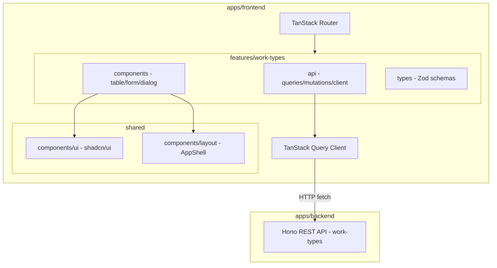
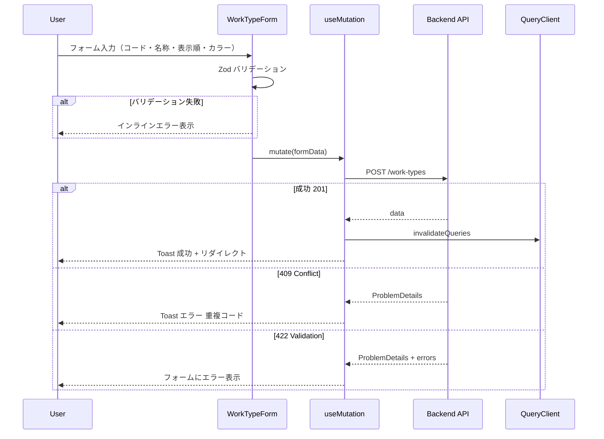
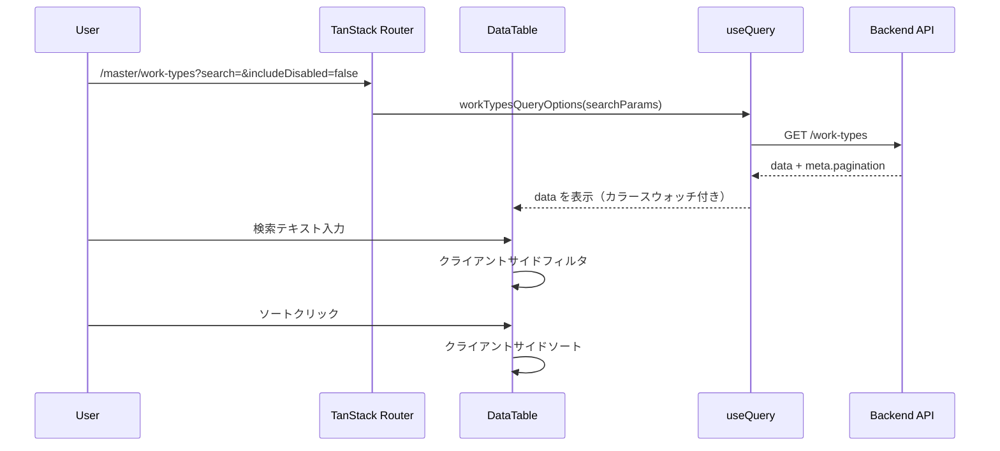

# Design Document

## Overview

**Purpose**: 作業種類（`work_types`）マスターデータの管理画面を提供し、管理者が作業種類の一覧閲覧・検索・詳細確認・新規登録・編集・削除・復元を行えるようにする。

**Users**: 事業部リーダー・管理者が、間接作業分類のマスターデータメンテナンスに使用する。

**Impact**: 既存の `work-types` CRUD API（Hono バックエンド）に対するフロントエンド UI を新規構築する。バックエンドの変更は不要。business-units-master-ui の実装パターンを踏襲し、`color` フィールド対応（カラースウォッチ・カラーピッカー）を追加する。

### Goals
- 既存 `work-types` API を呼び出す型安全なフロントエンド管理画面の提供
- business-units マスタ管理画面と統一されたデザイン言語の適用
- `color` フィールドの視覚的な表示・編集 UI の実現
- feature-first アーキテクチャによる高凝集・低結合なモジュール構成

### Non-Goals
- バックエンド API の変更・拡張
- 他マスター画面との共通コンポーネント抽出（feature 間依存禁止）
- 認証・認可の実装
- E2E テストの実装

## Architecture

### Existing Architecture Analysis

- **バックエンド**: `work-types` の 6 エンドポイント（CRUD + 復元）が `apps/backend` に実装・テスト済み
- **フロントエンド**: `features/business-units/` が参照実装として稼働中。`features/work-types/` は未作成
- **AppShell**: サイドバーに「ビジネスユニット」メニューが存在。「作業種類」メニュー項目の追加が必要

### Architecture Pattern & Boundary Map



**Architecture Integration**:
- **Selected pattern**: Feature-first SPA — business-units と同一パターン。`features/work-types/` に全ドメインロジックを凝集
- **Domain boundaries**: API 層・表示層・型定義層を feature 内で分離。feature 外への依存は共有 UI コンポーネントとルーティングのみ
- **Existing patterns preserved**: business-units のファイル構成・命名・API パターンをそのまま踏襲
- **New components rationale**: color フィールド固有の UI（カラースウォッチ表示、カラーピッカー入力）が business-units にはない新規要素
- **Steering compliance**: feature-first 構成、`@/` エイリアス、TanStack エコシステム統一、Zod 中心の型安全性

### Technology Stack

| Layer | Choice / Version | Role in Feature | Notes |
|-------|------------------|-----------------|-------|
| Routing | `@tanstack/react-router` | ファイルベースルーティング | search params は Zod でバリデーション |
| Data Fetching | `@tanstack/react-query` v5 | API データの取得・キャッシュ・ミューテーション | queryOptions パターン |
| Table | `@tanstack/react-table` v8 | ヘッドレス UI テーブル | ソート・フィルタ |
| Form | `@tanstack/react-form` v1 | フォーム状態管理・バリデーション | Standard Schema 対応 |
| UI Components | shadcn/ui | デザインシステムプリミティブ | business-units と統一テーマ |
| Styling | Tailwind CSS v4 | ユーティリティファースト CSS | 既存テーマ適用 |
| Validation | Zod v3 | スキーマ定義・型導出 | フロントエンド側バリデーション |
| カラーピッカー | ネイティブ `<input type="color">` | カラー選択 UI | 外部ライブラリ不要 |

## System Flows

### 作業種類作成フロー（color フィールド含む）



### 一覧表示・検索フロー



## Requirements Traceability

| Requirement | Summary | Components | Interfaces | Flows |
|-------------|---------|------------|------------|-------|
| 1.1 | 一覧画面で API 呼び出し | WorkTypeListPage, DataTable | workTypesQueryOptions | 一覧表示フロー |
| 1.2 | テーブルカラム表示 | columns.tsx | ColumnDef | - |
| 1.3 | カラースウォッチ表示 | columns.tsx, ColorSwatch | color accessor | - |
| 1.4 | ソート機能 | DataTable | SortingState | - |
| 1.5 | ローディング状態 | DataTable | isLoading | - |
| 1.6 | エラー表示 | DataTable | isError | - |
| 2.1 | 検索入力欄 | DataTableToolbar | globalFilter | - |
| 2.2 | クライアントサイドフィルタ | DataTable | filterFn | 一覧表示フロー |
| 2.3 | 削除済みトグル | DataTableToolbar | includeDisabled search param | - |
| 2.4 | 削除済みの視覚的区別 | columns.tsx, StatusBadge | deletedAt | - |
| 3.1 | 詳細画面遷移 | WorkTypeDetailPage | workTypeQueryOptions | - |
| 3.2 | 詳細情報表示（カラースウォッチ付き） | WorkTypeDetailPage | WorkType 型 | - |
| 3.3 | 編集・削除ボタン | WorkTypeDetailPage | Link, Dialog | - |
| 3.4 | 戻るナビゲーション | Breadcrumb | - | - |
| 3.5 | 404 表示 | WorkTypeDetailPage | notFoundComponent | - |
| 4.1 | 新規登録画面遷移 | WorkTypeListPage | Link | - |
| 4.2 | 登録フォーム（カラーピッカー含む） | WorkTypeForm | createWorkTypeSchema | - |
| 4.3 | カラーピッカー UI | WorkTypeForm | input type=color | - |
| 4.4 | リアルタイムバリデーション | WorkTypeForm | Zod validators | - |
| 4.5 | POST API 呼び出し | useCreateWorkType | createWorkType mutation | 作成フロー |
| 4.6 | 成功時リダイレクト | useCreateWorkType | navigate, toast | 作成フロー |
| 4.7 | 409 エラー表示 | useCreateWorkType | toast | 作成フロー |
| 4.8 | 422 エラー表示 | WorkTypeForm | form errors | 作成フロー |
| 5.1 | 編集画面遷移 | WorkTypeEditPage | workTypeQueryOptions | - |
| 5.2 | コード読み取り専用 | WorkTypeForm | mode prop | - |
| 5.3 | 編集バリデーション | WorkTypeForm | updateWorkTypeSchema | - |
| 5.4 | PUT API 呼び出し | useUpdateWorkType | updateWorkType mutation | - |
| 5.5 | 更新成功リダイレクト | useUpdateWorkType | navigate, toast | - |
| 5.6 | 404 エラー | useUpdateWorkType | toast | - |
| 5.7 | 422 エラー | WorkTypeForm | form errors | - |
| 6.1 | 削除確認ダイアログ | DeleteConfirmDialog | AlertDialog | - |
| 6.2 | DELETE API 呼び出し | useDeleteWorkType | deleteWorkType mutation | - |
| 6.3 | 削除成功リダイレクト | useDeleteWorkType | navigate, toast | - |
| 6.4 | 409 エラー参照制約 | useDeleteWorkType | toast | - |
| 6.5 | 404 エラー | useDeleteWorkType | toast | - |
| 7.1 | 復元ボタン表示 | columns.tsx | deletedAt 条件 | - |
| 7.2 | 復元確認ダイアログ | RestoreConfirmDialog | AlertDialog | - |
| 7.3 | 復元 API 呼び出し | useRestoreWorkType | restoreWorkType mutation | - |
| 7.4 | 復元成功・再取得 | useRestoreWorkType | invalidateQueries, toast | - |
| 7.5 | 復元 409 エラー | useRestoreWorkType | toast | - |
| 8.1 | ファイルベースルーティング | routes/master/work-types/ | Route files | - |
| 8.2 | 検索条件 search params | Route validateSearch | searchSchema | - |
| 8.3 | 削除済みトグル search params | Route validateSearch | searchSchema | - |
| 9.1-9.5 | ビジュアルデザイン | Theme CSS, shadcn/ui | 既存テーマ踏襲 | - |
| 10.1-10.5 | インタラクション・フィードバック | Toast, StatusBadge, Transitions | Sonner, CSS animations | - |
| 11.1-11.4 | feature モジュール構成 | features/work-types/ | index.ts exports | - |

## Components and Interfaces

| Component | Domain/Layer | Intent | Req Coverage | Key Dependencies | Contracts |
|-----------|--------------|--------|--------------|------------------|-----------|
| WorkTypeListPage | Route/Page | 一覧画面のルートコンポーネント | 1.1-1.6, 2.1-2.4, 4.1 | DataTable (P0), QueryClient (P0) | - |
| WorkTypeDetailPage | Route/Page | 詳細画面（カラースウォッチ付き） | 3.1-3.5 | QueryClient (P0) | - |
| WorkTypeNewPage | Route/Page | 新規登録画面 | 4.1-4.8 | WorkTypeForm (P0) | - |
| WorkTypeEditPage | Route/Page | 編集画面 | 5.1-5.7 | WorkTypeForm (P0), QueryClient (P0) | - |
| DataTable | Feature/UI | TanStack Table ラッパー（ソート・フィルタ） | 1.1-1.6, 2.1-2.2 | @tanstack/react-table (P0), shadcn/ui Table (P0) | State |
| DataTableToolbar | Feature/UI | 検索・フィルタ・新規登録ボタン | 2.1-2.4, 4.1 | shadcn/ui Input, Switch (P0) | - |
| columns.tsx | Feature/Config | カラム定義（カラースウォッチ列含む） | 1.2-1.3, 2.4, 7.1 | ColumnDef (P0) | - |
| WorkTypeForm | Feature/UI | 新規登録・編集共通フォーム（カラーピッカー含む） | 4.2-4.4, 5.2-5.3 | @tanstack/react-form (P0), Zod (P0) | Service |
| workTypesApi | Feature/API | API クライアント関数群 | 全 CRUD | fetch (P0) | API |
| workTypesQueries | Feature/API | queryOptions / mutation 定義 | 1.1, 3.1, 4.5, 5.4, 6.2, 7.3 | @tanstack/react-query (P0) | Service |
| DebouncedSearchInput | Feature/UI | IME 対応検索入力 | 2.1-2.2 | - | - |
| DeleteConfirmDialog | Feature/UI | 削除確認ダイアログ | 6.1-6.2 | shadcn/ui AlertDialog (P0) | - |
| RestoreConfirmDialog | Feature/UI | 復元確認ダイアログ | 7.2-7.3 | shadcn/ui AlertDialog (P0) | - |

### Feature/API Layer

#### workTypesApi (api-client.ts)

| Field | Detail |
|-------|--------|
| Intent | バックエンド API との HTTP 通信を抽象化する薄い fetch ラッパー |
| Requirements | 1.1, 3.1, 4.5, 5.4, 6.2, 7.3 |

**Responsibilities & Constraints**
- 各 API エンドポイントに対応する関数を提供
- レスポンスの JSON パースと型アサーションを一箇所に集約
- エラーレスポンス（RFC 9457 ProblemDetails）のパースと型付きエラーの throw

**Dependencies**
- External: `fetch` API — HTTP 通信 (P0)
- Outbound: Backend API `GET/POST/PUT/DELETE /work-types` (P0)

**Contracts**: API [x]

##### API Contract

| Method | Endpoint | Request | Response | Errors |
|--------|----------|---------|----------|--------|
| GET | /work-types | `WorkTypeListParams` | `PaginatedResponse<WorkType>` | 422 |
| GET | /work-types/:code | - | `SingleResponse<WorkType>` | 404 |
| POST | /work-types | `CreateWorkTypeInput` | `SingleResponse<WorkType>` | 409, 422 |
| PUT | /work-types/:code | `UpdateWorkTypeInput` | `SingleResponse<WorkType>` | 404, 422 |
| DELETE | /work-types/:code | - | 204 No Content | 404, 409 |
| POST | /work-types/:code/actions/restore | - | `SingleResponse<WorkType>` | 404, 409 |

**Implementation Notes**
- API ベース URL は環境変数 `VITE_API_BASE_URL` で設定（business-units と同一パターン）
- `ApiError` クラスで `ProblemDetails` をラップして throw
- Content-Type は `application/json` 固定

#### workTypesQueries (queries.ts / mutations.ts)

| Field | Detail |
|-------|--------|
| Intent | TanStack Query の queryOptions / useMutation を定義し、キャッシュキーと取得ロジックを co-locate |
| Requirements | 1.1, 3.1, 4.5-4.8, 5.4-5.7, 6.2-6.5, 7.3-7.5 |

**Responsibilities & Constraints**
- `queryOptions` パターンで queryKey と queryFn を一体管理
- Mutation の `onSuccess` でキャッシュ無効化（`invalidateQueries`）
- エラーハンドリングは Route コンポーネント側で Toast 表示に委譲

**Dependencies**
- Inbound: Route components — クエリ・ミューテーションの使用 (P0)
- Outbound: workTypesApi — API 通信 (P0)

**Contracts**: Service [x]

##### Service Interface

```typescript
// Query Key Factory
const workTypeKeys = {
  all: ['work-types'] as const
  lists: () => [...workTypeKeys.all, 'list'] as const
  list: (params: WorkTypeListParams) => [...workTypeKeys.lists(), params] as const
  details: () => [...workTypeKeys.all, 'detail'] as const
  detail: (code: string) => [...workTypeKeys.details(), code] as const
}

// queries.ts
function workTypesQueryOptions(params: WorkTypeListParams): QueryOptions<PaginatedResponse<WorkType>>
function workTypeQueryOptions(code: string): QueryOptions<SingleResponse<WorkType>>

// mutations.ts
function useCreateWorkType(): UseMutationResult<WorkType, ProblemDetails, CreateWorkTypeInput>
function useUpdateWorkType(code: string): UseMutationResult<WorkType, ProblemDetails, UpdateWorkTypeInput>
function useDeleteWorkType(): UseMutationResult<void, ProblemDetails, string>
function useRestoreWorkType(): UseMutationResult<WorkType, ProblemDetails, string>
```

- Preconditions: QueryClient がプロバイダーで提供されていること
- Postconditions: 成功時にキャッシュが無効化され、一覧データが最新になること
- Invariants: queryKey はエンティティ名 `'work-types'` をプレフィクスとして持つ

### Feature/UI Layer

#### DataTable

| Field | Detail |
|-------|--------|
| Intent | TanStack Table のソート・フィルタをラップした汎用テーブルコンポーネント |
| Requirements | 1.1-1.6, 2.1-2.2 |

**Responsibilities & Constraints**
- `useReactTable` でテーブルインスタンスを生成
- ソート状態（`SortingState`）はクライアントサイドで管理
- グローバルフィルタ（`globalFilter`）はクライアントサイドで管理
- business-units の DataTable と同一パターン（ページネーション UI は非表示）

**Dependencies**
- External: `@tanstack/react-table` v8 (P0)
- External: shadcn/ui `Table`, `TableHeader`, `TableBody`, `TableRow`, `TableCell` (P0)

**Contracts**: State [x]

##### State Management

```typescript
type DataTableState = {
  sorting: SortingState
  globalFilter: string
}
```

- Persistence: 検索条件は URL search params に永続化。ソートはクライアントサイド状態
- Concurrency: シングルユーザー操作のため競合なし

#### WorkTypeForm

| Field | Detail |
|-------|--------|
| Intent | 新規登録・編集で共有するフォームコンポーネント（TanStack Form + Zod）。カラーピッカー UI を含む |
| Requirements | 4.2-4.4, 5.2-5.3 |

**Responsibilities & Constraints**
- `mode: 'create' | 'edit'` プロパティで新規/編集を切り替え
- `edit` モードでは作業種類コードフィールドを `disabled` にする
- `color` フィールドはネイティブ `<input type="color">` とテキスト入力（#RRGGBB）のハイブリッド。null 許容のためクリアボタンを配置
- Zod スキーマによるフィールドレベルバリデーション

**Dependencies**
- External: `@tanstack/react-form` v1 (P0)
- External: `zod` (P0)
- Outbound: shadcn/ui `Input`, `Button`, `Label` (P1)

**Contracts**: Service [x]

##### Service Interface

```typescript
type WorkTypeFormProps = {
  mode: 'create' | 'edit'
  defaultValues?: WorkTypeFormValues
  onSubmit: (values: WorkTypeFormValues) => Promise<void>
  isSubmitting: boolean
}

type WorkTypeFormValues = {
  workTypeCode: string
  name: string
  displayOrder: number
  color: string | null
}
```

- Preconditions: `edit` モード時に `defaultValues` が提供されること
- Postconditions: `onSubmit` が呼ばれた時点でフォーム値は Zod スキーマでバリデーション済み

**Implementation Notes**
- カラーピッカー UI: `<input type="color">` でカラー選択 + `<Input>` で #RRGGBB テキスト入力を横並び配置
- color が null の場合、カラーピッカーはデフォルト値（#000000）を表示し、「クリア」ボタンで null に戻せる
- color フィールドのラベルには現在選択中のカラースウォッチ（小さな色丸）を併記

#### columns.tsx

| Field | Detail |
|-------|--------|
| Intent | TanStack Table のカラム定義。カラースウォッチ列を含む |
| Requirements | 1.2-1.3, 2.4, 7.1 |

**Implementation Notes**
- カラーカラム: `color` 値が存在する場合は `w-6 h-6 rounded-full border` の div に `backgroundColor` を設定。null の場合は「-」テキスト
- ステータスバッジ: `deletedAt` の有無で「有効」/「削除済み」Badge を表示
- 復元ボタン: `deletedAt` が存在する行に「復元」ボタンを条件付き表示
- コードカラム: 詳細画面への Link を含む

### Integration Points

#### AppShell サイドバー更新

`components/layout/AppShell.tsx` の `menuItems` に作業種類メニュー項目を追加:

```typescript
{
  label: '作業種類',
  href: '/master/work-types',
  icon: Palette, // lucide-react から Palette アイコン
}
```

## Data Models

### Domain Model

作業種類は単一のエンティティであり、フロントエンドでは API レスポンスの DTO をそのまま使用する。business-units との差分は `color` フィールド（string | null）のみ。

```typescript
/** API レスポンス型 */
type WorkType = {
  workTypeCode: string
  name: string
  displayOrder: number
  color: string | null
  createdAt: string
  updatedAt: string
  deletedAt?: string | null
}
```

### Data Contracts & Integration

**API Data Transfer**

```typescript
/** 一覧取得パラメータ */
type WorkTypeListParams = {
  includeDisabled: boolean
}

/** ページネーション付きレスポンス（共通型） */
type PaginatedResponse<T> = {
  data: T[]
  meta: {
    pagination: {
      currentPage: number
      pageSize: number
      totalItems: number
      totalPages: number
    }
  }
}

/** 単一リソースレスポンス（共通型） */
type SingleResponse<T> = {
  data: T
}

/** 作成リクエスト */
type CreateWorkTypeInput = {
  workTypeCode: string
  name: string
  displayOrder?: number
  color?: string | null
}

/** 更新リクエスト */
type UpdateWorkTypeInput = {
  name: string
  displayOrder?: number
  color?: string | null
}

/** RFC 9457 ProblemDetails エラー（共通型） */
type ProblemDetails = {
  type: string
  status: number
  title: string
  detail: string
  instance?: string
  errors?: Array<{
    field: string
    message: string
  }>
}
```

**Zod Schemas（フロントエンド用）**

```typescript
/** #RRGGBB 形式のカラーコードバリデーション */
const colorSchema = z.string().regex(/^#[0-9A-Fa-f]{6}$/, 'カラーコードは #RRGGBB 形式で入力してください').nullable().optional()

const createWorkTypeSchema = z.object({
  workTypeCode: z.string()
    .min(1, '作業種類コードは必須です')
    .max(20, '作業種類コードは20文字以内で入力してください')
    .regex(/^[a-zA-Z0-9_-]+$/, '英数字・ハイフン・アンダースコアのみ使用できます'),
  name: z.string()
    .min(1, '名称は必須です')
    .max(100, '名称は100文字以内で入力してください'),
  displayOrder: z.number()
    .int('表示順は整数で入力してください')
    .min(0, '表示順は0以上で入力してください')
    .default(0),
  color: colorSchema,
})

const updateWorkTypeSchema = z.object({
  name: z.string()
    .min(1, '名称は必須です')
    .max(100, '名称は100文字以内で入力してください'),
  displayOrder: z.number()
    .int('表示順は整数で入力してください')
    .min(0, '表示順は0以上で入力してください')
    .optional(),
  color: colorSchema,
})

const workTypeSearchSchema = z.object({
  search: z.string().catch('').default(''),
  includeDisabled: z.boolean().catch(false).default(false),
})
```

## Error Handling

### Error Strategy

business-units と同一の 3 層エラー処理:
1. **フォームバリデーション**: Zod スキーマによるクライアントサイドバリデーション → インラインエラー表示
2. **API エラー**: `ProblemDetails` 形式のレスポンスを解析 → Toast 通知またはフォームエラー
3. **予期しないエラー**: Error Boundary でキャッチ → エラー画面表示

### Error Categories and Responses

**User Errors (4xx)**:
- 422 バリデーションエラー → `errors` 配列の各 `field` をフォームフィールドにマッピングしてインライン表示
- 404 Not Found → 「作業種類が見つかりません」Toast + 一覧画面へリダイレクト
- 409 Conflict（作成時重複）→ 「同一コードの作業種類が既に存在します」Toast
- 409 Conflict（削除時参照制約）→ 「この作業種類は他のデータから参照されているため削除できません」Toast

**System Errors (5xx)**:
- ネットワークエラー / 500 → 「サーバーとの通信に失敗しました」Toast（エラー通知は手動閉じ）
- TanStack Query のリトライ（デフォルト 3 回）で自動復旧を試行

## Testing Strategy

### Unit Tests
- Zod スキーマのバリデーション（`createWorkTypeSchema`, `updateWorkTypeSchema`, `workTypeSearchSchema`、特に `colorSchema` の #RRGGBB バリデーション）
- API クライアント関数のレスポンスパース・エラーハンドリング

### Integration Tests
- `workTypesQueryOptions` が正しいキャッシュキーと取得関数を返すこと
- Mutation の `onSuccess` でキャッシュが無効化されること
- フォームの Zod バリデーションが TanStack Form と正しく統合されること（color フィールド含む）

### E2E/UI Tests（将来スコープ）
- 一覧画面表示 → カラースウォッチ表示確認 → 行クリック → 詳細画面遷移
- 新規登録 → カラーピッカー操作 → バリデーション → 成功 → リダイレクト
- 削除 → 確認ダイアログ → 成功 → 一覧更新

## Optional Sections

### Performance & Scalability

- TanStack Query の `staleTime` を 30 秒に設定（既存 QueryClient 設定を継承）
- TanStack Table のクライアントサイドソート/フィルタにより、ソート/検索時の API コール不要
- TanStack Router の `autoCodeSplitting` によるルート単位のバンドル分割
