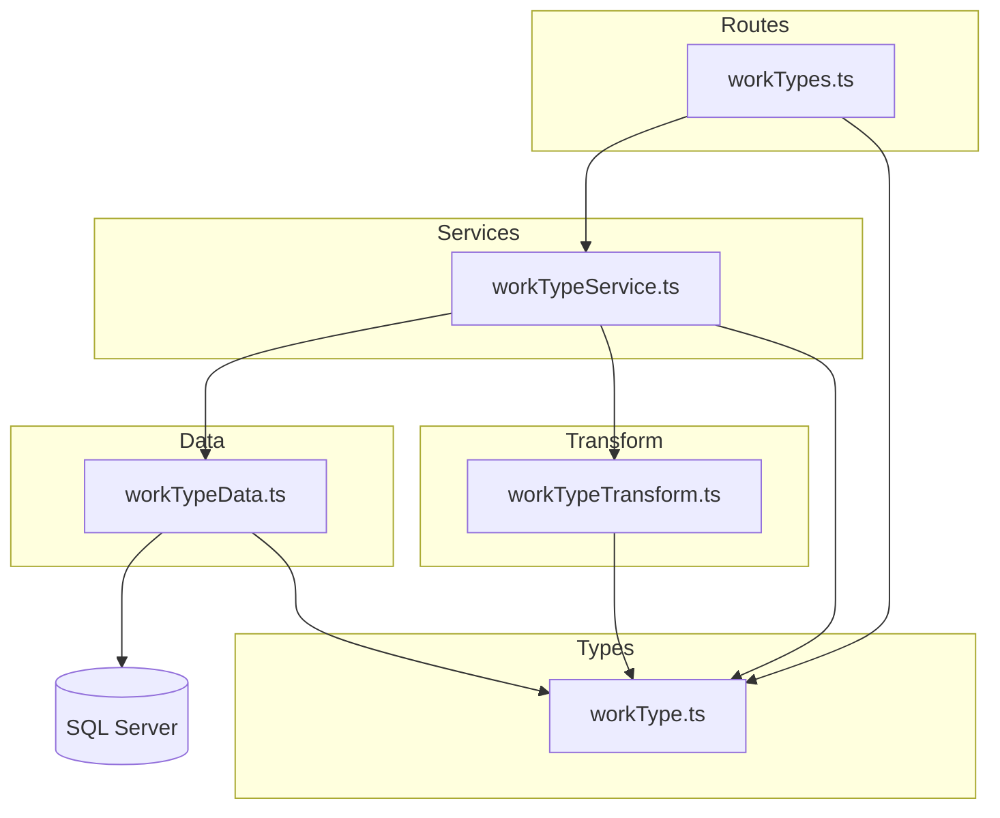

# 技術設計書: work-types CRUD API

## 概要

**目的**: 作業種類（work_types）マスタデータの CRUD API を提供し、間接作業の分類管理を可能にする。

**ユーザー**: システム管理者が作業種類の登録・参照・更新・削除・復元を行う。

**影響**: 新規 API エンドポイント群（`/work-types`）を追加。既存の business_units CRUD パターンを踏襲し、`color` フィールドの追加と参照整合性チェック対象の変更が主な差分。

### ゴール
- work_types テーブルに対する完全な CRUD 操作（一覧・個別取得・作成・更新・論理削除・復元）の提供
- 既存の business_units API と一貫したインターフェース設計
- RFC 9457 準拠のエラーレスポンス

### 非ゴール
- フロントエンド UI の実装
- work_types のバルク操作（一括作成・更新）
- 他テーブル（indirect_work_type_ratios）の連鎖操作

## アーキテクチャ

### 既存アーキテクチャ分析

既存の business_units CRUD API が確立した4層アーキテクチャを踏襲する。

- **Routes 層**: Hono メソッドチェーン + `validate()` ユーティリティ
- **Service 層**: ビジネスルール（重複チェック、参照整合性、状態検証）
- **Data 層**: mssql parameterized query による DB アクセス
- **Transform 層**: snake_case → camelCase 変換

ルートマウントは `src/index.ts` で `app.route('/work-types', workTypes)` として登録する。

### アーキテクチャパターン・境界マップ



**アーキテクチャ統合**:
- 選択パターン: 既存4層パターン（Routes → Service → Data → Transform）の踏襲
- 新規コンポーネント: workTypes ルート、workTypeService、workTypeData、workTypeTransform、workType 型定義の5ファイル
- 既存パターン維持: validate ユーティリティ、errorHelper、paginationQuerySchema を再利用

### 技術スタック

| レイヤー | 選択 / バージョン | 役割 | 備考 |
|---------|------------------|------|------|
| Backend | Hono | HTTP ルーティング・バリデーション | 既存と同一 |
| Validation | Zod + @hono/zod-validator | リクエストバリデーション | 既存と同一 |
| Data | mssql | SQL Server アクセス | 既存と同一 |
| Database | SQL Server | work_types テーブル | 既存テーブル |

## 要件トレーサビリティ

| 要件 | 概要 | コンポーネント | インターフェース | フロー |
|------|------|-------------|----------------|-------|
| 1.1 | 一覧取得（アクティブのみ） | WorkTypeData.findAll, WorkTypeService.findAll, WorkTypesRoute GET / | API: GET /work-types | Request → Route → Service → Data → Transform → Response |
| 1.2 | ページネーション | WorkTypeData.findAll, WorkTypesRoute GET / | Query: page[number], page[size] | — |
| 1.3 | 論理削除済み含有フィルタ | WorkTypeData.findAll | Query: filter[includeDisabled] | — |
| 1.4 | camelCase レスポンス | WorkTypeTransform.toWorkTypeResponse | — | — |
| 1.5 | クエリバリデーションエラー | validate ユーティリティ | API: 422 Problem Details | — |
| 2.1 | 個別取得 | WorkTypeData.findByCode, WorkTypeService.findByCode, WorkTypesRoute GET /:workTypeCode | API: GET /work-types/:workTypeCode | — |
| 2.2 | 存在しない場合 404 | WorkTypeService.findByCode | API: 404 Problem Details | — |
| 3.1 | 新規作成 | WorkTypeData.create, WorkTypeService.create, WorkTypesRoute POST / | API: POST /work-types | — |
| 3.2 | 入力バリデーション | createWorkTypeSchema | API: 422 Problem Details | — |
| 3.3 | 重複チェック（削除済み含む） | WorkTypeData.findByCodeIncludingDeleted, WorkTypeService.create | API: 409 Problem Details | — |
| 3.4 | ボディバリデーションエラー | validate ユーティリティ | API: 422 Problem Details | — |
| 4.1 | 更新 | WorkTypeData.update, WorkTypeService.update, WorkTypesRoute PUT /:workTypeCode | API: PUT /work-types/:workTypeCode | — |
| 4.2 | 更新バリデーション | updateWorkTypeSchema | API: 422 Problem Details | — |
| 4.3 | 存在しない場合 404 | WorkTypeService.update | API: 404 Problem Details | — |
| 4.4 | ボディバリデーションエラー | validate ユーティリティ | API: 422 Problem Details | — |
| 5.1 | 論理削除 | WorkTypeData.softDelete, WorkTypeService.delete, WorkTypesRoute DELETE /:workTypeCode | API: DELETE /work-types/:workTypeCode | — |
| 5.2 | 存在しない場合 404 | WorkTypeService.delete | API: 404 Problem Details | — |
| 5.3 | 参照整合性チェック | WorkTypeData.hasReferences, WorkTypeService.delete | API: 409 Problem Details | — |
| 6.1 | 復元 | WorkTypeData.restore, WorkTypeService.restore, WorkTypesRoute POST /:workTypeCode/actions/restore | API: POST /work-types/:workTypeCode/actions/restore | — |
| 6.2 | 存在しない場合 404 | WorkTypeService.restore | API: 404 Problem Details | — |
| 6.3 | アクティブ状態での復元エラー | WorkTypeService.restore | API: 409 Problem Details | — |

## コンポーネントとインターフェース

| コンポーネント | ドメイン/レイヤー | 目的 | 要件カバレッジ | 主要依存関係 | コントラクト |
|--------------|----------------|------|-------------|------------|------------|
| WorkTypesRoute | Routes | HTTP エンドポイント定義 | 1.1-1.5, 2.1-2.2, 3.1-3.4, 4.1-4.4, 5.1-5.3, 6.1-6.3 | WorkTypeService (P0), validate (P0) | API |
| WorkTypeService | Services | ビジネスロジック | 1.1, 2.1-2.2, 3.1-3.3, 4.1-4.3, 5.1-5.3, 6.1-6.3 | WorkTypeData (P0), WorkTypeTransform (P0) | Service |
| WorkTypeData | Data | DB アクセス | 1.1-1.3, 2.1, 3.1-3.3, 4.1, 5.1-5.3, 6.1 | mssql/getPool (P0) | Service |
| WorkTypeTransform | Transform | レスポンス変換 | 1.4 | WorkType 型 (P0) | — |
| WorkType 型定義 | Types | スキーマ・型定義 | 3.2, 4.2 | Zod, paginationQuerySchema (P0) | — |

### Types レイヤー

#### WorkType 型定義（workType.ts）

| フィールド | 詳細 |
|-----------|------|
| 目的 | Zod バリデーションスキーマと TypeScript 型定義 |
| 要件 | 3.2, 4.2 |

**責務・制約**
- すべてのリクエスト/レスポンス型を一元管理
- DB 行型（snake_case）と API レスポンス型（camelCase）を分離

**コントラクト**: Service [x] / API [ ] / Event [ ] / Batch [ ] / State [ ]

##### サービスインターフェース

```typescript
// Zod スキーマ
const createWorkTypeSchema: z.ZodObject<{
  workTypeCode: z.ZodString       // 必須, 1-20文字, /^[a-zA-Z0-9_-]+$/
  name: z.ZodString               // 必須, 1-100文字
  displayOrder: z.ZodDefault<z.ZodNumber>  // 任意, 0以上整数, デフォルト0
  color: z.ZodOptional<z.ZodNullable<z.ZodString>>  // 任意, /^#[0-9a-fA-F]{6}$/ または null
}>

const updateWorkTypeSchema: z.ZodObject<{
  name: z.ZodString               // 必須, 1-100文字
  displayOrder: z.ZodOptional<z.ZodNumber>  // 任意, 0以上整数
  color: z.ZodOptional<z.ZodNullable<z.ZodString>>  // 任意, /^#[0-9a-fA-F]{6}$/ または null
}>

const workTypeListQuerySchema: z.ZodObject<{
  'page[number]': z.ZodDefault<z.ZodNumber>    // デフォルト1
  'page[size]': z.ZodDefault<z.ZodNumber>      // デフォルト20, 最大1000
  'filter[includeDisabled]': z.ZodDefault<z.ZodBoolean>  // デフォルトfalse
}>

// TypeScript 型
type CreateWorkType = z.infer<typeof createWorkTypeSchema>
type UpdateWorkType = z.infer<typeof updateWorkTypeSchema>
type WorkTypeListQuery = z.infer<typeof workTypeListQuerySchema>

type WorkTypeRow = {
  work_type_code: string
  name: string
  display_order: number
  color: string | null
  created_at: Date
  updated_at: Date
  deleted_at: Date | null
}

type WorkType = {
  workTypeCode: string
  name: string
  displayOrder: number
  color: string | null
  createdAt: string
  updatedAt: string
}
```

- 事前条件: なし
- 事後条件: スキーマによるバリデーション成功時のみ型推論された値が返却される
- 不変条件: WorkTypeRow は DB カラムと1:1対応、WorkType は API レスポンスと1:1対応

---

### Routes レイヤー

#### WorkTypesRoute（workTypes.ts）

| フィールド | 詳細 |
|-----------|------|
| 目的 | work-types エンドポイントの HTTP 契約定義 |
| 要件 | 1.1-1.5, 2.1-2.2, 3.1-3.4, 4.1-4.4, 5.1-5.3, 6.1-6.3 |

**責務・制約**
- HTTP リクエストの受付とバリデーション
- Service 層への委譲とレスポンス整形
- ビジネスロジックを含まない

**依存関係**
- Inbound: HTTP クライアント — API リクエスト (P0)
- Outbound: WorkTypeService — ビジネスロジック委譲 (P0)
- Outbound: validate — バリデーション (P0)

**コントラクト**: Service [ ] / API [x] / Event [ ] / Batch [ ] / State [ ]

##### API コントラクト

| メソッド | エンドポイント | リクエスト | レスポンス | エラー |
|---------|-------------|----------|----------|-------|
| GET | /work-types | workTypeListQuerySchema (query) | `{ data: WorkType[], meta: { pagination } }` | 422 |
| GET | /work-types/:workTypeCode | — | `{ data: WorkType }` | 404 |
| POST | /work-types | createWorkTypeSchema (body) | `{ data: WorkType }` + Location ヘッダ | 409, 422 |
| PUT | /work-types/:workTypeCode | updateWorkTypeSchema (body) | `{ data: WorkType }` | 404, 422 |
| DELETE | /work-types/:workTypeCode | — | 204 No Content | 404, 409 |
| POST | /work-types/:workTypeCode/actions/restore | — | `{ data: WorkType }` | 404, 409 |

**実装メモ**
- Hono メソッドチェーンパターンで `typeof app` をエクスポート（`WorkTypesRoute` 型）
- `src/index.ts` に `app.route('/work-types', workTypes)` として登録
- Location ヘッダは `/work-types/${workTypeCode}` 形式

---

### Services レイヤー

#### WorkTypeService（workTypeService.ts）

| フィールド | 詳細 |
|-----------|------|
| 目的 | 作業種類のビジネスルール実装 |
| 要件 | 1.1, 2.1-2.2, 3.1-3.3, 4.1-4.3, 5.1-5.3, 6.1-6.3 |

**責務・制約**
- 重複チェック（作成時、論理削除済みを含む）
- 参照整合性チェック（削除時）
- 論理削除状態の検証（復元時）
- Data 層からの結果を Transform 層で変換して返却

**依存関係**
- Inbound: WorkTypesRoute — HTTP ハンドラからの呼び出し (P0)
- Outbound: WorkTypeData — DB アクセス (P0)
- Outbound: WorkTypeTransform — レスポンス変換 (P0)

**コントラクト**: Service [x] / API [ ] / Event [ ] / Batch [ ] / State [ ]

##### サービスインターフェース

```typescript
interface WorkTypeServiceInterface {
  findAll(params: {
    page: number
    pageSize: number
    includeDisabled: boolean
  }): Promise<{ items: WorkType[]; totalCount: number }>

  findByCode(code: string): Promise<WorkType>
  // 事前条件: code は空でない文字列
  // 事後条件: 存在しない場合 HTTPException(404)

  create(data: CreateWorkType): Promise<WorkType>
  // 事前条件: data はバリデーション済み
  // 事後条件: 重複時 HTTPException(409)、削除済みの場合は復元を促すメッセージ

  update(code: string, data: UpdateWorkType): Promise<WorkType>
  // 事前条件: code は空でない文字列、data はバリデーション済み
  // 事後条件: 存在しない場合 HTTPException(404)

  delete(code: string): Promise<void>
  // 事前条件: code は空でない文字列
  // 事後条件: 参照あり時 HTTPException(409)、存在しない場合 HTTPException(404)

  restore(code: string): Promise<WorkType>
  // 事前条件: code は空でない文字列
  // 事後条件: 存在しない場合 HTTPException(404)、アクティブ時 HTTPException(409)
}
```

---

### Data レイヤー

#### WorkTypeData（workTypeData.ts）

| フィールド | 詳細 |
|-----------|------|
| 目的 | work_types テーブルへの DB アクセス |
| 要件 | 1.1-1.3, 2.1, 3.1-3.3, 4.1, 5.1-5.3, 6.1 |

**責務・制約**
- SQL Server への parameterized query 実行
- ビジネスロジックを含まない（純粋な DB アクセス）
- `OUTPUT INSERTED.*` パターンで更新後の行を返却

**依存関係**
- Inbound: WorkTypeService — ビジネスロジックからの呼び出し (P0)
- External: mssql / getPool — DB 接続プール (P0)

**コントラクト**: Service [x] / API [ ] / Event [ ] / Batch [ ] / State [ ]

##### サービスインターフェース

```typescript
interface WorkTypeDataInterface {
  findAll(params: {
    page: number
    pageSize: number
    includeDisabled: boolean
  }): Promise<{ items: WorkTypeRow[]; totalCount: number }>

  findByCode(code: string): Promise<WorkTypeRow | undefined>

  findByCodeIncludingDeleted(code: string): Promise<WorkTypeRow | undefined>

  create(data: {
    workTypeCode: string
    name: string
    displayOrder: number
    color: string | null
  }): Promise<WorkTypeRow>

  update(code: string, data: {
    name: string
    displayOrder?: number
    color?: string | null
  }): Promise<WorkTypeRow | undefined>

  softDelete(code: string): Promise<WorkTypeRow | undefined>

  restore(code: string): Promise<WorkTypeRow | undefined>

  hasReferences(code: string): Promise<boolean>
}
```

**実装メモ**
- `findAll`: `ORDER BY display_order ASC` でソート、`OFFSET/FETCH` でページネーション
- `create`: `color` は `sql.VarChar` で NULL 許容パラメータとしてバインド
- `update`: `color` が明示的に渡された場合のみ SET 句に含める（`undefined` の場合は更新しない）
- `hasReferences`: `indirect_work_type_ratios` テーブルの存在チェック（物理削除テーブルのため deleted_at フィルタ不要）

---

### Transform レイヤー

#### WorkTypeTransform（workTypeTransform.ts）

| フィールド | 詳細 |
|-----------|------|
| 目的 | DB 行から API レスポンスへの変換 |
| 要件 | 1.4 |

**責務・制約**
- `WorkTypeRow`（snake_case）→ `WorkType`（camelCase）の変換
- Date 型を ISO 8601 文字列に変換
- `color` フィールドは null をそのまま通過

**コントラクト**: なし（純粋な変換関数）

##### 関数シグネチャ

```typescript
function toWorkTypeResponse(row: WorkTypeRow): WorkType
```

## データモデル

### ドメインモデル

- **集約ルート**: WorkType（work_type_code が自然キー）
- **値オブジェクト**: Color（#RRGGBB 形式、nullable）
- **ビジネスルール**:
  - work_type_code は一意かつ不変
  - 参照されている WorkType は論理削除不可
  - 論理削除済みの WorkType は同一コードで新規作成不可（復元を使用）

### 論理データモデル

テーブル仕様書（`docs/database/table-spec.md`）の work_types テーブル定義をそのまま使用する。

**整合性**:
- トランザクション境界: 各 CRUD 操作は単一トランザクション
- カスケード: work_types の論理削除は子テーブルに自動伝播しない（参照整合性チェックで防止）

### データコントラクト・統合

**API データ転送**:
- リクエスト: `createWorkTypeSchema`, `updateWorkTypeSchema` による Zod バリデーション
- レスポンス: `WorkType` 型（camelCase）
- シリアライゼーション: JSON

## エラーハンドリング

### エラー戦略

既存の `errorHelper.ts`（`problemResponse`, `getProblemType`, `getStatusTitle`）とグローバルエラーハンドラを再利用する。Service 層で `HTTPException` をスローし、グローバルハンドラが RFC 9457 形式に変換する。

### エラーカテゴリとレスポンス

| カテゴリ | ステータス | 発生条件 | レスポンス |
|---------|----------|---------|----------|
| バリデーションエラー | 422 | 不正なクエリパラメータ/リクエストボディ | errors 配列にフィールド別エラー |
| リソース未検出 | 404 | 存在しない/論理削除済みの workTypeCode | detail に対象コードを含む |
| 競合 | 409 | 重複作成、参照ありの削除、アクティブ状態の復元 | detail に競合理由を含む |

## テスト戦略

### ユニットテスト
- `workTypeService`: 重複チェック、参照整合性チェック、論理削除状態チェック、Transform 呼び出し
- `workTypeData`: 各クエリメソッドの SQL パラメータバインディング（モック DB）
- `workTypeTransform`: snake_case → camelCase 変換、null color の処理
- `workType` 型: Zod スキーマバリデーション（有効/無効入力、color 正規表現）

### 統合テスト
- `routes/workTypes`: 全エンドポイントの HTTP 契約（ステータスコード、レスポンス形式、ヘッダ）
- Service モックによるエラーケース（404, 409, 422）の検証
- Location ヘッダの正確性（POST 201）
