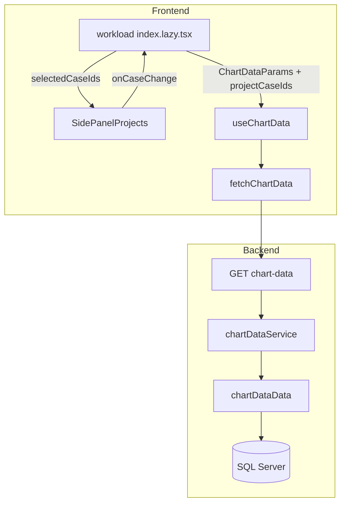
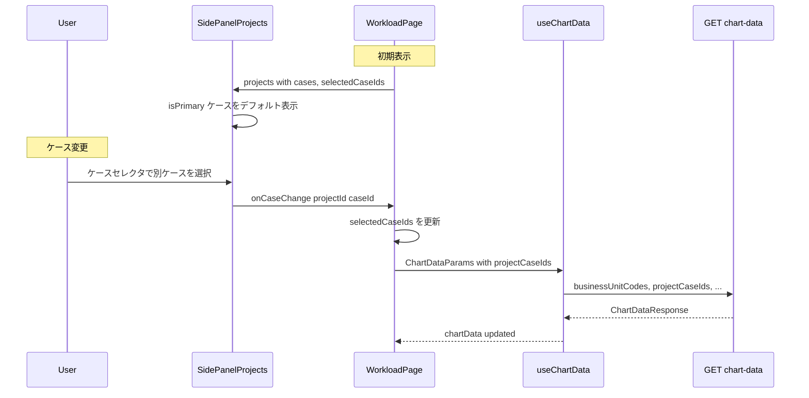
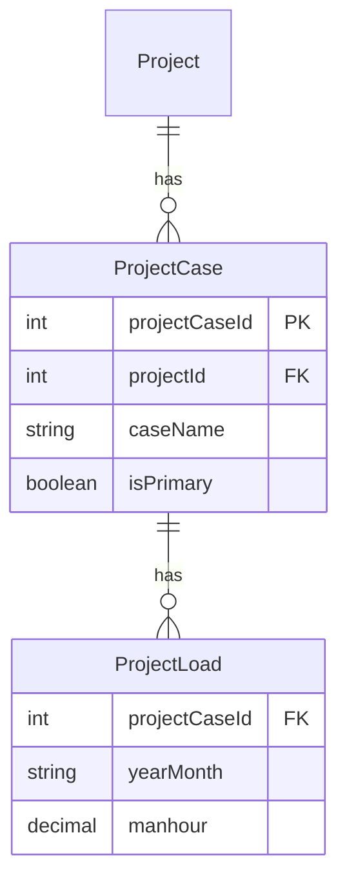

# Design Document: workload-case-selector

## Overview

**Purpose**: `/workload` ダッシュボードの各案件カードにケースセレクタを追加し、案件ごとに表示するケース（ProjectCase）を動的に切り替え可能にする。これにより、ユーザーは楽観・標準・悲観等の複数シナリオを自由に組み合わせた what-if 分析を実行できる。

**Users**: 事業部リーダーがサイドパネルの案件タブでケースを選択し、積み上げチャートの工数データをリアルタイムに確認する。

**Impact**: 現在の `isPrimary = true` 固定選択を、ユーザー主導のケース選択に拡張する。バックエンド `GET /chart-data` API にケースID指定パラメータを追加し、フロントエンドにケース選択UIと状態管理を導入する。

### Goals
- 案件カード内でケースを選択できるUIの提供
- 選択ケースに基づくチャートデータの動的更新
- `isPrimary` ケースのデフォルト自動選択
- 後方互換性の維持（既存動作への影響なし）

### Non-Goals
- ケース選択状態のURL永続化やプロファイル保存（Issue #64 Q5-3、将来対応）
- ケースの新規作成・編集UI（既存のケーススタディ機能で対応）
- 間接作業やキャパシティのケース選択（別機能）

## Architecture

### Existing Architecture Analysis

現在のワークロードダッシュボードのデータフローは以下の通り:

1. `useWorkloadFilters` が URL Search Params から `ChartDataParams` を構築
2. `workload/index.lazy.tsx` が `selectedProjectIds`, `capacityScenarioIds` 等を追加
3. `useChartData` が `fetchChartData` → `GET /chart-data` API を呼び出し
4. バックエンドは `chartViewId` の有無で分岐:
   - `chartViewId` あり: `chart_view_project_items` テーブル経由でケース指定（既にケース対応済み）
   - `chartViewId` なし: `getProjectDetailsByDefault` で `is_primary = 1` 固定

**制約**: `getProjectDetailsByDefault` の `pc.is_primary = 1` がハードコードされており、動的ケース指定には SQL の条件分岐が必要。

### Architecture Pattern & Boundary Map



**Architecture Integration**:
- 選択パターン: 既存のレイヤードアーキテクチャ（routes → services → data）をそのまま踏襲
- ドメイン境界: workload feature 内で完結。case-study feature への依存なし
- 既存パターン: `projectIds` CSV パラメータと同じ方式で `projectCaseIds` を追加
- 新規コンポーネント: なし（既存ファイルへの拡張のみ）

### Technology Stack

| Layer | Choice / Version | Role in Feature | Notes |
|-------|------------------|-----------------|-------|
| Frontend | React 19 + TanStack Query | ケース選択状態管理・API呼び出し | 既存 |
| Frontend UI | shadcn/ui Select | ケースセレクタドロップダウン | 既存コンポーネント活用 |
| Backend | Hono v4 + Zod | パラメータバリデーション | 既存 `chartDataQuerySchema` を拡張 |
| Data | SQL Server + mssql | 案件工数クエリ | SQL 条件分岐を追加 |

## System Flows

### ケース選択→チャート更新フロー



## Requirements Traceability

| Requirement | Summary | Components | Interfaces | Flows |
|-------------|---------|------------|------------|-------|
| 1.1 | 案件カード内にケース選択UI表示 | SidePanelProjects | ProjectWithCases 型 | — |
| 1.2 | 全ケースを選択肢として表示 | SidePanelProjects | ProjectWithCases.cases | — |
| 1.3 | ケース名をラベルとして表示 | SidePanelProjects | ProjectCaseSummary.caseName | — |
| 1.4 | ケースが1件のみの場合セレクタ非表示 | SidePanelProjects | cases.length 判定 | — |
| 2.1 | 初期表示時に isPrimary ケースをデフォルト選択 | WorkloadPage | initializeCaseSelection | ケース選択フロー |
| 2.2 | 案件チェック時に isPrimary を自動選択 | WorkloadPage | handleProjectSelectionChange | ケース選択フロー |
| 2.3 | isPrimary なしの場合は最初のケースを選択 | WorkloadPage | initializeCaseSelection | — |
| 3.1 | ケース変更時にチャート更新 | useChartData, fetchChartData | ChartDataParams.projectCaseIds | ケース選択フロー |
| 3.2 | 複数案件の異なるケースを組み合わせ表示 | chartDataService, chartDataData | getProjectDetailsWithCaseOverrides | ケース選択フロー |
| 3.3 | データ取得中のローディング表示 | useChartData | isFetching | — |
| 4.1 | API がケースIDパラメータを受付 | chartDataQuerySchema | projectCaseIds CSV | — |
| 4.2 | 指定ケースIDのデータを返却 | chartDataData | getProjectDetailsWithCaseOverrides | — |
| 4.3 | 未指定時は isPrimary にフォールバック | chartDataData | SQL 条件分岐 | — |
| 4.4 | 不正ケースID時は isPrimary にフォールバック | chartDataData | SQL LEFT JOIN + COALESCE | — |
| 5.1 | 他案件のケース変更時に選択状態維持 | WorkloadPage | selectedCaseIds Map | — |
| 5.2 | 案件チェック解除時にケース状態クリア | WorkloadPage | handleProjectSelectionChange | — |
| 5.3 | 再チェック時にデフォルトケースで復元 | WorkloadPage | handleProjectSelectionChange | — |

## Components and Interfaces

| Component | Domain/Layer | Intent | Req Coverage | Key Dependencies | Contracts |
|-----------|-------------|--------|--------------|------------------|-----------|
| SidePanelProjects | UI | 案件カード内にケースセレクタを表示 | 1.1–1.4 | projectsQueryOptions (P0) | State |
| WorkloadPage | UI/State | ケース選択状態管理・API パラメータ構築 | 2.1–2.3, 3.1, 3.3, 5.1–5.3 | SidePanelProjects (P0), useChartData (P0) | State |
| fetchChartData | API Client | projectCaseIds パラメータをリクエストに含める | 3.1 | API (P0) | API |
| chartDataQuerySchema | Backend/Validation | projectCaseIds パラメータのバリデーション | 4.1 | — | API |
| chartDataData | Backend/Data | ケースID指定対応の SQL クエリ | 4.2–4.4 | SQL Server (P0) | Service |
| projectData | Backend/Data | プロジェクト一覧にケースサマリを追加 | 1.2 | SQL Server (P0) | Service |

### Frontend Layer

#### SidePanelProjects（拡張）

| Field | Detail |
|-------|--------|
| Intent | 案件カード内にケースセレクタを表示し、ケース変更を親に通知 |
| Requirements | 1.1, 1.2, 1.3, 1.4 |

**Responsibilities & Constraints**
- 案件カード内にケースセレクタ（Select コンポーネント）を配置
- ケースが2件以上の案件のみセレクタを表示
- ケース変更時に `onCaseChange` コールバックを呼び出し

**Dependencies**
- Inbound: WorkloadPage — selectedCaseIds, onCaseChange (P0)
- Inbound: projectsQueryOptions — 案件一覧データ + ケースサマリ (P0)
- External: shadcn/ui Select — ドロップダウンUI (P2)

**Contracts**: State [x]

##### State Management

```typescript
// SidePanelProjects の props 拡張
interface SidePanelProjectsProps {
  businessUnitCodes: string[];
  selectedProjectIds: Set<number>;
  onSelectionChange: (ids: Set<number>) => void;
  // 新規追加
  selectedCaseIds: Map<number, number>; // projectId → projectCaseId
  onCaseChange: (projectId: number, projectCaseId: number) => void;
}
```

- State model: 親（WorkloadPage）から `selectedCaseIds` を受け取り、ケースセレクタの選択値として使用
- Persistence: なし（親コンポーネントが管理）

**Implementation Notes**
- shadcn/ui の `Select` コンポーネントを案件カード内チェックボックスの下部に配置
- ケースが1件のみの場合は `Select` を非表示にし、ケース名をテキストで表示
- 案件カードの既存レイアウト（チェックボックス + 名前 + バッジ + メタ情報）に自然に統合

#### WorkloadPage（拡張）

| Field | Detail |
|-------|--------|
| Intent | ケース選択状態を管理し、ChartDataParams にケースID配列を含める |
| Requirements | 2.1, 2.2, 2.3, 3.1, 3.3, 5.1, 5.2, 5.3 |

**Responsibilities & Constraints**
- `selectedCaseIds: Map<number, number>` の管理（projectId → projectCaseId）
- 案件データ取得後のデフォルトケース初期化
- 案件チェック変更時のケース状態同期
- `chartDataParamsWithFilters` に `projectCaseIds` を追加

**Contracts**: State [x]

##### State Management

```typescript
// ケース選択状態
const [selectedCaseIds, setSelectedCaseIds] = useState<Map<number, number>>(
  () => new Map()
);

// デフォルトケース初期化ロジック
// projects データにケースサマリが含まれる前提
function initializeCaseSelection(
  projects: ProjectWithCases[],
  currentSelection: Map<number, number>
): Map<number, number>;

// handleProjectSelectionChange の拡張
// - 新たにチェックされた案件: isPrimary ケースを自動選択
// - チェック解除された案件: selectedCaseIds からエントリを削除
// - 再チェック時: デフォルトケースで再選択
```

- State model: `Map<number, number>` で案件IDからケースIDへのマッピングを保持
- Persistence: インメモリのみ（URL永続化は将来対応）
- Concurrency: React の setState により整合性を担保

**全デフォルト時のパラメータ省略最適化**:

`chartDataParamsWithFilters` 構築時に、全案件が `isPrimary` ケースを選択している場合は `projectCaseIds` をパラメータに含めない。これにより:
- バックエンドは既存の最適化されたクエリ（`getProjectDetailsByDefault`）を使用する
- 後方互換性が維持される（パラメータ未指定 = 従来通り `isPrimary` 動作）

```typescript
// projectCaseIds の省略判定
// selectedCaseIds の全エントリが各案件の isPrimary ケースと一致する場合は省略
// 1件でも非 isPrimary のケースが選択されている場合のみ projectCaseIds を送信
function hasNonDefaultCaseSelection(
  selectedCaseIds: Map<number, number>,
  projects: ProjectWithCases[]
): boolean;
```

この判定は `projectIds` の省略ロジック（`selectedProjectIds.size < allProjectIds.length` の場合のみ送信）と同様のパターンに従う。

### API Client Layer

#### fetchChartData（拡張）

| Field | Detail |
|-------|--------|
| Intent | ChartDataParams の projectCaseIds を HTTP パラメータに変換 |
| Requirements | 3.1 |

**Contracts**: API [x]

##### API Contract

パラメータ構築の追加:

```typescript
// ChartDataParams 型拡張
type ChartDataParams = {
  businessUnitCodes: string[];
  startYearMonth: string;
  endYearMonth: string;
  projectIds?: number[];
  projectCaseIds?: number[];   // 新規追加
  capacityScenarioIds?: number[];
  indirectWorkCaseIds?: number[];
  chartViewId?: number;
};
```

| Method | Endpoint | New Parameter | Format | Description |
|--------|----------|---------------|--------|-------------|
| GET | /chart-data | projectCaseIds | CSV (`101,102,105`) | 案件ごとのケースID指定 |

**Implementation Notes**
- `projectCaseIds` が指定されている場合のみ `searchParams.set("projectCaseIds", ...)` を追加
- 既存の `projectIds` パラメータと共存可能

### Backend Layer

#### chartDataQuerySchema（拡張）

| Field | Detail |
|-------|--------|
| Intent | `projectCaseIds` パラメータのバリデーション |
| Requirements | 4.1 |

**Contracts**: API [x]

##### API Contract

```typescript
// chartDataQuerySchema への追加フィールド
{
  projectCaseIds: csvToNumberArray.optional()
}
```

- Preconditions: CSV 形式の数値配列（空許可）
- Postconditions: `number[]` に変換

#### chartDataData.getProjectDetailsWithCaseOverrides（新規メソッド）

| Field | Detail |
|-------|--------|
| Intent | ケースID指定に対応した案件工数取得 SQL |
| Requirements | 4.2, 4.3, 4.4 |

**Responsibilities & Constraints**
- `projectCaseIds` が指定された場合、指定ケースのデータを取得
- 指定されていない案件は `is_primary = 1` にフォールバック
- 不正なケースIDは無視（該当案件は `isPrimary` にフォールバック）

**Dependencies**
- External: SQL Server — project_cases, project_load テーブル (P0)

**Contracts**: Service [x]

##### Service Interface

```typescript
interface ChartDataData {
  getProjectDetailsWithCaseOverrides(params: {
    businessUnitCodes: string[];
    startYearMonth: string;
    endYearMonth: string;
    projectIds?: number[];
    projectCaseIds: number[];
  }): Promise<ProjectDetailRow[]>;
}
```

- Preconditions: `projectCaseIds` は1件以上
- Postconditions: 指定ケースの工数データ + 未指定案件の isPrimary 工数データ
- Invariants: 1案件あたり1ケースのデータのみ返却

**SQL 設計方針**:

指定ケースIDに該当する案件は指定ケースのデータを使用し、該当しない案件は `is_primary = 1` のデータを使用する。`getProjectDetailsByChartView` の条件パターン（`cvpi.project_case_id IS NOT NULL AND ... OR ... is_primary = 1`）を参考にする。

```
-- 擬似SQL
SELECT p.project_id, p.name, p.project_type_code, pl.year_month, SUM(pl.manhour)
FROM projects p
JOIN project_cases pc ON p.project_id = pc.project_id
JOIN project_load pl ON pc.project_case_id = pl.project_case_id
WHERE p.business_unit_code IN (...)
  AND pl.year_month BETWEEN @start AND @end
  AND p.deleted_at IS NULL
  AND pc.deleted_at IS NULL
  AND (
    pc.project_case_id IN (@caseId0, @caseId1, ...)   -- 指定ケース
    OR (
      pc.is_primary = 1
      AND p.project_id NOT IN (
        SELECT pc2.project_id FROM project_cases pc2
        WHERE pc2.project_case_id IN (@caseId0, @caseId1, ...)
        AND pc2.deleted_at IS NULL
      )
    )
  )
GROUP BY p.project_id, p.name, p.project_type_code, pl.year_month
```

#### chartDataService（拡張）

| Field | Detail |
|-------|--------|
| Intent | `projectCaseIds` パラメータに基づくデータ取得メソッドの分岐 |
| Requirements | 4.2, 4.3 |

**Contracts**: Service [x]

##### Service Interface

```typescript
// ChartDataServiceParams 拡張
type ChartDataServiceParams = {
  businessUnitCodes: string[];
  startYearMonth: string;
  endYearMonth: string;
  projectIds?: number[];
  projectCaseIds?: number[];   // 新規追加
  chartViewId?: number;
  capacityScenarioIds?: number[];
  indirectWorkCaseIds?: number[];
};
```

分岐ロジック:
1. `chartViewId` 指定あり → 既存の `getProjectDetailsByChartView`（変更なし）
2. `projectCaseIds` 指定あり → 新規 `getProjectDetailsWithCaseOverrides`
3. どちらも未指定 → 既存の `getProjectDetailsByDefault`（変更なし）

**`projectIds` と `projectCaseIds` の相互作用**:
- `projectIds` は案件のスコープ（表示対象）を決定する。`projectCaseIds` はそのスコープ内でのケースオーバーライドとして機能する
- `projectIds` スコープ外の案件に対する `projectCaseIds` のエントリは無視される（SQL の `projectIds` フィルタが先に適用されるため）
- `projectIds` でスコープされた案件のうち、`projectCaseIds` でオーバーライドされていない案件は `isPrimary` ケースにフォールバック
- 両パラメータが未指定の場合: 全案件 × 全 `isPrimary` ケース（既存動作と同一）

#### projectData（拡張）

| Field | Detail |
|-------|--------|
| Intent | プロジェクト一覧 API のレスポンスにケースサマリを追加 |
| Requirements | 1.2 |

**Contracts**: Service [x]

##### Service Interface

```typescript
// プロジェクト一覧レスポンス型の拡張
type ProjectRow = {
  // ... 既存フィールド
  // 新規: project_cases テーブルからの JOIN データ
};

// ケースサマリ型（API レスポンス）
type ProjectCaseSummary = {
  projectCaseId: number;
  caseName: string;
  isPrimary: boolean;
};

// Project 型の拡張（フロントエンド）
type ProjectWithCases = Project & {
  cases: ProjectCaseSummary[];
};
```

**Implementation Notes**
- プロジェクト一覧取得 SQL に `project_cases` テーブルへの追加クエリを実行
- メインクエリの後に別クエリでケースサマリを取得し、サービス層で結合する方式を推奨（メインクエリの複雑化を避ける）
- `deleted_at IS NULL` でソフトデリート済みケースを除外

## Data Models

### Domain Model



既存のドメインモデルに変更なし。`ProjectCase` の `isPrimary` フラグがデフォルト選択の根拠となる。

### Data Contracts & Integration

**API Data Transfer — GET /chart-data 拡張**

| Parameter | Type | Required | Description |
|-----------|------|----------|-------------|
| businessUnitCodes | string (CSV) | Yes | 事業部コード |
| startYearMonth | string (YYYYMM) | Yes | 開始年月 |
| endYearMonth | string (YYYYMM) | Yes | 終了年月 |
| projectIds | string (CSV of int) | No | 案件ID絞り込み |
| **projectCaseIds** | **string (CSV of int)** | **No** | **案件ケースID指定（新規）** |
| capacityScenarioIds | string (CSV of int) | No | キャパシティシナリオ |
| indirectWorkCaseIds | string (CSV of int) | No | 間接作業ケース |
| chartViewId | int | No | チャートビュー |

**API Data Transfer — GET /projects 拡張**

レスポンスの `Project` オブジェクトに `cases` フィールドを追加:

```typescript
{
  data: Array<{
    projectId: number;
    // ... 既存フィールド
    cases: Array<{
      projectCaseId: number;
      caseName: string;
      isPrimary: boolean;
    }>;
  }>;
  meta: { ... };
}
```

## Error Handling

### Error Categories and Responses

**User Errors (4xx)**:
- `projectCaseIds` に不正な値（非数値）→ Zod バリデーションエラー（既存の `validate` ミドルウェアで処理）

**Business Logic Errors**:
- 指定されたケースIDが存在しない → エラーにせず `isPrimary` にフォールバック（4.4）
- 指定されたケースIDが指定案件に属さない → 同上、SQL の条件で自然にフィルタされる

### Error Strategy
- バリデーションエラー: 既存の Zod + `@hono/zod-validator` パターンを踏襲
- データ不整合: フォールバック戦略（`isPrimary` ケースにデグレード）で処理。ユーザーへの明示的なエラー表示は不要

## Testing Strategy

### Unit Tests
- `initializeCaseSelection`: isPrimary ケースのデフォルト選択、isPrimary なしのフォールバック、空ケースリスト
- `chartDataParamsWithFilters`: projectCaseIds の構築ロジック（全デフォルト時は省略、カスタム選択時は含める）
- `chartDataQuerySchema`: `projectCaseIds` パラメータのバリデーション（有効CSV、空、未指定）

### Integration Tests
- `GET /chart-data` with `projectCaseIds`: 指定ケースのデータ返却確認
- `GET /chart-data` without `projectCaseIds`: 既存動作（isPrimary）の後方互換確認
- `GET /chart-data` with invalid `projectCaseIds`: フォールバック動作確認
- `GET /projects`: レスポンスに `cases` フィールドが含まれることの確認

### E2E Tests
- サイドパネルでケースセレクタが表示されること（ケース2件以上の案件）
- ケース選択変更でチャートが更新されること
- ケースが1件のみの案件でセレクタが非表示であること
