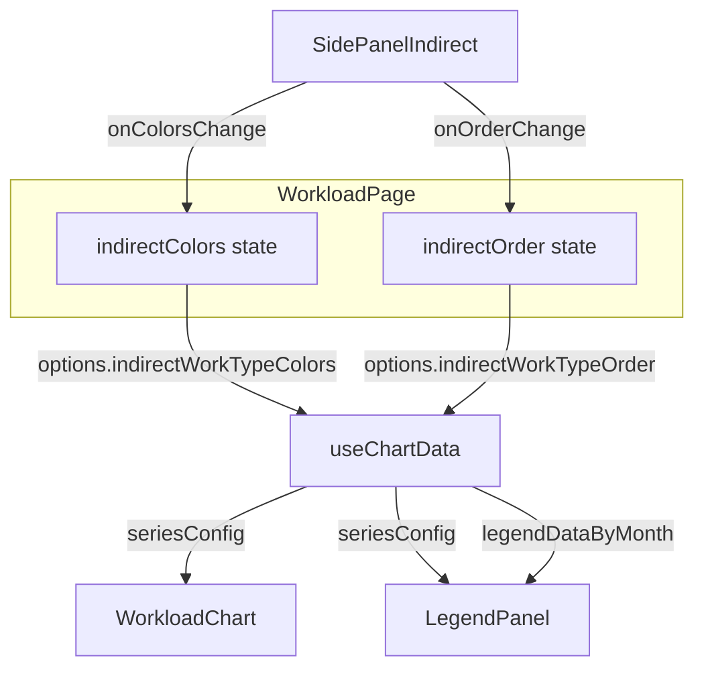

# Design Document: workload-chart-indirect-sync

## Overview

**Purpose**: `/workload` 画面において、間接作業種類の色・順序変更をチャート（`WorkloadChart`）および凡例パネル（`LegendPanel`）にリアクティブに反映する。

**Users**: 事業部リーダー・プロジェクトマネージャーが、間接作業の視覚的なカスタマイズを即座に確認しながらリソース配分を評価する。

**Impact**: 案件（project）で確立済みの State Lifting パターンを間接作業にも適用し、`SidePanelIndirect` → `WorkloadPage` → `useChartData` のデータフローを構築する。

### Goals
- 間接作業の色変更がチャート・凡例に即座に反映される
- 間接作業の順序変更がチャートの積み上げ順・凡例の表示順に即座に反映される
- 案件の既存パターンとの一貫性を維持する

### Non-Goals
- 間接作業の表示/非表示トグルのチャート連動（別 Issue）
- 案件と間接作業の設定管理を統一 hook にリファクタ
- プロファイル保存への間接作業設定の組み込み

## Architecture

### Existing Architecture Analysis

現在の案件色・順序反映パターン:

1. `WorkloadPage`（`index.lazy.tsx`）が `projectColors` / `projectOrder` state を保持
2. `SidePanelSettings` が `onProjectColorsChange` / `onProjectOrderChange` コールバックで親に通知
3. `useChartData` が `UseChartDataOptions` の `projectColors` / `projectOrder` を受け取り、シリーズ構築時に参照
4. `LegendPanel` が `seriesConfig` から色を取得し、`legendDataByMonth` から表示順を取得

間接作業にはこの橋渡しが**完全に欠落**しており、色はハードコード（`INDIRECT_COLORS[idx]`）、順序はAPIレスポンス出現順で固定されている。

### Architecture Pattern & Boundary Map



**Architecture Integration**:
- Selected pattern: State Lifting（案件パターンと同一）
- Domain boundaries: `SidePanelIndirect` は設定入力、`useChartData` はデータ変換、`WorkloadChart`/`LegendPanel` は表示
- Existing patterns preserved: 案件の `projectColors`/`projectOrder` フロー
- New components rationale: 新規コンポーネントなし。既存3ファイルの拡張のみ

### Technology Stack

| Layer | Choice / Version | Role in Feature | Notes |
|-------|------------------|-----------------|-------|
| Frontend | React 19 + TanStack Query | State管理・データフェッチ | 既存利用。新規依存なし |
| Hook | useChartData（既存拡張） | シリーズ構築に色・順序を反映 | options インターフェース拡張 |

## Requirements Traceability

| Requirement | Summary | Components | Interfaces | Flows |
|-------------|---------|------------|------------|-------|
| 1.1 | 色変更→チャート即時更新 | useChartData, WorkloadPage | UseChartDataOptions | State Lifting |
| 1.2 | 色変更→凡例即時更新 | useChartData, LegendPanel | ChartSeriesConfig | seriesConfig経由 |
| 1.3 | 未設定時のフォールバック色 | useChartData | UseChartDataOptions | — |
| 2.1 | 順序変更→チャート即時更新 | useChartData, WorkloadPage | UseChartDataOptions | State Lifting |
| 2.2 | 順序変更→凡例即時更新 | useChartData | LegendMonthData | legendMap構築時ソート |
| 3.1 | 案件色・順序への非干渉 | useChartData | UseChartDataOptions | 独立した処理パス |
| 3.2 | 案件と間接の同時変更 | useChartData | UseChartDataOptions | 独立した処理パス |
| 3.3 | 積み上げ順の独立制御 | useChartData | sortAreasByIndirectOrder | 専用ソート関数 |
| 4.1 | 色保存＋即時反映 | SidePanelIndirect, WorkloadPage | onColorsChange | コールバック＋mutation |
| 4.2 | 順序保存＋即時反映 | SidePanelIndirect, WorkloadPage | onOrderChange | コールバック＋mutation |
| 4.3 | リロード後の設定復元 | SidePanelIndirect | useState初期値 | 既存mutation＋state初期化 |
| 5.1 | TypeScript型定義 | 全コンポーネント | UseChartDataOptions | — |
| 5.2 | tsc -b エラーなし | 全コンポーネント | — | — |

## Components and Interfaces

| Component | Domain/Layer | Intent | Req Coverage | Key Dependencies | Contracts |
|-----------|--------------|--------|--------------|------------------|-----------|
| UseChartDataOptions拡張 | Hook | 間接作業の色・順序オプションを受け取る | 1.1-1.3, 2.1-2.2, 3.1-3.3, 5.1 | useChartData (P0) | State |
| sortAreasByIndirectOrder | Hook/Util | 間接作業シリーズの順序ソート | 2.1, 3.3 | useChartData (P0) | Service |
| sortLegendIndirectByOrder | Hook/Util | 凡例の間接作業表示順ソート | 2.2 | useChartData (P0) | Service |
| SidePanelIndirect Props拡張 | UI | 色・順序変更を親に通知 | 4.1, 4.2 | WorkloadPage (P0) | State |
| WorkloadPage State拡張 | UI/Route | 間接作業の色・順序 state を管理 | 1.1, 2.1, 4.1, 4.2 | useChartData (P0), SidePanelIndirect (P0) | State |

### Hook Layer

#### UseChartDataOptions 拡張

| Field | Detail |
|-------|--------|
| Intent | 間接作業の色・順序設定を useChartData に渡すインターフェースを提供する |
| Requirements | 1.1, 1.2, 1.3, 2.1, 2.2, 3.1, 3.2, 3.3, 5.1 |

**Responsibilities & Constraints**
- `indirectWorkTypeColors` でユーザー指定色を受け取り、シリーズ構築時に `INDIRECT_COLORS` フォールバックで適用
- `indirectWorkTypeOrder` でユーザー指定順序を受け取り、間接シリーズのソートに使用
- 案件の `projectColors`/`projectOrder` 処理パスに一切影響を与えない

**Dependencies**
- Inbound: WorkloadPage — options 経由で色・順序を受け取る (P0)
- Outbound: ChartSeriesConfig — シリーズ設定に色・順序を反映 (P0)

**Contracts**: State [x]

##### State Management

```typescript
interface UseChartDataOptions {
  projectColors?: Record<number, string>;
  projectOrder?: number[];
  indirectWorkTypeColors?: Record<string, string>;
  indirectWorkTypeOrder?: string[];
}
```

- `indirectWorkTypeColors`: key = workTypeCode, value = 色コード。未指定の workTypeCode は `INDIRECT_COLORS[idx]` にフォールバック
- `indirectWorkTypeOrder`: workTypeCode の配列。指定順で間接シリーズをソート。未指定時は API レスポンス出現順を維持
- `useMemo` 依存配列に `indirectWorkTypeColors` と `indirectWorkTypeOrder` を追加

**Implementation Notes**
- 間接シリーズ構築（現在 L144-157）で `indirectWorkTypeColors?.[workTypeCode]` を参照し、未定義なら既存の `INDIRECT_COLORS[wtIdx]` を使用
- 凡例データ `legendMap` の `indirectWorkTypes` 配列を `indirectWorkTypeOrder` に基づいてソート

#### sortAreasByIndirectOrder

| Field | Detail |
|-------|--------|
| Intent | 間接作業シリーズを指定順序でソートする（案件シリーズの位置は維持） |
| Requirements | 2.1, 3.3 |

**Contracts**: Service [x]

##### Service Interface

```typescript
function sortAreasByIndirectOrder(
  areas: AreaSeriesConfig[],
  indirectWorkTypeOrder: string[] | undefined,
): AreaSeriesConfig[];
```

- Preconditions: `areas` は `sortAreasByProjectOrder` 適用後の配列
- Postconditions: `type === "indirect"` のシリーズのみが `indirectWorkTypeOrder` 順にソートされ、`type === "project"` のシリーズ位置は不変
- Invariants: 未分類シリーズ（`indirect_wt_unclassified`）は常に間接シリーズの末尾に配置

#### sortLegendIndirectByOrder

| Field | Detail |
|-------|--------|
| Intent | 凡例パネルの間接作業リストを指定順序でソートする |
| Requirements | 2.2 |

**Contracts**: Service [x]

##### Service Interface

```typescript
function sortLegendIndirectByOrder<T extends { workTypeCode: string }>(
  indirectWorkTypes: T[],
  indirectWorkTypeOrder: string[] | undefined,
): T[];
```

- Preconditions: なし
- Postconditions: `indirectWorkTypeOrder` 指定順で並び替え。未指定の workTypeCode は末尾
- Invariants: 未分類（`workTypeCode === "unclassified"`）は常に末尾

### UI Layer

#### SidePanelIndirect Props 拡張

| Field | Detail |
|-------|--------|
| Intent | 色・順序変更を親コンポーネントにコールバックで通知する |
| Requirements | 4.1, 4.2 |

**Contracts**: State [x]

##### State Management

```typescript
interface SidePanelIndirectProps {
  onColorsChange?: (colors: Record<string, string>) => void;
  onOrderChange?: (order: string[]) => void;
}
```

- `onColorsChange`: `setColor` / `resetColors` 実行時に、全 items の `{ workTypeCode: color }` マップを通知
- `onOrderChange`: `moveUp` / `moveDown` / `toggleVisibility` 実行時に、全 items の workTypeCode 配列を displayOrder 順で通知
- 既存のバックエンド保存ロジック（`useBulkUpsertColorSettings` / `useBulkUpsertStackOrderSettings`）はそのまま維持

**Implementation Notes**
- 各 state 更新関数（`setColor`, `moveUp`, `moveDown`, `resetColors`）の末尾でコールバックを呼び出す
- コールバックは optional props とし、未指定時は既存動作と完全互換

#### WorkloadPage State 拡張

| Field | Detail |
|-------|--------|
| Intent | 間接作業の色・順序 state を管理し、SidePanelIndirect と useChartData を橋渡しする |
| Requirements | 1.1, 2.1, 4.1, 4.2 |

**Contracts**: State [x]

##### State Management

```typescript
// 新規 state（案件パターンと対称）
const [indirectColors, setIndirectColors] = useState<Record<string, string>>({});
const [indirectOrder, setIndirectOrder] = useState<string[]>([]);

// コールバック
const handleIndirectColorsChange = useCallback(
  (colors: Record<string, string>) => { setIndirectColors(colors); },
  [],
);
const handleIndirectOrderChange = useCallback(
  (order: string[]) => { setIndirectOrder(order); },
  [],
);

// useChartData に渡す
useChartData(chartDataParamsWithProjects, {
  projectColors,
  projectOrder,
  indirectWorkTypeColors: indirectColors,
  indirectWorkTypeOrder: indirectOrder,
});

// SidePanelIndirect に渡す
<SidePanelIndirect
  onColorsChange={handleIndirectColorsChange}
  onOrderChange={handleIndirectOrderChange}
/>
```

- Persistence: `SidePanelIndirect` 内の既存 mutation がバックエンドに永続化を担当
- Consistency: state 更新とバックエンド保存は `SidePanelIndirect` 内で同時実行される

## Testing Strategy

### Unit Tests
- `sortAreasByIndirectOrder`: 順序指定あり/なし/部分指定/未分類の各ケース
- `sortLegendIndirectByOrder`: 順序指定あり/なし/未分類の各ケース
- `useChartData` の間接シリーズ色適用: `indirectWorkTypeColors` 指定時のカスタム色使用、未指定時のフォールバック

### Integration Tests
- `SidePanelIndirect` で色変更 → `onColorsChange` コールバック発火の確認
- `SidePanelIndirect` で順序変更 → `onOrderChange` コールバック発火の確認
- `WorkloadPage` で間接作業色変更 → `seriesConfig.areas` の色が更新されることの確認
