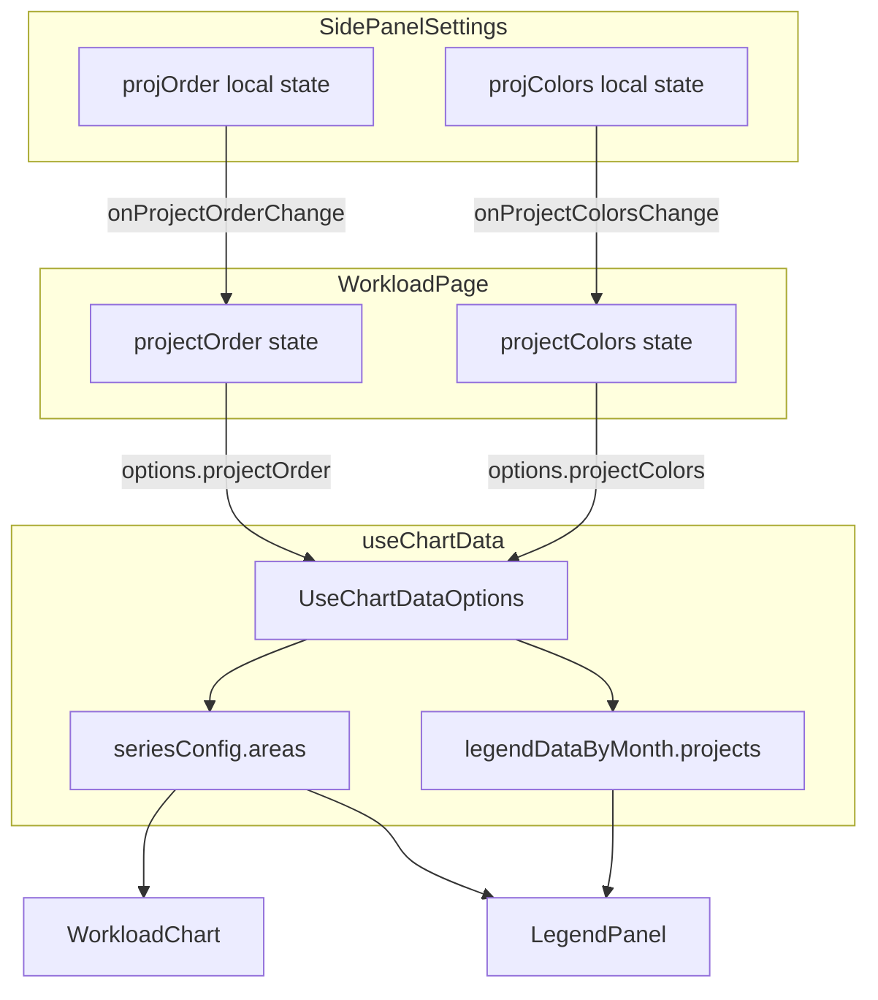

# Technical Design: workload-chart-project-order

## Overview

**Purpose**: 設定タブの案件並び順を Area Chart・凡例パネルに即座に反映し、ユーザーが積み上げ順序を直感的に制御できるようにする。

**Users**: 事業部リーダー・プロジェクトマネージャーが工数需要の分析時に積み上げ順序を調整するワークフローで使用する。

**Impact**: 既存の色設定橋渡しパターン（`onProjectColorsChange`）に並列して `onProjectOrderChange` を追加し、`useChartData` のシリーズ順序を制御する。

### Goals
- 設定タブの並び替えが Area Chart の積み上げ順序に即座に反映される
- チャート・凡例・設定タブの案件表示順が常に一致する
- プロファイル適用時に並び順が正しく復元される
- 既存の色設定パターンとの一貫性を維持する

### Non-Goals
- ドラッグ＆ドロップによる並び替え UI の実装
- 並び順のサーバーサイド永続化（プロファイル経由の既存仕組みで対応済み）
- テーブルビューへの並び順反映

## Architecture

### Existing Architecture Analysis

**現状のデータフロー**（並び順が欠落）:
```
SidePanelSettings [projOrder: local state]
  → onProjectColorsChange → WorkloadPage [projectColors state]
  → useChartData(params, { projectColors }) → seriesConfig / legendDataByMonth
  → WorkloadChart / LegendPanel
```

**課題**: `projOrder` が `SidePanelSettings` のローカル state に閉じており、`useChartData` に伝播しない。

### Architecture Pattern & Boundary Map



**Architecture Integration**:
- **Selected pattern**: Props-Callback-State パターン（色設定と同一）
- **既存パターン維持**: `onProjectColorsChange` の橋渡しパターンを完全踏襲
- **新規コンポーネント**: なし（既存3ファイルの拡張のみ）

### Technology Stack

| Layer | Choice / Version | Role in Feature | Notes |
|-------|------------------|-----------------|-------|
| Frontend | React 19 + TypeScript 5.9.x | state 管理・props 受け渡し | 既存技術スタック変更なし |

新規依存なし。既存の React state + props パターンのみで実装する。

## Requirements Traceability

| Requirement | Summary | Components | Interfaces | Flows |
|-------------|---------|------------|------------|-------|
| 1.1 | 並び替え操作で Chart 即座更新 | SidePanelSettings, WorkloadPage | onProjectOrderChange | 並び順伝播フロー |
| 1.2 | useChartData が指定順序で areas 返却 | useChartData | UseChartDataOptions | — |
| 1.3 | projectOrder 未指定時は API 順 | useChartData | UseChartDataOptions | — |
| 2.1 | LegendPanel の順序同期 | useChartData | legendDataByMonth | — |
| 2.2 | Chart と凡例の順序一致 | useChartData | seriesConfig, legendDataByMonth | — |
| 3.1 | プロファイル適用時の順序復元 | SidePanelSettings, WorkloadPage | onProjectOrderChange, onProfileApply | プロファイル適用フロー |
| 3.2 | 並び順情報なし時のフォールバック | useChartData | UseChartDataOptions | — |
| 4.1 | props/state/callback の型安全性 | 全コンポーネント | 全インターフェース | — |
| 4.2 | projectOrder の明示的型定義 | useChartData | UseChartDataOptions | — |

## Components and Interfaces

| Component | Domain/Layer | Intent | Req Coverage | Key Dependencies | Contracts |
|-----------|-------------|--------|--------------|------------------|-----------|
| SidePanelSettings | UI / Settings | 並び順変更を親に通知 | 1.1, 3.1 | WorkloadPage (P0) | State |
| useChartData | Hooks / Data | 並び順に基づく areas・legend ソート | 1.2, 1.3, 2.1, 2.2, 3.2, 4.2 | TanStack Query (P0) | State |
| WorkloadPage | Routes / Orchestration | projectOrder state 管理・橋渡し | 1.1, 3.1, 4.1 | SidePanelSettings (P0), useChartData (P0) | State |

### Hooks / Data Layer

#### useChartData

| Field | Detail |
|-------|--------|
| Intent | `projectOrder` に基づいて `seriesConfig.areas` と `legendDataByMonth.projects` をソートする |
| Requirements | 1.2, 1.3, 2.1, 2.2, 3.2, 4.2 |

**Responsibilities & Constraints**
- `projectOrder` が指定された場合、案件シリーズ（`type: "project"` の areas）を指定順序にソートする
- `legendDataByMonth` の各月の `projects` 配列も同一順序でソートする
- `projectOrder` が未指定（`undefined`）の場合、API レスポンス順（現行動作）を維持する
- 間接作業シリーズ・キャパシティラインの順序は変更しない

**Dependencies**
- Inbound: `WorkloadPage` — `options.projectOrder` を受け取る (P0)

**Contracts**: State [x]

##### State Management

拡張後のインターフェース:

```typescript
interface UseChartDataOptions {
  projectColors?: Record<number, string>;
  projectOrder?: number[];
}
```

- `projectOrder`: 案件 ID の配列。配列のインデックス順が積み上げ順序（先頭 = チャート下層）を示す
- `useMemo` 依存配列: `[rawResponse, projectColors, projectOrder]`

**ソートロジック仕様**:
- areas 構築後、`type === "project"` のエントリのみを `projectOrder` に基づきソートする
- ソート比較関数: `projectOrder.indexOf(projectIdA)` vs `projectOrder.indexOf(projectIdB)`
- `projectOrder` に含まれない案件は末尾に配置する（フォールバック）
- legendMap の `projects` 配列にも同じソート比較関数を適用する

**Implementation Notes**
- areas 配列内の間接作業シリーズ（`type: "indirect"`）は位置を維持し、案件シリーズ（`type: "project"`）のみを並び替える
- `projectOrder` が `undefined` の場合はソート処理をスキップ（後方互換）

### UI / Settings Layer

#### SidePanelSettings

| Field | Detail |
|-------|--------|
| Intent | 並び順変更時に `onProjectOrderChange` で親に通知する |
| Requirements | 1.1, 3.1 |

**Responsibilities & Constraints**
- `moveProjUp` / `moveProjDown` 実行時に `onProjectOrderChange` を呼び出す
- `handleProfileApply` でプロファイルの並び順復元後に `onProjectOrderChange` を呼び出す
- `selectedIdsKey` 監視の `useEffect` 内で `projOrder` 更新後に `onProjectOrderChange` を呼び出す（初期通知）

**Contracts**: State [x]

##### State Management

拡張後の Props インターフェース:

```typescript
interface SidePanelSettingsProps {
  from: string | undefined;
  months: number;
  businessUnitCodes: string[];
  selectedProjectIds: Set<number>;
  onPeriodChange: (from: string | undefined, months: number) => void;
  onProjectColorsChange?: (colors: Record<number, string>) => void;
  onProjectOrderChange?: (order: number[]) => void;  // 追加
  onProfileApply?: (profile: {
    chartViewId: number;
    startYearMonth: string;
    endYearMonth: string;
    projectItems: BulkUpsertProjectItemInput[];
    businessUnitCodes: string[] | null;
  }) => void;
}
```

**通知タイミング**:
- `projOrder` を監視する単一の `useEffect` で `onProjectOrderChange` を呼び出す
- これにより全ての変更契機（`moveProjUp`、`moveProjDown`、`handleProfileApply`、初期ロード）を一箇所でカバーする
- `moveProjUp` / `moveProjDown` / `handleProfileApply` 内では `setProjOrder` のみを呼び出し、外部通知は行わない

**Implementation Notes**
- `onProjectOrderChange` は `onProjectColorsChange` と同様にオプショナル（`?.` で呼び出し）
- `onProjectOrderChangeRef` パターンで最新参照を保持し、`useEffect` の依存配列を安定化する
- `useEffect` は `projOrder` を依存配列に持ち、変更時に `onProjectOrderChangeRef.current?.(projOrder)` を呼び出す

### Routes / Orchestration Layer

#### WorkloadPage

| Field | Detail |
|-------|--------|
| Intent | `projectOrder` state を管理し、SidePanelSettings → useChartData の橋渡しを行う |
| Requirements | 1.1, 3.1, 4.1 |

**Responsibilities & Constraints**
- `projectOrder` state を `useState<number[]>([])` で管理する
- `handleProjectOrderChange` コールバックを `SidePanelSettings` に渡す
- `useChartData` の options に `projectOrder` を渡す
- 色設定（`projectColors`）の橋渡しパターンと同一構造を維持する

**Contracts**: State [x]

##### State Management

追加される state と handler:

```typescript
// state
const [projectOrder, setProjectOrder] = useState<number[]>([]);

// handler
const handleProjectOrderChange = useCallback(
  (order: number[]) => { setProjectOrder(order); },
  [],
);

// useChartData への受け渡し
useChartData(chartDataParamsWithProjects, {
  projectColors,
  projectOrder,
});

// SidePanelSettings への受け渡し
<SidePanelSettings
  onProjectOrderChange={handleProjectOrderChange}
  // ...既存 props
/>
```

## Testing Strategy

### Unit Tests
- `useChartData` に `projectOrder` を渡した場合、`seriesConfig.areas` の案件シリーズが指定順序になること
- `useChartData` に `projectOrder` を渡さない場合、API レスポンス順が維持されること
- `useChartData` で `legendDataByMonth` の `projects` が `projectOrder` と同一順序になること
- `projectOrder` に含まれない案件 ID がある場合、該当シリーズが末尾に配置されること

### Integration Tests
- `SidePanelSettings` で並び替え操作後、`onProjectOrderChange` が正しい順序で呼ばれること
- プロファイル適用後、`onProjectOrderChange` がプロファイルの並び順で呼ばれること
- `WorkloadPage` で `projectOrder` 変更時、Chart と LegendPanel に反映されること
