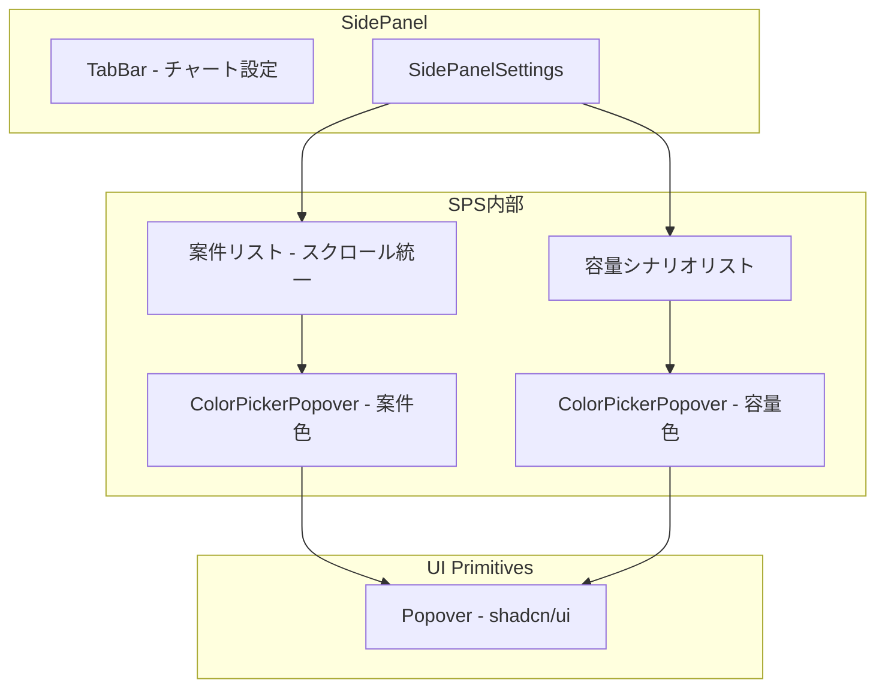

# Design Document: workload-control-panel

## Overview

**Purpose**: Workload画面のコントロールパネルUXを改善し、タブ名の明確化、二重スクロールの解消、色選択UIのPopoverベースへの刷新を実現する。

**Users**: 事業部リーダー・プロジェクトマネージャーがWorkloadチャートの表示設定を直感的に操作するために使用する。

**Impact**: 既存の SidePanel / SidePanelSettings コンポーネントのUI層を変更し、新規 ColorPickerPopover コンポーネントを追加する。ビジネスロジック・API層への影響はない。

### Goals
- タブラベルを「チャート設定」に変更し、機能の目的を明確化
- 案件設定エリアの二重スクロールを解消
- 色選択UIをPopoverベースに統一し、視認性と操作性を向上

### Non-Goals
- 色パレット自体の変更（PROJECT_TYPE_COLORS / CAPACITY_COLORS の定義変更）
- 色設定のAPI層・バックエンド変更
- 他の workload コンポーネント（チャート、テーブル、凡例）のリファクタリング

## Architecture

### Existing Architecture Analysis

現在のコントロールパネルは以下の構造で構成されている:

- **SidePanel.tsx**: タブ切替の親コンテナ（案件 / 間接作業 / 設定）
- **SidePanelSettings.tsx**: 設定タブの実装（色選択、並び順、期間設定、プロファイル管理）
- 色状態は SidePanelSettings 内のローカル state で管理し、`onProjectColorsChange` コールバックで親に通知
- 案件色変更は `colorMutation.mutate()` で API 送信済み

変更はUI層のみに限定され、既存のデータフロー（state → callback → mutation）はそのまま維持する。

### Architecture Pattern & Boundary Map



- **Selected pattern**: 既存コンポーネント拡張 + 新規プレゼンテーションコンポーネント
- **Existing patterns preserved**: feature 内配置、ローカル state 管理、コールバック通知パターン
- **New component rationale**: ColorPickerPopover は案件色・容量色で再利用し、UI の一貫性を保証

### Technology Stack

| Layer | Choice / Version | Role in Feature | Notes |
|-------|------------------|-----------------|-------|
| UI Primitive | `@radix-ui/react-popover` (latest) | Popover の基盤 | 新規追加。shadcn CLI で生成 |
| UI Component | `src/components/ui/popover.tsx` | shadcn/ui Popover ラッパー | 新規生成 |
| Feature Component | ColorPickerPopover | 色選択 Popover UI | 新規作成 |

## Requirements Traceability

| Requirement | Summary | Components | Interfaces |
|-------------|---------|------------|------------|
| 1.1 | タブラベル「チャート設定」表示 | SidePanel | tabs 配列 |
| 1.2 | タブクリックでパネル表示 | SidePanel | 既存動作（変更なし） |
| 2.1 | 内部スクロールバー削除 | SidePanelSettings | className 変更 |
| 2.2 | パネル全体の単一スクロール | SidePanelSettings | className 変更 |
| 2.3 | ネストスクロールコンテナ排除 | SidePanelSettings | className 変更 |
| 3.1 | 選択色のみ丸型スウォッチ表示 | ColorPickerPopover | `value` prop |
| 3.2 | クリックで全色 Popover 表示 | ColorPickerPopover | Popover Trigger |
| 3.3 | 色選択でスウォッチ更新・Popover 閉じ | ColorPickerPopover | `onChange` callback |
| 3.4 | チャート・凡例への即時反映 | SidePanelSettings | 既存 `onProjectColorsChange` |
| 3.5 | PROJECT_TYPE_COLORS 全色提供 | ColorPickerPopover | `colors` prop |
| 4.1 | 案件色と同一UIコンポーネント使用 | ColorPickerPopover | 同一コンポーネント再利用 |
| 4.2 | 容量色クリックで Popover 表示 | ColorPickerPopover | Popover Trigger |
| 4.3 | 容量色選択で更新・閉じ | ColorPickerPopover | `onChange` callback |
| 4.4 | キャパシティライン・凡例への即時反映 | SidePanelSettings | 既存 capColors state |
| 4.5 | CAPACITY_COLORS 全色提供 | ColorPickerPopover | `colors` prop |
| 5.1 | Popover 外クリックで閉じる | ColorPickerPopover | Radix 標準動作 |
| 5.2 | 選択中の色を視覚的に区別 | ColorPickerPopover | 選択状態スタイリング |
| 5.3 | TypeScript 型エラーなし | 全コンポーネント | 型定義 |

## Components and Interfaces

| Component | Domain/Layer | Intent | Req Coverage | Key Dependencies | Contracts |
|-----------|--------------|--------|--------------|------------------|-----------|
| SidePanel | UI / Container | タブラベル変更 | 1.1, 1.2 | — | — |
| SidePanelSettings | UI / Feature | スクロール修正、色選択UI置換 | 2.1-2.3, 3.4, 4.4 | ColorPickerPopover (P0) | State |
| ColorPickerPopover | UI / Presentation | Popover ベース色選択 | 3.1-3.3, 3.5, 4.1-4.3, 4.5, 5.1-5.3 | Popover UI (P0) | State |

### UI Layer

#### SidePanel（既存変更）

| Field | Detail |
|-------|--------|
| Intent | タブラベルを「設定」から「チャート設定」に変更 |
| Requirements | 1.1, 1.2 |

**Implementation Notes**
- `tabs` 配列（行17）の `label: "設定"` を `label: "チャート設定"` に変更
- 他のタブ（「案件」「間接作業」）は変更なし

#### SidePanelSettings（既存変更）

| Field | Detail |
|-------|--------|
| Intent | 二重スクロール解消、色選択UIの ColorPickerPopover への置換 |
| Requirements | 2.1-2.3, 3.4, 4.4 |

**Dependencies**
- Inbound: SidePanel — タブコンテンツとして描画 (P0)
- Outbound: ColorPickerPopover — 色選択UI (P0)
- Outbound: colorMutation — API色設定送信 (P1)

**Contracts**: State [x]

##### State Management
- 既存の `projColors` / `capColors` state はそのまま維持
- ColorPickerPopover の `onChange` で state を更新し、既存の通知フロー（`onProjectColorsChange`、`colorMutation`）を発火

**Implementation Notes**
- 行267 の `className="max-h-80 space-y-2 overflow-y-auto"` から `max-h-80` と `overflow-y-auto` を削除
- 行277-289 の案件色ボタン群を `<ColorPickerPopover>` に置換
- 行339-356 の容量シナリオ色ボタン群を `<ColorPickerPopover>` に置換

#### ColorPickerPopover（新規作成）

| Field | Detail |
|-------|--------|
| Intent | 選択色スウォッチ表示 + Popover で全色選択肢を提供する再利用可能コンポーネント |
| Requirements | 3.1-3.3, 3.5, 4.1-4.3, 4.5, 5.1-5.3 |

**Responsibilities & Constraints**
- 選択中の色を丸型スウォッチとして表示（Trigger）
- クリックで Popover を開き、全色パレットをグリッド表示
- 色選択で `onChange` を発火し、Popover を閉じる
- Popover 外クリックで変更なく閉じる（Radix 標準動作）
- 選択中の色をリング等で視覚的に区別

**Dependencies**
- External: `@/components/ui/popover` — Popover / PopoverTrigger / PopoverContent (P0)

**Contracts**: State [x]

##### State Management

```typescript
interface ColorPickerPopoverProps {
  /** 選択可能な色パレット（hex文字列配列） */
  colors: readonly string[];
  /** 現在選択されている色（hex文字列） */
  value: string;
  /** 色変更時のコールバック */
  onChange: (color: string) => void;
}
```

- Popover の開閉は内部 state で管理（Radix の controlled/uncontrolled）
- `onChange` 発火時に `open` を `false` に設定して Popover を閉じる

**Implementation Notes**
- 配置: `src/features/workload/components/ColorPickerPopover.tsx`
- Popover 方向: `side="bottom"` `align="start"`
- スウォッチサイズ: Trigger は `h-6 w-6 rounded-full`、Popover 内は `h-5 w-5 rounded-full`
- 選択状態表示: `ring-2 ring-offset-1` で現在の色を強調
- グリッドレイアウト: `grid grid-cols-5 gap-1.5` で最大10色を2行表示
- `cn()` ユーティリティで条件付きクラス適用

## Testing Strategy

### Unit Tests
- ColorPickerPopover: スウォッチ表示、Popover 開閉、色選択時の onChange 発火
- SidePanel: タブラベル「チャート設定」の表示確認

### Visual Tests (Storybook)
- ColorPickerPopover.stories.tsx: デフォルト状態、Popover 展開状態、異なるパレットサイズ
- 既存 SidePanelSettings.stories.tsx の更新（新しい色選択UIの反映）
