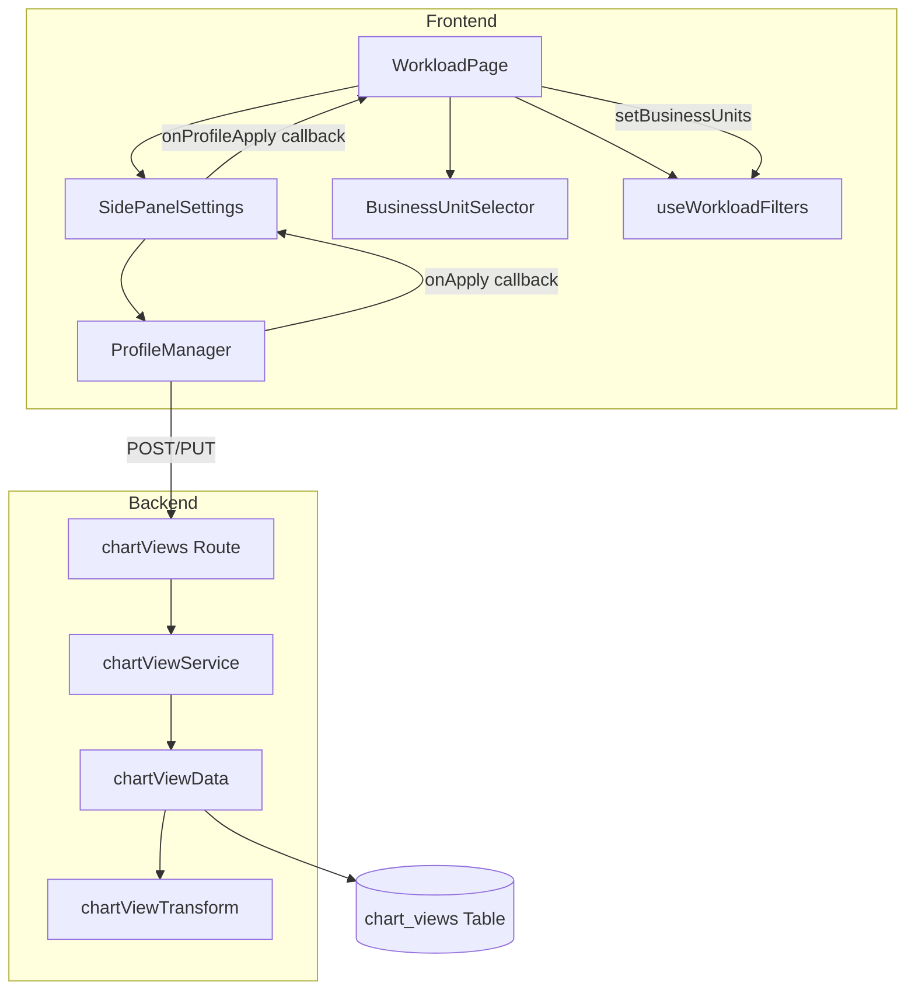
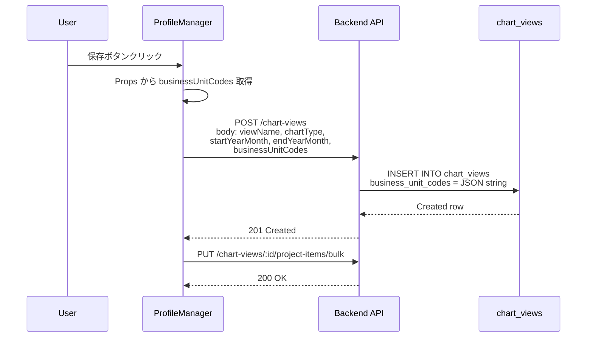
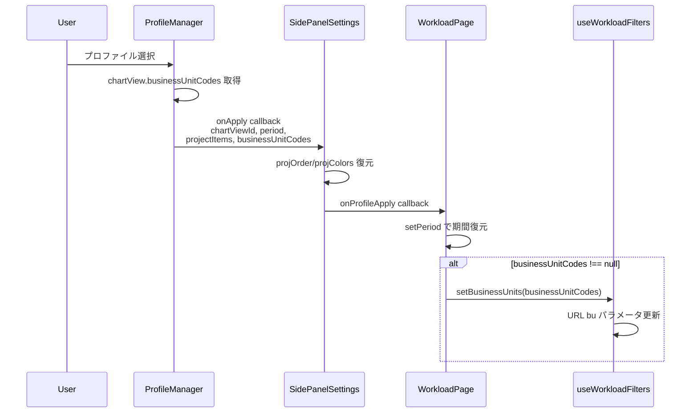
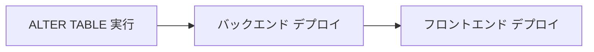

# Design Document: workload-profile-bu-sync

## Overview

**Purpose**: workload画面のプロファイル（chart_views）に Business Unit 選択状態を保存・復元する機能を追加し、プロファイル1つの操作で以前の表示状態を完全に再現可能にする。

**Users**: 操業管理者・事業部リーダーが workload チャートのプロファイル管理で利用する。

**Impact**: 既存の chart_views テーブルに `business_unit_codes` カラムを追加し、フロントエンド〜バックエンドの CRUD スタック全体で BU コードを受け渡す。既存プロファイルへの後方互換性を維持する。

### Goals
- プロファイル保存時に BU 選択状態を永続化する
- プロファイル適用時に BU 選択状態を復元し URL Search Params に反映する
- 既存プロファイル（BU 情報なし）の後方互換性を保証する

### Non-Goals
- BU コードによるプロファイルのフィルタリング・検索機能
- プロファイルのユーザー間共有・権限管理
- BU マスタの存在チェックバリデーション（フロントエンドが選択肢を制御するため不要）

## Architecture

### Existing Architecture Analysis

現行の chart_views CRUD は確立されたレイヤードパターンに従う:
- **routes** → **services** → **data** + **transform** + **types**
- フロントエンドは feature-based 構成: `features/workload/` 内に api / components / hooks / types を凝集
- BU 選択は `useWorkloadFilters` フックで URL Search Params（`bu` パラメータ）として管理
- ProfileManager は chartType / 期間 / projectItems のみを扱い、BU を認識しない

本機能は既存スタックへの**フィールド追加**であり、アーキテクチャの変更は発生しない。

### Architecture Pattern & Boundary Map



**Architecture Integration**:
- 選択パターン: 既存レイヤードアーキテクチャの拡張（Option A）
- ドメイン境界: workload feature 内で完結。他 feature への影響なし
- 既存パターン保持: routes → services → data のレイヤー方向、Transform 層での snake_case ↔ camelCase 変換
- 新規コンポーネント: なし（全て既存コンポーネントの拡張）

### Technology Stack

| Layer | Choice / Version | Role in Feature | Notes |
|-------|------------------|-----------------|-------|
| Frontend | React 19 + TanStack Query | ProfileManager Props 拡張、キャッシュ無効化 | 変更なし |
| Backend | Hono v4 + Zod v4 | スキーマにフィールド追加 | 変更なし |
| Data | SQL Server (mssql) | ALTER TABLE + CRUD SQL 更新 | NVARCHAR(MAX) JSON |

## System Flows

### プロファイル保存フロー（BU コード付き）



### プロファイル適用フロー（BU 復元付き）



## Requirements Traceability

| Requirement | Summary | Components | Interfaces | Flows |
|-------------|---------|------------|------------|-------|
| 1.1 | 新規保存時 BU 含める | ProfileManager, API, Data | ProfileManagerProps, createChartViewSchema | 保存フロー |
| 1.2 | 上書き保存時 BU 更新 | ProfileManager, API, Data | ProfileManagerProps, updateChartViewSchema | 保存フロー |
| 1.3 | 空配列の保存 | ProfileManager, API | createChartViewSchema | 保存フロー |
| 2.1 | 適用時 BU 復元 | WorkloadPage, ProfileManager | onApply callback | 適用フロー |
| 2.2 | URL Search Params 反映 | WorkloadPage, useWorkloadFilters | setBusinessUnits | 適用フロー |
| 2.3 | チャートデータ再取得 | WorkloadPage, TanStack Query | chartDataParams | 適用フロー |
| 3.1 | null 時 BU 維持 | WorkloadPage | onApply callback | 適用フロー |
| 3.2 | nullable フィールド | API, Zod スキーマ | chartViewSchema | - |
| 3.3 | 旧データの上書き保存 | ProfileManager | ProfileManagerProps | 保存フロー |
| 4.1 | DB カラム追加 | chart_views テーブル | - | - |
| 4.2 | JSON シリアライズ | chartViewTransform | toChartViewResponse | - |
| 4.3 | JSON デシリアライズ | chartViewTransform | toChartViewResponse | - |
| 4.4 | Zod バリデーション | chartView types | createChartViewSchema | - |
| 5.1 | バックエンド型追加 | ChartViewRow, ChartView 型 | - | - |
| 5.2 | フロントエンド型追加 | ChartView, Input 型 | - | - |
| 5.3 | Zod スキーマ定義 | createChartViewSchema | - | - |

## Components and Interfaces

| Component | Domain/Layer | Intent | Req Coverage | Key Dependencies | Contracts |
|-----------|--------------|--------|--------------|------------------|-----------|
| chartView types | Backend/Types | Zod スキーマ + 型にフィールド追加 | 4.4, 5.1, 5.3 | Zod v4 (P0) | Service |
| chartViewData | Backend/Data | CRUD SQL に カラム追加 | 4.1 | mssql (P0) | Service |
| chartViewTransform | Backend/Transform | JSON ↔ 配列変換追加 | 4.2, 4.3 | chartView types (P0) | Service |
| chartViews Route | Backend/Routes | スキーマ反映（自動） | 3.2 | chartView types (P0) | API |
| Frontend types | Frontend/Types | 型定義にフィールド追加 | 5.2 | - | - |
| api-client | Frontend/API | API 呼び出しにフィールド追加 | 1.1, 1.2 | Frontend types (P0) | API |
| ProfileManager | Frontend/Components | Props + 保存/適用ロジック更新 | 1.1, 1.2, 1.3, 2.1, 3.1 | mutations (P0), api-client (P0) | State |
| SidePanelSettings | Frontend/Components | BU コード受け渡し追加 | 1.1, 2.1 | ProfileManager (P0) | State |
| WorkloadPage | Frontend/Route | BU 復元ロジック追加 | 2.1, 2.2, 2.3, 3.1 | useWorkloadFilters (P0) | State |

### Backend / Types

#### chartView types (`apps/backend/src/types/chartView.ts`)

| Field | Detail |
|-------|--------|
| Intent | ChartView 関連の Zod スキーマと TypeScript 型に businessUnitCodes フィールドを追加 |
| Requirements | 4.4, 5.1, 5.3 |

**Responsibilities & Constraints**
- `createChartViewSchema` と `updateChartViewSchema` に `businessUnitCodes` フィールドを追加
- `ChartViewRow` に `business_unit_codes: string | null`（DB の JSON 文字列）を追加
- `ChartView` に `businessUnitCodes: string[] | null`（API レスポンスの配列）を追加

**Contracts**: Service [x]

##### Service Interface

```typescript
// createChartViewSchema への追加フィールド
// businessUnitCodes: z.array(z.string()).optional()

// updateChartViewSchema への追加フィールド
// businessUnitCodes: z.array(z.string()).optional()

// ChartViewRow への追加フィールド
interface ChartViewRow {
  // ...existing fields...
  business_unit_codes: string | null; // JSON string in DB
}

// ChartView への追加フィールド
interface ChartView {
  // ...existing fields...
  businessUnitCodes: string[] | null;
}
```

- Preconditions: なし
- Postconditions: 型が全レイヤーで整合する
- Invariants: businessUnitCodes が提供された場合、各要素は非空文字列

### Backend / Data

#### chartViewData (`apps/backend/src/data/chartViewData.ts`)

| Field | Detail |
|-------|--------|
| Intent | chart_views テーブルの CRUD SQL に business_unit_codes カラムを追加 |
| Requirements | 4.1 |

**Responsibilities & Constraints**
- `BASE_SELECT` に `business_unit_codes` を追加
- `create()` の INSERT 文に `business_unit_codes` パラメータを追加（`JSON.stringify()` で文字列化）
- `update()` の動的 SET 句に `business_unit_codes` を追加

**Contracts**: Service [x]

##### Service Interface

```typescript
// create() の data パラメータ
interface CreateChartView {
  // ...existing fields...
  businessUnitCodes?: string[]; // Transform 前: 配列
}

// DB へは JSON.stringify(businessUnitCodes ?? null) で格納
// 読み取り時は Transform 層で JSON.parse する
```

**Implementation Notes**
- `create()`: `businessUnitCodes` が undefined の場合は null を INSERT
- `update()`: `businessUnitCodes` が提供された場合のみ SET 句に含める（既存の動的 SET パターンに従う）

### Backend / Transform

#### chartViewTransform (`apps/backend/src/transform/chartViewTransform.ts`)

| Field | Detail |
|-------|--------|
| Intent | DB 行の JSON 文字列と API レスポンスの配列間の変換を追加 |
| Requirements | 4.2, 4.3 |

**Responsibilities & Constraints**
- `toChartViewResponse()` で `business_unit_codes`（JSON 文字列 | null）を `businessUnitCodes`（string[] | null）に変換
- null の場合は null をそのまま返す
- JSON パースエラーの場合は null にフォールバック（防御的プログラミング）

**Contracts**: Service [x]

##### Service Interface

```typescript
function toChartViewResponse(row: ChartViewRow): ChartView {
  // ...existing mapping...
  // businessUnitCodes: row.business_unit_codes
  //   ? JSON.parse(row.business_unit_codes)
  //   : null
}
```

### Frontend / Types

#### Frontend types (`apps/frontend/src/features/workload/types/index.ts`)

| Field | Detail |
|-------|--------|
| Intent | ChartView、CreateChartViewInput、UpdateChartViewInput 型に businessUnitCodes を追加 |
| Requirements | 5.2 |

**Contracts**: State [x]

##### State Management

```typescript
// ChartView への追加
interface ChartView {
  // ...existing fields...
  businessUnitCodes: string[] | null;
}

// CreateChartViewInput への追加
interface CreateChartViewInput {
  // ...existing fields...
  businessUnitCodes?: string[];
}

// UpdateChartViewInput への追加
interface UpdateChartViewInput {
  // ...existing fields...
  businessUnitCodes?: string[];
}
```

### Frontend / Components

#### ProfileManager (`apps/frontend/src/features/workload/components/ProfileManager.tsx`)

| Field | Detail |
|-------|--------|
| Intent | Props に businessUnitCodes を追加し、保存時に送信、適用時にコールバックで返却 |
| Requirements | 1.1, 1.2, 1.3, 2.1, 3.1 |

**Responsibilities & Constraints**
- Props から `businessUnitCodes: string[]` を受け取る
- 新規保存（handleSave）: `createMutation.mutate()` に `businessUnitCodes` を含める
- 上書き保存（handleOverwriteConfirm）: `updateMutation.mutate()` に `businessUnitCodes` を含める
- 適用（handleApply）: `onApply` コールバックに `businessUnitCodes: chartView.businessUnitCodes` を含める

**Contracts**: State [x]

##### State Management

```typescript
interface ProfileManagerProps {
  chartType: string;
  startYearMonth: string;
  endYearMonth: string;
  projectItems: BulkUpsertProjectItemInput[];
  businessUnitCodes: string[];  // 追加
  onApply?: (profile: {
    chartViewId: number;
    startYearMonth: string;
    endYearMonth: string;
    projectItems: BulkUpsertProjectItemInput[];
    businessUnitCodes: string[] | null;  // 追加
  }) => void;
}
```

- State model: Props 経由で受け取り、mutation / callback で受け渡す（内部状態の追加なし）

**Implementation Notes**
- 保存時: `businessUnitCodes` が空配列の場合もそのまま送信（BU 未選択状態の保存を許容）
- 適用時: ChartView レスポンスの `businessUnitCodes` をそのまま返す（null の場合あり）

#### SidePanelSettings (`apps/frontend/src/features/workload/components/SidePanelSettings.tsx`)

| Field | Detail |
|-------|--------|
| Intent | 親コンポーネントから受け取った businessUnitCodes を ProfileManager に透過的に渡す |
| Requirements | 1.1, 2.1 |

**Implementation Notes**
- Props に `businessUnitCodes: string[]` は既に存在する（BusinessUnitSelector で使用）
- ProfileManager への Props 伝搬を追加するのみ
- onProfileApply コールバックの型に `businessUnitCodes: string[] | null` を追加

#### WorkloadPage (`apps/frontend/src/routes/workload/index.tsx`)

| Field | Detail |
|-------|--------|
| Intent | handleProfileApply で BU 復元を追加、URL Search Params に反映 |
| Requirements | 2.1, 2.2, 2.3, 3.1 |

**Responsibilities & Constraints**
- `handleProfileApply` で `profile.businessUnitCodes` を受け取る
- `businessUnitCodes !== null` の場合のみ `setBusinessUnits()` を呼び出す
- `setBusinessUnits()` により URL の `bu` パラメータが更新される
- URL 更新により TanStack Query の `chartDataParams` が変化し、チャートデータが自動再取得される（2.3）

**Contracts**: State [x]

##### State Management

```typescript
// handleProfileApply の更新
const handleProfileApply = useCallback(
  (profile: {
    // ...existing fields...
    businessUnitCodes: string[] | null;  // 追加
  }) => {
    // 期間復元（既存）
    setPeriod(profile.startYearMonth, months);
    // BU 復元（追加）
    if (profile.businessUnitCodes !== null) {
      setBusinessUnits(profile.businessUnitCodes);
    }
  },
  [setPeriod, setBusinessUnits],
);
```

- Persistence: URL Search Params（`bu` パラメータ）
- Consistency: `setBusinessUnits` → URL 更新 → TanStack Query 自動再取得

## Data Models

### Physical Data Model

#### ALTER TABLE

```sql
ALTER TABLE chart_views
ADD business_unit_codes NVARCHAR(MAX) NULL;
```

- **型**: NVARCHAR(MAX) — JSON 文字列を格納
- **NULL 許容**: 既存レコードとの後方互換性
- **格納形式**: `'["BU001","BU002"]'` または `NULL`
- **インデックス**: 不要（BU コードによる検索・フィルタリングは非目標）

### Data Contracts & Integration

#### API Data Transfer

**Create Request（追加フィールド）:**

| Field | Type | Required | Validation |
|-------|------|----------|------------|
| businessUnitCodes | string[] | No | 各要素が string |

**Update Request（追加フィールド）:**

| Field | Type | Required | Validation |
|-------|------|----------|------------|
| businessUnitCodes | string[] | No | 各要素が string |

**Response（追加フィールド）:**

| Field | Type | Nullable | Description |
|-------|------|----------|-------------|
| businessUnitCodes | string[] | Yes | 保存された BU コード一覧。null は旧データ |

**シリアライズ:**
- Request → DB: `JSON.stringify(businessUnitCodes)` → NVARCHAR(MAX)
- DB → Response: `JSON.parse(business_unit_codes)` → string[] | null

## Error Handling

### Error Categories and Responses

**User Errors (4xx)**:
- businessUnitCodes に不正な型が含まれる → Zod バリデーションエラー（400）、既存のエラーハンドリングで対応

**System Errors**:
- JSON パースエラー（DB の不正データ） → Transform 層で null にフォールバック、ログ出力

### Monitoring
- 既存の Hono エラーハンドリングに含まれるため、追加の監視設定は不要

## Testing Strategy

### Unit Tests

**バックエンド:**
1. `chartViewData.test.ts`: create / update に businessUnitCodes パラメータが SQL に含まれることを検証
2. `chartViewTransform` (既存テスト or 新規): JSON 文字列 → 配列変換、null → null、不正 JSON → null のケース
3. `chartViewService.test.ts`: 既存テストに businessUnitCodes フィールドを追加して通過を確認

### Integration Tests

**バックエンド:**
1. `chartViews.test.ts` (ルートテスト): POST / PUT リクエストに businessUnitCodes を含め、レスポンスに反映されることを検証
2. `chartViews.test.ts`: businessUnitCodes なしのリクエストで後方互換性を検証
3. `chartViews.test.ts`: GET レスポンスに businessUnitCodes が含まれることを検証

### Migration Strategy



1. **ALTER TABLE**: `business_unit_codes NVARCHAR(MAX) NULL` を追加（既存データに影響なし）
2. **バックエンドデプロイ**: 新フィールド対応の API をデプロイ（旧フロントエンドからの businessUnitCodes なしリクエストも受け付ける）
3. **フロントエンドデプロイ**: businessUnitCodes を送信・復元する UI をデプロイ
