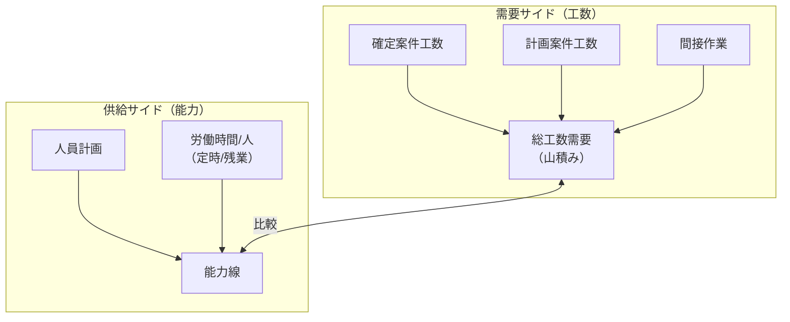

# ドメイン知識整理

## 1. システム概要

### 1.1 目的
エンジニアリング事業における**人員の操業管理**を行うシステム。

**操業**とは、月ごとの人員数とそれに基づく労働時間（Man-hour）を集計・管理すること。

### 1.2 対象組織
エンジニアリング事業は複数の**ビジネスユニット（BU）**で構成される：
- プラント事業（plant）
- 交通システム事業（trans）
- CO2回収事業（co2）

---

## 2. 主要概念

### 2.1 案件（プロジェクト）
案件ごとに**月別の工数を計画**する。

案件は以下の2種類に大別される：

| 区分 | 説明 | 工数計画方法 |
|------|------|--------------|
| **確定案件** | 受注済みの工事 | 今後の月ごとの工数見通しが比較的正確に把握できる |
| **計画案件** | 未受注・見込み案件 | 過去実績や標準工数パターンに基づいて展開 |

### 2.2 人員計画
今後の**人員数の見通し**を計画する。

### 2.3 能力（キャパシティ）
**能力 = 人員数 × 1人当たり労働時間**

労働時間のケースは複数存在：
- 定時ベース（例：160時間/月）
- 残業込みケース（例：180時間/月、200時間/月など）

---

## 3. 工数計算ロジック

### 3.1 確定案件の工数
月ごとの工数を直接入力または詳細に計画。

### 3.2 計画案件の工数展開（標準工数パターン）

**入力項目：**
- 案件の総期間（月数）
- 案件の総工数（Man-hour）
- 進捗に応じた重み（標準工数パターン）

**進捗重みの仕組み：**
- 0%〜100%の進捗を5%刻みで区切る（21区間）
- 各区間に「重み」を設定
- 重みに基づいて総工数を月ごとに按分展開

**例1：均等配分**
- 全区間の重みが同じ（例：すべて10）
- → 案件開始から終了まで毎月同じ工数

**例2：山型配分（設計・施工型）**
- 最初の30%と最後の30%の重みが大きい
- → 24ヶ月プロジェクトの場合
  - 1〜6ヶ月目：工数多い（設計フェーズ）
  - 7〜18ヶ月目：工数少ない
  - 19〜24ヶ月目：工数多い（施工・試運転フェーズ）

これにより**Sカーブ**や**バスタブカーブ**のような工数分布を表現。

---

## 4. 間接作業

### 4.1 定義
案件作業以外の業務時間。

### 4.2 例
- 教育・研修
- 部門活動
- 管理業務
- 引合対応

### 4.3 特徴
- 全体に占める割合は比較的小さい
- しかし操業管理においては欠かせない要素
- BUごとに間接作業の種類・比率が異なる場合がある

---

## 5. 操業管理の全体像

---

## 6. ドメイン用語集

### 6.1 組織・体制

| 用語 | 英語表記 | 定義 |
|------|----------|------|
| **ビジネスユニット（BU）** | Business Unit | エンジニアリング事業を構成する事業単位。プラント事業、交通システム事業、CO2回収事業など |
| **ファンクション** | Function | BU内の機能別組織区分。設計、調達、施工管理などの専門機能 |

### 6.2 案件・プロジェクト

| 用語 | 英語表記 | 定義 |
|------|----------|------|
| **案件** | Project | 工数管理の基本単位。顧客からの受注案件または受注見込み案件 |
| **確定案件** | Confirmed Project | 受注済みで、工数見通しが比較的正確に把握できる案件 |
| **計画案件** | Planned Project | 未受注の見込み案件。標準工数パターンに基づいて工数を展開 |
| **工事種別** | Construction Type | 案件の種類区分。EPC、Service、Study など |
| **案件ステータス** | Project Status | 案件の状態。確定、計画、支援、計画外など |
| **リビジョン** | Revision | 案件データの版管理番号。計画変更時に新リビジョンを作成 |

### 6.3 リソース

| 用語 | 英語表記 | 定義 |
|------|----------|------|
| **リソースタイプ** | Resource Type | 人員の区分。SE（社員）、PG（派遣・協力会社）、OTHER（その他）など |
| **人員計画** | Headcount Plan | 将来の人員数の見通し。BU・年度ごとに計画 |
| **能力（キャパシティ）** | Capacity | 人員が提供できる総労働時間。人員数 × 1人当たり労働時間で算出 |

### 6.4 工数・時間

| 用語 | 英語表記 | 定義 |
|------|----------|------|
| **工数** | Manhour | 作業量の単位。人×時間で表現（例：100人時間） |
| **Man-hour** | - | 工数と同義。1人が1時間作業する量を1 Man-hourとする |
| **Man-month** | - | 1人が1ヶ月作業する量。通常160〜180 Man-hourに相当 |
| **定時時間** | Regular Working Hours | 残業を含まない標準労働時間。通常160時間/月 |
| **残業時間** | Overtime Hours | 定時時間を超える労働時間 |
| **操業** | Operation / Workload | 月ごとの人員・工数の実態および計画の総称 |

### 6.5 工数計画・展開

| 用語 | 英語表記 | 定義 |
|------|----------|------|
| **標準工数パターン** | Standard Manhour Pattern | 進捗率に応じた工数配分の重みを定義したテンプレート |
| **進捗率** | Progress Ratio | 案件の完了度合いを0%〜100%で表現。5%刻みで管理 |
| **重み** | Weight | 各進捗区間に割り当てる工数配分の比率値 |
| **月次展開** | Monthly Distribution | 総工数を標準工数パターンに基づいて月別に按分する処理 |
| **工数カーブ** | Manhour Curve | 月別工数をグラフ化したときの形状。Sカーブ、バスタブカーブなど |

### 6.6 間接作業

| 用語 | 英語表記 | 定義 |
|------|----------|------|
| **間接作業** | Indirect Work | 案件に直接紐付かない業務。教育、部門活動、管理業務など |
| **間接作業種別** | Indirect Work Type | 間接作業の分類。教育、引合、部門費など |
| **間接作業比率** | Indirect Work Ratio | 総能力に対する間接作業の割合 |

### 6.7 可視化・分析

| 用語 | 英語表記 | 定義 |
|------|----------|------|
| **山積み** | Stacking / Workload Stack | 複数案件の工数を積み上げて表示すること。面グラフで可視化 |
| **能力線** | Capacity Line | 人員計画に基づく能力をグラフ上に線で表示したもの |
| **定時線** | Regular Capacity Line | 定時時間ベースの能力線 |
| **残業線** | Overtime Capacity Line | 残業込みの能力線 |
| **ケーススタディ** | Case Study | 複数のシナリオを比較検討するためのシミュレーション |

### 6.8 ケース管理

| 用語 | 英語表記 | 定義 |
|------|----------|------|
| **案件ケース** | Project Case | 1つの案件に対する複数の工数計画パターン（楽観/標準/悲観など） |
| **キャパシティケース** | Capacity Case | 能力計算の前提条件パターン（人員計画×労働時間の組み合わせ） |
| **間接作業ケース** | Indirect Work Case | 間接作業の計画パターン（理想ケース/実態ベースなど） |

---