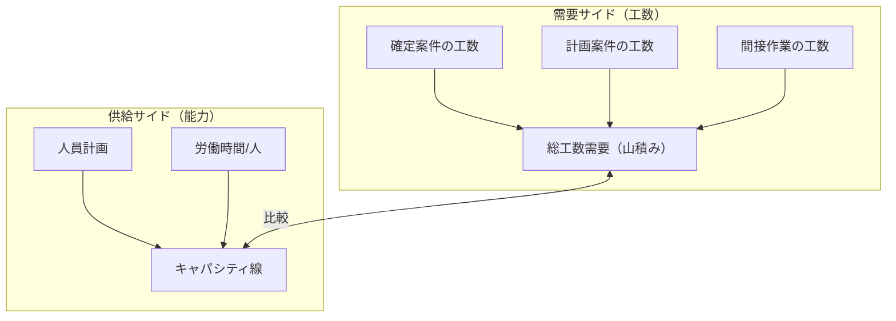
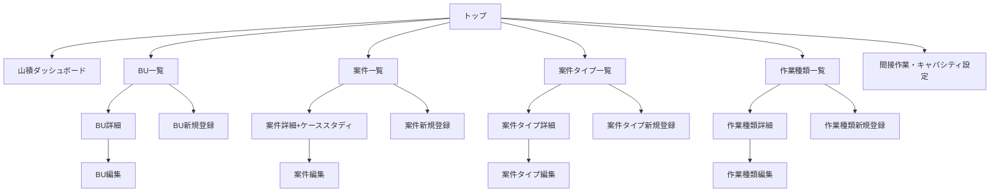

# 操業管理システム

エンジニアリング事業の人員・工数を一元管理し、リソース配分の意思決定を支援するWebアプリケーション

<br/>

<div class="text-left text-sm mt-4">

**対象組織**: エンジニアリング事業（プラント事業・交通システム事業・CO2回収事業 等）

**主な利用者**: 部門マネージャー / プロジェクトマネージャー / 経営層 / 計画担当者

**提供価値**: 属人的なExcel運用を置き換え、「長期プロジェクト × 複数事業部 × 流動的な人員計画」の複雑性を統一的に管理

</div>

---

## システム概要 - 解決する課題と全体像

<div class="text-xs">

<div class="grid grid-cols-2 gap-4">
<div>

### 解決する5つの課題

| # | 課題 | 詳細 |
|---|------|------|
| 1 | **工数の不可視性** | プロジェクト工数と間接業務工数が一元的に把握できず、実際のキャパシティとの乖離が発生 |
| 2 | **計画精度の低下** | 間接業務を考慮しないリソース計画により、プロジェクトへの過剰アサインが発生 |
| 3 | **種別分析の困難さ** | 「間接業務」が一括管理されており、教育・見積・会議等の内訳が不明 |
| 4 | **シナリオ比較の欠如** | 案件の工数見積を楽観/標準/悲観等の複数パターンで比較する手段がない |
| 5 | **負荷バランスの不透明さ** | 案件タイプ（EPC/Service/Study等）ごとの負荷が見えない |

</div>
<div>

### 需要と供給の可視化モデル



</div>
</div>

</div>

---

## 想定ユーザーと主要な利用シナリオ

<div class="text-xs">

| ロール | 主な利用画面 | 業務シナリオ | 関心事 |
|--------|-------------|-------------|--------|
| **部門マネージャー** | 山積ダッシュボード、間接作業・キャパシティ設定 | 月次の人員過不足の確認、要員調整の意思決定、間接業務比率の把握 | 部門全体のキャパシティ把握・人員計画策定 |
| **プロジェクトマネージャー** | 案件管理、ケーススタディ、山積ダッシュボード | 新規案件の工数影響シミュレーション、複数シナリオの比較検討 | 案件の工数見積・シナリオ比較 |
| **経営層** | 山積ダッシュボード | 事業部横断でのリソース状況把握、リソース配分の妥当性評価 | 部門間リソース配分の最適化 |
| **計画担当者** | 全画面 | マスタデータの整備、工数データの入力、計算実行と結果確認 | 全機能を活用した精度の高い計画策定 |

### 期待される効果

- 間接業務を含めた総工数の可視化によるリソース配分の最適化
- 種別ごとの間接業務分析による業務改善の推進
- ケーススタディによる精度の高い工数見積
- キャパシティと負荷の比較による適正な人員配置
- 複数ビジネスユニット横断でのリソース状況の把握

</div>

---

## 画面構成とナビゲーション

<div class="text-xs">

<div class="grid grid-cols-2 gap-4">
<div>

### サイドバーメニュー

アプリケーションの左側にサイドバーがあり、折りたたみ/展開が可能です。モバイル端末ではハンバーガーメニューから表示されます。

| カテゴリ | メニュー | 概要 |
|----------|---------|------|
| **ダッシュボード** | 山積ダッシュボード | メイン画面。案件工数・間接作業・キャパシティを時系列チャートで可視化 |
| **マスタ管理** | ビジネスユニット | 事業部（BU）の登録・編集・削除・復元 |
| | 案件 | プロジェクトの登録・編集・削除・復元。ケーススタディの管理 |
| | 案件タイプ | 案件の種類区分（EPC、Service、Study等）の定義 |
| | 作業種類 | 間接作業の種別（教育、引合、部門費等）の定義 |
| | 間接作業・キャパシティ | BUごとの人員計画・間接作業比率・キャパシティの計算と管理 |

トップページ（`/`）にアクセスすると、自動的に山積ダッシュボードにリダイレクトされます。

</div>
<div>

### 画面遷移図



</div>
</div>

</div>

---
layout: section
---

# 機能詳細 - 山積ダッシュボード

部門ごとのプロジェクト工数と人員キャパシティの過不足を一目で把握するメイン画面

---

## 山積ダッシュボード - 画面構成と操作

<div class="text-xs">

<div class="grid grid-cols-2 gap-4">
<div>

### 画面レイアウト

山積ダッシュボードは以下の4つのエリアで構成されています。

**1. ヘッダーバー**
- 画面タイトル「山積ダッシュボード」
- 表示切替トグル（チャートのみ / テーブルのみ / 両方表示）

**2. BU選択バー**
- ビジネスユニットをチェックボックスで選択（複数選択可）
- BU未選択時は「ビジネスユニットを選択してください」と案内表示
- 選択したBUに属する案件の工数が集計対象になる

**3. サイドパネル（左側・3タブ構成）**
- **案件タブ**: 表示する案件をチェックボックスで個別に選択/解除。案件名で検索フィルタも可能
- **間接タブ**: 間接作業の表示に関する設定
- **設定タブ**: 表示期間（開始年月・月数）、案件ごとのチャート色のカスタマイズ、チャート積み上げ順のドラッグ&ドロップ並べ替え、プロファイル（表示設定の保存・復元）

**4. メインエリア（右側）**
- チャートカードとデータテーブルカードを表示（切替・併用可能）

</div>
<div>

### チャート表示

案件ごとに色分けされた**積み上げ面グラフ（Area Chart）**で、月別の工数需要を可視化します。

- **面グラフの各層**: 各案件の月別工数（Man-hour）を積み上げ表示
- **キャパシティ線**: 人員計画に基づく生産能力を線グラフで重畳表示（定時/残業の複数ケース）
- **凡例パネル**: チャート上でマウスホバーした月の内訳がリアルタイム表示。ピン留めボタンで固定表示可能
- **フェッチ中インジケータ**: データ更新時は半透明のローディング表示

### データテーブル表示

チャートと同じデータを月別の数値テーブルとして表示します。

- **年度フィルタ**: 表示対象の年度を切り替え
- **キーワード検索**: 案件名・項目名でリアルタイム絞り込み
- **行タイプフィルタ**: 案件行・間接作業行・キャパシティ行を選択的に表示
- **ソート**: 列ヘッダーをクリックして昇順/降順の切り替え

</div>
</div>

</div>

---

## 山積ダッシュボード - 設定パネルとプロファイル管理

<div class="text-xs">

<div class="grid grid-cols-2 gap-4">
<div>

### 設定タブの詳細

設定タブでは、ダッシュボードの表示をきめ細かくカスタマイズできます。

**表示期間の設定**
- 開始年月（YYYY/MM形式）と表示月数を指定
- 表示月数を変更すると、チャートとテーブルの表示範囲が即座に反映

**案件の色設定**
- 各案件のチャート色をカラーピッカーで個別に変更可能
- 色の変更はチャートと凡例パネルに即座に反映
- デフォルトでは案件タイプ別のカラーパレットが適用

**案件の並び順**
- ドラッグ&ドロップで案件の表示順を変更
- チャートの積み上げ順序と凡例パネルの表示順に即座に反映
- 下層の案件ほどチャートの下部（X軸側）に積まれる

</div>
<div>

### プロファイル管理

表示設定を名前付きプロファイルとして保存し、いつでも復元できます。

**保存される設定**
- 表示期間（開始年月・終了年月）
- 選択中のビジネスユニット
- 案件ごとの色設定
- 案件の並び順
- 案件の表示/非表示状態

**利用イメージ**
- 「2026年度 プラント事業 月次レビュー用」のようにプロファイルを保存
- 月次会議のたびに同じプロファイルを呼び出して一貫した表示で確認
- BUごと・用途ごとに複数のプロファイルを使い分け

**操作方法**
- プロファイル名を入力して「保存」ボタンで新規保存
- 既存プロファイルの一覧から選択して「適用」で設定を復元
- 不要になったプロファイルの削除も可能

</div>
</div>

</div>

---
layout: section
---

# 機能詳細 - マスタ管理

ビジネスユニット・案件・案件タイプ・作業種類のマスタデータを管理

---

## マスタ管理 - 共通機能と画面パターン

<div class="text-xs">

すべてのマスタ管理画面（ビジネスユニット・案件・案件タイプ・作業種類）は、統一された操作体系を持っています。

<div class="grid grid-cols-2 gap-4">
<div>

### 一覧画面の共通機能

| 機能 | 説明 |
|------|------|
| **データテーブル** | ソート可能な列ヘッダー、行クリックで詳細画面に遷移 |
| **キーワード検索** | IME（日本語入力）対応のリアルタイム絞り込み。デバウンス処理により入力中のちらつきを防止 |
| **ページネーション** | 案件一覧とBU一覧はページネーション付き（10/25/50件切替）。案件タイプ・作業種類はページネーションなし |
| **削除済み表示** | 「削除済みを含む」チェックボックスで論理削除されたデータも表示。削除済み行は半透明で表示 |
| **復元** | 削除済みデータを表示中に「復元」ボタンで元に戻す（確認ダイアログあり） |
| **新規追加** | ツールバーの「新規追加」ボタンでフォーム画面へ遷移 |
| **プリフェッチ** | 行ホバー時に詳細データを事前取得し、遷移時の表示速度を向上 |

</div>
<div>

### 詳細画面・編集画面の共通機能

**詳細画面**
- パンくずリスト付きのページヘッダー（一覧画面への戻りリンク）
- 各フィールドをラベル-値の形式で表示
- 「編集」ボタンで編集画面に遷移
- 「削除」ボタンで削除確認ダイアログを表示（ソフトデリート方式）
- 他のデータから参照されている場合は削除不可（409エラー表示）

**編集・新規登録画面**
- バリデーション付きフォーム（必須チェック・重複チェック等）
- フィールドからフォーカスが外れた時点でバリデーション実行
- 保存成功時はトースト通知で確認
- 編集中にページを離れようとすると「未保存の変更があります」警告ダイアログを表示（保存して離れる / 変更を破棄して離れる / キャンセル の3択）

</div>
</div>

</div>

---

## マスタ管理 - 各マスタの管理項目と役割

<div class="text-xs">

<div class="grid grid-cols-2 gap-4">
<div>

### ビジネスユニット（BU）管理

事業部の情報を登録・管理します。BUはシステム全体のデータ分類の最上位単位です。

| 管理項目 | 説明 | 例 |
|----------|------|-----|
| BUコード | 事業部の識別コード（一意） | plant, trans, co2 |
| 名称 | 事業部の表示名 | プラント事業、交通システム事業 |
| 表示順 | 一覧画面やセレクタでの並び順 | 1, 2, 3 |

**用途**: ダッシュボードのBUフィルタ、案件の所属先、間接作業・キャパシティ計算の単位

### 案件タイプ管理

案件の種類区分を定義します。ダッシュボードでの分析軸として利用されます。

| 管理項目 | 説明 | 例 |
|----------|------|-----|
| タイプコード | 種類の識別コード（一意） | epc, service, study |
| 名称 | 種類の表示名 | EPC、サービス、Study |
| 表示順 | 一覧画面での並び順 | 1, 2, 3 |

**用途**: 案件登録時の種類選択、チャートの色分けグループ

</div>
<div>

### 案件（プロジェクト）管理

受注済み・見込み案件の情報を登録します。工数計画の基礎データであり、ダッシュボードの中心的なデータです。

| 管理項目 | 説明 | 例 |
|----------|------|-----|
| 案件コード | 案件の識別コード（一意） | PJ-2026-001 |
| 名称 | 案件名 | XX発電所建設工事 |
| 事業部 | 所属するBU | プラント事業 |
| 案件タイプ | 種類区分 | EPC |
| 開始年月 | 工事開始時期 | 2026/04 |
| 総工数 | 案件全体のMan-hour | 50,000 |
| ステータス | 確定 / 計画 / 支援 / 計画外 | 確定 |
| 期間月数 | プロジェクトの期間 | 24ヶ月 |

### 作業種類管理

間接作業の種別を定義します。間接作業比率の設定単位として利用されます。

| 管理項目 | 説明 | 例 |
|----------|------|-----|
| 種類コード | 作業種類の識別コード（一意） | education, inquiry |
| 名称 | 作業種類の表示名 | 教育・研修、引合対応 |
| 表示順 | 一覧画面での並び順 | 1, 2 |

**用途**: 間接作業比率の設定行、ダッシュボードの間接作業内訳

</div>
</div>

</div>

---

## 案件詳細画面 - ケーススタディ機能

<div class="text-xs">

案件詳細画面の下部には**ケーススタディセクション**があり、1つの案件に対して複数の工数配分パターン（ケース）を作成・比較できます。

<div class="grid grid-cols-2 gap-4">
<div>

### ケースの作成と管理

**ケースとは**: 1つの案件に対する工数配分の1パターンです。楽観ケース・標準ケース・悲観ケースのように複数のシナリオを並行して管理し、比較検討を可能にします。

**ケース作成時の入力項目**
- ケース名（例：「標準ケース」「楽観ケース」）
- 計算モードの選択
  - **STANDARD（標準工数パターン）**: 事前に定義されたS カーブ・バスタブカーブ等の分布パターンを案件に適用し、月別工数を自動展開
  - **MANUAL（手動入力）**: 月別の工数を直接入力

**標準工数パターンによる自動展開**
- 進捗率 0%～100% を5%刻みの21区間に分割
- 各区間に「重み」を設定（例：序盤と終盤の重みを大きくすると山型分布）
- 案件の総工数と期間月数に基づき、重みに応じて月別に按分展開
- S カーブ、バスタブカーブ、均等配分など様々な工数分布を表現可能

</div>
<div>

### 月別工数の表示と編集

**チャート表示**
- ケースごとの月別工数カーブをグラフで可視化
- 複数ケースを重ねて表示し、パターン間の違いを視覚的に比較

**月別工数の手動編集**
- MANUAL モードでは各月の工数を直接入力・修正可能
- STANDARD モードでも展開結果を確認した上で個別調整が可能

**Excel連携**
- **エクスポート**: 月別工数データをExcelファイルとしてダウンロード。会議資料や外部共有に利用
- **インポート**: Excelファイルから月別工数データを一括読み込み。既存のExcelベース運用からのデータ移行に対応

### ダッシュボードとの連携

ケーススタディで作成した工数データは、山積ダッシュボードのチャートに自動的に反映されます。設定タブでどのケースをチャートに表示するかを選択できるため、異なるシナリオがダッシュボード全体にどう影響するかをすぐに確認できます。

</div>
</div>

</div>

---
layout: section
---

# 機能詳細 - 間接作業・キャパシティ設定

BUごとの人員計画からキャパシティを算出し、間接作業の工数を比率ベースで計画

---

## 間接作業・キャパシティ設定 - 全体構成と操作フロー

<div class="text-xs">

この画面は**2カラムレイアウト**（左側60%：設定パネル / 右側40%：結果パネル）で構成されています。画面右上のセレクタでBUを切り替えると、そのBUに紐づくすべてのデータが切り替わります。

<div class="grid grid-cols-2 gap-4">
<div>

### 設定パネル（左側） - 入力と計算

**Step 1: 人員計画の入力**
- 人員計画ケースを選択または新規作成（例：「2026年度 標準計画」「2026年度 増員案」）
- 年度ごとのグリッドで月別の人員数（人数）を入力
- 一括入力ダイアログで同じ値を複数月にまとめて設定可能
- 入力内容は「人員計画を保存」ボタンで保存

**Step 2: キャパシティ計算**
- キャパシティシナリオを選択（例：定時160h/月、残業込み180h/月、200h/月 等）
- 「キャパシティ計算」ボタンを押下 → サーバーサイドで `人員数 × 労働時間 = キャパシティ` を算出
- 計算結果は右側の結果パネルに表示

**Step 3: 間接作業の計算**
- 間接作業ケースを選択または新規作成（例：「理想ケース」「実態ベース」）
- 年度 × 作業種類のマトリクスで間接作業比率（%）を入力
- 「間接作業計算」ボタンを押下 → `キャパシティ × 比率 = 間接作業工数` を算出

</div>
<div>

### 結果パネル（右側） - 確認と保存

**キャパシティ計算結果**
- 月別の人員数とキャパシティ（Man-hour）を一覧表形式で表示
- 選択中のケース名・シナリオ名を表示

**間接作業計算結果**
- 作業種類ごとの月別間接作業工数を一覧表形式で表示
- 全作業種類の合計行を自動計算

**計算結果の保存**
- 「計算結果を保存」ボタンでデータベースに永続化
- 保存されたデータは山積ダッシュボードの間接作業行・キャパシティ線に反映

**Excel出力**
- 計算結果をExcelファイルとしてダウンロード
- 人員計画・キャパシティ・間接作業工数を一括出力

**未保存変更の保護**
- 入力変更後に画面を離れようとすると警告ダイアログを表示
- 保存してから離れる / 変更を破棄して離れる / 操作をキャンセル の3択

</div>
</div>

</div>

---

## 間接作業・キャパシティ設定 - ケース管理と計算ロジック

<div class="text-xs">

<div class="grid grid-cols-2 gap-4">
<div>

### 3種類のケース管理

この画面では3種類のケースを独立して管理します。それぞれのケースは「what-if分析」のシナリオに対応し、複数パターンの計画を並行して検討できます。

| ケース種類 | 目的 | 例 |
|-----------|------|-----|
| **人員計画ケース** | 将来の人員数の見通しを複数パターンで管理 | 「現状維持」「5名増員」「10名削減」 |
| **キャパシティシナリオ** | 1人あたり労働時間の前提条件を設定 | 「定時160h」「残業込180h」「残業込200h」 |
| **間接作業ケース** | 間接作業の計画パターンを管理 | 「理想ケース（比率低め）」「実態ベース」 |

各ケースは作成・選択・無効化（ソフトデリート）が可能です。「無効を含む」チェックボックスで過去のケースも表示できます。

</div>
<div>

### 計算ロジックの詳細

**キャパシティ計算**

```
月別キャパシティ[Mh] = 月別人員数[人] × 労働時間[h/月]
```

- 人員計画ケースで設定した月別人員数を使用
- キャパシティシナリオで設定した1人あたり労働時間を掛け算
- 例：15人 × 160h/月 = 2,400 Mh/月（定時ベース）

**間接作業工数計算**

```
月別間接作業工数[Mh] = 月別キャパシティ[Mh] × 間接作業比率[%]
```

- 上記で計算したキャパシティに、作業種類ごとの比率を適用
- 例：キャパシティ 2,400 Mh × 教育比率 5% = 120 Mh/月
- 全作業種類の間接作業工数を合計して月別の間接作業総量を算出

**計算結果の利用先**
- 山積ダッシュボードのキャパシティ線（定時線・残業線）
- 山積ダッシュボードの間接作業の積み上げ表示
- データテーブルのキャパシティ行・間接作業行

</div>
</div>

</div>

---

## 業務シナリオと機能の対応

<div class="text-xs">

<div class="grid grid-cols-2 gap-4">
<div>

### シナリオ 1: 月次の人員過不足を確認する

**対象**: 部門マネージャー / **利用画面**: 山積ダッシュボード

1. サイドバーから**山積ダッシュボード**を開く
2. BU選択バーで対象の**事業部を選択**（複数BUを選択して横断表示も可能）
3. チャートで**案件工数の山積み**（面グラフ）と**キャパシティ線**を確認
4. 山積みがキャパシティ線を超えている月 = 人員不足の月を特定
5. 設定タブで**表示期間を調整**し、問題のある期間にフォーカス
6. データテーブルに切り替えて**月別の数値を詳細確認**
7. プロファイルに保存して、次回の月次会議で同じ条件で再確認

### シナリオ 2: 新規案件の工数影響をシミュレーション

**対象**: プロジェクトマネージャー / **利用画面**: 案件管理 → ケーススタディ → 山積ダッシュボード

1. **案件一覧**から対象案件を選択（または新規登録して案件を作成）
2. 案件詳細画面の**ケーススタディセクション**で「新規ケース」を作成
3. **計算モードを選択**: 標準工数パターン（自動展開）または手動入力
4. 必要に応じて**複数ケース**（楽観/標準/悲観）を作成し、チャートで比較
5. **山積ダッシュボード**に戻り、設定タブで表示ケースを切り替えて全体への影響を確認

</div>
<div>

### シナリオ 3: 間接作業を含めた総工数を計画する

**対象**: 計画担当者 / **利用画面**: 間接作業・キャパシティ設定 → 山積ダッシュボード

1. **間接作業・キャパシティ設定**画面を開き、対象BUを選択
2. **人員計画ケース**を作成し、月別の人員数を入力（または既存ケースを選択）
3. **キャパシティシナリオ**（例：定時160h/月）を選択し、**「キャパシティ計算」**を実行
4. 結果パネルで月別キャパシティを確認
5. **間接作業ケース**を作成し、作業種類ごとの**比率**（%）を入力
6. **「間接作業計算」**を実行し、結果パネルで月別の間接作業工数を確認
7. **「計算結果を保存」**でデータベースに永続化
8. **山積ダッシュボード**でプロジェクト工数 + 間接作業の総量をチャートで確認

### シナリオ 4: マスタデータを整備する

**対象**: 計画担当者 / **利用画面**: 各マスタ管理画面

1. **BU管理**で事業部を登録（例：プラント事業、交通システム事業）
2. **案件タイプ管理**で種類区分を登録（例：EPC、Service、Study）
3. **作業種類管理**で間接作業の種別を登録（例：教育、引合、部門費、管理）
4. **案件管理**で個別のプロジェクトを登録（BU・案件タイプを紐付け）
5. 登録したマスタデータは、ダッシュボードのフィルタ・チャート表示や、間接作業・キャパシティ計算で参照される

</div>
</div>

</div>

---

## 今後の予定

<div class="text-xs">

<div class="grid grid-cols-2 gap-4">
<div>

### 現在開発中の機能

| 機能 | 内容 | 効果 |
|------|------|------|
| **デザインシステム刷新** | 統一されたカラーパレット・フォント（Noto Sans JP）・カードスタイル（角丸24px）の全画面適用 | 視覚的な一貫性の向上と、よりモダンで洗練されたUI |
| **ダッシュボード操作性向上** | チャート設定UIの改善、案件色カラーピッカーの刷新、設定タブのラベル改善 | チャートの色設定がより直感的に |
| **ダッシュボードレイアウト最適化** | チャートのみ/テーブルのみ表示時のレイアウト最適化、チャートと凡例パネルの高さ整合 | 表示モードごとに画面スペースを最大活用 |

</div>
<div>

### 今後追加を検討している機能

| 機能 | 内容 | 想定される利用場面 |
|------|------|-------------------|
| **人員計画ケース管理の拡充** | ケースの作成・編集・削除のUI改善 | 複数シナリオの効率的な管理 |
| **標準工数パターン管理画面** | 工数展開パターンの作成・編集をUI上で操作 | 新しい工数カーブパターンの定義 |
| **認証・権限管理** | ユーザーログインとロールベースのアクセス制御（閲覧/編集/管理者） | セキュリティ確保と操作権限の分離 |
| **チャート全画面表示** | ダッシュボードチャートの拡大オーバーレイ表示 | プレゼン・会議での大画面表示 |
| **案件変更履歴** | 案件データの変更トラッキングとバージョン管理 | 計画変更の経緯追跡・監査 |
| **複数BU横断レポート** | BU間の比較分析ダッシュボード | 経営層によるリソース配分の俯瞰評価 |

</div>
</div>

</div>

---
layout: center
class: text-center
---

# ご質問・フィードバック

操業管理システムについてのご質問やご要望がありましたら、お気軽にお声がけください。
