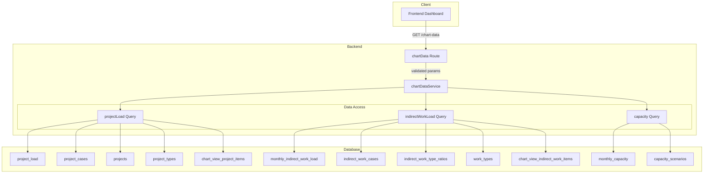
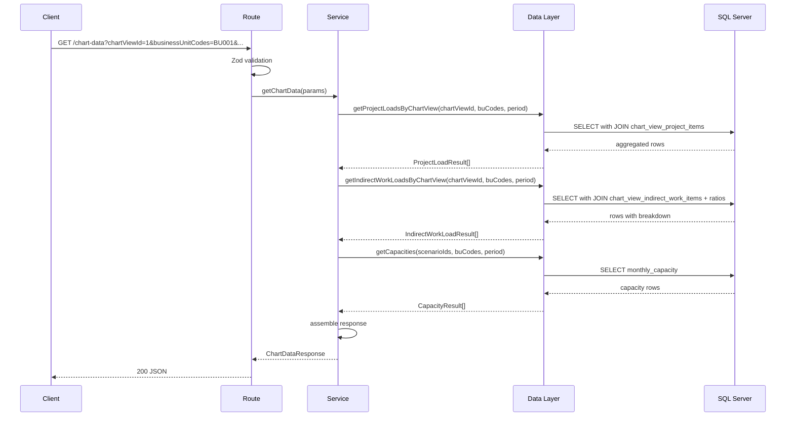
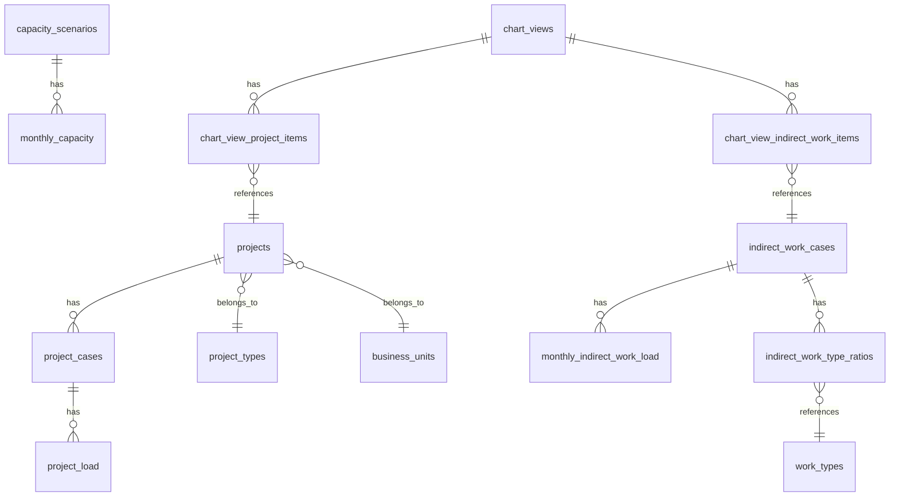

# 集約チャートデータ API

> **元spec**: aggregated-chart-data-api

## 概要

操業山積ダッシュボードのチャート描画に必要な案件工数・間接工数・キャパシティの3種データを、単一の GET エンドポイント（`GET /chart-data`）で月別集約して返却する読み取り専用 API を提供する。

- **ユーザー**: フロントエンドのダッシュボードコンポーネントが本 API を利用
- **目的**: N+1 リクエスト問題の解消、クライアント側集約処理の負荷削減、データ不整合リスクの解消
- **影響**: 既存の CRUD API に変更は加えない。新規エンドポイントの追加のみ

## 要件

### 集約チャートデータの一括取得
- `GET /chart-data` に必須パラメータ（`businessUnitCodes`, `startYearMonth`, `endYearMonth`）を指定して、`projectLoads`・`indirectWorkLoads`・`capacities` の3セクションを含むレスポンスを返却
- メタ情報（`period`, `businessUnitCodes`）を含む
- 読み取り専用、ソフトデリートされたレコードは除外

### 案件工数の集約
- `projectTypeCode` 単位で集約し、月別の `manhour` 合計を返却
- `displayOrder` 昇順でソート
- `projectTypeCode` が NULL の案件も集約対象に含める

### 間接工数の取得と種類別内訳の導出
- `indirectWorkCaseId` x `businessUnitCode` 単位で返却
- 各月に `breakdown` 配列を含め、`indirect_work_type_ratios` の比率を適用して作業種類別工数内訳を動的導出
- 年度判定は日本の会計年度基準（4月〜翌3月）
- `breakdownCoverage`（比率合計値）を含め、比率合計が 1.0 超でもエラーとしない
- `breakdown` 内は `work_types.display_order` 昇順でソート
- 比率未登録の場合は `breakdown` を空配列、`breakdownCoverage` を 0

### キャパシティの取得
- `capacityScenarioId` 単位で月別 `capacity` を返却
- `capacityScenarioIds` 未指定時はキャパシティセクションを空配列

### チャートビューによるフィルタリング
- `chartViewId` 指定時は `chart_view_project_items` / `chart_view_indirect_work_items` の `isVisible = true` に基づいてフィルタリング

### デフォルト動作（chartViewId 未指定時）
- 各案件の `isPrimary = true` のケースを自動選択して工数を集約
- `indirectWorkCaseIds` 未指定時は `isPrimary = true` の間接作業ケースを自動選択

### バリデーション
- `businessUnitCodes` が未指定/空の場合は 400
- `startYearMonth` / `endYearMonth` は YYYYMM 形式（月: 01〜12）
- `startYearMonth` が `endYearMonth` より後の場合は 400
- 期間が60ヶ月を超える場合は 400
- 各 BU コードは 1〜20文字

## アーキテクチャ・設計

### レイヤード構成



### データ取得フロー



### 技術スタック

| レイヤー | 選択 | 役割 |
|---------|------|------|
| Backend | Hono v4 | ルーティング・ミドルウェア |
| Validation | Zod v4 + @hono/zod-validator | クエリパラメータバリデーション |
| Data | mssql | SQL Server 接続・クエリ実行 |

新規ライブラリの追加は不要。

### 主要コンポーネント

| コンポーネント | レイヤー | 責務 |
|--------------|---------|------|
| chartDataRoute | Routes | HTTP リクエスト受付・バリデーション・レスポンス返却 |
| chartDataService | Services | 3種データの取得統合・条件分岐・レスポンス構築 |
| chartDataData | Data | SQL 実行・集約クエリ（transform 層不要、サービス層でレスポンス構造を構築） |
| chartDataTypes | Types | Zod スキーマ・TypeScript 型定義 |

## API コントラクト

| Method | Endpoint | Request | Response | Errors |
|--------|----------|---------|----------|--------|
| GET | /chart-data | ChartDataQuery (query params) | ChartDataResponse | 400 (validation), 500 (server) |

### リクエストスキーマ

```typescript
interface ChartDataQuery {
  businessUnitCodes: string   // CSV, required
  startYearMonth: string      // YYYYMM, required
  endYearMonth: string        // YYYYMM, required
  chartViewId?: number
  capacityScenarioIds?: string // CSV
  indirectWorkCaseIds?: string // CSV
}
```

### レスポンススキーマ

```typescript
interface ChartDataResponse {
  data: {
    projectLoads: ProjectLoadAggregation[]
    indirectWorkLoads: IndirectWorkLoadAggregation[]
    capacities: CapacityAggregation[]
    period: {
      startYearMonth: string
      endYearMonth: string
    }
    businessUnitCodes: string[]
  }
}

interface ProjectLoadAggregation {
  projectTypeCode: string | null
  projectTypeName: string | null
  monthly: Array<{
    yearMonth: string
    manhour: number
  }>
}

interface IndirectWorkLoadAggregation {
  indirectWorkCaseId: number
  caseName: string
  businessUnitCode: string
  monthly: Array<{
    yearMonth: string
    manhour: number
    source: 'calculated' | 'manual'
    breakdown: IndirectWorkTypeBreakdown[]
    breakdownCoverage: number
  }>
}

interface IndirectWorkTypeBreakdown {
  workTypeCode: string
  workTypeName: string
  manhour: number
}

interface CapacityAggregation {
  capacityScenarioId: number
  scenarioName: string
  monthly: Array<{
    yearMonth: string
    capacity: number
  }>
}
```

### Zod バリデーションスキーマ

```typescript
const csvToNumberArray = z.string().transform((val) =>
  val.split(',').map((s) => Number(s.trim()))
)

const csvToStringArray = z.string().transform((val) =>
  val.split(',').map((s) => s.trim()).filter((s) => s.length > 0)
)

const yearMonthSchema = z.string()
  .regex(/^\d{6}$/, 'YYYYMM形式で指定してください')
  .refine((val) => {
    const month = parseInt(val.slice(4, 6), 10)
    return month >= 1 && month <= 12
  }, '月は01〜12の範囲で指定してください')

const chartDataQuerySchema = z.object({
  businessUnitCodes: csvToStringArray
    .refine((arr) => arr.length > 0, '1件以上指定してください')
    .refine((arr) => arr.every((c) => c.length >= 1 && c.length <= 20),
      '各コードは1〜20文字で指定してください'),
  startYearMonth: yearMonthSchema,
  endYearMonth: yearMonthSchema,
  chartViewId: z.coerce.number().int().positive().optional(),
  capacityScenarioIds: csvToNumberArray.optional(),
  indirectWorkCaseIds: csvToNumberArray.optional(),
}).refine((data) => data.startYearMonth <= data.endYearMonth,
  'startYearMonthはendYearMonth以前を指定してください'
).refine((data) => {
  const startYear = parseInt(data.startYearMonth.slice(0, 4), 10)
  const startMonth = parseInt(data.startYearMonth.slice(4, 6), 10)
  const endYear = parseInt(data.endYearMonth.slice(0, 4), 10)
  const endMonth = parseInt(data.endYearMonth.slice(4, 6), 10)
  const months = (endYear - startYear) * 12 + (endMonth - startMonth) + 1
  return months <= 60
}, '期間は60ヶ月以内で指定してください')
```

## データモデル

本 API は既存テーブルに対する読み取り専用集約であり、新規テーブルの作成やスキーマ変更は行わない。



### 集約に関与するテーブル

| テーブル | 役割 | 結合キー |
|----------|------|----------|
| project_load | 案件工数ファクト | project_case_id, year_month |
| project_cases | 案件ケース（isPrimary フィルタ） | project_case_id → project_id |
| projects | 案件マスタ（BU フィルタ） | project_id, business_unit_code |
| project_types | 案件タイプ（集約キー） | project_type_code |
| monthly_indirect_work_load | 間接工数ファクト | indirect_work_case_id, business_unit_code, year_month |
| indirect_work_cases | 間接作業ケース（caseName） | indirect_work_case_id |
| indirect_work_type_ratios | 種類別比率 | indirect_work_case_id, work_type_code, fiscal_year |
| work_types | 作業種類マスタ（名称・表示順） | work_type_code |
| monthly_capacity | キャパシティファクト | capacity_scenario_id, business_unit_code, year_month |
| capacity_scenarios | シナリオマスタ（名称） | capacity_scenario_id |
| chart_view_project_items | ビュー別案件設定 | chart_view_id → project_id |
| chart_view_indirect_work_items | ビュー別間接作業設定 | chart_view_id → indirect_work_case_id |

### 主要 SQL パターン

案件工数集約（chartViewId 未指定時）:
```sql
SELECT
  pt.project_type_code AS projectTypeCode,
  pt.name AS projectTypeName,
  pt.display_order AS displayOrder,
  pl.year_month AS yearMonth,
  SUM(pl.manhour) AS manhour
FROM project_load pl
JOIN project_cases pc ON pl.project_case_id = pc.project_case_id
JOIN projects p ON pc.project_id = p.project_id
LEFT JOIN project_types pt ON p.project_type_code = pt.project_type_code
WHERE p.business_unit_code IN (...)
  AND pl.year_month BETWEEN @startYearMonth AND @endYearMonth
  AND pc.is_primary = 1
  AND p.deleted_at IS NULL
  AND pc.deleted_at IS NULL
GROUP BY pt.project_type_code, pt.name, pt.display_order, pl.year_month
ORDER BY pt.display_order, pl.year_month
```

間接工数 + 種類別内訳（chartViewId 未指定時）:
```sql
SELECT
  miwl.indirect_work_case_id AS indirectWorkCaseId,
  iwc.case_name AS caseName,
  miwl.business_unit_code AS businessUnitCode,
  miwl.year_month AS yearMonth,
  miwl.manhour,
  miwl.source,
  iwtr.work_type_code AS workTypeCode,
  wt.name AS workTypeName,
  wt.display_order AS workTypeDisplayOrder,
  iwtr.ratio,
  CAST(miwl.manhour * iwtr.ratio AS DECIMAL(10,2)) AS typeManhour
FROM monthly_indirect_work_load miwl
JOIN indirect_work_cases iwc ON miwl.indirect_work_case_id = iwc.indirect_work_case_id
LEFT JOIN indirect_work_type_ratios iwtr
  ON miwl.indirect_work_case_id = iwtr.indirect_work_case_id
  AND iwtr.fiscal_year = CASE
    WHEN CAST(RIGHT(miwl.year_month, 2) AS INT) >= 4
    THEN CAST(LEFT(miwl.year_month, 4) AS INT)
    ELSE CAST(LEFT(miwl.year_month, 4) AS INT) - 1
  END
LEFT JOIN work_types wt ON iwtr.work_type_code = wt.work_type_code
  AND wt.deleted_at IS NULL
WHERE miwl.indirect_work_case_id IN (...)
  AND miwl.business_unit_code IN (...)
  AND miwl.year_month BETWEEN @startYearMonth AND @endYearMonth
  AND iwc.deleted_at IS NULL
ORDER BY miwl.indirect_work_case_id, miwl.business_unit_code,
         miwl.year_month, wt.display_order
```

キャパシティ取得:
```sql
SELECT
  mc.capacity_scenario_id AS capacityScenarioId,
  cs.scenario_name AS scenarioName,
  mc.business_unit_code AS businessUnitCode,
  mc.year_month AS yearMonth,
  mc.capacity
FROM monthly_capacity mc
JOIN capacity_scenarios cs ON mc.capacity_scenario_id = cs.capacity_scenario_id
WHERE mc.capacity_scenario_id IN (...)
  AND mc.business_unit_code IN (...)
  AND mc.year_month BETWEEN @startYearMonth AND @endYearMonth
  AND cs.deleted_at IS NULL
ORDER BY mc.capacity_scenario_id, mc.year_month
```

## エラーハンドリング

| カテゴリ | ステータス | 発生条件 |
|---------|----------|---------|
| バリデーションエラー | 400 | businessUnitCodes 未指定/空、YYYYMM 不正形式、期間逆転、60ヶ月超過 |
| 内部エラー | 500 | DB 接続エラー、予期しない SQL 実行エラー |

既存の `errorHelper.ts` と Hono の `onError` グローバルハンドラを活用。本 API 固有のエラー処理はバリデーション層のみ。

## ファイル構成

```
apps/backend/src/
├── types/
│   └── chartData.ts
├── data/
│   └── chartDataData.ts
├── services/
│   └── chartDataService.ts
├── routes/
│   └── chartData.ts
└── __tests__/
    ├── services/chartDataService.test.ts
    └── routes/chartData.test.ts
```

統合ポイント: `apps/backend/src/index.ts` に `app.route('/chart-data', chartData)` でマウント。Transform 層は不要（サービス層でレスポンス構造を構築）。

### パフォーマンス目標
- 500案件 x 36ヶ月の集約で2秒以内のレスポンス
- 既存のユニークインデックスを活用した GROUP BY 集約
- 将来の最適化として3クエリの Promise.all 並列化を検討
