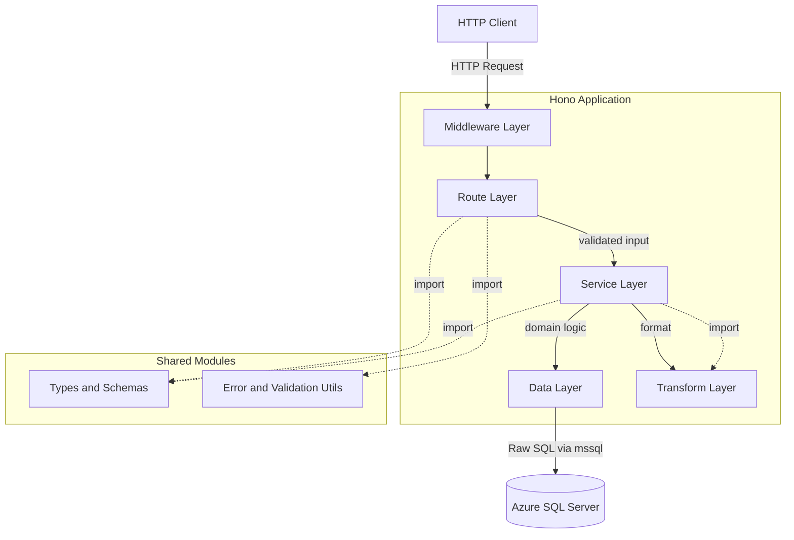
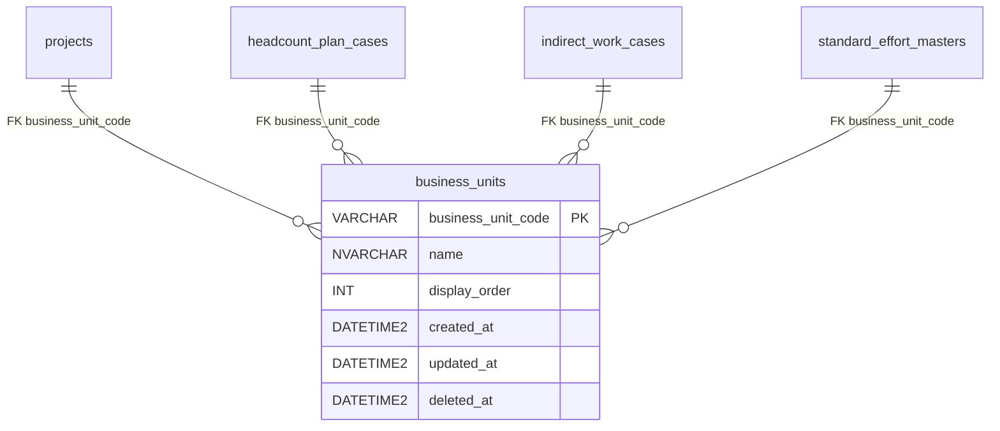

# ビジネスユニット CRUD API

> **元spec**: business-units-crud

## 概要

`business_units` マスタテーブルに対する CRUD API を提供し、ビジネスユニット（組織単位）の管理を可能にする。

- **ユーザー**: フロントエンドアプリケーションおよび将来的な外部システム連携
- **操作**: 一覧取得・単一取得・作成・更新・論理削除・復元
- **影響**: リポジトリ初の API 実装であり、DB 接続基盤・エラーハンドリング基盤・バリデーション基盤を含む。他リソース CRUD のテンプレートとなる

## 要件

### 一覧取得
- `GET /business-units` で論理削除されていないビジネスユニット一覧を `display_order` 昇順で返却
- `page[number]` / `page[size]` によるページネーション対応（`meta.pagination` 含む）
- `filter[includeDisabled]=true` で論理削除済みも含む一覧を取得可能
- クエリバリデーションエラー時は RFC 9457 形式で 422 を返却

### 単一取得
- `GET /business-units/:businessUnitCode` で指定コードのビジネスユニットを返却
- 不存在または論理削除済みの場合は 404 を返却

### 新規作成
- `POST /business-units` でビジネスユニットを作成し、201 + `Location` ヘッダを返却
- リクエストボディ: `businessUnitCode`（必須, 最大20文字）、`name`（必須, 最大100文字）、`displayOrder`（任意, 整数, デフォルト0）
- 同一コード既存時（論理削除済み含む）は 409 を返却

### 更新
- `PUT /business-units/:businessUnitCode` でビジネスユニットを更新し、200 を返却
- リクエストボディ: `name`（必須, 最大100文字）、`displayOrder`（任意, 整数）
- `updated_at` を自動更新

### 論理削除
- `DELETE /business-units/:businessUnitCode` で `deleted_at` に現在日時を設定し、204 を返却
- 他テーブル（projects, headcount_plan_cases, indirect_work_cases, standard_effort_masters）から参照中の場合は 409 を返却

### 復元
- `POST /business-units/:businessUnitCode/actions/restore` で `deleted_at` を NULL に設定し、200 を返却
- 未削除の場合は 409、不存在の場合は 404 を返却

### バリデーション
- `businessUnitCode`: 1〜20文字、`/^[a-zA-Z0-9_-]+$/`
- `name`: 1〜100文字
- `displayOrder`: 0 以上の整数
- 複数エラーは `errors` 配列にまとめて返却

## アーキテクチャ・設計

### レイヤードアーキテクチャ



### 技術スタック

| レイヤー | 選択 | 役割 |
|---------|------|------|
| Backend | Hono + @hono/node-server | API ルーティング・ミドルウェア |
| Validation | Zod + @hono/zod-validator | リクエストバリデーション（RFC 9457 エラー変換フック付き） |
| DB Client | mssql (node-mssql) | SQL Server 接続 + コネクションプール + 生 SQL 実行 |
| Data / Storage | Azure SQL Server | 構築済み business_units テーブル |

### 主要コンポーネント

| コンポーネント | レイヤー | 責務 |
|--------------|---------|------|
| businessUnits route | Route | CRUD エンドポイント定義、バリデーション、レスポンス返却 |
| businessUnitService | Service | 存在チェック、重複チェック、参照整合性チェック、復元状態チェック |
| businessUnitData | Data | 生 SQL による DB クエリ実行 |
| businessUnitTransform | Transform | DB行（snake_case）→ API レスポンス（camelCase）変換 |
| businessUnit types | Types | Zod スキーマ・TypeScript 型定義 |
| validate util | Utils | Zod エラーを RFC 9457 形式に変換するカスタムフック |
| errorHelper util | Utils | ステータスコード → RFC 9457 problem type / title マッピング |
| db client | Database | mssql コネクションプール管理 |

## API コントラクト

| Method | Endpoint | Request | Response | Status | Errors |
|--------|----------|---------|----------|--------|--------|
| GET | /business-units | query: businessUnitListQuerySchema | `{ data: BusinessUnit[], meta: { pagination } }` | 200 | 422 |
| GET | /business-units/:businessUnitCode | param: businessUnitCode | `{ data: BusinessUnit }` | 200 | 404 |
| POST | /business-units | json: createBusinessUnitSchema | `{ data: BusinessUnit }` + Location header | 201 | 409, 422 |
| PUT | /business-units/:businessUnitCode | json: updateBusinessUnitSchema | `{ data: BusinessUnit }` | 200 | 404, 422 |
| DELETE | /business-units/:businessUnitCode | - | (empty body) | 204 | 404, 409 |
| POST | /business-units/:businessUnitCode/actions/restore | - | `{ data: BusinessUnit }` | 200 | 404, 409 |

### 型定義

```typescript
// 作成リクエスト
{
  businessUnitCode: string  // 1-20文字, /^[a-zA-Z0-9_-]+$/
  name: string              // 1-100文字
  displayOrder?: number     // 0以上の整数, default: 0
}

// 更新リクエスト
{
  name: string              // 1-100文字
  displayOrder?: number     // 0以上の整数
}

// レスポンスリソース
{
  businessUnitCode: string
  name: string
  displayOrder: number
  createdAt: string         // ISO 8601
  updatedAt: string         // ISO 8601
}

// 一覧レスポンス
{
  data: BusinessUnit[]
  meta: {
    pagination: {
      currentPage: number
      pageSize: number
      totalItems: number
      totalPages: number
    }
  }
}

// エラーレスポンス（RFC 9457）
{
  type: string      // "https://example.com/problems/{problem-type}"
  status: number
  title: string
  detail: string
  instance: string  // リクエストパス
  timestamp: string // ISO 8601
  errors?: Array<{  // バリデーションエラー時のみ
    pointer: string
    keyword: string
    message: string
    params?: Record<string, unknown>
  }>
}
```

## データモデル



| カラム名 | データ型 | NULL | デフォルト | 説明 |
|---------|---------|------|-----------|------|
| business_unit_code | VARCHAR(20) | NO | - | 主キー |
| name | NVARCHAR(100) | NO | - | ビジネスユニット名 |
| display_order | INT | NO | 0 | 表示順序 |
| created_at | DATETIME2 | NO | GETDATE() | 作成日時 |
| updated_at | DATETIME2 | NO | GETDATE() | 更新日時 |
| deleted_at | DATETIME2 | YES | NULL | 論理削除日時 |

**ビジネスルール**:
- `business_unit_code` は自然キー（不変）、作成後の変更不可
- 論理削除は `deleted_at` に日時を設定（物理削除は行わない）
- 論理削除時は FK 依存テーブルにアクティブレコードが存在しないことを確認
- 復元は `deleted_at` を NULL に戻す操作

## エラーハンドリング

| カテゴリ | ステータス | problem-type | 発生条件 |
|---------|----------|-------------|---------|
| バリデーションエラー | 422 | validation-error | リクエストパラメータ不正 |
| リソース未検出 | 404 | resource-not-found | 指定コードの BU が不存在 or 論理削除済み |
| 競合 | 409 | conflict | 重複コード / FK 参照中の削除 / 未削除の復元 |
| 内部エラー | 500 | internal-error | 予期しないサーバーエラー |

**エラーフロー**:
- validate util → 422（バリデーション層で即時返却）
- businessUnitService → `HTTPException(404 | 409)` を throw
- グローバルエラーハンドラ（`app.onError`）→ RFC 9457 形式に統一変換

## ファイル構成

```
apps/backend/
├── src/
│   ├── index.ts
│   ├── database/
│   │   └── client.ts
│   ├── types/
│   │   ├── businessUnit.ts
│   │   ├── pagination.ts
│   │   └── problemDetail.ts
│   ├── data/
│   │   └── businessUnitData.ts
│   ├── transform/
│   │   └── businessUnitTransform.ts
│   ├── services/
│   │   └── businessUnitService.ts
│   ├── routes/
│   │   └── businessUnits.ts
│   └── utils/
│       ├── errorHelper.ts
│       └── validate.ts
└── src/__tests__/
    └── routes/
        └── businessUnits.test.ts
```
