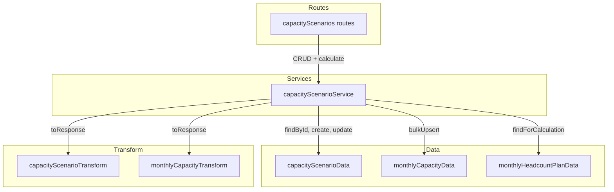
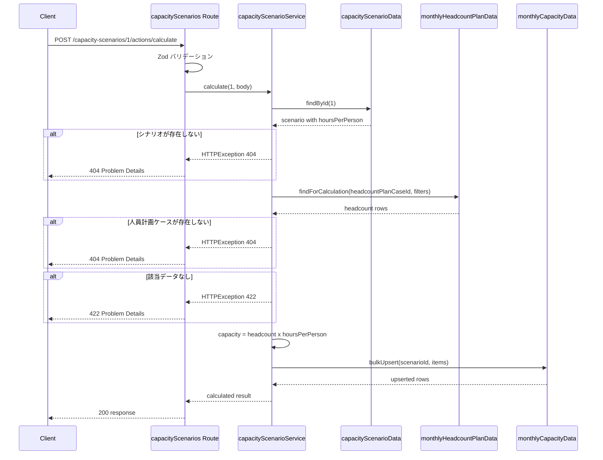
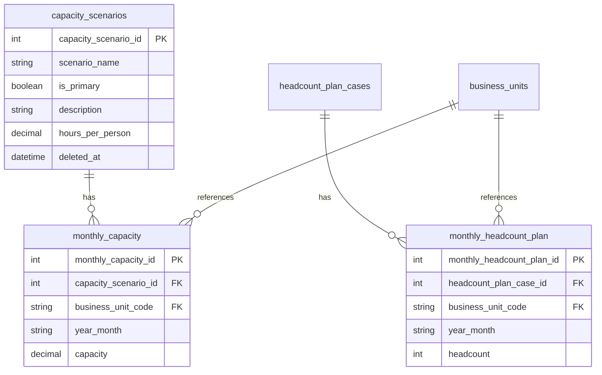

# キャパシティシナリオ パラメータ拡張・自動計算

> **元spec**: capacity-scenario-params

## 概要

キャパシティシナリオに「1人当たり月間労働時間（`hoursPerPerson`）」パラメータを追加し、キャパシティの計算根拠を明確化する。さらに、人員計画データから `monthly_capacity` を自動計算するエンドポイントを提供する。

- **ユーザー**: 事業部リーダー・プロジェクトマネージャーが、シナリオの前提条件管理と what-if 分析に利用
- **影響範囲**: 既存の `capacity_scenarios` エンティティにフィールド追加、CRUD API 拡張、新規アクションエンドポイント追加。既存の `monthly_capacity` 手動入力は影響なし
- **背景**: 現在の `monthly_capacity` テーブルには計算済みのキャパシティ値が直接格納され、計算根拠（人員数・労働時間）が追跡できない

## 要件

### hoursPerPerson パラメータ追加
- `capacity_scenarios` に `hoursPerPerson`（1人当たり月間労働時間）を追加
- デフォルト値: `160.00`
- バリデーション: 0 超 744 以下
- 精度: DECIMAL(10,2)

### 既存 CRUD API の拡張
- GET 一覧/詳細のレスポンスに `hoursPerPerson` を含める
- POST で `hoursPerPerson` 指定可能（省略時はデフォルト値 160.00 を適用）
- PUT で `hoursPerPerson` 更新可能（省略時は既存値を維持）
- `hoursPerPerson` を含まない既存クライアントとの後方互換性を維持

### キャパシティ自動計算
- `POST /capacity-scenarios/:capacityScenarioId/actions/calculate` で自動計算を実行
- 計算式: `capacity = headcount x hoursPerPerson`
- フィルタリング: `businessUnitCodes`（任意、省略時は全BU）、`yearMonthFrom`/`yearMonthTo`（任意、省略時は人員計画データの最小〜最大年月）
- 計算結果を `monthly_capacity` に MERGE（upsert）で格納
- レスポンスに生成/更新件数、使用した `hoursPerPerson`、各アイテムの詳細を含む

### 自動計算エラーハンドリング
- シナリオ不存在 → 404
- 人員計画ケース不存在 → 404
- 指定条件に人員計画データなし → 422

### 手動入力との共存
- 既存の `monthly_capacity` 手動入力を継続サポート
- 自動計算と手動入力が競合する場合は後勝ち
- 自動計算は明示的操作（`POST /actions/calculate`）としてのみ実行（シナリオ更新時の自動再計算はしない）

### 既存データのマイグレーション
- 既存「標準シナリオ」→ `hoursPerPerson = 128.00`（定時160h x 稼働率80%）
- 既存「楽観シナリオ」→ `hoursPerPerson = 162.00`（残業込み180h x 稼働率90%）
- 未設定の既存シナリオ → デフォルト値 `160.00`

## アーキテクチャ・設計

### レイヤード構成



- 既存レイヤードアーキテクチャの拡張（新規コンポーネントなし）
- `capacityScenarioService` が calculate の責務を持ち、`monthlyHeadcountPlanData` と `monthlyCapacityData` を組み合わせる

### 自動計算フロー



## APIコントラクト

### 既存エンドポイントの変更

GET レスポンスに `hoursPerPerson` フィールドが追加される。POST/PUT リクエストで `hoursPerPerson` を指定可能。

### 新規エンドポイント

| Method | Endpoint | Request | Response | Errors |
|--------|----------|---------|----------|--------|
| POST | /:id/actions/calculate | CalculateCapacity (json) | `{ data: CalculateCapacityResult }` 200 | 404, 422 |

### リクエスト形式

```typescript
{
  headcountPlanCaseId: number      // 必須、正の整数
  businessUnitCodes?: string[]     // 任意、対象 BU コード配列
  yearMonthFrom?: string           // 任意、YYYYMM 形式
  yearMonthTo?: string             // 任意、YYYYMM 形式
}
```

### レスポンス形式

```typescript
{
  data: {
    calculated: number             // 生成/更新件数
    hoursPerPerson: number         // 使用した労働時間
    items: Array<{
      monthlyCapacityId: number
      capacityScenarioId: number
      businessUnitCode: string
      yearMonth: string
      capacity: number
      createdAt: string
      updatedAt: string
    }>
  }
}
```

## データモデル

### ER図



**Business Rule**: `monthly_capacity.capacity = monthly_headcount_plan.headcount x capacity_scenarios.hours_per_person`（自動計算時）

### capacity_scenarios テーブル追加カラム

| カラム名 | データ型 | NULL | デフォルト | 制約 |
|---------|---------|------|-----------|------|
| hours_per_person | DECIMAL(10,2) | NO | 160.00 | > 0 AND <= 744 |

### DDL

```sql
ALTER TABLE capacity_scenarios
  ADD hours_per_person DECIMAL(10, 2) NOT NULL
    CONSTRAINT DF_capacity_scenarios_hours_per_person DEFAULT 160.00;

ALTER TABLE capacity_scenarios
  ADD CONSTRAINT CK_capacity_scenarios_hours_per_person
    CHECK (hours_per_person > 0 AND hours_per_person <= 744);
```

### 型定義

```typescript
// Zod バリデーション
const hoursPerPersonField = z.number()
  .gt(0, { message: 'hoursPerPerson must be greater than 0' })
  .lte(744, { message: 'hoursPerPerson must be 744 or less' })

const calculateCapacitySchema = z.object({
  headcountPlanCaseId: z.number().int().positive(),
  businessUnitCodes: z.array(z.string().min(1).max(20)).optional(),
  yearMonthFrom: z.string().regex(/^\d{6}$/).optional(),
  yearMonthTo: z.string().regex(/^\d{6}$/).optional(),
})

type CalculateCapacity = z.infer<typeof calculateCapacitySchema>

// 拡張された行型
interface CapacityScenarioRow {
  // ...既存フィールド
  hours_per_person: number
}

// 拡張されたレスポンス型
interface CapacityScenario {
  // ...既存フィールド
  hoursPerPerson: number
}

// 計算結果レスポンス型
interface CalculateCapacityResult {
  calculated: number
  hoursPerPerson: number
  items: MonthlyCapacity[]
}
```

## エラーハンドリング

| Category | Status | Trigger | Detail |
|----------|--------|---------|--------|
| バリデーション | 422 | hoursPerPerson が範囲外 | Zod バリデーションミドルウェアが返却 |
| バリデーション | 422 | calculateCapacitySchema 不適合 | 同上 |
| Not Found | 404 | シナリオ不在 | `Capacity scenario with ID '{id}' not found` |
| Not Found | 404 | 人員計画ケース不在 | `Headcount plan case with ID '{id}' not found` |
| ビジネスロジック | 422 | 指定条件に人員計画データなし | `No headcount plan data found for the specified conditions` |

## ファイル構成

既存ファイルの変更のみ。新規ファイルなし。

| ファイル | レイヤー | 変更内容 |
|---------|---------|---------|
| `src/types/capacityScenario.ts` | Types | hoursPerPerson スキーマ・型追加、calculateCapacitySchema 新規定義 |
| `src/data/capacityScenarioData.ts` | Data | SELECT/INSERT/UPDATE に hours_per_person 追加 |
| `src/data/monthlyHeadcountPlanData.ts` | Data | findForCalculation メソッド追加 |
| `src/transform/capacityScenarioTransform.ts` | Transform | hoursPerPerson マッピング追加 |
| `src/services/capacityScenarioService.ts` | Service | calculate メソッド追加 |
| `src/routes/capacityScenarios.ts` | Routes | POST /:id/actions/calculate エンドポイント追加 |

### マイグレーション SQL

```sql
-- 1. カラム追加
ALTER TABLE capacity_scenarios
  ADD hours_per_person DECIMAL(10, 2) NOT NULL
    CONSTRAINT DF_capacity_scenarios_hours_per_person DEFAULT 160.00;

ALTER TABLE capacity_scenarios
  ADD CONSTRAINT CK_capacity_scenarios_hours_per_person
    CHECK (hours_per_person > 0 AND hours_per_person <= 744);

-- 2. 既存シードデータの更新
UPDATE capacity_scenarios
SET hours_per_person = 128.00
WHERE scenario_name = N'標準シナリオ';

UPDATE capacity_scenarios
SET hours_per_person = 162.00
WHERE scenario_name = N'楽観シナリオ';
```
