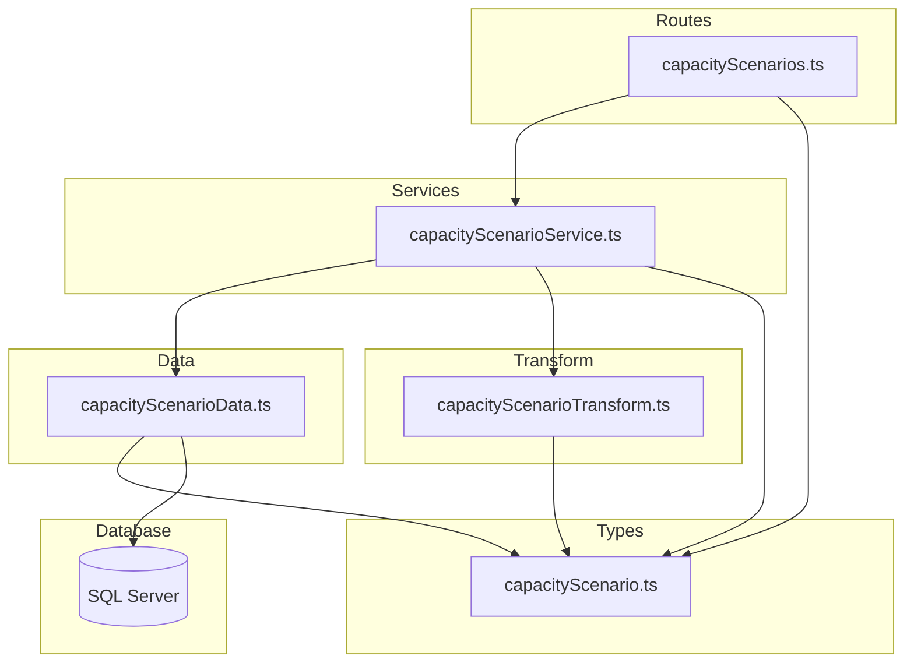
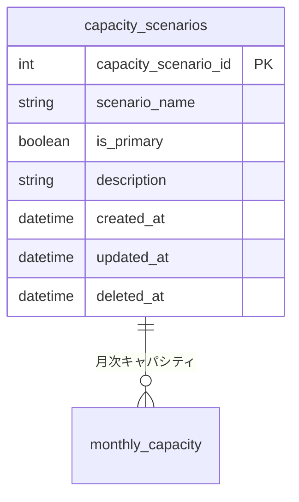

# キャパシティシナリオ CRUD API

> **元spec**: capacity-scenarios-crud-api

## 概要

キャパシティシナリオ（capacity_scenarios）の CRUD API を提供し、事業部リーダーがキャパシティ計画シナリオ（楽観/標準/悲観等）の登録・参照・更新・削除を行えるようにする。

- **ユーザー**: 事業部リーダー、フロントエンド開発者
- **影響範囲**: 外部キーを持たないシンプルなエンティティ。既存パターンの簡略版
- **ルーティング**: `/capacity-scenarios` にフラットマウント

## 要件

### 一覧取得
- `GET /capacity-scenarios` でページネーション付き一覧を返却（デフォルト: page=1, pageSize=20）
- ソフトデリート済みはデフォルト除外、`filter[includeDisabled]=true` で含める
- `meta.pagination` を含む

### 単一取得
- `GET /capacity-scenarios/:id` で詳細取得
- 不存在 / ソフトデリート済み → 404

### 新規作成
- `POST /capacity-scenarios` → 201 Created + Location ヘッダ
- バリデーション: scenarioName（必須・1〜100文字）、isPrimary（任意・デフォルト false）、description（任意・最大500文字）

### 更新
- `PUT /capacity-scenarios/:id` → 200 OK
- scenarioName（任意）、isPrimary（任意）、description（任意・null許可）

### 論理削除
- `DELETE /capacity-scenarios/:id` → 204 No Content
- monthly_capacity から参照されている場合 → 409 Conflict

### 復元
- `POST /capacity-scenarios/:id/actions/restore` → 200 OK
- 不存在 / 未削除 → 404

### 共通仕様
- RFC 9457 Problem Details 形式
- camelCase レスポンス、ISO 8601 日時

## アーキテクチャ・設計

### レイヤード構成



- 外部キーがないため他エンティティの Data 層への依存なし
- FK存在チェック不要、LEFT JOIN 不要（単一テーブル操作）

### 技術スタック

| Layer | Choice | Role |
|-------|--------|------|
| Backend | Hono v4 | ルーティング・ミドルウェア |
| Validation | Zod + @hono/zod-validator | リクエストバリデーション |
| Data | mssql | SQL Server クエリ実行（JOINなし） |
| Test | Vitest | ユニットテスト |

## APIコントラクト

| Method | Endpoint | Request | Response | Status | Errors |
|--------|----------|---------|----------|--------|--------|
| GET | / | CapacityScenarioListQuery (query) | `{ data: CapacityScenario[], meta: { pagination } }` | 200 | 422 |
| GET | /:id | id: number (path) | `{ data: CapacityScenario }` | 200 | 404 |
| POST | / | CreateCapacityScenario (json) | `{ data: CapacityScenario }` + Location header | 201 | 422 |
| PUT | /:id | id + UpdateCapacityScenario (json) | `{ data: CapacityScenario }` | 200 | 404, 422 |
| DELETE | /:id | id: number (path) | (no body) | 204 | 404, 409 |
| POST | /:id/actions/restore | id: number (path) | `{ data: CapacityScenario }` | 200 | 404 |

**マウント**: `app.route('/capacity-scenarios', capacityScenarios)`

## データモデル

### ER図



### capacity_scenarios テーブル

| カラム名 | データ型 | NULL | デフォルト | 説明 |
|---------|---------|------|-----------|------|
| capacity_scenario_id | INT | NO | IDENTITY(1,1) | 主キー |
| scenario_name | NVARCHAR(100) | NO | - | シナリオ名 |
| is_primary | BIT | NO | 0 | プライマリシナリオフラグ |
| description | NVARCHAR(500) | YES | NULL | 説明 |
| created_at | DATETIME2 | NO | GETDATE() | 作成日時 |
| updated_at | DATETIME2 | NO | GETDATE() | 更新日時 |
| deleted_at | DATETIME2 | YES | NULL | 削除日時 |

### ビジネスルール
- is_primary はデフォルト false
- 削除前に monthly_capacity への参照を確認

### 型定義

```typescript
// DB行型（snake_case）
type CapacityScenarioRow = {
  capacity_scenario_id: number
  scenario_name: string
  is_primary: boolean
  description: string | null
  created_at: Date
  updated_at: Date
  deleted_at: Date | null
}

// APIレスポンス型（camelCase）
type CapacityScenario = {
  capacityScenarioId: number
  scenarioName: string
  isPrimary: boolean
  description: string | null
  createdAt: string   // ISO 8601
  updatedAt: string   // ISO 8601
}
```

### レスポンス例（単一取得）

```json
{
  "data": {
    "capacityScenarioId": 1,
    "scenarioName": "標準シナリオ",
    "isPrimary": true,
    "description": "標準的なキャパシティ計画",
    "createdAt": "2026-01-31T00:00:00.000Z",
    "updatedAt": "2026-01-31T00:00:00.000Z"
  }
}
```

## エラーハンドリング

| Status | Trigger | Detail |
|--------|---------|--------|
| 404 | ID不存在、論理削除済み | `Capacity scenario with ID '{id}' not found` |
| 409 | 参照整合性違反（削除時） | `Capacity scenario with ID '{id}' is referenced by other resources and cannot be deleted` |
| 409 | 復元対象が未削除 | `Capacity scenario with ID '{id}' is not soft-deleted` |
| 422 | Zodバリデーション失敗 | errors 配列にフィールド別詳細 |

## ファイル構成

| ファイル | レイヤー | 役割 |
|---------|---------|------|
| `src/types/capacityScenario.ts` | Types | Zod スキーマ・型定義 |
| `src/data/capacityScenarioData.ts` | Data | SQL クエリ実行 |
| `src/transform/capacityScenarioTransform.ts` | Transform | Row → Response 変換 |
| `src/services/capacityScenarioService.ts` | Service | ビジネスロジック |
| `src/routes/capacityScenarios.ts` | Routes | エンドポイント定義 |
| `src/__tests__/routes/capacityScenarios.test.ts` | Test | ルートテスト |
| `src/__tests__/services/capacityScenarioService.test.ts` | Test | サービステスト |
| `src/__tests__/data/capacityScenarioData.test.ts` | Test | データ層テスト |
