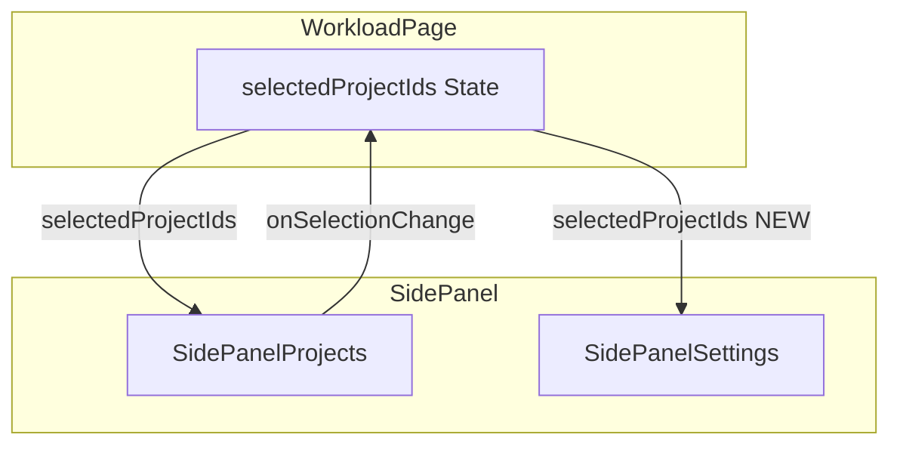

# 案件タブ・設定タブ間の案件選択同期

> **元spec**: case-tab-project-settings-sync

## 概要

案件タブ（`SidePanelProjects`）でユーザーが選択した案件が、設定タブ（`SidePanelSettings`）の「案件設定」セクションに反映されていないバグを修正する。

- **ユーザー**: 事業部リーダー・プロジェクトマネージャーが、選択中の案件に対して色設定・並び順変更を行うワークフローで利用
- **影響範囲**: `SidePanelSettings` コンポーネントの props インターフェースと内部フィルタリングロジックを変更し、`WorkloadPage` からの props 渡しを追加
- **GitHub Issue**: #27

### 問題の原因
- `WorkloadPage` → `SidePanelSettings` の props に `selectedProjectIds` が含まれていない
- `SidePanelSettings` 内の `projOrder` 初期化が全案件を対象としている

## 要件

### 案件タブの選択状態を設定タブに伝播
- 案件タブで選択した案件のみが設定タブの案件設定セクションに表示される
- 案件タブの選択変更時、設定タブの案件リストをリアルタイムに更新
- `selectedProjectIds` を `SidePanelSettings` に props として渡す

### projOrder の初期化・更新ロジック
- `projOrder` を選択中の案件IDのみで構成
- 新規選択案件は `projOrder` の末尾に追加、既存の並び順を維持
- 選択解除された案件は `projOrder` から除外
- `projColors` も選択中の案件のみを対象として同期

### 色設定・並び順の操作
- 色設定変更は `onProjectColorsChange` コールバック経由で親コンポーネントに通知
- ドラッグ&ドロップによる並び順変更が正常動作
- プロファイル適用時は選択中の案件に対してのみ設定を適用

### TypeScript 型安全性
- `SidePanelSettingsProps` に `selectedProjectIds: Set<number>` を追加
- ビルドエラーなし

## アーキテクチャ・設計

### データフロー



- Props ドリリング（既存パターンの拡張）
- `workload` feature 内で完結、feature 間依存なし
- 新規コンポーネント不要

### Props インターフェース変更

```typescript
interface SidePanelSettingsProps {
  from: string | undefined;
  months: number;
  businessUnitCodes: string[];
  selectedProjectIds: Set<number>;  // 追加
  onPeriodChange: (from: string | undefined, months: number) => void;
  onProjectColorsChange?: (colors: Record<number, string>) => void;
  onProfileApply?: (profile: {
    chartViewId: number;
    startYearMonth: string;
    endYearMonth: string;
    projectItems: BulkUpsertProjectItemInput[];
    businessUnitCodes: string[] | null;
  }) => void;
}
```

### フィルタリングロジック
- `projects` を `selectedProjectIds` でフィルタし、`filteredProjects` を `useMemo` で導出
- `useEffect` で `selectedProjectIds` と `projects` の変更を監視し、`projOrder` を差分更新
  - 追加された案件: 末尾に追加、デフォルト色を割り当て
  - 削除された案件: `projOrder` から除外
- `handleProfileApply` 内で `profile.projectItems` を `selectedProjectIds` でフィルタ

### 実装上の注意
- `useEffect` の依存配列には `selectedProjectIds` のサイズまたはシリアライズ値を使用し、Set 参照変更による不要な再実行を回避
- 初期化ロジックは `useEffect` に統合し、レンダー中の `setState` 呼び出しを排除
- `onProjectColorsChange` は `projOrder` 更新時にも呼び出し、親の色設定を同期

## エラーハンドリング

UI 内部の props 伝播とフィルタリングのみのため、新規のエラーパスは発生しない。

- **空の選択状態**: `selectedProjectIds.size === 0` → 案件設定セクションは空リスト
- **プロファイル適用時のミスマッチ**: 現在の選択に含まれない案件はフィルタにより除外

## ファイル構成

| ファイル | 変更内容 |
|---------|---------|
| `src/features/workload/components/SidePanelSettings.tsx` | props に `selectedProjectIds` 追加、フィルタリングロジック追加 |
| `src/routes/workload.tsx`（WorkloadPage） | `SidePanelSettings` に `selectedProjectIds` props を渡す |
