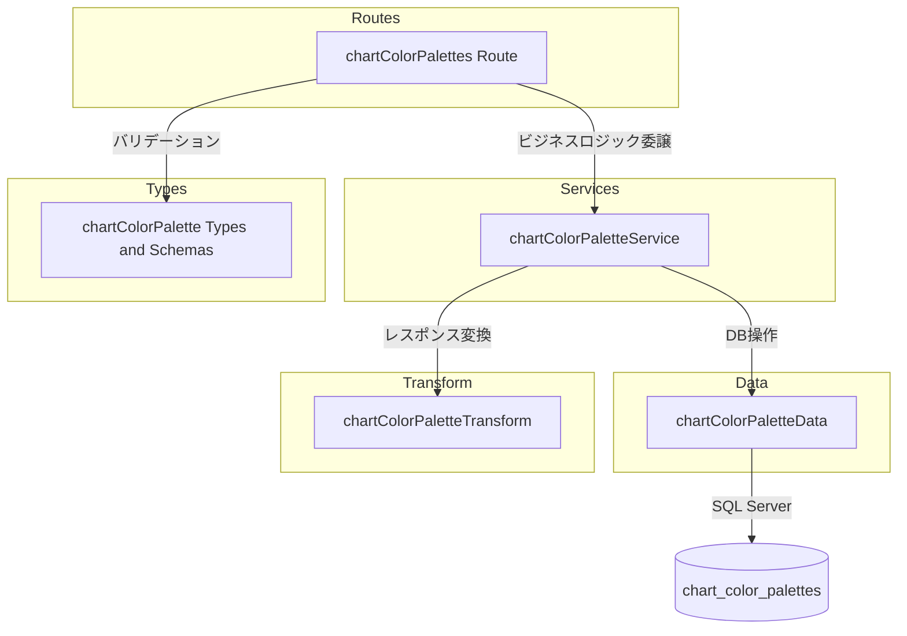

# チャートカラーパレット CRUD API

> **元spec**: chart-color-palettes-crud-api

## 概要

チャート描画で使用するカラーパレット（色の定義）を管理する CRUD API を提供する。

- **ユーザー**: フロントエンド開発者（色の選択肢の参照）、システム管理者（登録・変更・削除）
- **影響範囲**: 新規トップレベルエンドポイント `/chart-color-palettes` を追加。既存コードへの変更は `index.ts` のルート登録のみ
- **テーブル種別**: 設定テーブル（物理削除・論理削除なし）

### Goals

- `chart_color_palettes` テーブルに対する完全な CRUD 操作の提供
- 既存の設定テーブル API と一貫したパターンの維持
- `display_order` による表示順序制御

### Non-Goals

- `chart_color_settings` との連携・参照整合性チェック
- フロントエンド実装
- ページネーション（少数データのため不要）

## 要件

### 1. カラーパレット一覧取得

カラーパレットの一覧を `display_order` 昇順で返却する。0件の場合も空配列で正常レスポンスを返す。

### 2. カラーパレット個別取得

指定IDのカラーパレット詳細を返却する。存在しない場合は 404。

### 3. カラーパレット作成

新しいカラーパレットを作成し、201 Created で返却。`Location` ヘッダを含める。

- `name`（必須、1〜100文字）
- `colorCode`（必須、`#` + 6桁の16進数: `/^#[0-9A-Fa-f]{6}$/`）
- `displayOrder`（任意、整数、デフォルト0）

### 4. カラーパレット更新

指定IDのカラーパレットを更新し、200 OK で返却。

- `name`（必須、1〜100文字）、`colorCode`（必須、`#` + 6桁16進数）、`displayOrder`（任意、整数）
- 存在しない場合は 404

### 5. カラーパレット削除

指定IDのカラーパレットを**物理削除**し、204 No Content を返却。存在しない場合は 404。

### 6. APIレスポンス形式

- 成功時: `{ data: ... }` 形式
- 一覧取得時: `{ data: [...] }` 形式（ページネーション不要）
- エラー時: RFC 9457 Problem Details 形式
- フィールド名: camelCase
- 日時フィールド: ISO 8601 形式

### 7. バリデーション

- パスパラメータ `paletteId` を正の整数としてバリデーション
- `colorCode` は `#` + 6桁16進数の正規表現で検証
- バリデーションエラー時は `errors` 配列にフィールドごとの詳細を含める

## アーキテクチャ・設計

### レイヤー構成



### 技術スタック

| Layer | Choice / Version | Role |
|-------|------------------|------|
| Backend | Hono v4 | HTTP ルーティング・ミドルウェア |
| Validation | Zod | リクエストボディ・パスパラメータ検証 |
| Data | mssql | SQL Server クエリ実行 |
| Testing | Vitest | ユニットテスト |

新規依存なし。すべて既存スタック内で完結する。

## APIコントラクト

| Method | Endpoint | Request | Response | Status | Errors |
|--------|----------|---------|----------|--------|--------|
| GET | / | - | `{ data: ChartColorPalette[] }` | 200 | - |
| GET | /:paletteId | - | `{ data: ChartColorPalette }` | 200 | 404 |
| POST | / | CreateChartColorPalette (json) | `{ data: ChartColorPalette }` + Location header | 201 | 422 |
| PUT | /:paletteId | UpdateChartColorPalette (json) | `{ data: ChartColorPalette }` | 200 | 404, 422 |
| DELETE | /:paletteId | - | (no body) | 204 | 404 |

ベースパス: `/chart-color-palettes`

## データモデル

### テーブル定義

| カラム名 | データ型 | NULL | デフォルト | 説明 |
|---------|---------|------|-----------|------|
| chart_color_palette_id | INT | NO | IDENTITY(1,1) | 主キー。自動採番 |
| name | NVARCHAR(100) | NO | - | パレット名 |
| color_code | VARCHAR(7) | NO | - | カラーコード（`#RRGGBB` 形式） |
| display_order | INT | NO | 0 | 表示順序 |
| created_at | DATETIME2 | NO | GETDATE() | 作成日時 |
| updated_at | DATETIME2 | NO | GETDATE() | 更新日時 |

### 特記事項

- **物理削除**: `deleted_at` カラムなし
- **ユニーク制約なし**: 同名パレットの登録を許容

### 型定義

```typescript
// Zod スキーマ
const createChartColorPaletteSchema = z.object({
  name: z.string().min(1).max(100),
  colorCode: z.string().regex(/^#[0-9A-Fa-f]{6}$/),
  displayOrder: z.number().int().default(0),
})

const updateChartColorPaletteSchema = z.object({
  name: z.string().min(1).max(100),
  colorCode: z.string().regex(/^#[0-9A-Fa-f]{6}$/),
  displayOrder: z.number().int().optional(),
})

// DB 行型（snake_case）
type ChartColorPaletteRow = {
  chart_color_palette_id: number
  name: string
  color_code: string
  display_order: number
  created_at: Date
  updated_at: Date
}

// API レスポンス型（camelCase）
type ChartColorPalette = {
  chartColorPaletteId: number
  name: string
  colorCode: string
  displayOrder: number
  createdAt: string   // ISO 8601
  updatedAt: string   // ISO 8601
}
```

### データ層の実装メモ

- 一覧取得は `display_order ASC` でソート
- INSERT 時に `OUTPUT INSERTED.*` で作成行を返却
- UPDATE 時に `OUTPUT INSERTED.*` で更新行を返却
- SQLパラメータ型指定: name は `sql.NVarChar(100)`、color_code は `sql.VarChar(7)`、display_order は `sql.Int`

## エラーハンドリング

すべてのエラーは RFC 9457 Problem Details 形式で返却する。

| Status | Type | Trigger | Detail |
|--------|------|---------|--------|
| 404 | resource-not-found | paletteId が存在しない | `Chart color palette with ID '{id}' not found` |
| 422 | validation-error | Zod スキーマ検証失敗 | RFC 9457 errors 配列 |
| 422 | validation-error | パスパラメータが正の整数でない | `Invalid paletteId: must be a positive integer` |

## ファイル構成

```
apps/backend/src/
  routes/chartColorPalettes.ts
  services/chartColorPaletteService.ts
  data/chartColorPaletteData.ts
  transform/chartColorPaletteTransform.ts
  types/chartColorPalette.ts
  __tests__/routes/chartColorPalettes.test.ts
  __tests__/services/chartColorPaletteService.test.ts
  __tests__/types/chartColorPalette.test.ts
  __tests__/transform/chartColorPaletteTransform.test.ts
```

変更ファイル:
```
apps/backend/src/index.ts  (app.route('/chart-color-palettes', chartColorPalettes) を追加)
```
