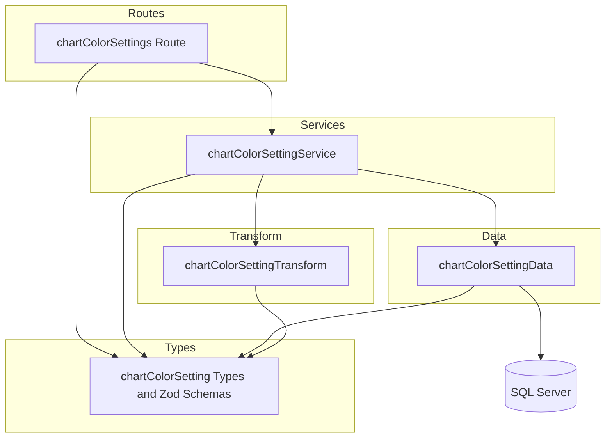

# チャート色設定 CRUD API

> **元spec**: chart-color-settings-crud-api

## 概要

チャートの各要素（案件・間接作業など）に割り当てる色を管理する CRUD API を提供する。設定テーブル `chart_color_settings` に対する標準的な CRUD 操作に加え、一括 Upsert エンドポイントを実装する。

- **ユーザー**: フロントエンドアプリケーション（チャート描画時の色設定取得・管理）
- **影響範囲**: 新規トップレベルエンドポイント `/chart-color-settings` を追加。既存機能への影響なし
- **固有の設計要素**: `target_type` + `target_id` のユニーク制約、ポリモーフィック参照パターン、MERGE文による一括Upsert

### Goals

- `chart_color_settings` テーブルに対する CRUD API（一覧・個別取得・作成・更新・削除）の実装
- `target_type` + `target_id` に基づく一括 Upsert エンドポイントの実装
- 既存のレイヤードアーキテクチャパターンとの完全な一貫性
- RFC 9457 準拠のエラーレスポンス

### Non-Goals

- フロントエンド UI の実装
- `chart_color_palettes` テーブルの API 実装
- `chart_stack_order_settings` テーブルの API 実装
- 色設定のデフォルト値自動割り当てロジック

## 要件

### 1. 一覧取得

ページネーション付きで chart_color_settings の一覧を返却する。

- デフォルト: page[number]=1, page[size]=20
- `filter[targetType]` クエリパラメータでフィルタリング可能
- `meta.pagination` に `currentPage`, `pageSize`, `totalItems`, `totalPages` を含む

### 2. 個別取得

指定IDの chart_color_setting を返却する。存在しない場合は 404。

### 3. 作成

新しいレコードを作成し、201 Created で返却。`Location` ヘッダを含める。

- `targetType`（VARCHAR(20)、必須）、`targetId`（INT、必須）、`colorCode`（VARCHAR(7)、必須、`#RRGGBB`形式）
- **同一の `targetType` + `targetId` が既に存在する場合は 409 Conflict**

### 4. 更新

指定IDのレコードを部分更新し、200 OK で返却。

- `targetType`、`targetId`、`colorCode` はすべてオプショナル
- 存在しない場合は 404
- **更新後に `targetType` + `targetId` が他レコードと重複する場合は 409 Conflict**

### 5. 削除

指定IDのレコードを**物理削除**し、204 No Content を返却。存在しない場合は 404。

### 6. 一括更新（Upsert）

`PUT /chart-color-settings/bulk` で複数の色設定を一括 Upsert する。

- 各要素の `targetType` + `targetId` の組み合わせに基づいて、存在すれば更新・存在しなければ作成
- 配列内のいずれかがバリデーションエラーの場合は全体をロールバック
- 各要素に `targetType`（必須）、`targetId`（必須）、`colorCode`（必須）を要求

### 7. バリデーション

- すべてのリクエストボディとクエリパラメータを Zod スキーマでバリデーション
- `targetType` は `project`, `indirect_work` 等の有効値を受付
- `colorCode` は `#` + 6桁16進数形式のみ受付
- バリデーションエラー時は `errors` 配列にフィールドごとの詳細を含める

## アーキテクチャ・設計

### レイヤー構成



### 技術スタック

| Layer | Choice / Version | Role |
|-------|------------------|------|
| Backend | Hono v4 | ルーティング・ミドルウェア |
| Validation | Zod + @hono/zod-validator | リクエストバリデーション |
| Data | mssql | SQL Server アクセス（MERGE 文を一括 Upsert に使用） |
| Testing | Vitest | ユニットテスト・API テスト |

## APIコントラクト

| Method | Endpoint | Request | Response | Status | Errors |
|--------|----------|---------|----------|--------|--------|
| GET | / | Query: page[number], page[size], filter[targetType] | `{ data: ChartColorSetting[], meta: { pagination } }` | 200 | 422 |
| GET | /:id | Param: id (INT) | `{ data: ChartColorSetting }` | 200 | 404 |
| POST | / | CreateChartColorSettingInput (json) | `{ data: ChartColorSetting }` + Location header | 201 | 409, 422 |
| PUT | /bulk | BulkUpsertChartColorSettingInput (json) | `{ data: ChartColorSetting[] }` | 200 | 422 |
| PUT | /:id | UpdateChartColorSettingInput (json) | `{ data: ChartColorSetting }` | 200 | 404, 409, 422 |
| DELETE | /:id | Param: id (INT) | (no body) | 204 | 404 |

ベースパス: `/chart-color-settings`

**注意**: `/bulk` ルートは `/:id` より前に定義する（Hono のルートマッチング順序）

### レスポンス例

作成リクエスト:
```json
{
  "targetType": "project",
  "targetId": 1,
  "colorCode": "#FF5733"
}
```

一覧レスポンス:
```json
{
  "data": [
    {
      "chartColorSettingId": 1,
      "targetType": "project",
      "targetId": 1,
      "colorCode": "#FF5733",
      "createdAt": "2026-01-31T00:00:00.000Z",
      "updatedAt": "2026-01-31T00:00:00.000Z"
    }
  ],
  "meta": {
    "pagination": {
      "currentPage": 1,
      "pageSize": 20,
      "totalItems": 1,
      "totalPages": 1
    }
  }
}
```

一括 Upsert リクエスト:
```json
{
  "items": [
    { "targetType": "project", "targetId": 1, "colorCode": "#FF5733" },
    { "targetType": "project", "targetId": 2, "colorCode": "#33FF57" }
  ]
}
```

## データモデル

### テーブル定義

| カラム名 | データ型 | NULL | デフォルト | 説明 |
|---------|---------|------|-----------|------|
| chart_color_setting_id | INT IDENTITY(1,1) | NO | - | 主キー |
| target_type | VARCHAR(20) | NO | - | 対象タイプ |
| target_id | INT | NO | - | 対象 ID |
| color_code | VARCHAR(7) | NO | - | カラーコード (#RRGGBB) |
| created_at | DATETIME2 | NO | GETDATE() | 作成日時 |
| updated_at | DATETIME2 | NO | GETDATE() | 更新日時 |

### インデックス

- PK: `chart_color_setting_id`
- UQ: `(target_type, target_id)` -- ユニーク制約

### 特記事項

- **物理削除**: `deleted_at` カラムなし（設定テーブル）
- **ポリモーフィック参照**: `target_type` + `target_id` で任意のエンティティを参照

### 型定義

```typescript
// Zod スキーマ
const colorCodeSchema = z.string().regex(/^#[0-9A-Fa-f]{6}$/)
const targetTypeSchema = z.enum(['project', 'indirect_work'])

// 作成スキーマ
interface CreateChartColorSettingInput {
  targetType: string    // VARCHAR(20)
  targetId: number      // INT
  colorCode: string     // VARCHAR(7), #RRGGBB
}

// 更新スキーマ（全フィールドオプショナル）
interface UpdateChartColorSettingInput {
  targetType?: string
  targetId?: number
  colorCode?: string
}

// 一括 Upsert 用スキーマ
interface BulkUpsertChartColorSettingInput {
  items: CreateChartColorSettingInput[]
}

// 一覧取得クエリスキーマ
interface ChartColorSettingListQuery extends PaginationQuery {
  'filter[targetType]'?: string
}

// DB 行型（snake_case）
interface ChartColorSettingRow {
  chart_color_setting_id: number
  target_type: string
  target_id: number
  color_code: string
  created_at: Date
  updated_at: Date
}

// API レスポンス型（camelCase）
interface ChartColorSetting {
  chartColorSettingId: number
  targetType: string
  targetId: number
  colorCode: string
  createdAt: string   // ISO 8601
  updatedAt: string   // ISO 8601
}
```

### データ層の主要メソッド

- `findAll(params)`: ページネーション + `target_type` フィルタ付き一覧取得
- `findById(id)`: 単一レコード取得
- `findByTarget(targetType, targetId)`: ユニーク制約チェック用
- `findByTargetExcluding(targetType, targetId, excludeId)`: 更新時の重複チェック用
- `create(data)`: INSERT + OUTPUT INSERTED
- `update(id, data)`: 動的 SET 句による部分更新
- `hardDelete(id)`: `DELETE FROM` による物理削除
- `bulkUpsert(items)`: MERGE 文によるトランザクション付き一括 Upsert

## エラーハンドリング

既存のグローバルエラーハンドラと RFC 9457 Problem Details 形式に従う。

| Status | Type | Trigger | Detail |
|--------|------|---------|--------|
| 404 | resource-not-found | 指定IDのレコードが存在しない | RFC 9457 Problem Details |
| 409 | conflict | `target_type` + `target_id` の重複 | RFC 9457 Problem Details |
| 422 | validation-error | Zod バリデーション失敗、不正な colorCode | RFC 9457 Problem Details + errors 配列 |
| 500 | internal-error | 予期しないエラー | グローバルエラーハンドラで処理 |

## ファイル構成

```
apps/backend/src/
  routes/chartColorSettings.ts
  services/chartColorSettingService.ts
  data/chartColorSettingData.ts
  transform/chartColorSettingTransform.ts
  types/chartColorSetting.ts
  __tests__/routes/chartColorSettings.test.ts
  __tests__/services/chartColorSettingService.test.ts
```

変更ファイル:
```
apps/backend/src/index.ts  (app.route('/chart-color-settings', chartColorSettings) を追加)
```
