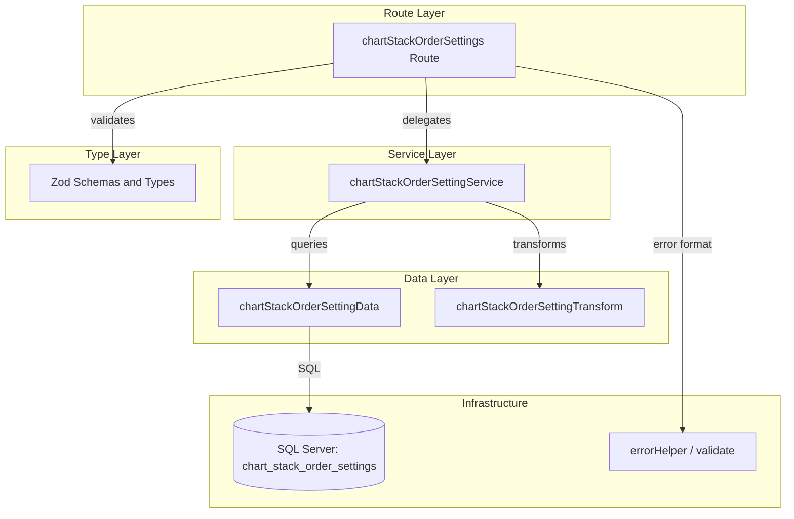

# チャート積み上げ順序設定 CRUD API

> **元spec**: chart-stack-order-settings-crud-api

## 概要

チャートの積み上げ表示順序設定（`chart_stack_order_settings`）に対するCRUD APIを提供し、フロントエンドクライアントがチャート要素の積み上げ順序を管理できるようにする。

- **ユーザー**: フロントエンドアプリケーション（チャート描画時の積み上げ順序の取得・設定・一括変更）
- **影響範囲**: 新規トップレベルAPIエンドポイント `/chart-stack-order-settings` を追加。既存コンポーネントへの変更は `index.ts` のルート登録のみ
- **固有の設計要素**: ポリモーフィック参照パターン（`target_type` + `target_id`）、MERGE文による一括upsert

### Goals

- `chart_stack_order_settings` テーブルに対する標準CRUD操作（一覧・取得・作成・更新・削除）を提供
- 一括upsertエンドポイントにより、複数設定の同時更新を効率的に処理
- 既存のレイヤードアーキテクチャパターン（routes → services → data）に準拠
- 物理削除・RFC 9457エラーハンドリング・Zodバリデーションの既存パターンを踏襲

### Non-Goals

- `target_type` / `target_id` が参照する実体の存在検証（ポリモーフィック参照のため外部キー制約なし）
- フロントエンドUIの実装
- チャート描画ロジックの実装
- 他の設定テーブル（`chart_color_settings` / `chart_color_palettes`）の実装

## 要件

### 1. 一覧取得

ページネーション付きで積み上げ順序設定の一覧を返却する。

- デフォルト: page=1, pageSize=20
- `filter[targetType]` クエリパラメータで対象タイプフィルタリング可能
- `meta.pagination` に `currentPage`, `pageSize`, `totalItems`, `totalPages` を含む
- 各設定項目に `chartStackOrderSettingId`, `targetType`, `targetId`, `stackOrder`, `createdAt`, `updatedAt` を含む

### 2. 個別取得

指定IDの設定を返却する。存在しない場合は 404。

### 3. 新規作成

新しい設定を作成し、201 Created で返却。`Location` ヘッダを含める。

- `targetType`（必須、max 20文字）、`targetId`（必須、正の整数）、`stackOrder`（必須、整数）
- **同一の `targetType` + `targetId` が既に存在する場合は 409 Conflict**

### 4. 更新

指定IDの設定を部分更新し、200 OK で返却。

- `targetType`、`targetId`、`stackOrder` はすべてオプショナル
- 存在しない場合は 404
- **更新後に `targetType` + `targetId` が他レコードと重複する場合は 409 Conflict**

### 5. 削除

指定IDの設定を**物理削除**し、204 No Content を返却。存在しない場合は 404。

### 6. 一括更新（Upsert）

`PUT /chart-stack-order-settings/bulk` で複数の設定を一括 Upsert する。

- 各アイテムの `targetType` + `targetId` に基づいて、存在すれば更新・存在しなければ作成
- 配列内で `targetType` + `targetId` の重複がある場合は 422
- 一括更新はトランザクション内で実行、失敗時は全体ロールバック

### 7. バリデーション

- `targetType` を必須の文字列フィールド、`targetId` を必須の正の整数、`stackOrder` を必須の整数としてバリデーション
- Zod スキーマによる型安全なバリデーション
- パスパラメータ `id` が正の整数でない場合は 422

### 8. エラーハンドリング

- すべてのエラーは RFC 9457 Problem Details 形式で返却
- サーバー内部エラーは 500

## アーキテクチャ・設計

### レイヤー構成



### 技術スタック

| Layer | Choice / Version | Role |
|-------|------------------|------|
| Backend | Hono v4 | ルーティング・ミドルウェア |
| Validation | Zod + @hono/zod-validator | リクエストバリデーション（既存 `validate` ユーティリティ再利用） |
| Data | SQL Server (mssql) | データ永続化（直接SQL、ORM不使用） |
| Testing | Vitest | ルートハンドラテスト（mock service パターン） |

### 設計上の特徴

- **独立した設定ドメイン**: 他エンティティへの依存なし
- **ポリモーフィック参照**: `target_type` + `target_id` で任意のエンティティ（案件・間接作業等）を参照（外部キー制約なし）
- **既存パターン踏襲**: 物理削除CRUD（indirectWorkTypeRatios 参照）、ページネーション（businessUnits 参照）、一括upsert（indirectWorkTypeRatios 参照）

## APIコントラクト

| Method | Endpoint | Request | Response | Status | Errors |
|--------|----------|---------|----------|--------|--------|
| GET | / | Query: page, pageSize, filter[targetType] | `{ data: ChartStackOrderSetting[], meta: { pagination } }` | 200 | - |
| GET | /:id | Param: id (int) | `{ data: ChartStackOrderSetting }` | 200 | 404, 422 |
| POST | / | createChartStackOrderSettingSchema (json) | `{ data: ChartStackOrderSetting }` + Location header | 201 | 409, 422 |
| PUT | /bulk | bulkUpsertChartStackOrderSettingSchema (json) | `{ data: ChartStackOrderSetting[] }` | 200 | 422 |
| PUT | /:id | updateChartStackOrderSettingSchema (json) | `{ data: ChartStackOrderSetting }` | 200 | 404, 409, 422 |
| DELETE | /:id | Param: id (int) | (empty) | 204 | 404, 422 |

ベースパス: `/chart-stack-order-settings`

**注意**: `/bulk` エンドポイントは `/:id` パターンより前に定義する（ルートマッチング順序）

### レスポンス例（一覧）

```json
{
  "data": [
    {
      "chartStackOrderSettingId": 1,
      "targetType": "project",
      "targetId": 42,
      "stackOrder": 1,
      "createdAt": "2026-01-31T00:00:00.000Z",
      "updatedAt": "2026-01-31T00:00:00.000Z"
    }
  ],
  "meta": {
    "pagination": {
      "currentPage": 1,
      "pageSize": 20,
      "totalItems": 50,
      "totalPages": 3
    }
  }
}
```

### レスポンス例（単一）

```json
{
  "data": {
    "chartStackOrderSettingId": 1,
    "targetType": "project",
    "targetId": 42,
    "stackOrder": 1,
    "createdAt": "2026-01-31T00:00:00.000Z",
    "updatedAt": "2026-01-31T00:00:00.000Z"
  }
}
```

### 一括upsertリクエスト例

```json
{
  "items": [
    { "targetType": "project", "targetId": 42, "stackOrder": 1 },
    { "targetType": "project", "targetId": 43, "stackOrder": 2 }
  ]
}
```

## データモデル

### テーブル定義

| カラム名 | データ型 | NULL | 説明 |
|---------|---------|------|------|
| chart_stack_order_setting_id | INT IDENTITY(1,1) | NO | 主キー |
| target_type | VARCHAR(20) | NO | 対象タイプ |
| target_id | INT | NO | 対象ID |
| stack_order | INT | NO | 積み上げ順序 |
| created_at | DATETIME2 | NO | 作成日時 |
| updated_at | DATETIME2 | NO | 更新日時 |

### インデックス

- `PK_chart_stack_order_settings` (chart_stack_order_setting_id) -- 主キー
- `UQ_chart_stack_order_settings_target` (target_type, target_id) -- ユニーク制約

### 特記事項

- **物理削除**: `deleted_at` カラムなし
- **ポリモーフィック参照**: 外部キー制約なし
- **ビジネスルール**: `(target_type, target_id)` は一意

### 型定義

```typescript
// 作成スキーマ
const createChartStackOrderSettingSchema = z.object({
  targetType: z.string().max(20),
  targetId: z.number().int().positive(),
  stackOrder: z.number().int(),
})

// 更新スキーマ
const updateChartStackOrderSettingSchema = z.object({
  targetType: z.string().max(20).optional(),
  targetId: z.number().int().positive().optional(),
  stackOrder: z.number().int().optional(),
})

// 一括upsertスキーマ
const bulkUpsertChartStackOrderSettingSchema = z.object({
  items: z.array(z.object({
    targetType: z.string().max(20),
    targetId: z.number().int().positive(),
    stackOrder: z.number().int(),
  })).min(1),
})

// 一覧クエリスキーマ
const listQuerySchema = z.object({
  page: z.coerce.number().default(1),
  pageSize: z.coerce.number().default(20),
  'filter[targetType]': z.string().optional(),
})

// DB行型（snake_case）
type ChartStackOrderSettingRow = {
  chart_stack_order_setting_id: number
  target_type: string
  target_id: number
  stack_order: number
  created_at: Date
  updated_at: Date
}

// APIレスポンス型（camelCase）
type ChartStackOrderSetting = {
  chartStackOrderSettingId: number
  targetType: string
  targetId: number
  stackOrder: number
  createdAt: string   // ISO 8601
  updatedAt: string   // ISO 8601
}

type PaginationMeta = {
  currentPage: number
  pageSize: number
  totalItems: number
  totalPages: number
}
```

### データ層の主要メソッド

- `findAll(params)`: ページネーション + `targetType` フィルタ付き一覧取得（動的WHERE句）
- `findById(id)`: 単一レコード取得
- `targetExists(targetType, targetId, excludeId?)`: ユニーク制約チェック用（excludeId で自身を除外可能）
- `create(data)`: INSERT + OUTPUT INSERTED
- `update(id, data)`: 動的SET句による部分更新
- `deleteById(id)`: `DELETE FROM` による物理削除
- `bulkUpsert(items)`: `sql.Transaction` + `MERGE` 文でアトミック操作。完了後に全件取得して返却

## エラーハンドリング

既存のグローバルエラーハンドリング（`app.onError`）と `errorHelper.ts` の `problemResponse` を再利用する。

| Status | Type | Trigger | Detail |
|--------|------|---------|--------|
| 404 | resource-not-found | IDが存在しない | `Chart stack order setting with ID '{id}' not found` |
| 409 | conflict | (targetType, targetId) 重複 | `Chart stack order setting with target type '{type}' and target ID '{id}' already exists` |
| 422 | validation-error | バリデーションエラー | `The request contains invalid parameters` |
| 422 | validation-error | パスパラメータ不正 | `Parameter '{name}' must be a positive integer` |
| 500 | internal-error | サーバー内部エラー | `An unexpected error occurred` |

## ファイル構成

```
apps/backend/src/
  routes/chartStackOrderSettings.ts
  services/chartStackOrderSettingService.ts
  data/chartStackOrderSettingData.ts
  transform/chartStackOrderSettingTransform.ts
  types/chartStackOrderSetting.ts
  __tests__/routes/chartStackOrderSettings.test.ts
```

変更ファイル:
```
apps/backend/src/index.ts  (app.route('/chart-stack-order-settings', chartStackOrderSettings) を追加)
```
