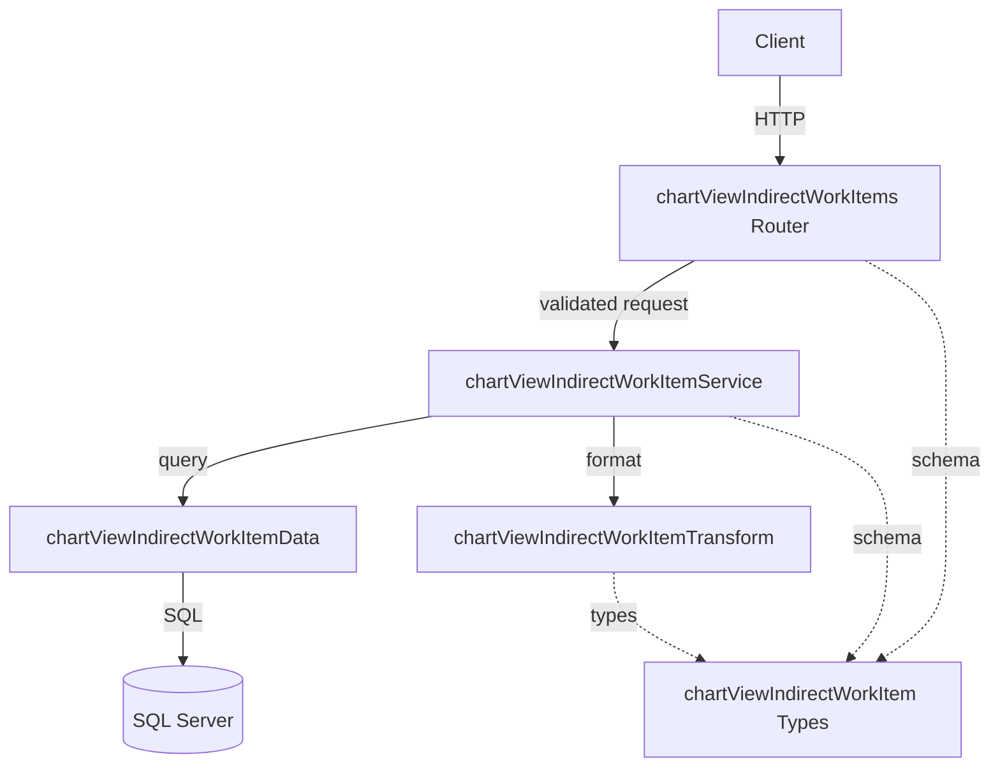

# チャートビュー間接作業項目 CRUD API

> **元spec**: chart-view-indirect-work-items-crud-api

## 概要

チャートビュー間接作業項目（chart_view_indirect_work_items）のCRUD APIを提供し、チャートビューにどの間接作業ケースを含めるかを管理する。

- **ユーザー**: 事業部リーダー、フロントエンド開発者
- **影響範囲**: 既存の chart_views API にネストされた子リソースエンドポイントを追加。既存コードへの変更は `index.ts` のルート登録のみ
- **固有の設計要素**: 物理削除、同一チャートビュー内での間接作業ケース重複チェック（409 Conflict）

### Goals

- chart_view_indirect_work_items テーブルに対する完全なCRUD操作を提供
- 既存の関連テーブルCRUDパターン（indirectWorkTypeRatios等）と一貫した設計にする
- RFC 9457 Problem Details形式のエラーハンドリング

### Non-Goals

- バルクupsert操作（現時点では不要）
- ページネーション（1チャートビューあたりの項目数は限定的）
- chart_view_project_items の実装（別spec）

## 要件

### 1. 間接作業項目一覧取得

指定チャートビューに紐づく間接作業項目の一覧を `displayOrder` 昇順で返却する。

- `indirectWorkCaseId` に対応する `caseName`（indirect_work_cases テーブルからJOINで取得）を含める
- 親チャートビューが存在しない / 論理削除済みの場合は 404

### 2. 間接作業項目単一取得

指定IDの間接作業項目を返却する。`caseName` を含める。

- 存在しない場合は 404
- `chartViewId` 不一致の場合は 404

### 3. 間接作業項目新規作成

新しい間接作業項目を作成し、201 Created で返却。`Location` ヘッダを含める。

- `indirectWorkCaseId`（必須）、`displayOrder`（任意、デフォルト 0）、`isVisible`（任意、デフォルト true）
- 親チャートビュー不存在の場合は 404
- `indirectWorkCaseId` の間接作業ケースが存在しない場合は 422
- **同一チャートビュー内に同じ `indirectWorkCaseId` の項目が既に存在する場合は 409 Conflict**

### 4. 間接作業項目更新

指定IDの間接作業項目を更新し、200 OK で返却。

- 更新可能フィールド: `displayOrder`、`isVisible`
- 存在しない場合は 404、`chartViewId` 不一致の場合は 404

### 5. 間接作業項目削除

指定IDの間接作業項目を**物理削除**し、204 No Content を返却。

- 存在しない場合は 404、`chartViewId` 不一致の場合は 404

### 6. APIレスポンス形式

- 成功時: `{ data: ... }` 形式
- 一覧取得時: `{ data: [...] }` 形式（ページネーション不要）
- エラー時: RFC 9457 Problem Details 形式
- フィールド名: camelCase
- 日時フィールド: ISO 8601 形式

### 7. バリデーション

- パスパラメータ `chartViewId` および `id` を正の整数としてバリデーション
- 作成・更新時のリクエストボディをZodスキーマでバリデーション
- バリデーションエラー時は `errors` 配列にフィールドごとの詳細を含める

## アーキテクチャ・設計

### レイヤー構成



### 技術スタック

| Layer | Choice / Version | Role |
|-------|------------------|------|
| Backend | Hono v4 | ルーティング・バリデーション |
| Validation | Zod + @hono/zod-validator | リクエストバリデーション（validate ユーティリティ経由） |
| Data | mssql | SQL Server接続・クエリ（LEFT JOINでcase_name取得） |
| Test | Vitest | ユニットテスト（app.request() パターン） |

## APIコントラクト

| Method | Endpoint | Request | Response | Status | Errors |
|--------|----------|---------|----------|--------|--------|
| GET | / | - | `{ data: ChartViewIndirectWorkItem[] }` | 200 | 404 |
| GET | /:id | - | `{ data: ChartViewIndirectWorkItem }` | 200 | 404 |
| POST | / | CreateChartViewIndirectWorkItem (json) | `{ data: ChartViewIndirectWorkItem }` + Location header | 201 | 404, 409, 422 |
| PUT | /:id | UpdateChartViewIndirectWorkItem (json) | `{ data: ChartViewIndirectWorkItem }` | 200 | 404, 422 |
| DELETE | /:id | - | (no body) | 204 | 404 |

ベースパス: `/chart-views/:chartViewId/indirect-work-items`

## データモデル

### テーブル定義

| カラム名 | データ型 | NULL | デフォルト | 説明 |
|---------|---------|------|-----------|------|
| chart_view_indirect_work_item_id | INT | NO | IDENTITY(1,1) | 主キー。自動採番 |
| chart_view_id | INT | NO | - | 外部キー → chart_views |
| indirect_work_case_id | INT | NO | - | 外部キー → indirect_work_cases |
| display_order | INT | NO | 0 | 表示順序 |
| is_visible | BIT | NO | 1 | 表示フラグ |
| created_at | DATETIME2 | NO | GETDATE() | 作成日時 |
| updated_at | DATETIME2 | NO | GETDATE() | 更新日時 |

### リレーション

- ChartView (1) → (*) ChartViewIndirectWorkItem: 1対多（カスケード削除）
- IndirectWorkCase (1) → (*) ChartViewIndirectWorkItem: 1対多（参照のみ）

### ビジネスルール

- 1つのチャートビューに同一の間接作業ケースは1つのみ紐づけ可能
- 親チャートビューが論理削除されている場合、子リソースへのアクセスは拒否
- **物理削除のみ**（`deleted_at` カラムなし）
- chart_views の削除時はカスケード削除

### 型定義

```typescript
// 作成スキーマ
const createChartViewIndirectWorkItemSchema = z.object({
  indirectWorkCaseId: z.number().int().positive(),
  displayOrder: z.number().int().min(0).default(0),
  isVisible: z.boolean().default(true),
})

// 更新スキーマ
const updateChartViewIndirectWorkItemSchema = z.object({
  displayOrder: z.number().int().min(0).optional(),
  isVisible: z.boolean().optional(),
})

// DB行型（snake_case）
type ChartViewIndirectWorkItemRow = {
  chart_view_indirect_work_item_id: number
  chart_view_id: number
  indirect_work_case_id: number
  display_order: number
  is_visible: boolean
  created_at: Date
  updated_at: Date
  case_name: string | null  // JOINで取得
}

// APIレスポンス型（camelCase）
type ChartViewIndirectWorkItem = {
  chartViewIndirectWorkItemId: number
  chartViewId: number
  indirectWorkCaseId: number
  caseName: string | null
  displayOrder: number
  isVisible: boolean
  createdAt: string  // ISO 8601
  updatedAt: string  // ISO 8601
}
```

### データ層の主要SQL

```sql
-- findAll
SELECT i.*, c.case_name
FROM chart_view_indirect_work_items i
LEFT JOIN indirect_work_cases c ON i.indirect_work_case_id = c.indirect_work_case_id
WHERE i.chart_view_id = @chartViewId
ORDER BY i.display_order ASC

-- chartViewExists
SELECT 1 FROM chart_views WHERE chart_view_id = @chartViewId AND deleted_at IS NULL

-- indirectWorkCaseExists
SELECT 1 FROM indirect_work_cases WHERE indirect_work_case_id = @indirectWorkCaseId AND deleted_at IS NULL

-- duplicateExists
SELECT 1 FROM chart_view_indirect_work_items
WHERE chart_view_id = @chartViewId AND indirect_work_case_id = @indirectWorkCaseId
[AND chart_view_indirect_work_item_id != @excludeId]
```

## エラーハンドリング

既存のグローバルエラーハンドラと RFC 9457 Problem Details 形式に従う。

| Status | Type | Trigger | Detail |
|--------|------|---------|--------|
| 404 | resource-not-found | 親チャートビュー不存在/論理削除済み | `Chart view with ID '{id}' not found` |
| 404 | resource-not-found | 子リソース不存在、chartViewId不一致 | `Chart view indirect work item with ID '{id}' not found` |
| 409 | conflict | 同一チャートビュー内でindirectWorkCaseIdが重複 | 重複登録エラー |
| 422 | validation-error | Zodバリデーション失敗 | errors 配列にフィールド別詳細 |
| 422 | validation-error | indirectWorkCaseId の参照先が不存在 | 外部キー検証エラー |

## ファイル構成

```
apps/backend/src/
  routes/chartViewIndirectWorkItems.ts
  services/chartViewIndirectWorkItemService.ts
  data/chartViewIndirectWorkItemData.ts
  transform/chartViewIndirectWorkItemTransform.ts
  types/chartViewIndirectWorkItem.ts
  __tests__/routes/chartViewIndirectWorkItems.test.ts
```

変更ファイル:
```
apps/backend/src/index.ts  (app.route('/chart-views/:chartViewId/indirect-work-items', chartViewIndirectWorkItems) を追加)
```
