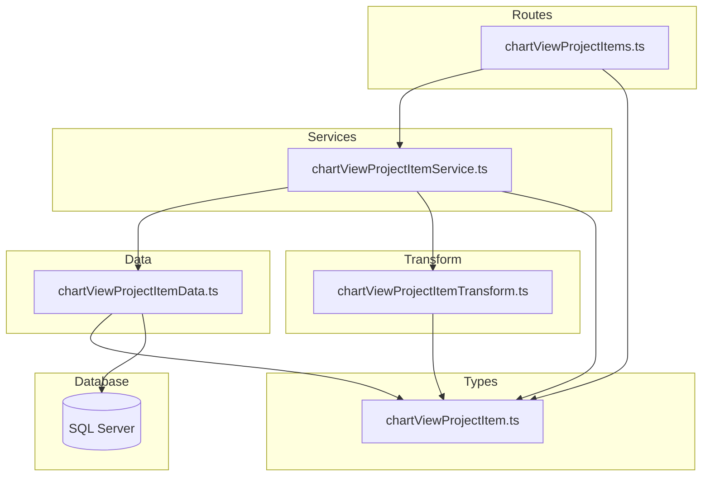

# チャートビュー案件項目 CRUD API

> **元spec**: chart-view-project-items-crud-api

## 概要

チャートビューに含まれる案件項目（chart_view_project_items）のCRUD APIを提供し、事業部リーダーがチャート上に表示する案件の構成・表示順序・表示/非表示を管理できるようにする。

- **ユーザー**: 事業部リーダー、フロントエンド開発者
- **影響範囲**: 既存の chart-views CRUD API にネストされた子リソースのエンドポイントを追加
- **固有の設計要素**: 物理削除パターン、JOINによる関連リソース情報の付加、一括表示順序更新

### Goals

- chart_view_project_items テーブルに対するCRUD操作（一覧・単一取得・作成・更新・物理削除）の提供
- 表示順序の一括更新エンドポイントの提供
- 関連リソース情報（案件名・案件ケース名）を含むレスポンスの返却
- 外部キー参照先（chart_views, projects, project_cases）の存在検証

### Non-Goals

- chart_view_indirect_work_items のCRUD操作
- ページネーション（1チャートビューあたりの項目数は限定的）
- 論理削除・復元（関連テーブルのため物理削除を採用）
- フロントエンド実装

## 要件

### 1. 案件項目一覧取得

指定チャートビューに紐づく案件項目の一覧を `display_order` 昇順で返却する。

- 親チャートビューが存在しないまたは論理削除済みの場合は 404
- 関連する案件情報（`projectCode`, `projectName`）と案件ケース情報（`caseName`）を含める

### 2. 案件項目単一取得

指定IDの案件項目を返却する。存在しない場合・`chartViewId` に属さない場合は 404。

### 3. 案件項目新規作成

新しい案件項目を作成し、201 Created で返却。`Location` ヘッダを含める。

- `projectId`（必須、正の整数）、`projectCaseId`（任意、正の整数またはnull）
- `displayOrder`（任意、非負整数、デフォルト0）、`isVisible`（任意、boolean、デフォルトtrue）
- 外部キー検証: chart_views の存在・projects の存在・project_cases の所属検証
- `projectId` の案件が存在しない場合は 422
- `projectCaseId` の案件ケースが存在しない / `projectId` に属さない場合は 422

### 4. 案件項目更新

指定IDの案件項目を更新し、200 OK で返却。

- 更新可能フィールド: `projectCaseId`、`displayOrder`、`isVisible`
- **`projectId` の変更は受け付けない**（案件の差し替えは削除→再作成で行う）
- `projectCaseId` の案件ケースが該当案件項目の `projectId` に属さない場合は 422

### 5. 案件項目削除

指定IDの案件項目を**物理削除**し、204 No Content を返却。`chartViewId` の所属チェック含む。

### 6. 案件項目一括更新（表示順序）

`/chart-views/:chartViewId/project-items/display-order` に PUT リクエストで表示順序を一括更新。

- `items` 配列（各要素に `chartViewProjectItemId` と `displayOrder`）をリクエストボディとして受け付ける
- `items` 配列内のIDに `chartViewId` に属さない項目が含まれる場合は 422
- 更新後の一覧を返却

### 7. APIレスポンス形式

- 成功時: `{ data: ... }` 形式
- 一覧取得時: `{ data: [...] }` 形式（ページネーション不要）
- エラー時: RFC 9457 Problem Details 形式
- フィールド名: camelCase
- 日時フィールド: ISO 8601 形式
- 関連リソース情報をネストオブジェクトとして含める

### 8. バリデーション

- パスパラメータ `chartViewId` および `id` を正の整数としてバリデーション
- 作成・更新・一括更新のリクエストボディをZodスキーマでバリデーション
- 外部キー参照先（projects, project_cases）の存在検証

## アーキテクチャ・設計

### レイヤー構成



### 技術スタック

| Layer | Choice / Version | Role |
|-------|------------------|------|
| Backend | Hono v4 | ルーティング・ミドルウェア |
| Validation | Zod + @hono/zod-validator | リクエストバリデーション |
| Data | mssql | SQL Server クエリ実行（projects, project_cases との JOIN） |
| Test | Vitest | ユニットテスト |

### 既存パターンとの差異

- **JOINが必要**: 一覧・単一取得時に projects / project_cases テーブルをJOIN
- **複数の外部キー検証**: 作成時に chart_views, projects, project_cases の3テーブルの存在・整合性を検証
- **一括表示順序更新**: `/display-order` エンドポイントを新規追加
- **projectId の変更禁止**: 更新時に projectId の変更を受け付けない設計

## APIコントラクト

| Method | Endpoint | Request | Response | Status | Errors |
|--------|----------|---------|----------|--------|--------|
| GET | / | chartViewId: number (path) | `{ data: ChartViewProjectItem[] }` | 200 | 404 |
| GET | /:id | chartViewId, id: number (path) | `{ data: ChartViewProjectItem }` | 200 | 404 |
| POST | / | chartViewId (path) + CreateChartViewProjectItem (json) | `{ data: ChartViewProjectItem }` + Location header | 201 | 404, 422 |
| PUT | /display-order | chartViewId (path) + UpdateDisplayOrder (json) | `{ data: ChartViewProjectItem[] }` | 200 | 404, 422 |
| PUT | /:id | chartViewId, id (path) + UpdateChartViewProjectItem (json) | `{ data: ChartViewProjectItem }` | 200 | 404, 422 |
| DELETE | /:id | chartViewId, id: number (path) | (no body) | 204 | 404 |

ベースパス: `/chart-views/:chartViewId/project-items`

**注意**: `PUT /display-order` を `PUT /:id` より前に定義（ルート競合回避）

### レスポンス例（一覧取得）

```json
{
  "data": [
    {
      "chartViewProjectItemId": 1,
      "chartViewId": 10,
      "projectId": 5,
      "projectCaseId": 12,
      "displayOrder": 0,
      "isVisible": true,
      "createdAt": "2026-01-31T00:00:00.000Z",
      "updatedAt": "2026-01-31T00:00:00.000Z",
      "project": {
        "projectCode": "PRJ-001",
        "projectName": "新規開発プロジェクトA"
      },
      "projectCase": {
        "caseName": "標準ケース"
      }
    },
    {
      "chartViewProjectItemId": 2,
      "chartViewId": 10,
      "projectId": 8,
      "projectCaseId": null,
      "displayOrder": 1,
      "isVisible": true,
      "createdAt": "2026-01-31T00:00:00.000Z",
      "updatedAt": "2026-01-31T00:00:00.000Z",
      "project": {
        "projectCode": "PRJ-002",
        "projectName": "改修プロジェクトB"
      },
      "projectCase": null
    }
  ]
}
```

### 一括表示順序更新リクエスト例

```json
{
  "items": [
    { "chartViewProjectItemId": 2, "displayOrder": 0 },
    { "chartViewProjectItemId": 1, "displayOrder": 1 }
  ]
}
```

## データモデル

### ER図

```mermaid
erDiagram
    chart_views ||--o{ chart_view_project_items : contains
    projects ||--o{ chart_view_project_items : referenced_by
    project_cases ||--o{ chart_view_project_items : optionally_referenced_by

    chart_view_project_items {
        int chart_view_project_item_id PK
        int chart_view_id FK
        int project_id FK
        int project_case_id FK_nullable
        int display_order
        boolean is_visible
        datetime created_at
        datetime updated_at
    }
```

### テーブル定義

| カラム名 | データ型 | NULL | デフォルト | 説明 |
|---------|---------|------|-----------|------|
| chart_view_project_item_id | INT | NO | IDENTITY(1,1) | 主キー。自動採番 |
| chart_view_id | INT | NO | - | 外部キー → chart_views |
| project_id | INT | NO | - | 外部キー → projects |
| project_case_id | INT | YES | NULL | 外部キー → project_cases |
| display_order | INT | NO | 0 | 表示順序 |
| is_visible | BIT | NO | 1 | 表示フラグ |
| created_at | DATETIME2 | NO | GETDATE() | 作成日時 |
| updated_at | DATETIME2 | NO | GETDATE() | 更新日時 |

### 外部キー

- FK_chart_view_project_items_view → chart_views(chart_view_id) ON DELETE CASCADE
- FK_chart_view_project_items_project → projects(project_id)
- FK_chart_view_project_items_case → project_cases(project_case_id)

### ビジネスルール

- chart_view_project_item_id は自動採番（IDENTITY）、変更不可
- chart_view_id は必須。chart_views に存在し、論理削除されていないこと
- project_id は必須・**変更不可**。projects に存在し、論理削除されていないこと
- project_case_id は任意。指定時は project_cases に存在し、かつ該当 project_id に所属すること
- display_order はデフォルト 0。一括更新でチャート内の積み上げ順序を制御
- is_visible はデフォルト true
- **物理削除のみ**（`deleted_at` カラムなし）
- chart_views の論理削除時は ON DELETE CASCADE により本テーブルのレコードが物理削除される

### 型定義

```typescript
/** 作成用スキーマ */
const createChartViewProjectItemSchema = z.object({
  projectId: z.number().int().positive(),
  projectCaseId: z.number().int().positive().nullable().optional(),
  displayOrder: z.number().int().min(0).default(0),
  isVisible: z.boolean().default(true),
})

/** 更新用スキーマ（projectId は変更不可） */
const updateChartViewProjectItemSchema = z.object({
  projectCaseId: z.number().int().positive().nullable().optional(),
  displayOrder: z.number().int().min(0).optional(),
  isVisible: z.boolean().optional(),
})

/** 一括表示順序更新用スキーマ */
const updateDisplayOrderSchema = z.object({
  items: z.array(
    z.object({
      chartViewProjectItemId: z.number().int().positive(),
      displayOrder: z.number().int().min(0),
    })
  ).min(1),
})

/** DB行型（snake_case -- JOINカラム含む） */
type ChartViewProjectItemRow = {
  chart_view_project_item_id: number
  chart_view_id: number
  project_id: number
  project_case_id: number | null
  display_order: number
  is_visible: boolean
  created_at: Date
  updated_at: Date
  // JOIN カラム
  project_code: string
  project_name: string
  case_name: string | null
}

/** APIレスポンス型（camelCase） */
type ChartViewProjectItem = {
  chartViewProjectItemId: number
  chartViewId: number
  projectId: number
  projectCaseId: number | null
  displayOrder: number
  isVisible: boolean
  createdAt: string   // ISO 8601
  updatedAt: string   // ISO 8601
  project: {
    projectCode: string
    projectName: string
  }
  projectCase: {
    caseName: string
  } | null
}
```

## エラーハンドリング

既存のグローバルエラーハンドラと RFC 9457 Problem Details 形式に従う。

| Status | Type | Trigger | Detail |
|--------|------|---------|--------|
| 404 | resource-not-found | チャートビューID不存在・論理削除済み | `Chart view with ID '{id}' not found` |
| 404 | resource-not-found | 案件項目ID不存在・所属不一致 | `Chart view project item with ID '{id}' not found` |
| 422 | validation-error | Zodバリデーション失敗 | errors 配列にフィールド別詳細 |
| 422 | validation-error | projectId の案件が不存在 | `Project with ID '{id}' not found` |
| 422 | validation-error | projectCaseId 不存在・所属不一致 | `Project case with ID '{id}' not found or does not belong to project '{projectId}'` |
| 422 | validation-error | 一括更新で所属不一致のIDを含む | `Chart view project item with ID '{id}' does not belong to chart view '{chartViewId}'` |

## ファイル構成

```
apps/backend/src/
  routes/chartViewProjectItems.ts
  services/chartViewProjectItemService.ts
  data/chartViewProjectItemData.ts
  transform/chartViewProjectItemTransform.ts
  types/chartViewProjectItem.ts
  __tests__/routes/chartViewProjectItems.test.ts
  __tests__/services/chartViewProjectItemService.test.ts
  __tests__/data/chartViewProjectItemData.test.ts
```

変更ファイル:
```
apps/backend/src/index.ts  (app.route('/chart-views/:chartViewId/project-items', chartViewProjectItems) を追加)
```
