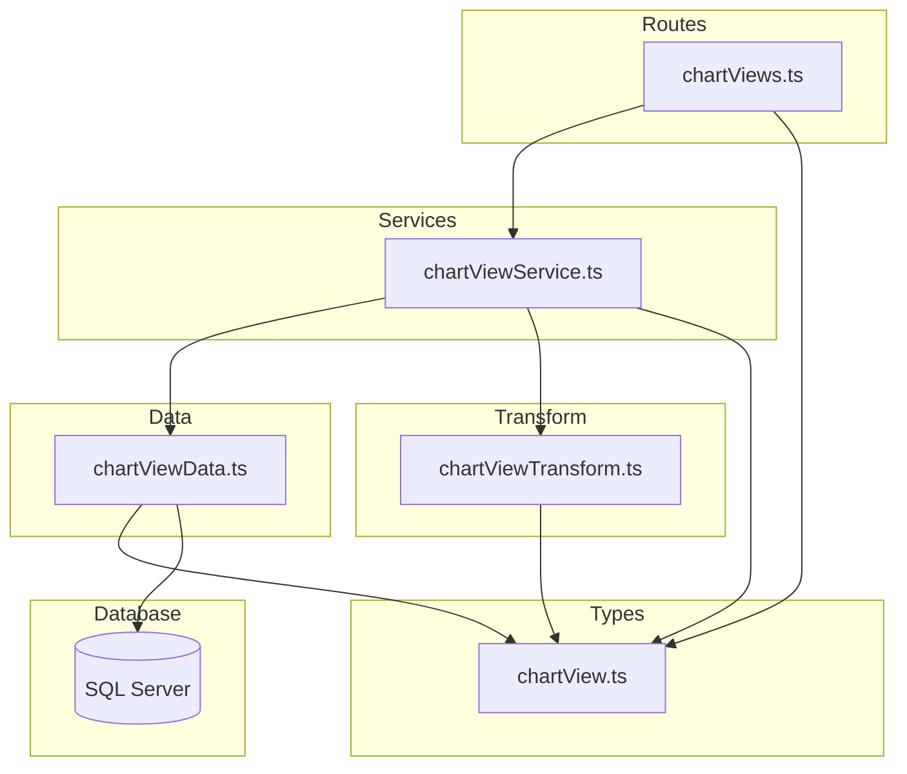
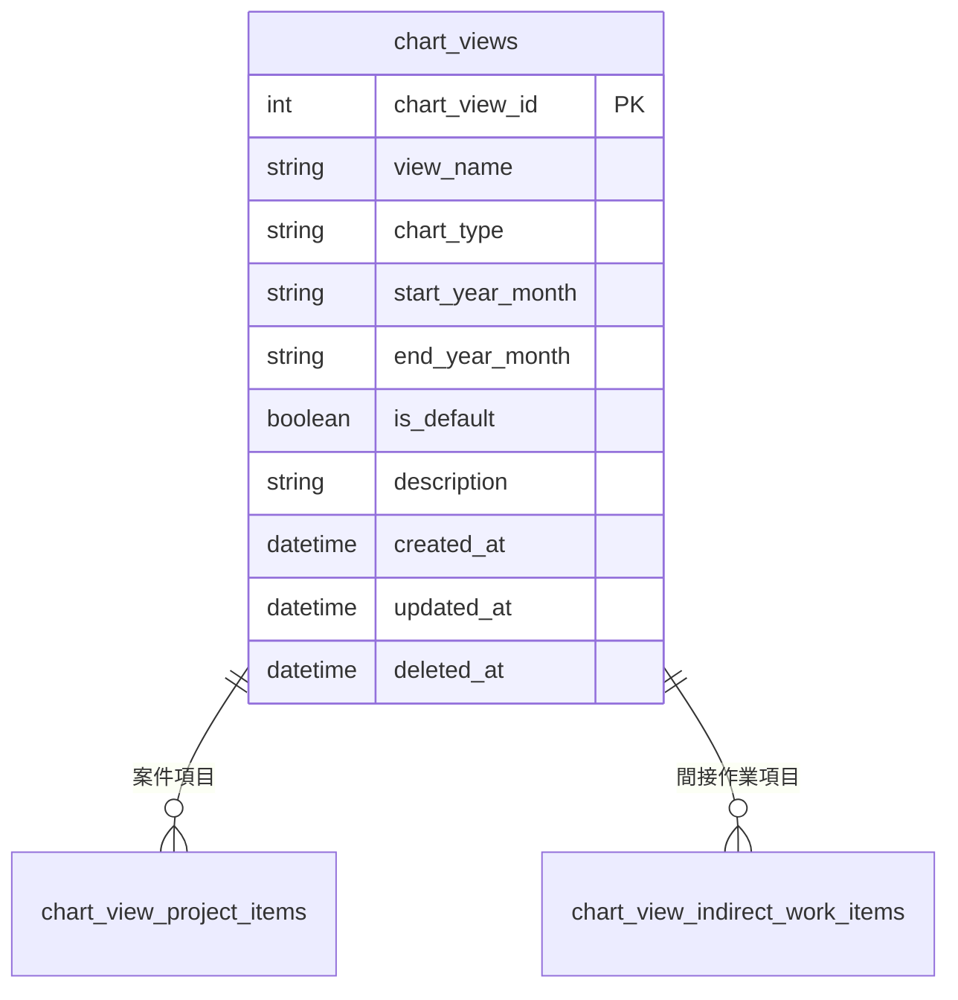

# チャートビュー CRUD API

> **元spec**: chart-views-crud-api

## 概要

チャートビュー（chart_views）のCRUD APIを提供し、事業部リーダーが積み上げチャートの表示設定（表示期間・チャートタイプ・デフォルトビュー）を登録・参照・更新・削除できるようにする。

- **ユーザー**: 事業部リーダー、フロントエンド開発者
- **影響範囲**: 既存のレイヤードアーキテクチャに新規エンティティを追加。外部キーなし・子テーブルCASCADE削除のシンプルなCRUD構成
- **固有の設計要素**: `startYearMonth` <= `endYearMonth` のクロスフィールドバリデーション

### Goals

- chart_views テーブルに対する完全なCRUD操作（一覧・単一取得・作成・更新・論理削除・復元）の提供
- YYYYMM形式の年月フィールドに対するクロスフィールドバリデーション
- 既存のレイヤードアーキテクチャパターン（routes → services → data → transform → types）への準拠

### Non-Goals

- chart_view_project_items / chart_view_indirect_work_items（子テーブル）のCRUD操作
- chart_stack_order_settings / chart_color_settings（設定テーブル）の管理
- chartType のenum定義・バリデーション（将来課題）
- フロントエンド実装

## 要件

### 1. チャートビュー一覧取得

チャートビューの一覧をページネーション付きで取得する（デフォルト: page=1, pageSize=20）。

- 論理削除されたビュー（`deleted_at IS NOT NULL`）をデフォルトで除外
- `filter[includeDisabled]=true` で論理削除済みも含めた一覧を返却
- `meta.pagination`（currentPage, pageSize, totalItems, totalPages）を含む

### 2. チャートビュー単一取得

指定IDのチャートビューを返却する。存在しない場合・論理削除済みの場合は 404 Not Found。

### 3. チャートビュー新規作成

新しいチャートビューを作成し、201 Created で返却。`Location` ヘッダを含める。

- `viewName`（必須、1〜100文字）、`chartType`（必須、1〜50文字）
- `startYearMonth`（必須、YYYYMM形式6文字）、`endYearMonth`（必須、YYYYMM形式6文字）
- `isDefault`（任意、デフォルト false）、`description`（任意、最大500文字）
- `startYearMonth` > `endYearMonth` の場合は 422

### 4. チャートビュー更新

指定IDのチャートビューを部分更新し、200 OK で返却。

- 全フィールドが任意（部分更新）
- 更新後の `startYearMonth` > `endYearMonth` となる場合は 422
- サービス層で既存値とマージしてクロスフィールドバリデーション実施

### 5. チャートビュー論理削除

指定IDのチャートビューを論理削除し、204 No Content を返却。`deleted_at` に現在日時を設定。

- hasReferences チェック不要（子テーブルCASCADE）

### 6. チャートビュー復元

論理削除済みチャートビューを復元し、200 OK で返却。`deleted_at` を NULL に、`updated_at` を現在日時に設定。

### 7. APIレスポンス形式

- 成功時: `{ data: ... }` 形式
- 一覧取得時: `{ data: [...], meta: { pagination: {...} } }` 形式
- エラー時: RFC 9457 Problem Details 形式（`application/problem+json`）
- フィールド名: camelCase
- 日時フィールド: ISO 8601 形式

### 8. バリデーション

- クエリパラメータ（`page[number]`、`page[size]`、`filter[includeDisabled]`）をZodでバリデーション
- 作成・更新時のリクエストボディをバリデーション
- `startYearMonth` <= `endYearMonth` の大小関係を検証
- バリデーションエラー時は `errors` 配列にフィールドごとの詳細を含める

## アーキテクチャ・設計

### レイヤー構成



### 技術スタック

| Layer | Choice / Version | Role |
|-------|------------------|------|
| Backend | Hono v4 | ルーティング・ミドルウェア |
| Validation | Zod + @hono/zod-validator | リクエストバリデーション（`.refine()` でクロスフィールドバリデーション） |
| Data | mssql | SQL Server クエリ実行（単純CRUD、JOINなし） |
| Test | Vitest | ユニットテスト |

### 既存パターンとの差異

- INT IDENTITY 主キー（headcountPlanCases と同パターン）
- 外部キーなし（JOINやFK存在チェック不要）
- 子テーブルは ON DELETE CASCADE のため、論理削除時の参照チェック（hasReferences）不要
- `startYearMonth` <= `endYearMonth` のクロスフィールドバリデーションが必要

## APIコントラクト

| Method | Endpoint | Request | Response | Status | Errors |
|--------|----------|---------|----------|--------|--------|
| GET | / | ChartViewListQuery (query) | `{ data: ChartView[], meta: { pagination } }` | 200 | 422 |
| GET | /:id | id: number (path) | `{ data: ChartView }` | 200 | 404 |
| POST | / | CreateChartView (json) | `{ data: ChartView }` + Location header | 201 | 422 |
| PUT | /:id | id: number (path) + UpdateChartView (json) | `{ data: ChartView }` | 200 | 404, 422 |
| DELETE | /:id | id: number (path) | (no body) | 204 | 404 |
| POST | /:id/actions/restore | id: number (path) | `{ data: ChartView }` | 200 | 404 |

ベースパス: `/chart-views`

### レスポンス例（単一取得）

```json
{
  "data": {
    "chartViewId": 1,
    "viewName": "2026年度全体ビュー",
    "chartType": "stacked-area",
    "startYearMonth": "202604",
    "endYearMonth": "202703",
    "isDefault": true,
    "description": "2026年度のプロジェクト工数積み上げ表示",
    "createdAt": "2026-01-31T00:00:00.000Z",
    "updatedAt": "2026-01-31T00:00:00.000Z"
  }
}
```

### レスポンス例（一覧取得）

```json
{
  "data": [
    {
      "chartViewId": 1,
      "viewName": "2026年度全体ビュー",
      "chartType": "stacked-area",
      "startYearMonth": "202604",
      "endYearMonth": "202703",
      "isDefault": true,
      "description": null,
      "createdAt": "2026-01-31T00:00:00.000Z",
      "updatedAt": "2026-01-31T00:00:00.000Z"
    }
  ],
  "meta": {
    "pagination": {
      "currentPage": 1,
      "pageSize": 20,
      "totalItems": 1,
      "totalPages": 1
    }
  }
}
```

## データモデル

### ER図



### テーブル定義

| カラム名 | データ型 | NULL | デフォルト | 説明 |
|---------|---------|------|-----------|------|
| chart_view_id | INT | NO | IDENTITY(1,1) | 主キー。自動採番 |
| view_name | NVARCHAR(100) | NO | - | ビュー名 |
| chart_type | VARCHAR(50) | NO | - | チャートタイプ |
| start_year_month | CHAR(6) | NO | - | 表示開始年月（YYYYMM形式） |
| end_year_month | CHAR(6) | NO | - | 表示終了年月（YYYYMM形式） |
| is_default | BIT | NO | 0 | デフォルトビューフラグ |
| description | NVARCHAR(500) | YES | NULL | 説明 |
| created_at | DATETIME2 | NO | GETDATE() | 作成日時 |
| updated_at | DATETIME2 | NO | GETDATE() | 更新日時 |
| deleted_at | DATETIME2 | YES | NULL | 削除日時（論理削除） |

### ビジネスルール

- chart_view_id は自動採番（IDENTITY）、変更不可
- `startYearMonth` <= `endYearMonth` を常に満たすこと（YYYYMM形式は辞書順で正しく大小判定可能）
- is_default はデフォルト false
- 論理削除（deleted_at）のあるレコードは通常のクエリから除外
- 子テーブルは ON DELETE CASCADE -- 論理削除時は影響なし、物理削除時に連動削除

### 型定義

```typescript
// --- YYYYMM バリデーション用ヘルパー ---
// yearMonthSchema: z.string().length(6).regex(/^\d{6}$/)

/** 作成用スキーマ */
const createChartViewSchema = z.object({
  viewName: z.string().min(1).max(100),
  chartType: z.string().min(1).max(50),
  startYearMonth: yearMonthSchema,
  endYearMonth: yearMonthSchema,
  isDefault: z.boolean().default(false),
  description: z.string().max(500).optional().nullable(),
}).refine(
  data => data.startYearMonth <= data.endYearMonth,
  { path: ['endYearMonth'], message: 'endYearMonth must be >= startYearMonth' }
)

/** 更新用スキーマ（クロスフィールドバリデーションはサービス層で実施） */
const updateChartViewSchema = z.object({
  viewName: z.string().min(1).max(100).optional(),
  chartType: z.string().min(1).max(50).optional(),
  startYearMonth: yearMonthSchema.optional(),
  endYearMonth: yearMonthSchema.optional(),
  isDefault: z.boolean().optional(),
  description: z.string().max(500).optional().nullable(),
})

/** 一覧取得クエリスキーマ */
const chartViewListQuerySchema = paginationQuerySchema.extend({
  'filter[includeDisabled]': z.coerce.boolean().default(false)
})

/** DB行型（snake_case） */
type ChartViewRow = {
  chart_view_id: number
  view_name: string
  chart_type: string
  start_year_month: string
  end_year_month: string
  is_default: boolean
  description: string | null
  created_at: Date
  updated_at: Date
  deleted_at: Date | null
}

/** APIレスポンス型（camelCase） */
type ChartView = {
  chartViewId: number
  viewName: string
  chartType: string
  startYearMonth: string
  endYearMonth: string
  isDefault: boolean
  description: string | null
  createdAt: string   // ISO 8601
  updatedAt: string   // ISO 8601
}
```

## エラーハンドリング

既存のグローバルエラーハンドラ（`app.onError`）と RFC 9457 Problem Details 形式に従う。サービス層から HTTPException をスローし、グローバルハンドラが統一的に処理する。

| Status | Type | Trigger | Detail |
|--------|------|---------|--------|
| 404 | resource-not-found | ID不存在、論理削除済み | `Chart view with ID '{id}' not found` |
| 422 | validation-error | Zodバリデーション失敗 | errors 配列にフィールド別詳細 |
| 422 | validation-error | startYearMonth > endYearMonth | `endYearMonth must be greater than or equal to startYearMonth` |

## ファイル構成

```
apps/backend/src/
  routes/chartViews.ts
  services/chartViewService.ts
  data/chartViewData.ts
  transform/chartViewTransform.ts
  types/chartView.ts
  __tests__/routes/chartViews.test.ts
  __tests__/services/chartViewService.test.ts
  __tests__/data/chartViewData.test.ts
```

変更ファイル:
```
apps/backend/src/index.ts  (app.route('/chart-views', chartViews) を追加)
```
