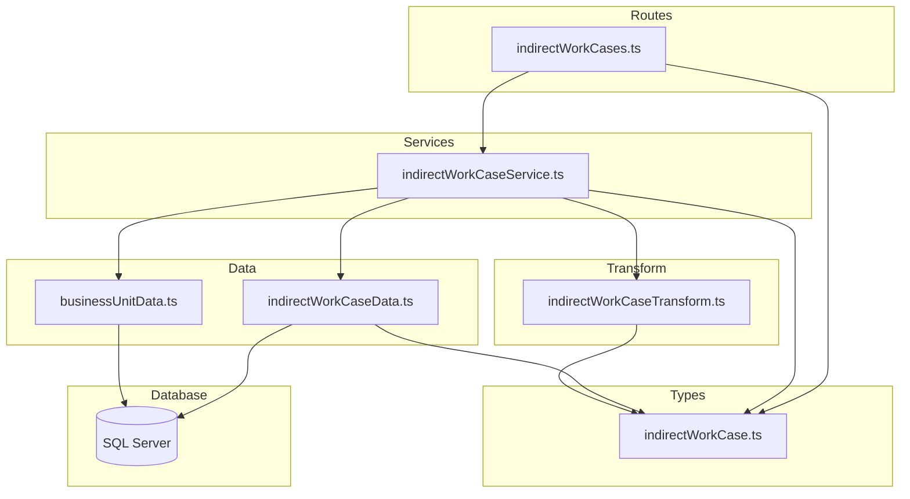
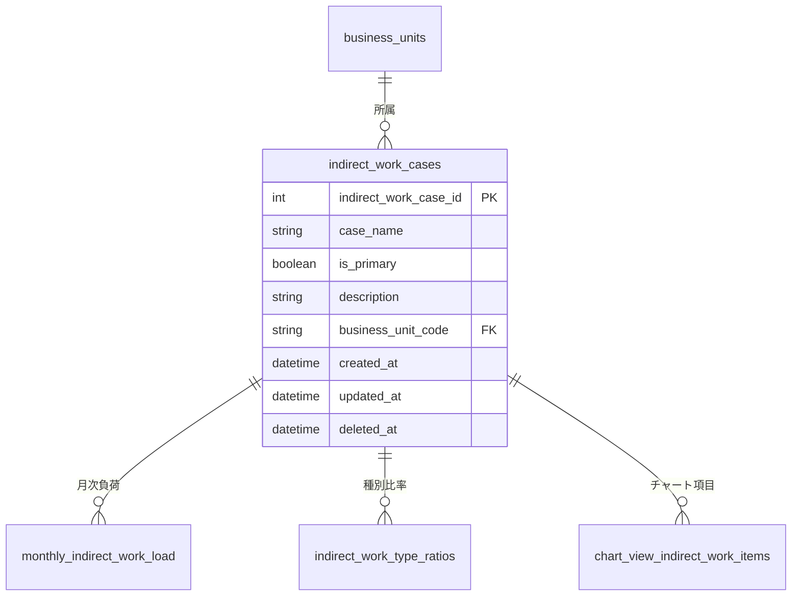

# 間接作業ケース CRUD API

> **元spec**: indirect-work-cases-crud-api

## 概要

間接作業ケース（indirect_work_cases）の CRUD API を提供し、事業部ごとの間接作業（教育・管理業務・会議等）の工数計画を複数シナリオ（楽観/標準/悲観等）で管理可能にする。

- **ユーザー**: 事業部リーダー、フロントエンド開発者
- **影響範囲**: headcount_plan_cases と同一のレイヤードアーキテクチャパターンを踏襲。`business_unit_code` NOT NULL 制約と3テーブル参照チェックが特徴
- **ルーティング**: `/indirect-work-cases` にフラットマウント

## 要件

### 一覧取得
- `GET /indirect-work-cases` でページネーション付き一覧を返却（デフォルト: page=1, pageSize=20）
- `businessUnitCode` に対応する `businessUnitName` を LEFT JOIN で取得
- ソフトデリート済みはデフォルト除外、`filter[includeDisabled]=true` で含める
- `meta.pagination` を含む

### 単一取得
- `GET /indirect-work-cases/:id` で詳細取得
- 不存在 / ソフトデリート済み → 404

### 新規作成
- `POST /indirect-work-cases` → 201 Created + Location ヘッダ
- バリデーション: caseName（必須・1〜100文字）、isPrimary（任意・デフォルト false）、description（任意・最大500文字）、businessUnitCode（必須・最大20文字・英数字+ハイフン+アンダースコア）
- businessUnitCode 不存在 → 422

### 更新
- `PUT /indirect-work-cases/:id` → 200 OK
- businessUnitCode は optional だが nullable 不可（headcount_plan_cases との差分）

### 論理削除
- `DELETE /indirect-work-cases/:id` → 204 No Content
- 参照チェック対象: `monthly_indirect_work_load`, `indirect_work_type_ratios`, `chart_view_indirect_work_items` の3テーブル
- 参照あり → 409 Conflict

### 復元
- `POST /indirect-work-cases/:id/actions/restore` → 200 OK
- 不存在 / 未削除 → 404

### 共通仕様
- RFC 9457 Problem Details 形式
- camelCase レスポンス、ISO 8601 日時

## アーキテクチャ・設計

### レイヤード構成



- 外部キーチェックには既存の `businessUnitData` を再利用
- `business_unit_code` が NOT NULL のため、作成時は常にFK存在チェックを実行

### 技術スタック

| Layer | Choice | Role |
|-------|--------|------|
| Backend | Hono v4 | ルーティング・ミドルウェア |
| Validation | Zod + @hono/zod-validator | リクエストバリデーション |
| Data | mssql | SQL Server クエリ実行（LEFT JOIN追加） |
| Test | Vitest | ユニットテスト |

## APIコントラクト

| Method | Endpoint | Request | Response | Status | Errors |
|--------|----------|---------|----------|--------|--------|
| GET | / | IndirectWorkCaseListQuery (query) | `{ data: IndirectWorkCase[], meta: { pagination } }` | 200 | 422 |
| GET | /:id | id: number (path) | `{ data: IndirectWorkCase }` | 200 | 404 |
| POST | / | CreateIndirectWorkCase (json) | `{ data: IndirectWorkCase }` + Location header | 201 | 422 |
| PUT | /:id | id + UpdateIndirectWorkCase (json) | `{ data: IndirectWorkCase }` | 200 | 404, 422 |
| DELETE | /:id | id: number (path) | (no body) | 204 | 404, 409 |
| POST | /:id/actions/restore | id: number (path) | `{ data: IndirectWorkCase }` | 200 | 404 |

**マウント**: `app.route('/indirect-work-cases', indirectWorkCases)`

## データモデル

### ER図



### indirect_work_cases テーブル

| カラム名 | データ型 | NULL | デフォルト | 説明 |
|---------|---------|------|-----------|------|
| indirect_work_case_id | INT | NO | IDENTITY(1,1) | 主キー |
| case_name | NVARCHAR(100) | NO | - | ケース名 |
| is_primary | BIT | NO | 0 | プライマリケースフラグ |
| description | NVARCHAR(500) | YES | NULL | 説明 |
| business_unit_code | VARCHAR(20) | NO | - | FK → business_units |
| created_at | DATETIME2 | NO | GETDATE() | 作成日時 |
| updated_at | DATETIME2 | NO | GETDATE() | 更新日時 |
| deleted_at | DATETIME2 | YES | NULL | 削除日時 |

### ビジネスルール
- business_unit_code は NOT NULL（必ず事業部に紐づく）
- is_primary はデフォルト false
- 削除前に3テーブル（monthly_indirect_work_load, indirect_work_type_ratios, chart_view_indirect_work_items）への参照を確認

### 型定義

```typescript
// DB行型（snake_case）
type IndirectWorkCaseRow = {
  indirect_work_case_id: number
  case_name: string
  is_primary: boolean
  description: string | null
  business_unit_code: string
  business_unit_name: string | null  // LEFT JOIN（BU論理削除時にnull）
  created_at: Date
  updated_at: Date
  deleted_at: Date | null
}

// APIレスポンス型（camelCase）
type IndirectWorkCase = {
  indirectWorkCaseId: number
  caseName: string
  isPrimary: boolean
  description: string | null
  businessUnitCode: string
  businessUnitName: string | null
  createdAt: string   // ISO 8601
  updatedAt: string   // ISO 8601
}
```

### レスポンス例（単一取得）

```json
{
  "data": {
    "indirectWorkCaseId": 1,
    "caseName": "標準ケース",
    "isPrimary": true,
    "description": "間接作業の標準工数計画",
    "businessUnitCode": "plant",
    "businessUnitName": "プラント事業",
    "createdAt": "2026-01-31T00:00:00.000Z",
    "updatedAt": "2026-01-31T00:00:00.000Z"
  }
}
```

## エラーハンドリング

既存のグローバルエラーハンドラと RFC 9457 Problem Details 形式に従う。

| Status | Trigger | Detail |
|--------|---------|--------|
| 404 | ID不存在、論理削除済み | `Indirect work case with ID '{id}' not found` |
| 409 | 参照整合性違反（削除時） | `Indirect work case with ID '{id}' is referenced by other resources and cannot be deleted` |
| 422 | Zodバリデーション失敗 | errors 配列にフィールド別詳細 |
| 422 | businessUnitCode 不存在 | `Business unit with code '{code}' not found` |

## ファイル構成

| ファイル | レイヤー | 役割 |
|---------|---------|------|
| `src/types/indirectWorkCase.ts` | Types | Zod スキーマ・型定義 |
| `src/data/indirectWorkCaseData.ts` | Data | SQL クエリ実行（LEFT JOIN） |
| `src/transform/indirectWorkCaseTransform.ts` | Transform | Row → Response 変換 |
| `src/services/indirectWorkCaseService.ts` | Service | ビジネスロジック・FK存在チェック |
| `src/routes/indirectWorkCases.ts` | Routes | エンドポイント定義 |
| `src/__tests__/routes/indirectWorkCases.test.ts` | Test | ルートテスト |
| `src/__tests__/services/indirectWorkCaseService.test.ts` | Test | サービステスト |
| `src/__tests__/data/indirectWorkCaseData.test.ts` | Test | データ層テスト |
