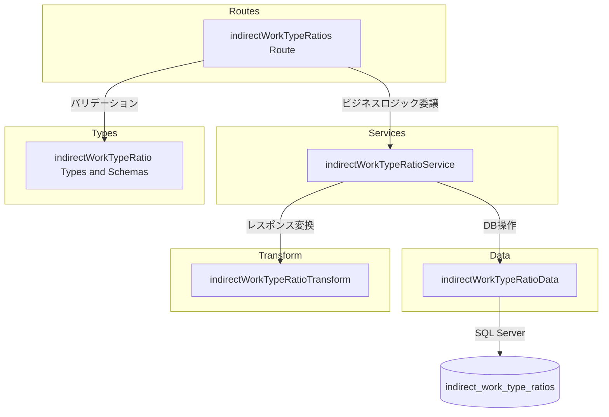

# 間接作業種別配分比率 CRUD API

> **元spec**: indirect-work-type-ratios-crud-api

## 概要

間接作業ケース配下の作業種別ごとの年度別配分比率を管理する CRUD API を提供する。

- **ユーザー**: 事業部リーダーおよび API 利用者が、間接作業の配分比率の参照・設定・一括更新に使用
- **影響**: 既存の `/indirect-work-cases` ルート配下にネストリソースとして新規 API を追加。既存コードへの変更は `index.ts` のルート登録のみ
- **テーブル分類**: ファクトテーブル（物理削除、deleted_at なし）。親リソース削除時はカスケード削除

## 要件

### 一覧取得
- `GET /indirect-work-cases/:indirectWorkCaseId/indirect-work-type-ratios` で指定された間接作業ケースに紐づく全配分比率レコードを `{ data: [...] }` 形式で返却（200）
- 各レコードに `indirectWorkTypeRatioId`, `indirectWorkCaseId`, `workTypeCode`, `fiscalYear`, `ratio`, `createdAt`, `updatedAt` を含む
- 親 indirectWorkCaseId が存在しない場合は 404

### 単一取得
- `GET .../indirect-work-type-ratios/:indirectWorkTypeRatioId` で指定レコードを `{ data: {...} }` 形式で返却（200）
- 不存在の場合は 404、親不存在の場合も 404

### 新規作成
- `POST .../indirect-work-type-ratios` で新規レコードを作成し、201 + `Location` ヘッダを返却
- リクエストボディ: `workTypeCode`（VARCHAR(20), 必須）、`fiscalYear`（整数, 必須）、`ratio`（0.0000〜1.0000, 必須）
- 同一 `indirectWorkCaseId` + `workTypeCode` + `fiscalYear` の重複時は 409
- `workTypeCode` が work_types に存在しない場合は 422

### 更新
- `PUT .../indirect-work-type-ratios/:indirectWorkTypeRatioId` でレコードを更新し、200 を返却
- リクエストボディ: `workTypeCode`（任意）、`fiscalYear`（任意）、`ratio`（任意）
- 更新後の複合キーが他レコードと重複する場合は 409

### 削除
- `DELETE .../indirect-work-type-ratios/:indirectWorkTypeRatioId` でレコードを物理削除し、204 を返却

### 一括登録・更新（バルク Upsert）
- `PUT .../indirect-work-type-ratios/bulk` で複数レコードを一括 UPSERT し、200 を返却
- リクエストボディ: 配列形式（各要素に `workTypeCode`, `fiscalYear`, `ratio`）
- 既存の組み合わせは更新、存在しない組み合わせは新規作成
- トランザクション内で実行し、一部失敗時は全体をロールバック

### バリデーション
- `workTypeCode`: 最大20文字の文字列
- `fiscalYear`: 整数
- `ratio`: 0.0000 以上 1.0000 以下の小数
- パスパラメータ: 正の整数

## アーキテクチャ・設計

### レイヤード構成



### 技術スタック

| レイヤー | 選択 | 役割 |
|---------|------|------|
| Backend | Hono v4 | HTTP ルーティング・ミドルウェア |
| Validation | Zod | リクエストボディ・パスパラメータ検証 |
| Data | mssql | SQL Server クエリ実行 |

新規依存なし。すべて既存スタック内で完結する。

### 主要コンポーネント

| コンポーネント | レイヤー | 責務 |
|--------------|---------|------|
| indirectWorkTypeRatios Route | Routes | HTTP エンドポイント定義 |
| indirectWorkTypeRatioService | Services | 親存在確認、ユニーク制約チェック、workTypeCode 存在確認 |
| indirectWorkTypeRatioData | Data | SQL クエリ実行（MERGE 文含む） |
| indirectWorkTypeRatioTransform | Transform | DB行 → API レスポンス変換 |
| indirectWorkTypeRatio Types | Types | Zod スキーマ・型定義 |

## API コントラクト

ベースパス: `/indirect-work-cases/:indirectWorkCaseId/indirect-work-type-ratios`

| Method | Endpoint | Request | Response | Errors |
|--------|----------|---------|----------|--------|
| GET | / | - | `{ data: IndirectWorkTypeRatio[] }` | 404 |
| GET | /:indirectWorkTypeRatioId | - | `{ data: IndirectWorkTypeRatio }` | 404 |
| POST | / | CreateIndirectWorkTypeRatio | `{ data: IndirectWorkTypeRatio }` + Location | 404, 409, 422 |
| PUT | /:indirectWorkTypeRatioId | UpdateIndirectWorkTypeRatio | `{ data: IndirectWorkTypeRatio }` | 404, 409, 422 |
| DELETE | /:indirectWorkTypeRatioId | - | 204 No Content | 404 |
| PUT | /bulk | BulkUpsertIndirectWorkTypeRatio | `{ data: IndirectWorkTypeRatio[] }` | 404, 422 |

### 型定義

```typescript
// Zod スキーマ
const createIndirectWorkTypeRatioSchema: z.ZodObject<{
  workTypeCode: z.ZodString        // max 20 chars
  fiscalYear: z.ZodNumber          // integer
  ratio: z.ZodNumber               // 0.0000 - 1.0000
}>

const updateIndirectWorkTypeRatioSchema: z.ZodObject<{
  workTypeCode: z.ZodOptional<z.ZodString>
  fiscalYear: z.ZodOptional<z.ZodNumber>
  ratio: z.ZodOptional<z.ZodNumber>
}>

const bulkUpsertIndirectWorkTypeRatioSchema: z.ZodObject<{
  items: z.ZodArray<z.ZodObject<{
    workTypeCode: z.ZodString
    fiscalYear: z.ZodNumber
    ratio: z.ZodNumber
  }>>
}>

// DB 行型
type IndirectWorkTypeRatioRow = {
  indirect_work_type_ratio_id: number
  indirect_work_case_id: number
  work_type_code: string
  fiscal_year: number
  ratio: number
  created_at: Date
  updated_at: Date
}

// API レスポンス型
type IndirectWorkTypeRatio = {
  indirectWorkTypeRatioId: number
  indirectWorkCaseId: number
  workTypeCode: string
  fiscalYear: number
  ratio: number
  createdAt: string
  updatedAt: string
}
```

## データモデル

| カラム | 型 | 設計上の注意点 |
|--------|-----|---------------|
| indirect_work_type_ratio_id | INT IDENTITY | 主キー、自動採番 |
| indirect_work_case_id | INT | FK → indirect_work_cases、CASCADE DELETE |
| work_type_code | VARCHAR(20) | FK → work_types |
| fiscal_year | INT | 年度 |
| ratio | DECIMAL(5,4) | 0.0000 〜 1.0000 |
| created_at | DATETIME2 | GETDATE() |
| updated_at | DATETIME2 | GETDATE() |

**整合性制約**:
- ユニーク制約: `UQ_indirect_work_type_ratios_case_wt_fy (indirect_work_case_id, work_type_code, fiscal_year)`
- CASCADE DELETE: 親 `indirect_work_cases` 削除時に自動削除
- 物理削除: deleted_at カラムなし

## エラーハンドリング

| カテゴリ | ステータス | 発生条件 | メッセージ例 |
|---------|----------|---------|------------|
| Parent Not Found | 404 | indirectWorkCaseId が存在しない | `Indirect work case with ID '{id}' not found` |
| Resource Not Found | 404 | indirectWorkTypeRatioId が存在しない | `Indirect work type ratio with ID '{id}' not found` |
| Duplicate Key | 409 | 同一 case + workType + fiscalYear | `Indirect work type ratio for work type '{code}' and fiscal year '{year}' already exists` |
| Invalid Work Type | 422 | workTypeCode が work_types に存在しない | `Work type with code '{code}' not found` |
| Validation Error | 422 | Zod スキーマ検証失敗 | RFC 9457 errors 配列 |
| Invalid Param | 422 | パスパラメータが正の整数でない | `Invalid {name}: must be a positive integer` |

すべてのエラーは RFC 9457 Problem Details 形式で返却する。

## ファイル構成

```
apps/backend/src/
├── types/
│   └── indirectWorkTypeRatio.ts
├── data/
│   └── indirectWorkTypeRatioData.ts
├── transform/
│   └── indirectWorkTypeRatioTransform.ts
├── services/
│   └── indirectWorkTypeRatioService.ts
├── routes/
│   └── indirectWorkTypeRatios.ts
└── __tests__/
    ├── types/indirectWorkTypeRatio.test.ts
    ├── transform/indirectWorkTypeRatioTransform.test.ts
    ├── data/indirectWorkTypeRatioData.test.ts
    ├── services/indirectWorkTypeRatioService.test.ts
    └── routes/indirectWorkTypeRatios.test.ts
```

統合ポイント: `index.ts` に `app.route('/indirect-work-cases/:indirectWorkCaseId/indirect-work-type-ratios', indirectWorkTypeRatios)` を追加。`/bulk` ルートを `/:indirectWorkTypeRatioId` より前に定義すること（ルート優先順位）。
