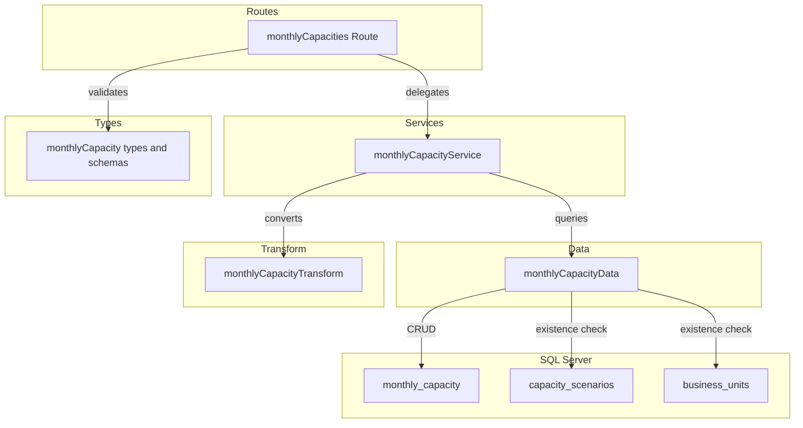
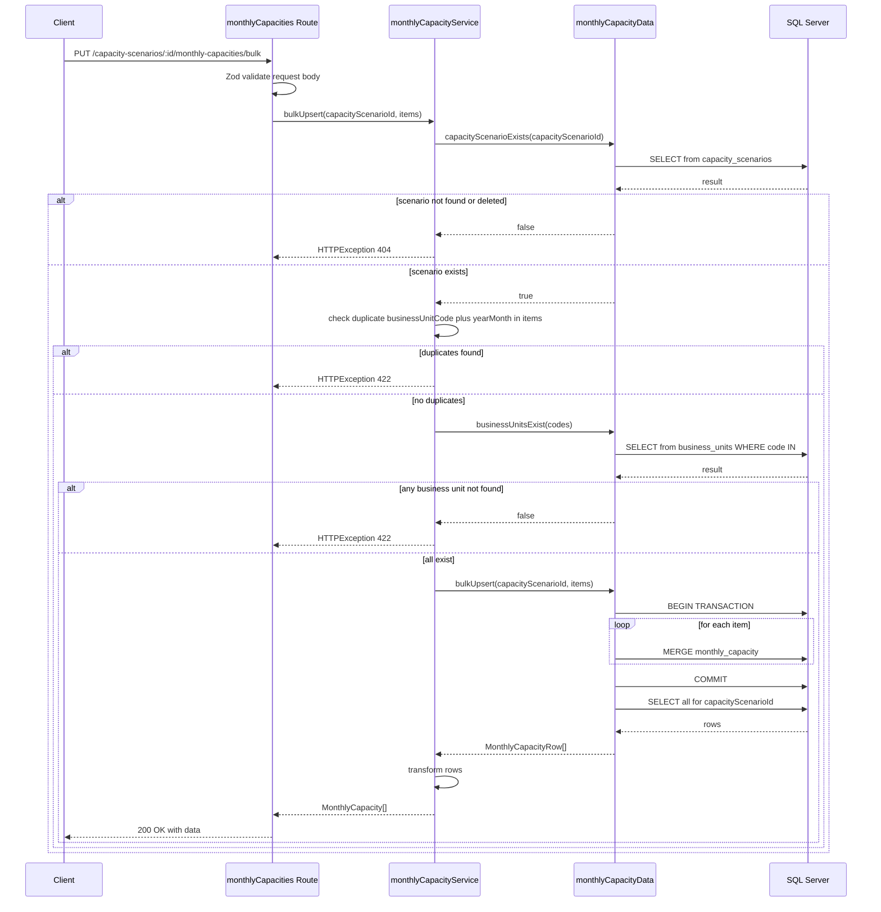
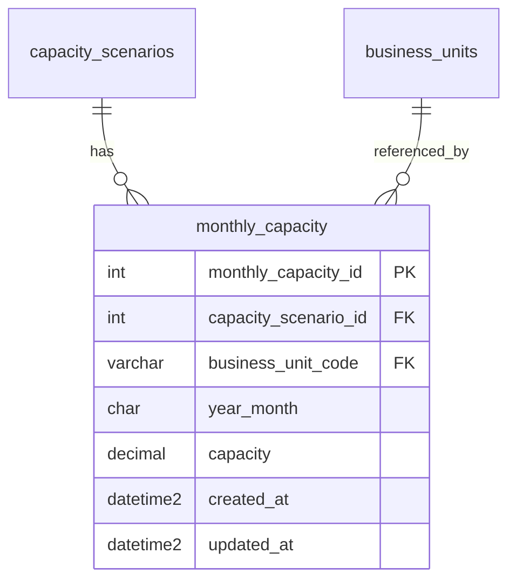

# 月次キャパシティ CRUD API

> **元spec**: monthly-capacity-crud-api

## 概要

キャパシティシナリオ（capacity_scenarios）に紐づく月次キャパシティデータ（monthly_capacity）の CRUD API を提供し、事業部ごとのキャパシティ計画の入力・管理を可能にする。

- **ユーザー**: 事業部リーダーが月次キャパシティの入力・修正・一括更新に利用。フロントエンドの積み上げチャートにおける供給キャパシティラインの基盤データ
- **テーブル分類**: ファクトテーブル（物理削除・deleted_at なし・ページネーションなし）
- **影響範囲**: CRUD + バルク Upsert エンドポイントを新設
- **ルーティング**: capacity_scenarios の子リソースとして `/capacity-scenarios/:capacityScenarioId/monthly-capacities` にネストマウント

## 要件

### 一覧取得
- `GET /capacity-scenarios/:capacityScenarioId/monthly-capacities` で全件返却（ページネーションなし）
- `{ data: [...] }` 形式
- `business_unit_code` 昇順 → `year_month` 昇順でソート
- 親シナリオが不存在 / 論理削除済み → 404

### 単一取得
- `GET .../monthly-capacities/:monthlyCapacityId` で詳細取得
- capacityScenarioId 不一致 → 404

### 新規作成
- `POST .../monthly-capacities` → 201 Created + Location ヘッダ
- バリデーション: businessUnitCode（必須・最大20文字）、yearMonth（必須・YYYYMM形式）、capacity（必須・DECIMAL(10,2)・0以上）
- businessUnitCode 不存在/論理削除済み → 422
- 同一 (capacityScenarioId, businessUnitCode, yearMonth) の重複 → 409

### 更新
- `PUT .../monthly-capacities/:monthlyCapacityId` → 200 OK
- 更新結果がユニーク制約に違反 → 409

### 物理削除
- `DELETE .../monthly-capacities/:monthlyCapacityId` → 204 No Content
- capacityScenarioId 不一致 → 404

### バルク Upsert
- `PUT .../monthly-capacities/bulk` → 200 OK
- `{ items: [{ businessUnitCode, yearMonth, capacity }, ...] }` 形式
- 既存レコードは更新、新規レコードは作成（MERGE）
- 配列内の businessUnitCode + yearMonth 重複 → 422
- トランザクション内で実行、一部失敗時は全体ロールバック
- いずれかの businessUnitCode 不存在 → 422

### 共通仕様
- RFC 9457 Problem Details 形式
- camelCase レスポンス、ISO 8601 日時
- capacity は数値型（小数点以下2桁）
- yearMonth は YYYYMM（月は 01〜12）
- capacity は 0 以上 99999999.99 以下

## アーキテクチャ・設計

### レイヤード構成



### バルク Upsert フロー



### 技術スタック

| Layer | Choice | Role |
|-------|--------|------|
| Backend | Hono v4 | ルート定義・リクエスト処理 |
| Validation | Zod + validate ヘルパー | リクエストバリデーション |
| Data | mssql | SQL Server・MERGE 文によるバルク Upsert |
| Testing | Vitest | app.request() パターン |

## APIコントラクト

| Method | Endpoint | Request | Response | Errors |
|--------|----------|---------|----------|--------|
| GET | / | - | `{ data: MonthlyCapacity[] }` 200 | 404, 422 |
| GET | /:monthlyCapacityId | param: monthlyCapacityId (int) | `{ data: MonthlyCapacity }` 200 | 404, 422 |
| POST | / | json: createMonthlyCapacitySchema | `{ data: MonthlyCapacity }` 201 + Location | 404, 409, 422 |
| PUT | /bulk | json: bulkUpsertMonthlyCapacitySchema | `{ data: MonthlyCapacity[] }` 200 | 404, 422 |
| PUT | /:monthlyCapacityId | json: updateMonthlyCapacitySchema | `{ data: MonthlyCapacity }` 200 | 404, 409, 422 |
| DELETE | /:monthlyCapacityId | - | 204 No Content | 404 |

**マウント**: `app.route('/capacity-scenarios/:capacityScenarioId/monthly-capacities', monthlyCapacities)`

**注意**: `PUT /bulk` は `PUT /:monthlyCapacityId` より前に定義してルーティング衝突を回避

## データモデル

### ER図



### monthly_capacity テーブル

| Column | Type | Nullable | Description |
|--------|------|----------|-------------|
| monthly_capacity_id | INT IDENTITY(1,1) | NO | 主キー |
| capacity_scenario_id | INT | NO | FK → capacity_scenarios(ON DELETE CASCADE) |
| business_unit_code | VARCHAR(20) | NO | FK → business_units |
| year_month | CHAR(6) | NO | 年月 YYYYMM |
| capacity | DECIMAL(10,2) | NO | キャパシティ（人時） |
| created_at | DATETIME2 | NO | 作成日時 |
| updated_at | DATETIME2 | NO | 更新日時 |

**ユニークインデックス**: UQ_monthly_capacity_scenario_bu_ym (capacity_scenario_id, business_unit_code, year_month)

### ビジネスルール
- 同一 (capacity_scenario_id, business_unit_code, year_month) は一意
- 物理削除（deleted_at なし）
- 親テーブル削除時は ON DELETE CASCADE で自動削除
- business_unit_code は business_units に存在し、論理削除されていないこと

### 型定義

```typescript
// Zod スキーマ
const createMonthlyCapacitySchema: z.ZodObject<{
  businessUnitCode: z.ZodString   // 必須・1-20文字
  yearMonth: z.ZodString          // 必須・YYYYMM形式
  capacity: z.ZodNumber           // 必須・min(0).max(99999999.99)
}>

const bulkUpsertMonthlyCapacitySchema: z.ZodObject<{
  items: z.ZodArray<z.ZodObject<{
    businessUnitCode: z.ZodString
    yearMonth: z.ZodString
    capacity: z.ZodNumber
  }>>  // min(1)
}>

// DB行型（snake_case）
type MonthlyCapacityRow = {
  monthly_capacity_id: number
  capacity_scenario_id: number
  business_unit_code: string
  year_month: string
  capacity: number
  created_at: Date
  updated_at: Date
}

// APIレスポンス型（camelCase）
type MonthlyCapacity = {
  monthlyCapacityId: number
  capacityScenarioId: number
  businessUnitCode: string
  yearMonth: string
  capacity: number
  createdAt: string   // ISO 8601
  updatedAt: string   // ISO 8601
}
```

## エラーハンドリング

| Category | Status | Trigger |
|----------|--------|---------|
| バリデーション | 422 | Zod スキーマ不適合、パスパラメータ不正、バルク配列内重複、businessUnitCode 不存在 |
| リソース不存在 | 404 | capacityScenarioId 不存在/論理削除済み、monthlyCapacityId 不存在、capacityScenarioId 不一致 |
| 競合 | 409 | 3キー ユニーク制約違反（create/update 時） |
| 内部エラー | 500 | 予期しない例外（グローバルハンドラ） |

## ファイル構成

| ファイル | レイヤー | 役割 |
|---------|---------|------|
| `src/types/monthlyCapacity.ts` | Types | Zod スキーマ・型定義 |
| `src/data/monthlyCapacityData.ts` | Data | SQL クエリ実行・MERGE |
| `src/transform/monthlyCapacityTransform.ts` | Transform | Row → Response 変換 |
| `src/services/monthlyCapacityService.ts` | Service | ビジネスロジック・重複チェック |
| `src/routes/monthlyCapacities.ts` | Routes | エンドポイント定義 |
| `src/__tests__/routes/monthlyCapacities.test.ts` | Test | ユニットテスト |
