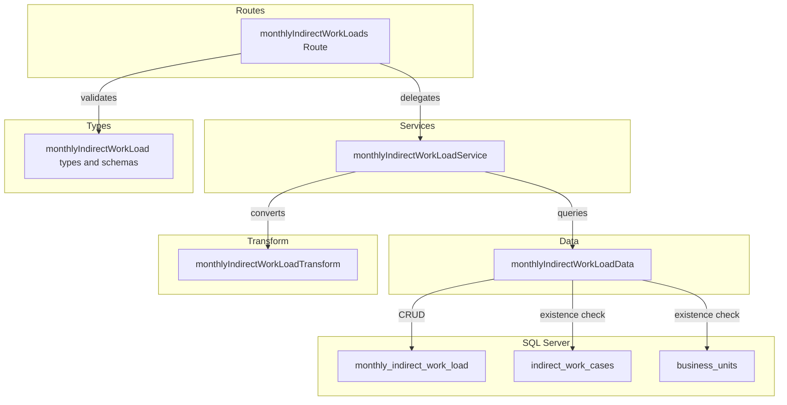
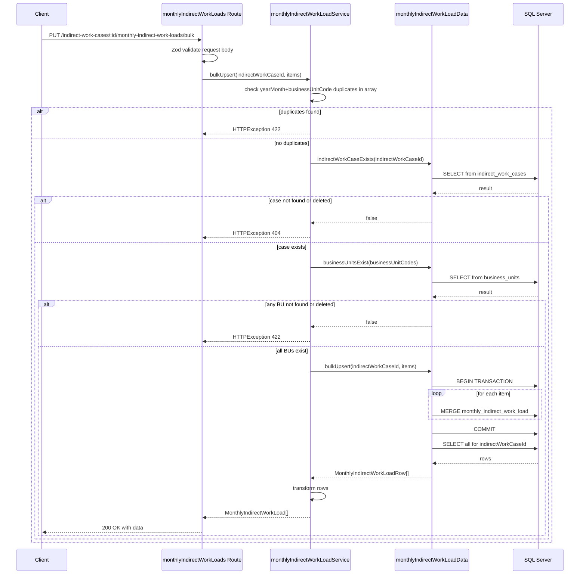
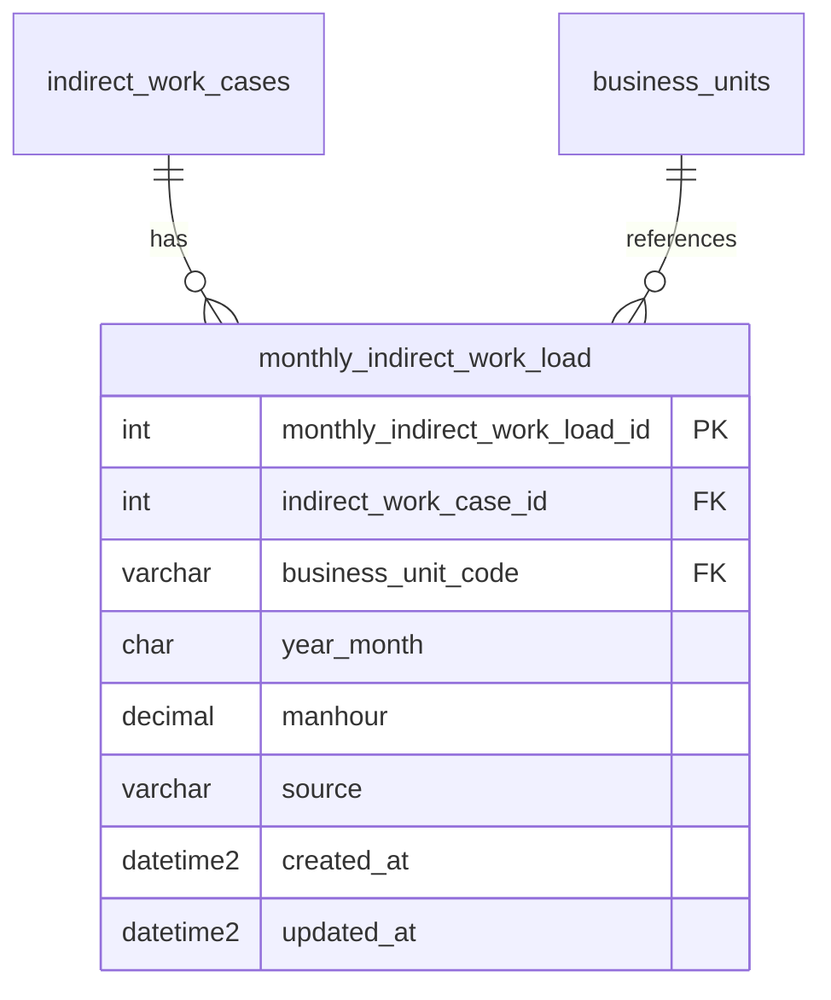

# 月次間接作業負荷データ CRUD API

> **元spec**: monthly-indirect-work-load-crud-api

## 概要

間接作業ケース（indirect_work_cases）に紐づく月次間接作業負荷データ（monthly_indirect_work_load）の CRUD API を提供し、間接作業工数計画の入力・管理を可能にする。

- **ユーザー**: 事業部リーダーが月次の間接作業負荷の入力・修正・一括更新に利用
- **影響範囲**: バックエンドに routes/services/data/transform/types の各ファイルを新設し、`index.ts` にルートをマウント
- **テーブル分類**: ファクトテーブル（物理削除・deleted_at なし・ページネーションなし）

### Non-Goals

- indirect_work_cases テーブルの CRUD（別スペックで実装済み）
- フロントエンド実装
- 認証・認可の実装
- 間接作業負荷の自動計算ロジック

## 要件

### 要件1: 一覧取得

GET `/indirect-work-cases/:indirectWorkCaseId/monthly-indirect-work-loads` で間接作業負荷データ一覧を `{ data: [...] }` 形式で返却する。`business_unit_code` 昇順、`year_month` 昇順でソート。親ケース不存在/論理削除済みの場合は 404。

### 要件2: 単一取得

GET `.../:monthlyIndirectWorkLoadId` で詳細を `{ data: {...} }` 形式で返却。不存在時は 404。indirectWorkCaseId 不一致時も 404。

### 要件3: 新規作成

POST で新規作成し、201 Created + Location ヘッダを返却。Zod スキーマでバリデーション（businessUnitCode, yearMonth, manhour, source）。親ケース不存在 404、BU 不存在 422、BU+yearMonth 重複 409。

### 要件4: 更新

PUT で更新し、200 OK を返却。全フィールド任意。updated_at を自動更新。不存在 404、BU+yearMonth 重複 409、BU 不存在 422。

### 要件5: 物理削除

DELETE で物理削除し、204 No Content を返却。不存在 404、indirectWorkCaseId 不一致 404。

### 要件6: バルク Upsert

PUT `/bulk` で一括登録・更新。`{ items: [...] }` 形式。既存レコードは更新、新規は作成。トランザクション内で実行し、失敗時は全体ロールバック。配列内 BU+yearMonth 重複 422、BU 不存在 422。

### 要件7: APIレスポンス形式

- 成功時: `{ data: ... }` 形式
- エラー時: RFC 9457 Problem Details 形式（Content-Type: `application/problem+json`）
- camelCase フィールド、日時は ISO 8601、manhour は数値型（小数点以下2桁）

### 要件8: バリデーション

- パスパラメータ: 正の整数（Zod）
- yearMonth: YYYYMM 6桁（月は 01〜12）
- manhour: 0 以上 99999999.99 以下
- businessUnitCode: 1〜20文字
- source: "calculated" | "manual"

## アーキテクチャ・設計

既存バックエンドのレイヤードアーキテクチャを踏襲する。



| Layer | Technology | Notes |
|-------|-----------|-------|
| Backend | Hono v4 | ルート定義・リクエスト処理 |
| Validation | Zod + validate ヘルパー | 既存パターン利用 |
| Data | mssql | SQL Server・MERGE 文（バルク Upsert） |
| Testing | Vitest | app.request() パターン |

## APIコントラクト

ベースパス: `/indirect-work-cases/:indirectWorkCaseId/monthly-indirect-work-loads`

| Method | Endpoint | Request | Response | Errors |
|--------|----------|---------|----------|--------|
| GET | / | - | `{ data: MonthlyIndirectWorkLoad[] }` 200 | 404, 422 |
| GET | /:monthlyIndirectWorkLoadId | param: int | `{ data: MonthlyIndirectWorkLoad }` 200 | 404, 422 |
| POST | / | json: createSchema | `{ data: MonthlyIndirectWorkLoad }` 201 + Location | 404, 409, 422 |
| PUT | /bulk | json: bulkUpsertSchema | `{ data: MonthlyIndirectWorkLoad[] }` 200 | 404, 422 |
| PUT | /:monthlyIndirectWorkLoadId | json: updateSchema | `{ data: MonthlyIndirectWorkLoad }` 200 | 404, 409, 422 |
| DELETE | /:monthlyIndirectWorkLoadId | - | 204 No Content | 404 |

**注意**: `PUT /bulk` は `PUT /:monthlyIndirectWorkLoadId` より前に定義してルーティング衝突を回避する。

### バルク Upsert フロー



## データモデル



| Column | Type | Nullable | Description |
|--------|------|----------|-------------|
| monthly_indirect_work_load_id | INT IDENTITY(1,1) | NO | 主キー |
| indirect_work_case_id | INT | NO | FK → indirect_work_cases(ON DELETE CASCADE) |
| business_unit_code | VARCHAR(20) | NO | FK → business_units |
| year_month | CHAR(6) | NO | 年月 YYYYMM |
| manhour | DECIMAL(10,2) | NO | 工数（人時） |
| source | VARCHAR(20) | NO | データソース（calculated/manual） |
| created_at | DATETIME2 | NO | 作成日時 |
| updated_at | DATETIME2 | NO | 更新日時 |

**ユニークインデックス**: UQ_monthly_indirect_work_load_case_bu_ym (indirect_work_case_id, business_unit_code, year_month)

**ビジネスルール**:
- 同一 indirect_work_case_id + business_unit_code 内で year_month は一意
- 物理削除（deleted_at なし）
- 親テーブル削除時は ON DELETE CASCADE で自動削除
- source は "calculated" または "manual" のいずれか

### 型定義

```typescript
// Zod スキーマ
const createMonthlyIndirectWorkLoadSchema = z.object({
  businessUnitCode: z.string().min(1).max(20),
  yearMonth: z.string(), // regex + refine で YYYYMM 検証
  manhour: z.number().min(0).max(99999999.99),
  source: z.enum(["calculated", "manual"]),
})

const updateMonthlyIndirectWorkLoadSchema = z.object({
  businessUnitCode: z.string().min(1).max(20).optional(),
  yearMonth: z.string().optional(),
  manhour: z.number().min(0).max(99999999.99).optional(),
  source: z.enum(["calculated", "manual"]).optional(),
})

const bulkUpsertMonthlyIndirectWorkLoadSchema = z.object({
  items: z.array(z.object({
    businessUnitCode: z.string().min(1).max(20),
    yearMonth: z.string(),
    manhour: z.number().min(0).max(99999999.99),
    source: z.enum(["calculated", "manual"]),
  })).min(1),
})

// DB 行型（snake_case）
type MonthlyIndirectWorkLoadRow = {
  monthly_indirect_work_load_id: number
  indirect_work_case_id: number
  business_unit_code: string
  year_month: string
  manhour: number
  source: string
  created_at: Date
  updated_at: Date
}

// API レスポンス型（camelCase）
type MonthlyIndirectWorkLoad = {
  monthlyIndirectWorkLoadId: number
  indirectWorkCaseId: number
  businessUnitCode: string
  yearMonth: string
  manhour: number
  source: string
  createdAt: string  // ISO 8601
  updatedAt: string  // ISO 8601
}
```

### Data Layer インターフェース

```typescript
interface MonthlyIndirectWorkLoadDataInterface {
  findAll(indirectWorkCaseId: number): Promise<MonthlyIndirectWorkLoadRow[]>
  findById(monthlyIndirectWorkLoadId: number): Promise<MonthlyIndirectWorkLoadRow | undefined>
  create(data: { indirectWorkCaseId: number; businessUnitCode: string; yearMonth: string; manhour: number; source: string }): Promise<MonthlyIndirectWorkLoadRow>
  update(monthlyIndirectWorkLoadId: number, data: Partial<{ businessUnitCode: string; yearMonth: string; manhour: number; source: string }>): Promise<MonthlyIndirectWorkLoadRow | undefined>
  deleteById(monthlyIndirectWorkLoadId: number): Promise<boolean>
  bulkUpsert(indirectWorkCaseId: number, items: Array<{ businessUnitCode: string; yearMonth: string; manhour: number; source: string }>): Promise<MonthlyIndirectWorkLoadRow[]>
  indirectWorkCaseExists(indirectWorkCaseId: number): Promise<boolean>
  businessUnitExists(businessUnitCode: string): Promise<boolean>
  businessUnitsExist(businessUnitCodes: string[]): Promise<boolean>
  uniqueKeyExists(indirectWorkCaseId: number, businessUnitCode: string, yearMonth: string, excludeId?: number): Promise<boolean>
}
```

### Service Layer インターフェース

```typescript
interface MonthlyIndirectWorkLoadServiceInterface {
  findAll(indirectWorkCaseId: number): Promise<MonthlyIndirectWorkLoad[]>
  findById(indirectWorkCaseId: number, monthlyIndirectWorkLoadId: number): Promise<MonthlyIndirectWorkLoad>
  create(indirectWorkCaseId: number, data: CreateMonthlyIndirectWorkLoad): Promise<MonthlyIndirectWorkLoad>
  update(indirectWorkCaseId: number, monthlyIndirectWorkLoadId: number, data: UpdateMonthlyIndirectWorkLoad): Promise<MonthlyIndirectWorkLoad>
  delete(indirectWorkCaseId: number, monthlyIndirectWorkLoadId: number): Promise<void>
  bulkUpsert(indirectWorkCaseId: number, data: BulkUpsertMonthlyIndirectWorkLoad): Promise<MonthlyIndirectWorkLoad[]>
}
```

### Transform

```typescript
function toMonthlyIndirectWorkLoadResponse(row: MonthlyIndirectWorkLoadRow): MonthlyIndirectWorkLoad
```

- snake_case → camelCase のフィールド名変換
- Date → ISO 8601 文字列変換
- manhour は number 型のまま返却

## エラーハンドリング

既存のグローバルエラーハンドラ（`index.ts` の `app.onError`）と validate ヘルパー（`utils/validate.ts`）を利用。新規のエラーハンドリングコードは不要。

| Category | Status | Trigger |
|----------|--------|---------|
| バリデーション | 422 | Zod スキーマ不適合、パスパラメータ不正、バルク配列内重複、BU 不存在 |
| リソース不存在 | 404 | indirectWorkCaseId 不存在/論理削除済み、monthlyIndirectWorkLoadId 不存在、ID 不一致 |
| 競合 | 409 | (indirect_work_case_id, business_unit_code, year_month) ユニーク制約違反 |
| 内部エラー | 500 | 予期しない例外（グローバルハンドラ） |

## ファイル構成

```
apps/backend/src/
├── routes/monthlyIndirectWorkLoads.ts      # エンドポイント定義
├── services/monthlyIndirectWorkLoadService.ts  # ビジネスロジック
├── data/monthlyIndirectWorkLoadData.ts     # SQL クエリ実行
├── transform/monthlyIndirectWorkLoadTransform.ts  # snake_case → camelCase 変換
├── types/monthlyIndirectWorkLoad.ts        # Zod スキーマ・型定義
└── __tests__/routes/monthlyIndirectWorkLoads.test.ts  # テスト
```
