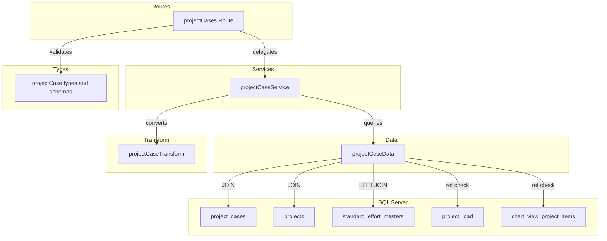
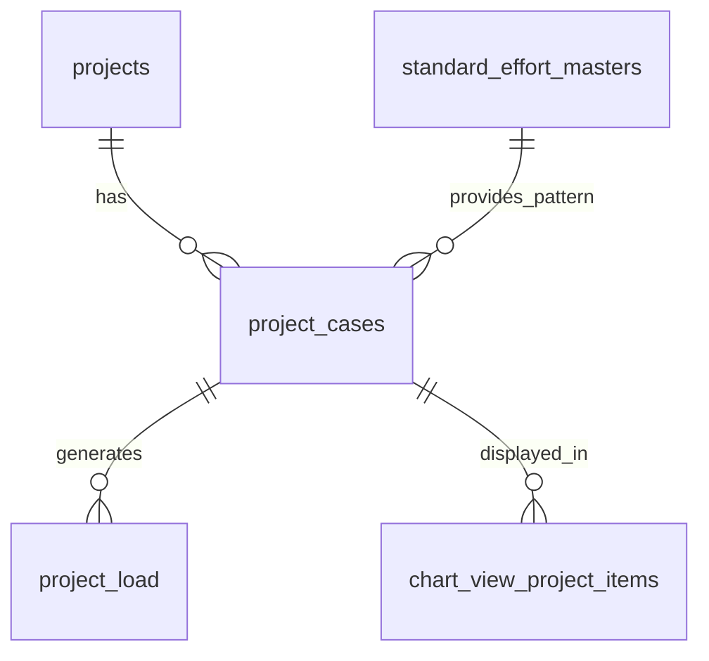

# 案件ケース CRUD API

> **元spec**: project-cases-crud-api

## 概要

案件ケース（project_cases）の CRUD API を提供し、1つの案件に対する複数の工数計画パターン（楽観/標準/悲観等）の管理を可能にする。

- **ユーザー**: プロジェクトマネージャーが案件ごとの工数シミュレーションに利用
- **影響範囲**: バックエンドに新規エンティティの CRUD エンドポイントを追加。既存の routes/services/data/transform/types レイヤーに project_cases 用ファイルを新設
- **ルーティング**: projects の子リソースとして `/projects/:projectId/project-cases` にネストマウント

## 要件

### 一覧取得
- `GET /projects/:projectId/project-cases` でページネーション付き一覧を返却
- `data` 配列 + `meta.pagination`（currentPage, pageSize, totalItems, totalPages）
- ソフトデリート済みレコードはデフォルト除外、`filter[includeDisabled]=true` で含める
- 外部キー付随名称（projectName, standardEffortName）を JOIN で取得
- `created_at` 昇順ソート
- 存在しない projectId → 404

### 単一取得
- `GET /projects/:projectId/project-cases/:projectCaseId` で詳細取得
- projectId 不一致 / 不存在 / ソフトデリート済み → 404

### 新規作成
- `POST /projects/:projectId/project-cases` → 201 Created + Location ヘッダ
- バリデーション: caseName（必須・最大100文字）、isPrimary（boolean）、description（任意・最大500文字）、calculationType（'MANUAL'|'STANDARD'）、standardEffortId（任意・整数）、startYearMonth（任意・YYYYMM形式）、durationMonths（任意・正の整数）、totalManhour（任意・非負整数）
- calculationType が 'STANDARD' かつ standardEffortId 未指定 → 422
- standardEffortId が存在しない → 422

### 更新
- `PUT /projects/:projectId/project-cases/:projectCaseId` → 200 OK
- 作成時と同一フィールド（すべて任意）
- `updated_at` を自動更新

### 論理削除
- `DELETE /projects/:projectId/project-cases/:projectCaseId` → 204 No Content
- 他リソース（project_load, chart_view_project_items）から参照されている場合 → 409 Conflict

### 復元
- `POST /projects/:projectId/project-cases/:projectCaseId/actions/restore` → 200 OK
- 未削除状態のケースに対する復元 → 409 Conflict

### 共通仕様
- 全エラーレスポンスは RFC 9457 Problem Details 形式
- パスパラメータは正の整数としてバリデーション
- レスポンスフィールドは camelCase
- startYearMonth は YYYYMM（6桁数字）

## アーキテクチャ・設計

### レイヤード構成



### 技術スタック

| Layer | Choice | Role |
|-------|--------|------|
| Backend | Hono v4 | ルート定義・リクエスト処理 |
| Validation | Zod + @hono/zod-validator | リクエストバリデーション |
| Data | mssql | SQL Server 接続・JOIN クエリ |
| Testing | Vitest | app.request() パターン |

## APIコントラクト

| Method | Endpoint | Request | Response | Errors |
|--------|----------|---------|----------|--------|
| GET | / | query: projectCaseListQuerySchema | `{ data: ProjectCase[], meta: { pagination } }` 200 | 404, 422 |
| GET | /:projectCaseId | param: projectCaseId (int) | `{ data: ProjectCase }` 200 | 404, 422 |
| POST | / | json: createProjectCaseSchema | `{ data: ProjectCase }` 201 + Location | 404, 409, 422 |
| PUT | /:projectCaseId | json: updateProjectCaseSchema | `{ data: ProjectCase }` 200 | 404, 422 |
| DELETE | /:projectCaseId | - | 204 No Content | 404, 409 |
| POST | /:projectCaseId/actions/restore | - | `{ data: ProjectCase }` 200 | 404, 409 |

**マウント**: `app.route('/projects/:projectId/project-cases', projectCases)`

## データモデル

### ER図



### project_cases テーブル

| Column | Type | Nullable | Description |
|--------|------|----------|-------------|
| project_case_id | INT IDENTITY(1,1) | NO | 主キー |
| project_id | INT | NO | FK → projects |
| case_name | NVARCHAR(100) | NO | ケース名 |
| is_primary | BIT | NO (default 0) | プライマリケースフラグ |
| description | NVARCHAR(500) | YES | 説明 |
| calculation_type | VARCHAR(10) | NO (default 'MANUAL') | 計算タイプ |
| standard_effort_id | INT | YES | FK → standard_effort_masters |
| start_year_month | CHAR(6) | YES | 開始年月 YYYYMM |
| duration_months | INT | YES | 期間（月数） |
| total_manhour | INT | YES | 総工数（人時） |
| created_at | DATETIME2 | NO | 作成日時 |
| updated_at | DATETIME2 | NO | 更新日時 |
| deleted_at | DATETIME2 | YES | 削除日時 |

### ビジネスルール
- calculationType = 'STANDARD' の場合、standard_effort_id は必須
- is_primary は同一 project_id 内での選定ケース（ユニーク制約なし）
- 削除は論理削除（deleted_at）

### 型定義

```typescript
// Zod スキーマ
const createProjectCaseSchema: z.ZodObject<{
  caseName: z.ZodString            // min(1).max(100)
  isPrimary: z.ZodDefault<z.ZodBoolean>  // default(false)
  description: z.ZodOptional<z.ZodString>  // max(500)
  calculationType: z.ZodDefault<z.ZodEnum<['MANUAL', 'STANDARD']>>  // default('MANUAL')
  standardEffortId: z.ZodOptional<z.ZodNumber>  // int().positive()
  startYearMonth: z.ZodOptional<z.ZodString>  // regex(/^\d{6}$/)
  durationMonths: z.ZodOptional<z.ZodNumber>  // int().positive()
  totalManhour: z.ZodOptional<z.ZodNumber>  // int().min(0)
}>

// DB行型（snake_case）
type ProjectCaseRow = {
  project_case_id: number
  project_id: number
  case_name: string
  is_primary: boolean
  description: string | null
  calculation_type: string
  standard_effort_id: number | null
  start_year_month: string | null
  duration_months: number | null
  total_manhour: number | null
  created_at: Date
  updated_at: Date
  deleted_at: Date | null
  project_name: string           // JOIN
  standard_effort_name: string | null  // JOIN
}

// APIレスポンス型（camelCase）
type ProjectCase = {
  projectCaseId: number
  projectId: number
  caseName: string
  isPrimary: boolean
  description: string | null
  calculationType: string
  standardEffortId: number | null
  startYearMonth: string | null
  durationMonths: number | null
  totalManhour: number | null
  createdAt: string
  updatedAt: string
  projectName: string
  standardEffortName: string | null
}
```

## エラーハンドリング

既存のグローバルエラーハンドラ（`app.onError`）と validate ヘルパーを利用。

| Category | Status | Trigger |
|----------|--------|---------|
| バリデーション | 422 | Zod スキーマ不適合、パスパラメータ不正 |
| リソース不存在 | 404 | projectId/projectCaseId 不存在、ソフトデリート済み、projectId 不一致 |
| 競合 | 409 | 参照されたケースの削除試行、未削除ケースの復元試行 |
| 内部エラー | 500 | 予期しない例外 |

## ファイル構成

| ファイル | レイヤー | 役割 |
|---------|---------|------|
| `src/types/projectCase.ts` | Types | Zod スキーマ・型定義 |
| `src/data/projectCaseData.ts` | Data | SQL クエリ実行・JOIN |
| `src/transform/projectCaseTransform.ts` | Transform | snake_case → camelCase 変換 |
| `src/services/projectCaseService.ts` | Service | ビジネスロジック・エラーハンドリング |
| `src/routes/projectCases.ts` | Routes | エンドポイント定義 |
| `src/__tests__/routes/projectCases.test.ts` | Test | ユニットテスト |
