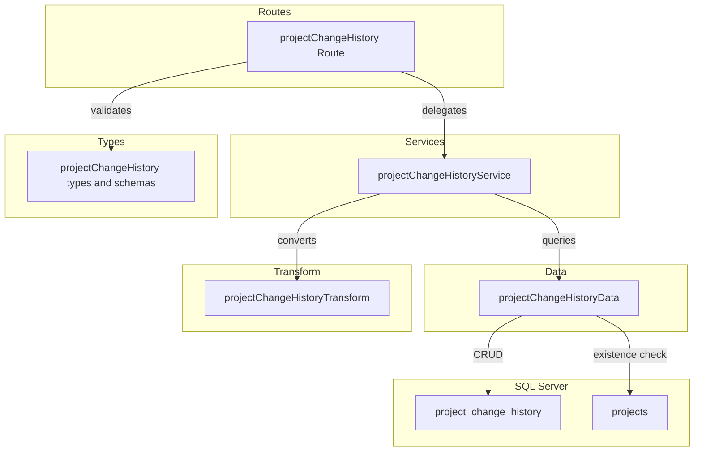
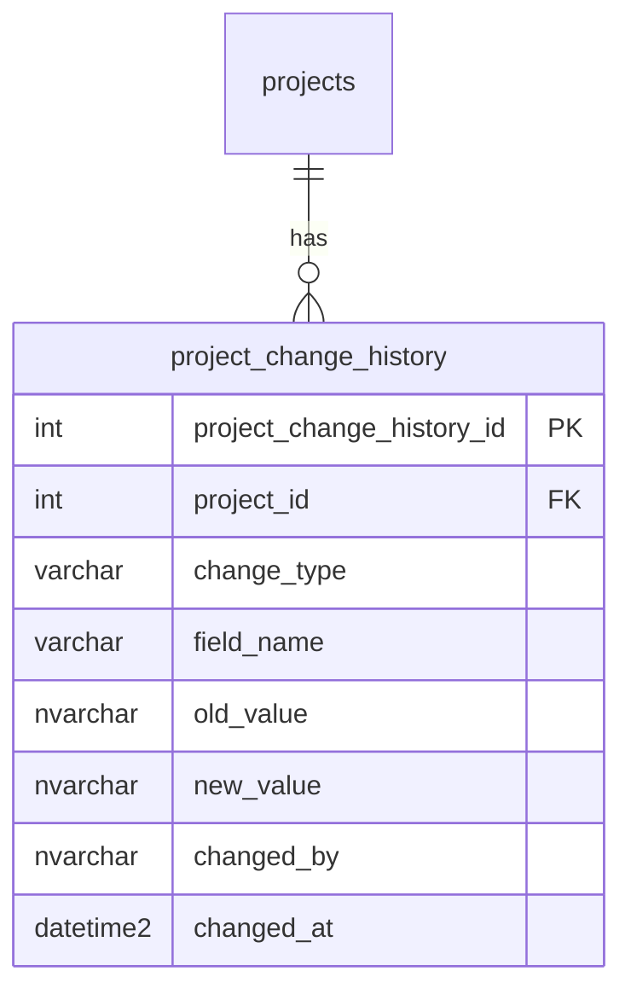

# 案件変更履歴 CRUD API

> **元spec**: project-change-history-crud-api

## 概要

案件（projects）に紐づく変更履歴（`project_change_history`）の CRUD API を提供し、案件の変更追跡・監査を可能にする。

- **ユーザー**: プロジェクトマネージャーが変更経緯を確認、システムが変更時に履歴を記録
- **テーブル分類**: 関連テーブル（物理削除・deleted_at なし）
- **特性**: 更新エンドポイントなし（履歴の不変性を担保）、ページネーションなし（全件返却）、`changed_at` のみの特殊カラム構成

## 要件

### 一覧取得
- `GET /projects/:projectId/change-history` で指定 projectId に紐づく変更履歴一覧を `{ data: [...] }` 形式で返却
- `changed_at` の降順（新しい変更が先頭）でソート
- 親案件が不存在または論理削除済みの場合は 404

### 単一取得
- `GET /projects/:projectId/change-history/:projectChangeHistoryId` で変更履歴の詳細を `{ data: {...} }` 形式で返却
- 不存在の場合は 404、projectId との不一致の場合も 404

### 新規作成
- `POST /projects/:projectId/change-history` で変更履歴を作成し、201 + `Location` ヘッダを返却
- リクエストボディ:
  - `changeType`（必須, 50文字以内）
  - `fieldName`（任意, 100文字以内）
  - `oldValue`（任意, 1000文字以内）
  - `newValue`（任意, 1000文字以内）
  - `changedBy`（必須, 100文字以内）
- 親案件が不存在または論理削除済みの場合は 404

### 物理削除
- `DELETE /projects/:projectId/change-history/:projectChangeHistoryId` で物理削除し、204 を返却
- 不存在の場合は 404、projectId との不一致の場合も 404

### レスポンス形式
- 成功時: `{ data: ... }` 形式
- エラー時: RFC 9457 Problem Details 形式
- フィールド名: camelCase（`projectChangeHistoryId`, `projectId`, `changeType`, `fieldName`, `oldValue`, `newValue`, `changedBy`, `changedAt`）
- `changedAt` は ISO 8601 形式

## アーキテクチャ・設計

### レイヤード構成



### 技術スタック

| レイヤー | 選択 | 役割 |
|---------|------|------|
| Backend | Hono v4 | ルート定義・リクエスト処理 |
| Validation | Zod + validate ヘルパー | リクエストバリデーション |
| Data | mssql | SQL Server 接続・クエリ実行 |

### 主要コンポーネント

| コンポーネント | レイヤー | 責務 |
|--------------|---------|------|
| projectChangeHistory Route | Routes | エンドポイント定義 |
| projectChangeHistoryService | Services | 親リソース存在確認、projectId 親子整合性チェック |
| projectChangeHistoryData | Data | CRD SQL クエリ実行、projects 存在確認 |
| projectChangeHistoryTransform | Transform | snake_case → camelCase 変換、Date → ISO 8601 |
| projectChangeHistory types | Types | Zod スキーマ・型定義 |

## API コントラクト

ベースパス: `/projects/:projectId/change-history`

| Method | Endpoint | Request | Response | Errors |
|--------|----------|---------|----------|--------|
| GET | / | - | `{ data: ProjectChangeHistory[] }` 200 | 404, 422 |
| GET | /:projectChangeHistoryId | param: int | `{ data: ProjectChangeHistory }` 200 | 404, 422 |
| POST | / | json: createProjectChangeHistorySchema | `{ data: ProjectChangeHistory }` 201 + Location | 404, 422 |
| DELETE | /:projectChangeHistoryId | - | 204 No Content | 404 |

### 型定義

```typescript
// Zod スキーマ
const createProjectChangeHistorySchema: z.ZodObject<{
  changeType: z.ZodString       // 必須・min(1).max(50)
  fieldName: z.ZodOptional<z.ZodString>   // 任意・max(100)
  oldValue: z.ZodOptional<z.ZodString>    // 任意・max(1000)
  newValue: z.ZodOptional<z.ZodString>    // 任意・max(1000)
  changedBy: z.ZodString        // 必須・min(1).max(100)
}>

// DB 行型
type ProjectChangeHistoryRow = {
  project_change_history_id: number
  project_id: number
  change_type: string
  field_name: string | null
  old_value: string | null
  new_value: string | null
  changed_by: string
  changed_at: Date
}

// API レスポンス型
type ProjectChangeHistory = {
  projectChangeHistoryId: number
  projectId: number
  changeType: string
  fieldName: string | null
  oldValue: string | null
  newValue: string | null
  changedBy: string
  changedAt: string       // ISO 8601
}
```

## データモデル



| カラム名 | データ型 | NULL | デフォルト | 説明 |
|---------|---------|------|-----------|------|
| project_change_history_id | INT IDENTITY(1,1) | NO | - | 主キー |
| project_id | INT | NO | - | FK → projects(ON DELETE CASCADE) |
| change_type | VARCHAR(50) | NO | - | 変更タイプ |
| field_name | VARCHAR(100) | YES | NULL | 変更フィールド名 |
| old_value | NVARCHAR(1000) | YES | NULL | 変更前の値 |
| new_value | NVARCHAR(1000) | YES | NULL | 変更後の値 |
| changed_by | NVARCHAR(100) | NO | - | 変更者 |
| changed_at | DATETIME2 | NO | GETDATE() | 変更日時 |

**インデックス**:
- PK_project_change_history (project_change_history_id)
- IX_project_change_history_project (project_id)
- IX_project_change_history_changed_at (changed_at)

**ビジネスルール**:
- 物理削除（deleted_at なし）
- 親テーブル削除時は ON DELETE CASCADE で自動削除
- `changed_at` は DB のデフォルト値（GETDATE()）で自動設定
- 一度作成された履歴レコードは更新不可（不変性）

## エラーハンドリング

| カテゴリ | ステータス | 発生条件 |
|---------|----------|---------|
| バリデーション | 422 | Zod スキーマ不適合、パスパラメータ不正 |
| リソース不存在 | 404 | projectId 不存在/論理削除済み、projectChangeHistoryId 不存在、projectId 不一致 |
| 内部エラー | 500 | 予期しない例外（グローバルハンドラ） |

既存のグローバルエラーハンドラと validate ヘルパーを利用。新規のエラーハンドリングコードは不要。

## ファイル構成

```
apps/backend/src/
├── types/
│   └── projectChangeHistory.ts
├── data/
│   └── projectChangeHistoryData.ts
├── transform/
│   └── projectChangeHistoryTransform.ts
├── services/
│   └── projectChangeHistoryService.ts
├── routes/
│   └── projectChangeHistory.ts
└── __tests__/
    └── routes/
        └── projectChangeHistory.test.ts
```

統合ポイント: `index.ts` に `app.route('/projects/:projectId/change-history', projectChangeHistory)` でマウント。
