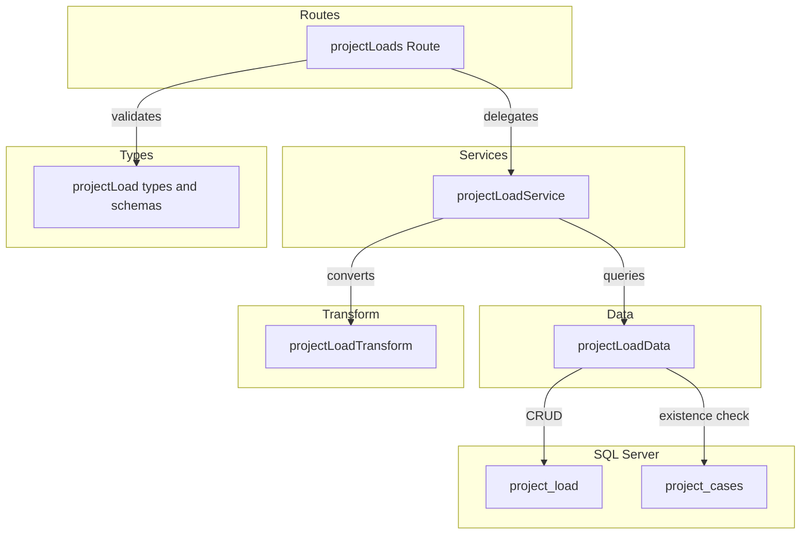
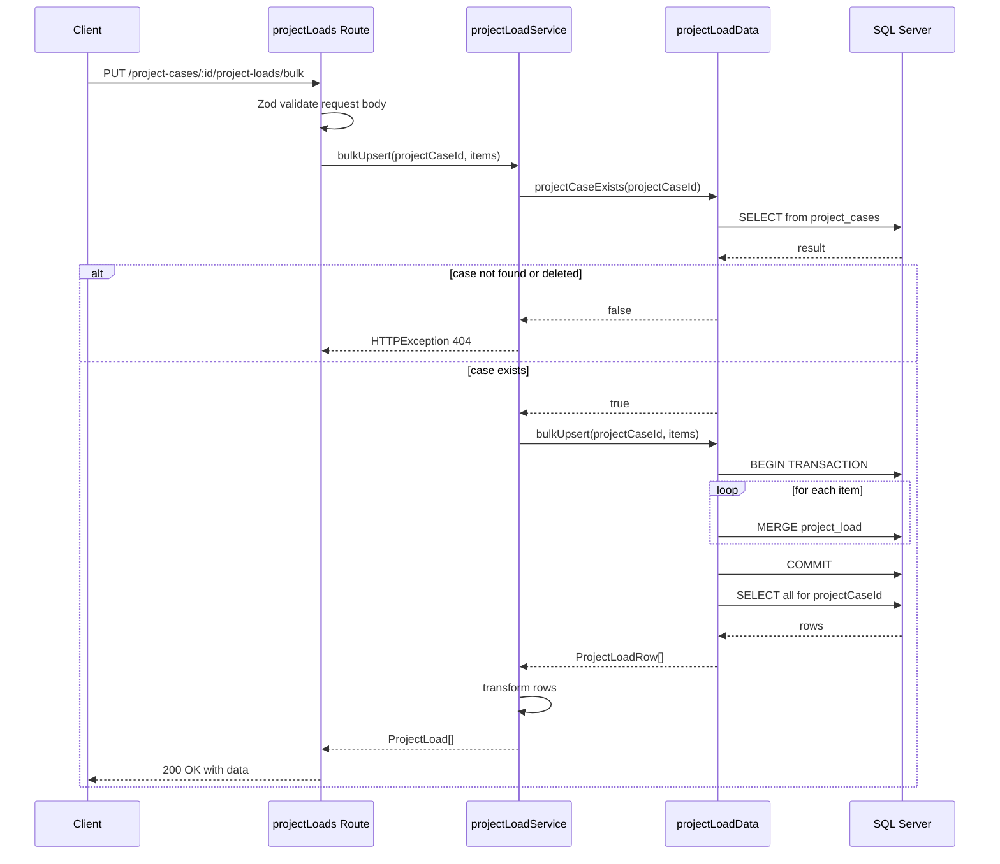
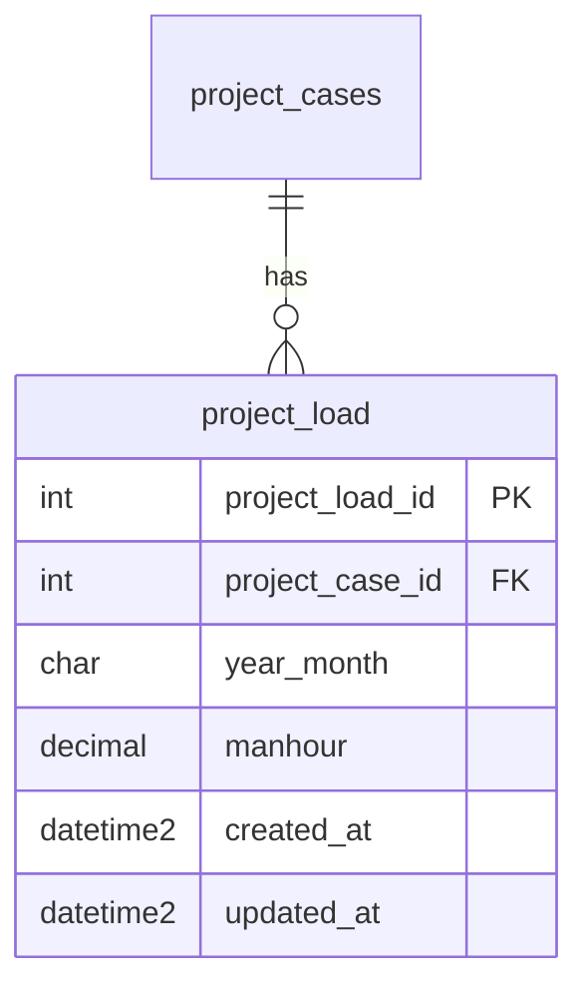

# 案件負荷データ CRUD API

> **元spec**: project-load-crud-api

## 概要

案件ケース（project_cases）に紐づく月次負荷データ（project_load）の CRUD API を提供し、工数計画の入力・管理を可能にする。

- **ユーザー**: プロジェクトマネージャーが月次工数の入力・修正・一括更新に利用
- **影響範囲**: バックエンドに routes/services/data/transform/types の各ファイルを新設し、`index.ts` にルートをマウント
- **テーブル分類**: ファクトテーブル（物理削除・deleted_at なし・ページネーションなし）

### Non-Goals

- project_cases テーブルの CRUD（別スペックで実装済み）
- フロントエンド実装
- 認証・認可の実装
- 標準工数パターンからの自動計算ロジック

## 要件

### 要件1: 一覧取得

GET `/project-cases/:projectCaseId/project-loads` で負荷データ一覧を `{ data: [...] }` 形式で返却する。`year_month` 昇順でソート。親ケース不存在/論理削除済みの場合は 404。

### 要件2: 単一取得

GET `.../:projectLoadId` で詳細を `{ data: {...} }` 形式で返却。不存在時は 404。projectCaseId 不一致時も 404。

### 要件3: 新規作成

POST で新規作成し、201 Created + Location ヘッダを返却。Zod スキーマでバリデーション（yearMonth, manhour）。親ケース不存在 404、yearMonth 重複 409。

### 要件4: 更新

PUT で更新し、200 OK を返却。全フィールド任意。updated_at を自動更新。不存在 404、yearMonth 重複 409。

### 要件5: 物理削除

DELETE で物理削除し、204 No Content を返却。不存在 404、projectCaseId 不一致 404。

### 要件6: バルク Upsert

PUT `/bulk` で一括登録・更新。`{ items: [{ yearMonth, manhour }, ...] }` 形式。既存レコードは更新、新規は作成。トランザクション内で実行し、失敗時は全体ロールバック。配列内 yearMonth 重複 422。

### 要件7: APIレスポンス形式

- 成功時: `{ data: ... }` 形式
- エラー時: RFC 9457 Problem Details 形式（Content-Type: `application/problem+json`）
- camelCase フィールド、日時は ISO 8601、manhour は数値型（小数点以下2桁）

### 要件8: バリデーション

- パスパラメータ: 正の整数（Zod）
- yearMonth: YYYYMM 6桁（月は 01〜12）
- manhour: 0 以上 99999999.99 以下

## アーキテクチャ・設計

既存バックエンドのレイヤードアーキテクチャを踏襲する。



| Layer | Technology | Notes |
|-------|-----------|-------|
| Backend | Hono v4 | ルート定義・リクエスト処理 |
| Validation | Zod + validate ヘルパー | 既存パターン利用 |
| Data | mssql | SQL Server・MERGE 文（バルク Upsert） |
| Testing | Vitest | app.request() パターン |

## APIコントラクト

ベースパス: `/project-cases/:projectCaseId/project-loads`

| Method | Endpoint | Request | Response | Errors |
|--------|----------|---------|----------|--------|
| GET | / | - | `{ data: ProjectLoad[] }` 200 | 404, 422 |
| GET | /:projectLoadId | param: int | `{ data: ProjectLoad }` 200 | 404, 422 |
| POST | / | json: createSchema | `{ data: ProjectLoad }` 201 + Location | 404, 409, 422 |
| PUT | /bulk | json: bulkUpsertSchema | `{ data: ProjectLoad[] }` 200 | 404, 422 |
| PUT | /:projectLoadId | json: updateSchema | `{ data: ProjectLoad }` 200 | 404, 409, 422 |
| DELETE | /:projectLoadId | - | 204 No Content | 404 |

**注意**: `PUT /bulk` は `PUT /:projectLoadId` より前に定義してルーティング衝突を回避する。

### バルク Upsert フロー



## データモデル



| Column | Type | Nullable | Description |
|--------|------|----------|-------------|
| project_load_id | INT IDENTITY(1,1) | NO | 主キー |
| project_case_id | INT | NO | FK → project_cases(ON DELETE CASCADE) |
| year_month | CHAR(6) | NO | 年月 YYYYMM |
| manhour | DECIMAL(10,2) | NO | 工数（人時） |
| created_at | DATETIME2 | NO | 作成日時 |
| updated_at | DATETIME2 | NO | 更新日時 |

**ユニークインデックス**: UQ_project_load_case_ym (project_case_id, year_month)

**ビジネスルール**:
- 同一 project_case_id 内で year_month は一意
- 物理削除（deleted_at なし）
- 親テーブル削除時は ON DELETE CASCADE で自動削除

### 型定義

```typescript
// Zod スキーマ
const createProjectLoadSchema = z.object({
  yearMonth: z.string(), // regex + refine で YYYYMM 検証
  manhour: z.number().min(0).max(99999999.99),
})

const updateProjectLoadSchema = z.object({
  yearMonth: z.string().optional(),
  manhour: z.number().min(0).max(99999999.99).optional(),
})

const bulkUpsertProjectLoadSchema = z.object({
  items: z.array(z.object({
    yearMonth: z.string(),
    manhour: z.number().min(0).max(99999999.99),
  })).min(1),
})

// DB 行型（snake_case）
type ProjectLoadRow = {
  project_load_id: number
  project_case_id: number
  year_month: string
  manhour: number
  created_at: Date
  updated_at: Date
}

// API レスポンス型（camelCase）
type ProjectLoad = {
  projectLoadId: number
  projectCaseId: number
  yearMonth: string
  manhour: number
  createdAt: string  // ISO 8601
  updatedAt: string  // ISO 8601
}
```

### Data Layer インターフェース

```typescript
interface ProjectLoadDataInterface {
  findAll(projectCaseId: number): Promise<ProjectLoadRow[]>
  findById(projectLoadId: number): Promise<ProjectLoadRow | undefined>
  create(data: { projectCaseId: number; yearMonth: string; manhour: number }): Promise<ProjectLoadRow>
  update(projectLoadId: number, data: Partial<{ yearMonth: string; manhour: number }>): Promise<ProjectLoadRow | undefined>
  deleteById(projectLoadId: number): Promise<boolean>
  bulkUpsert(projectCaseId: number, items: Array<{ yearMonth: string; manhour: number }>): Promise<ProjectLoadRow[]>
  projectCaseExists(projectCaseId: number): Promise<boolean>
  yearMonthExists(projectCaseId: number, yearMonth: string, excludeId?: number): Promise<boolean>
}
```

### Service Layer インターフェース

```typescript
interface ProjectLoadServiceInterface {
  findAll(projectCaseId: number): Promise<ProjectLoad[]>
  findById(projectCaseId: number, projectLoadId: number): Promise<ProjectLoad>
  create(projectCaseId: number, data: CreateProjectLoad): Promise<ProjectLoad>
  update(projectCaseId: number, projectLoadId: number, data: UpdateProjectLoad): Promise<ProjectLoad>
  delete(projectCaseId: number, projectLoadId: number): Promise<void>
  bulkUpsert(projectCaseId: number, data: BulkUpsertProjectLoad): Promise<ProjectLoad[]>
}
```

### Transform

```typescript
function toProjectLoadResponse(row: ProjectLoadRow): ProjectLoad
```

- snake_case → camelCase のフィールド名変換
- Date → ISO 8601 文字列変換
- manhour は number 型のまま返却

## エラーハンドリング

既存のグローバルエラーハンドラ（`index.ts` の `app.onError`）と validate ヘルパー（`utils/validate.ts`）を利用。新規のエラーハンドリングコードは不要。

| Category | Status | Trigger |
|----------|--------|---------|
| バリデーション | 422 | Zod スキーマ不適合、パスパラメータ不正、バルク配列内 yearMonth 重複 |
| リソース不存在 | 404 | projectCaseId 不存在/論理削除済み、projectLoadId 不存在、ID 不一致 |
| 競合 | 409 | year_month ユニーク制約違反（create/update 時） |
| 内部エラー | 500 | 予期しない例外（グローバルハンドラ） |

## ファイル構成

```
apps/backend/src/
├── routes/projectLoads.ts                 # エンドポイント定義
├── services/projectLoadService.ts         # ビジネスロジック
├── data/projectLoadData.ts                # SQL クエリ実行
├── transform/projectLoadTransform.ts      # snake_case → camelCase 変換
├── types/projectLoad.ts                   # Zod スキーマ・型定義
└── __tests__/routes/projectLoads.test.ts  # テスト
```
