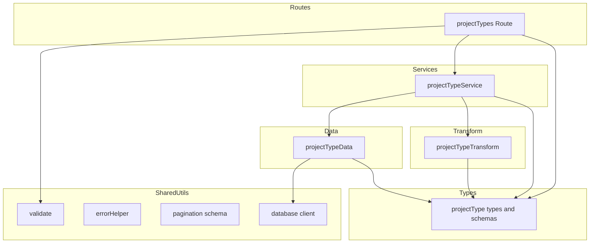

# 案件タイプ CRUD API

> **元spec**: project-types-crud

## 概要

案件タイプ（`project_types`）マスタテーブルに対する CRUD API を提供する。案件タイプは案件の分類に使用されるマスタデータであり、一覧取得・単一取得・作成・更新・論理削除・復元の6つの操作をサポートする。

- **ユーザー**: API 利用者（フロントエンドアプリケーション、外部連携サービス）
- **影響**: 既存の `business-units` API と一貫したインターフェース・アーキテクチャを維持

## 要件

### 一覧取得
- `GET /project-types` で論理削除されていない案件タイプ一覧を `display_order` 昇順で返却
- `page[number]` / `page[size]` によるページネーション対応（`meta.pagination` 含む）
- `filter[includeDisabled]=true` で論理削除済みも含む一覧を取得可能
- クエリバリデーションエラー時は RFC 9457 形式で 422 を返却

### 単一取得
- `GET /project-types/:projectTypeCode` で指定コードの案件タイプを返却
- 不存在または論理削除済みの場合は 404 を返却

### 新規作成
- `POST /project-types` で案件タイプを作成し、201 + `Location` ヘッダを返却
- リクエストボディ: `projectTypeCode`（必須, 最大20文字）、`name`（必須, 最大100文字）、`displayOrder`（任意, 整数, デフォルト0）
- 同一コード既存時（論理削除済み含む）は 409 を返却

### 更新
- `PUT /project-types/:projectTypeCode` で案件タイプを更新し、200 を返却
- リクエストボディ: `name`（必須, 最大100文字）、`displayOrder`（任意, 整数）
- `updated_at` を自動更新

### 論理削除
- `DELETE /project-types/:projectTypeCode` で `deleted_at` に現在日時を設定し、204 を返却
- 他テーブル（projects, standard_effort_masters）から参照中の場合は 409 を返却

### 復元
- `POST /project-types/:projectTypeCode/actions/restore` で `deleted_at` を NULL に設定し、200 を返却
- 未削除の場合は 409、不存在の場合は 404 を返却

### バリデーション
- `projectTypeCode`: 1〜20文字、`/^[a-zA-Z0-9_-]+$/`
- `name`: 1〜100文字
- `displayOrder`: 0 以上の整数
- 複数エラーは `errors` 配列にまとめて返却

## アーキテクチャ・設計

### レイヤード構成

既存の `business-units` CRUD API が確立した3層アーキテクチャ（Routes → Services → Data + Transform）を完全に踏襲する。



### 技術スタック

| レイヤー | 選択 | 役割 |
|---------|------|------|
| Backend | Hono | ルーティング・ミドルウェア |
| Validation | Zod + @hono/zod-validator | リクエストバリデーション（既存 `validate()` を再利用） |
| Data | mssql | MSSQL クエリ実行（既存 `getPool()` を再利用） |

### 主要コンポーネント

| コンポーネント | レイヤー | 責務 |
|--------------|---------|------|
| projectTypes Route | Routes | HTTP エンドポイント定義 |
| projectTypeService | Services | ビジネスロジック・エラー判定（404/409） |
| projectTypeData | Data | MSSQL クエリ実行 |
| projectTypeTransform | Transform | DB行 → API レスポンス変換（snake_case → camelCase） |
| projectType types | Types | Zod スキーマ・TypeScript 型定義 |

## API コントラクト

| Method | Endpoint | Request | Response | Errors |
|--------|----------|---------|----------|--------|
| GET | /project-types | Query: page[number], page[size], filter[includeDisabled] | 200: `{ data: ProjectType[], meta: { pagination } }` | 422 |
| GET | /project-types/:projectTypeCode | Param: projectTypeCode | 200: `{ data: ProjectType }` | 404 |
| POST | /project-types | Body: { projectTypeCode, name, displayOrder? } | 201: `{ data: ProjectType }` + Location header | 409, 422 |
| PUT | /project-types/:projectTypeCode | Param + Body: { name, displayOrder? } | 200: `{ data: ProjectType }` | 404, 422 |
| DELETE | /project-types/:projectTypeCode | Param: projectTypeCode | 204: No Content | 404, 409 |
| POST | /project-types/:projectTypeCode/actions/restore | Param: projectTypeCode | 200: `{ data: ProjectType }` | 404, 409 |

### 型定義

```typescript
// Zod スキーマ
const createProjectTypeSchema: z.ZodObject<{
  projectTypeCode: z.ZodString    // 1-20文字, /^[a-zA-Z0-9_-]+$/
  name: z.ZodString               // 1-100文字
  displayOrder: z.ZodDefault<z.ZodNumber>  // int, min(0), default(0)
}>

const updateProjectTypeSchema: z.ZodObject<{
  name: z.ZodString               // 1-100文字
  displayOrder: z.ZodOptional<z.ZodNumber>  // int, min(0), optional
}>

// DB 行型
type ProjectTypeRow = {
  project_type_code: string
  name: string
  display_order: number
  created_at: Date
  updated_at: Date
  deleted_at: Date | null
}

// API レスポンス型
type ProjectType = {
  projectTypeCode: string
  name: string
  displayOrder: number
  createdAt: string
  updatedAt: string
}
```

## データモデル

| カラム名 | データ型 | NULL | デフォルト | 説明 |
|---------|---------|------|-----------|------|
| project_type_code | VARCHAR(20) | NO | - | 主キー。案件タイプコード |
| name | NVARCHAR(100) | NO | - | 案件タイプ名 |
| display_order | INT | NO | 0 | 表示順序 |
| created_at | DATETIME2 | NO | GETDATE() | 作成日時 |
| updated_at | DATETIME2 | NO | GETDATE() | 更新日時 |
| deleted_at | DATETIME2 | YES | NULL | 削除日時（論理削除） |

**参照元テーブル**:
- `projects.project_type_code` → FK_projects_project_type
- `standard_effort_masters.project_type_code` → FK_standard_effort_masters_pt

**ビジネスルール**:
- コードは作成後に変更不可
- 論理削除済みのコードは新規作成に再利用不可（復元のみ可能）
- 他テーブルから参照されている場合は削除不可

## エラーハンドリング

| エラー種別 | ステータス | 発生条件 |
|-----------|----------|---------|
| バリデーションエラー | 422 | Zod スキーマ違反 |
| リソース未検出 | 404 | コード不一致 or 論理削除済み |
| 重複コンフリクト | 409 | 同一コード既存（論理削除済み含む） |
| 参照コンフリクト | 409 | 他テーブルから参照中の削除 |
| 未削除コンフリクト | 409 | 未削除リソースの復元要求 |

既存のグローバルエラーハンドラ（`app.onError`）を活用。サービス層で `HTTPException` を throw し、グローバルハンドラが RFC 9457 形式に変換する。

## ファイル構成

```
apps/backend/src/
├── types/
│   └── projectType.ts
├── data/
│   └── projectTypeData.ts
├── transform/
│   └── projectTypeTransform.ts
├── services/
│   └── projectTypeService.ts
├── routes/
│   └── projectTypes.ts
└── __tests__/
    ├── types/projectType.test.ts
    ├── transform/projectTypeTransform.test.ts
    ├── data/projectTypeData.test.ts
    ├── services/projectTypeService.test.ts
    └── routes/projectTypes.test.ts
```

統合ポイント: `src/index.ts` に `app.route('/project-types', projectTypes)` を追加して登録。
