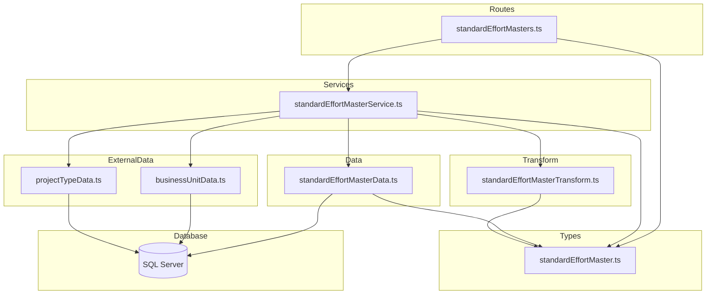
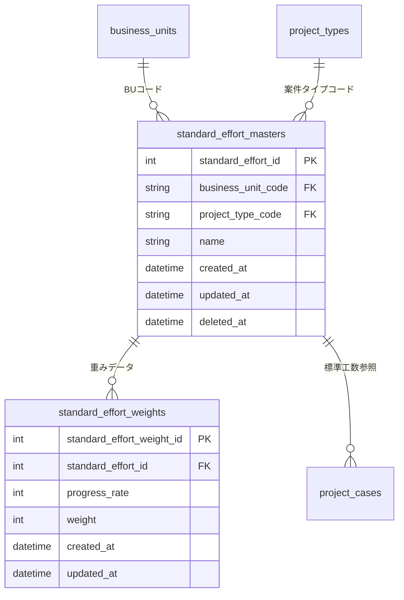

# 標準工数マスタ CRUD API

> **元spec**: standard-effort-masters-crud-api

## 概要

標準工数マスタ（`standard_effort_masters`）の CRUD API を提供し、事業部リーダーが BU x 案件タイプごとの標準工数パターン（Sカーブ・バスタブカーブ等）の登録・参照・更新・削除を行えるようにする。

- **ユーザー**: 事業部リーダー、フロントエンド開発者
- **影響**: 既存 CRUD エンティティに続く新規実装。子テーブル（`standard_effort_weights`）との親子操作パターンを新たに導入する点が、既存実装との主な差異

## 要件

### 一覧取得
- `GET /standard-effort-masters` でページネーション付き一覧を返却（デフォルト: page=1, pageSize=20）
- 論理削除レコードをデフォルトで除外、`filter[includeDisabled]=true` で含める
- `filter[businessUnitCode]` / `filter[projectTypeCode]` による絞り込み対応
- `meta.pagination` を含むレスポンス

### 単一取得
- `GET /standard-effort-masters/:id` で指定 ID の標準工数マスタを `weights` 配列を含めて返却
- 不存在または論理削除済みの場合は 404 を返却

### 新規作成
- `POST /standard-effort-masters` でマスタを作成し、201 + `Location` ヘッダを返却
- リクエストボディ: `businessUnitCode`（必須, 1〜20文字）、`projectTypeCode`（必須, 1〜20文字）、`name`（必須, 1〜100文字）、`weights`（任意, 重み配列）
- `weights` の各要素: `progressRate`（必須, 0〜100の整数）、`weight`（必須, 0以上の整数）
- `businessUnitCode` / `projectTypeCode` が存在しない場合は 422
- 同一 `businessUnitCode` + `projectTypeCode` + `name` の重複時は 409

### 更新
- `PUT /standard-effort-masters/:id` でマスタを更新し、200 を返却
- リクエストボディ: `name`（任意, 1〜100文字）、`weights`（任意, 重み配列で全置換）
- `weights` 指定時は既存 weights を全削除して新しいデータで置換
- 更新後の `name` が同一 BU+PT の他レコードと重複する場合は 409

### 論理削除
- `DELETE /standard-effort-masters/:id` で論理削除し、204 を返却
- 他リソース（project_cases 等）から参照中の場合は 409

### 復元
- `POST /standard-effort-masters/:id/actions/restore` で論理削除済みマスタを復元し、200 を返却
- 復元後の複合ユニークキーが既存有効レコードと重複する場合は 409

### レスポンス形式
- 成功時: `{ data: ... }` 形式、一覧時は `meta.pagination` 含む
- エラー時: RFC 9457 Problem Details 形式
- フィールド名: camelCase（`standardEffortId`, `businessUnitCode`, `projectTypeCode` 等）
- 日時: ISO 8601 形式
- 単一取得時は `weights` 配列（`standardEffortWeightId`, `progressRate`, `weight`）を含む

## アーキテクチャ・設計

### レイヤード構成



### 技術スタック

| レイヤー | 選択 | 役割 | 備考 |
|---------|------|------|------|
| Backend | Hono v4 | ルーティング・ミドルウェア | 既存と同一 |
| Validation | Zod + @hono/zod-validator | リクエストバリデーション | weights 配列のネストバリデーション |
| Data | mssql | SQL Server クエリ実行 | **トランザクション（sql.Transaction）を新規使用** |

### 主要コンポーネント

| コンポーネント | レイヤー | 責務 |
|--------------|---------|------|
| standardEffortMasters.ts | Routes | HTTP エンドポイント定義 |
| standardEffortMasterService.ts | Service | FK検証・ユニーク制約チェック・参照整合性チェック |
| standardEffortMasterData.ts | Data | SQL クエリ実行（トランザクション含む） |
| standardEffortMasterTransform.ts | Transform | Row → Response 変換 |
| standardEffortMaster.ts | Types | Zod スキーマ・型定義 |

## API コントラクト

| Method | Endpoint | Request | Response | Status | Errors |
|--------|----------|---------|----------|--------|--------|
| GET | / | StandardEffortMasterListQuery (query) | `{ data: StandardEffortMasterSummary[], meta: { pagination } }` | 200 | 422 |
| GET | /:id | id: number (path) | `{ data: StandardEffortMasterDetail }` | 200 | 404 |
| POST | / | CreateStandardEffortMaster (json) | `{ data: StandardEffortMasterDetail }` + Location header | 201 | 409, 422 |
| PUT | /:id | id + UpdateStandardEffortMaster (json) | `{ data: StandardEffortMasterDetail }` | 200 | 404, 409, 422 |
| DELETE | /:id | id: number (path) | (no body) | 204 | 404, 409 |
| POST | /:id/actions/restore | id: number (path) | `{ data: StandardEffortMasterDetail }` | 200 | 404, 409 |

### 型定義

```typescript
// 重み要素
type WeightItem = {
  progressRate: number  // 0〜100の整数
  weight: number        // 0以上の整数
}

// 作成リクエスト
type CreateStandardEffortMaster = {
  businessUnitCode: string  // 1〜20文字, /^[a-zA-Z0-9_-]+$/
  projectTypeCode: string   // 1〜20文字, /^[a-zA-Z0-9_-]+$/
  name: string              // 1〜100文字
  weights?: WeightItem[]
}

// 更新リクエスト
type UpdateStandardEffortMaster = {
  name?: string             // 1〜100文字
  weights?: WeightItem[]    // 全置換
}

// API レスポンス型（一覧用）
type StandardEffortMasterSummary = {
  standardEffortId: number
  businessUnitCode: string
  projectTypeCode: string
  name: string
  createdAt: string   // ISO 8601
  updatedAt: string   // ISO 8601
}

// API レスポンス型（重み）
type StandardEffortWeight = {
  standardEffortWeightId: number
  progressRate: number
  weight: number
}

// API レスポンス型（詳細）
type StandardEffortMasterDetail = StandardEffortMasterSummary & {
  weights: StandardEffortWeight[]
}
```

### レスポンス例

単一取得:
```json
{
  "data": {
    "standardEffortId": 1,
    "businessUnitCode": "BU001",
    "projectTypeCode": "PT001",
    "name": "Sカーブパターン",
    "createdAt": "2026-01-31T00:00:00.000Z",
    "updatedAt": "2026-01-31T00:00:00.000Z",
    "weights": [
      { "standardEffortWeightId": 1, "progressRate": 0, "weight": 0 },
      { "standardEffortWeightId": 2, "progressRate": 5, "weight": 1 },
      { "standardEffortWeightId": 3, "progressRate": 10, "weight": 3 },
      { "standardEffortWeightId": 4, "progressRate": 50, "weight": 10 },
      { "standardEffortWeightId": 5, "progressRate": 100, "weight": 0 }
    ]
  }
}
```

## データモデル



### standard_effort_masters

| カラム名 | データ型 | NULL | デフォルト | 説明 |
|---------|---------|------|-----------|------|
| standard_effort_id | INT | NO | IDENTITY(1,1) | 主キー。自動採番 |
| business_unit_code | VARCHAR(20) | NO | - | FK → business_units |
| project_type_code | VARCHAR(20) | NO | - | FK → project_types |
| name | NVARCHAR(100) | NO | - | パターン名 |
| created_at | DATETIME2 | NO | GETDATE() | 作成日時 |
| updated_at | DATETIME2 | NO | GETDATE() | 更新日時 |
| deleted_at | DATETIME2 | YES | NULL | 削除日時（論理削除） |

**ユニーク制約**: `(business_unit_code, project_type_code, name)` — `deleted_at IS NULL` の場合

### standard_effort_weights

| カラム名 | データ型 | NULL | デフォルト | 説明 |
|---------|---------|------|-----------|------|
| standard_effort_weight_id | INT | NO | IDENTITY(1,1) | 主キー。自動採番 |
| standard_effort_id | INT | NO | - | FK → standard_effort_masters |
| progress_rate | INT | NO | - | 進捗率（0, 5, 10, ... 100） |
| weight | INT | NO | - | 重み（非負整数） |
| created_at | DATETIME2 | NO | GETDATE() | 作成日時 |
| updated_at | DATETIME2 | NO | GETDATE() | 更新日時 |

**ビジネスルール**:
- `standard_effort_id` は自動採番（IDENTITY）、変更不可
- (business_unit_code, project_type_code, name) は `deleted_at IS NULL` のレコード間でユニーク
- business_unit_code / project_type_code は作成時に確定し、更新では変更不可
- weights の progress_rate は同一 standard_effort_id 内でユニーク
- standard_effort_weights は ON DELETE CASCADE（親の物理削除時のみ）
- 論理削除前に project_cases からの参照がないことを確認

## エラーハンドリング

| ステータス | タイプ | 発生条件 | メッセージ例 |
|----------|------|---------|------------|
| 404 | resource-not-found | ID不存在、論理削除済み | `Standard effort master with ID '{id}' not found` |
| 409 | conflict | ユニーク制約違反（作成・更新・復元時） | `Standard effort master with name '{name}' already exists for business unit '{buCode}' and project type '{ptCode}'` |
| 409 | conflict | 参照整合性違反（削除時） | `Standard effort master with ID '{id}' is referenced by other resources and cannot be deleted` |
| 422 | validation-error | Zodバリデーション失敗 | errors 配列にフィールド別詳細 |
| 422 | validation-error | FK存在チェック失敗 | `Business unit with code '{code}' not found` |

## ファイル構成

```
apps/backend/src/
├── types/
│   └── standardEffortMaster.ts
├── data/
│   └── standardEffortMasterData.ts
├── transform/
│   └── standardEffortMasterTransform.ts
├── services/
│   └── standardEffortMasterService.ts
├── routes/
│   └── standardEffortMasters.ts
└── __tests__/
    ├── types/standardEffortMaster.test.ts
    ├── transform/standardEffortMasterTransform.test.ts
    ├── data/standardEffortMasterData.test.ts
    ├── services/standardEffortMasterService.test.ts
    └── routes/standardEffortMasters.test.ts
```

統合ポイント: `app.route('/standard-effort-masters', standardEffortMasters)` で index.ts にマウント。
