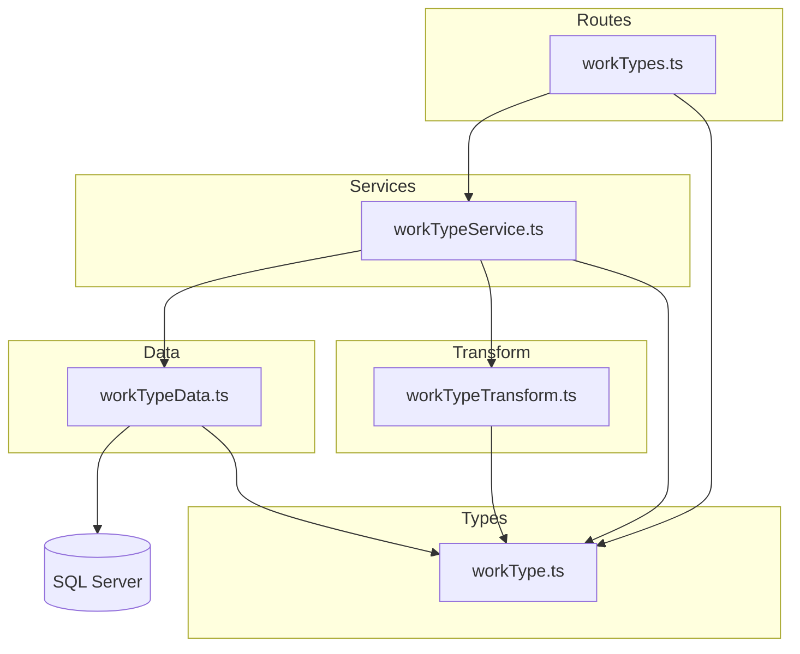

# 作業種類 CRUD API

> **元spec**: work-types

## 概要

作業種類（`work_types`）マスタデータの CRUD API を提供し、間接作業の分類管理を可能にする。

- **ユーザー**: システム管理者が作業種類の登録・参照・更新・削除・復元を行う
- **影響**: 新規 API エンドポイント群（`/work-types`）を追加。既存の business_units CRUD パターンを踏襲し、`color` フィールドの追加と参照整合性チェック対象の変更が主な差分

## 要件

### 一覧取得
- `GET /work-types` で論理削除されていない作業種類一覧を返却（200）
- `page[number]` / `page[size]` によるページネーション対応（`meta.pagination` 含む）
- `filter[includeDisabled]=true` で論理削除済みも含む一覧を取得可能
- 各レコードを camelCase 形式（workTypeCode, name, displayOrder, color, createdAt, updatedAt）で返却
- クエリバリデーションエラー時は RFC 9457 形式で 422 を返却

### 単一取得
- `GET /work-types/:workTypeCode` で指定コードの作業種類を返却
- 不存在または論理削除済みの場合は 404 を返却

### 新規作成
- `POST /work-types` で作業種類を作成し、201 + `Location` ヘッダを返却
- リクエストボディ: `workTypeCode`（必須, 1-20文字, 英数字・ハイフン・アンダースコア）、`name`（必須, 1-100文字）、`displayOrder`（任意, 0以上整数, デフォルト0）、`color`（任意, `#RRGGBB` 形式）
- 同一コード既存時（論理削除済み含む）は 409 を返却。削除済みの場合は復元を促すメッセージを含める

### 更新
- `PUT /work-types/:workTypeCode` で作業種類を更新し、200 を返却
- リクエストボディ: `name`（必須, 1-100文字）、`displayOrder`（任意, 0以上整数）、`color`（任意, null または `#RRGGBB` 形式）

### 論理削除
- `DELETE /work-types/:workTypeCode` で `deleted_at` に現在日時を設定し、204 を返却
- 他リソース（indirect_work_type_ratios 等）から参照中の場合は 409 を返却

### 復元
- `POST /work-types/:workTypeCode/actions/restore` で論理削除済みの作業種類を復元し、200 を返却
- 不存在の場合は 404、アクティブ状態の場合は 409 を返却

## アーキテクチャ・設計

### レイヤード構成

既存の business_units CRUD API が確立した4層アーキテクチャを踏襲する。



### 技術スタック

| レイヤー | 選択 | 役割 |
|---------|------|------|
| Backend | Hono | HTTP ルーティング・バリデーション |
| Validation | Zod + @hono/zod-validator | リクエストバリデーション |
| Data | mssql | SQL Server アクセス |

### 主要コンポーネント

| コンポーネント | レイヤー | 責務 |
|--------------|---------|------|
| WorkTypesRoute | Routes | HTTP エンドポイント定義 |
| WorkTypeService | Services | 重複チェック、参照整合性チェック、論理削除状態の検証 |
| WorkTypeData | Data | SQL Server への parameterized query 実行 |
| WorkTypeTransform | Transform | `WorkTypeRow`（snake_case）→ `WorkType`（camelCase）の変換 |
| WorkType 型定義 | Types | Zod バリデーションスキーマと TypeScript 型定義 |

## API コントラクト

| メソッド | エンドポイント | リクエスト | レスポンス | エラー |
|---------|-------------|----------|----------|-------|
| GET | /work-types | workTypeListQuerySchema (query) | `{ data: WorkType[], meta: { pagination } }` | 422 |
| GET | /work-types/:workTypeCode | - | `{ data: WorkType }` | 404 |
| POST | /work-types | createWorkTypeSchema (body) | `{ data: WorkType }` + Location ヘッダ | 409, 422 |
| PUT | /work-types/:workTypeCode | updateWorkTypeSchema (body) | `{ data: WorkType }` | 404, 422 |
| DELETE | /work-types/:workTypeCode | - | 204 No Content | 404, 409 |
| POST | /work-types/:workTypeCode/actions/restore | - | `{ data: WorkType }` | 404, 409 |

### 型定義

```typescript
// Zod スキーマ
const createWorkTypeSchema: z.ZodObject<{
  workTypeCode: z.ZodString       // 必須, 1-20文字, /^[a-zA-Z0-9_-]+$/
  name: z.ZodString               // 必須, 1-100文字
  displayOrder: z.ZodDefault<z.ZodNumber>  // 任意, 0以上整数, デフォルト0
  color: z.ZodOptional<z.ZodNullable<z.ZodString>>  // 任意, /^#[0-9a-fA-F]{6}$/ または null
}>

const updateWorkTypeSchema: z.ZodObject<{
  name: z.ZodString               // 必須, 1-100文字
  displayOrder: z.ZodOptional<z.ZodNumber>  // 任意, 0以上整数
  color: z.ZodOptional<z.ZodNullable<z.ZodString>>  // 任意, /^#[0-9a-fA-F]{6}$/ または null
}>

// DB 行型
type WorkTypeRow = {
  work_type_code: string
  name: string
  display_order: number
  color: string | null
  created_at: Date
  updated_at: Date
  deleted_at: Date | null
}

// API レスポンス型
type WorkType = {
  workTypeCode: string
  name: string
  displayOrder: number
  color: string | null
  createdAt: string
  updatedAt: string
}
```

## データモデル

| カラム名 | データ型 | NULL | デフォルト | 説明 |
|---------|---------|------|-----------|------|
| work_type_code | VARCHAR(20) | NO | - | 主キー。作業種類コード |
| name | NVARCHAR(100) | NO | - | 作業種類名 |
| display_order | INT | NO | 0 | 表示順序 |
| color | VARCHAR(7) | YES | NULL | 表示カラーコード（例: #FF5733） |
| created_at | DATETIME2 | NO | GETDATE() | 作成日時 |
| updated_at | DATETIME2 | NO | GETDATE() | 更新日時 |
| deleted_at | DATETIME2 | YES | NULL | 削除日時（論理削除） |

**ビジネスルール**:
- `work_type_code` は一意かつ不変
- 参照されている WorkType は論理削除不可
- 論理削除済みの WorkType は同一コードで新規作成不可（復元を使用）
- `hasReferences` は `indirect_work_type_ratios` テーブルの存在チェック（物理削除テーブルのため deleted_at フィルタ不要）

## エラーハンドリング

| カテゴリ | ステータス | 発生条件 |
|---------|----------|---------|
| バリデーションエラー | 422 | 不正なクエリパラメータ/リクエストボディ |
| リソース未検出 | 404 | 存在しない/論理削除済みの workTypeCode |
| 競合 | 409 | 重複作成、参照ありの削除、アクティブ状態の復元 |

既存の `errorHelper.ts` とグローバルエラーハンドラを再利用。Service 層で `HTTPException` をスローし、グローバルハンドラが RFC 9457 形式に変換する。

## ファイル構成

```
apps/backend/src/
├── types/
│   └── workType.ts
├── data/
│   └── workTypeData.ts
├── transform/
│   └── workTypeTransform.ts
├── services/
│   └── workTypeService.ts
├── routes/
│   └── workTypes.ts
└── __tests__/
    ├── types/workType.test.ts
    ├── transform/workTypeTransform.test.ts
    ├── data/workTypeData.test.ts
    ├── services/workTypeService.test.ts
    └── routes/workTypes.test.ts
```

統合ポイント: `src/index.ts` に `app.route('/work-types', workTypes)` として登録。
