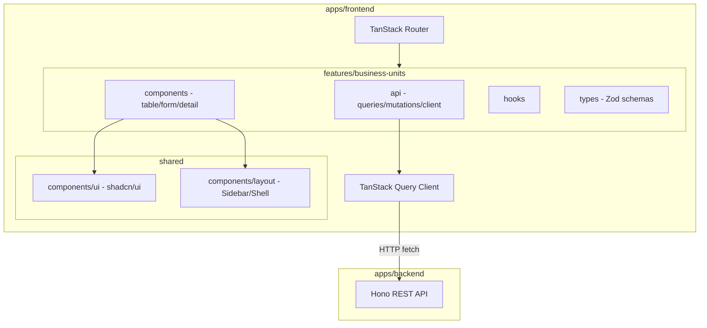
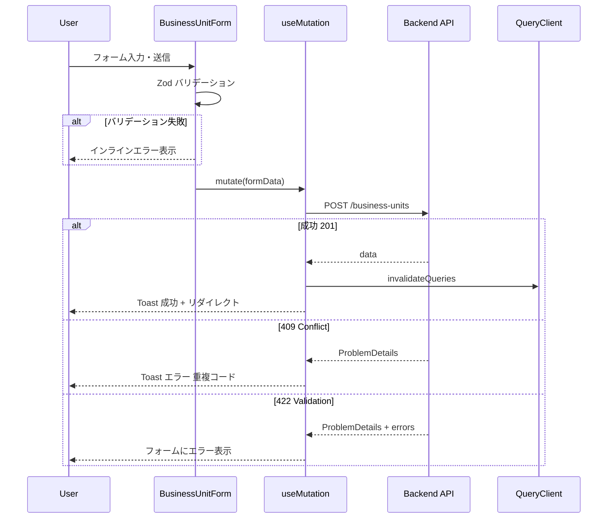
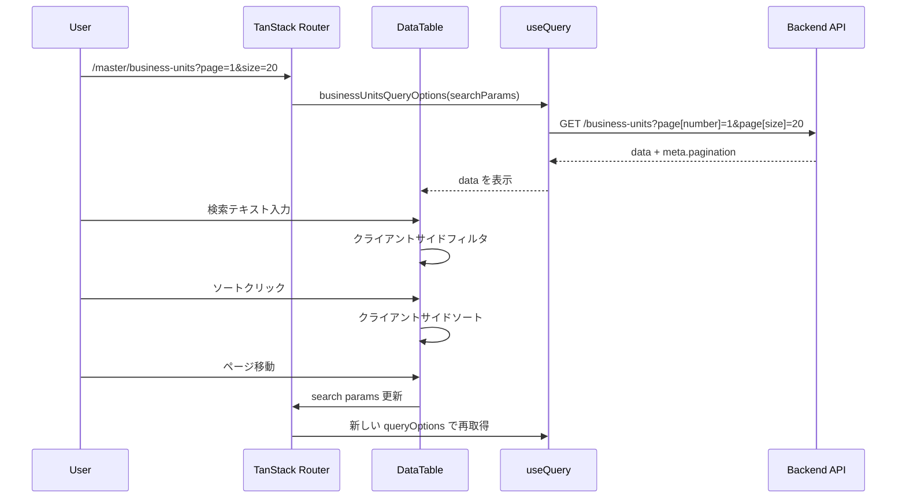

# ビジネスユニット マスター管理画面

> **元spec**: business-units-master-ui

## 概要

**目的**: ビジネスユニット（`business_units`）マスターデータの管理画面を提供し、管理者が組織単位の一覧閲覧・検索・詳細確認・新規登録・編集・削除・復元を行えるようにする。

**ユーザー**: 事業部リーダー・管理者が、マスターデータの日常的なメンテナンスに使用する。

**影響範囲**: 既存のバックエンド CRUD API（Hono）に対するフロントエンド UI を新規構築。バックエンドの変更は不要。`apps/frontend` プロジェクトの初期セットアップを含む。

## 要件

### 1. 一覧画面
- `GET /business-units` API を呼び出し、TanStack Table で一覧表示
- カラム: ビジネスユニットコード・名称・表示順・作成日時・更新日時
- ソート（各カラム昇順・降順）、ページネーション、ローディング状態、エラー表示

### 2. 検索・フィルタ
- テーブル上部に検索入力欄（コード/名称の部分一致、クライアントサイドフィルタ）
- 「削除済みを含む」トグル（`filter[includeDisabled]=true`）
- 削除済みレコードの視覚的区別（透明度低下 + 「削除済み」ステータスバッジ）

### 3. 詳細表示
- 行クリックで `/master/business-units/$businessUnitCode` に遷移
- 全フィールド表示、「編集」「削除」ボタン、パンくずリスト
- 存在しないコードの場合は 404 エラー画面

### 4. 新規登録
- `/master/business-units/new` にて TanStack Form + Zod バリデーション
- フィールド: コード（必須・最大20文字・英数字+ハイフン+アンダースコア）、名称（必須・最大100文字）、表示順（任意・0以上整数・デフォルト0）
- 成功時: 一覧にリダイレクト + 成功 Toast
- エラー: 409（重複コード）、422（バリデーション）

### 5. 編集
- `/master/business-units/$businessUnitCode/edit` にて現在値をプリフィル
- コードは読み取り専用、名称・表示順は編集可能
- 成功時: 詳細画面にリダイレクト + 成功 Toast

### 6. 削除
- 確認ダイアログ → `DELETE` API で論理削除 → 一覧にリダイレクト
- 409（参照制約）、404 のエラーハンドリング

### 7. 復元
- 削除済みトグル有効時に「復元」ボタン表示
- 確認ダイアログ → `POST /business-units/:code/actions/restore` → テーブル再取得

### 8. ルーティング
- TanStack Router ファイルベースルーティング
- ページネーション・検索条件を URL search params で管理

### 9. ビジュアルデザイン（nani.now スタイル）
- ゆとりのあるスペーシング（`gap-6` 以上、`p-6` 以上）
- 大きめの角丸（`rounded-xl` 〜 `rounded-2xl`）
- 控えめなシャドウ（`shadow-sm`）
- コンテンツ幅制限（`max-w-4xl`）
- テーブル行ホバーのトランジション（`transition-colors duration-150`）

### 10. インタラクション・フィードバック
- 成功 Toast（自動消滅）、エラー Toast（手動閉じ）
- フォームバリデーションエラーのインライン表示
- API リクエスト中のボタン無効化 + スピナー
- ステータスバッジ（アクティブ/削除済み）
- ページ遷移フェードイン、ボタンホバーのスケール変化

### 11. レイアウト・レスポンシブ
- サイドバー + メインコンテンツ領域レイアウト
- デスクトップ（1024px+）: サイドバー常時表示
- タブレット（768px〜1023px）: ハンバーガーメニューで折りたたみ

## アーキテクチャ・設計

### アーキテクチャパターン

Feature-first SPA 構成。`features/business-units/` にすべてのドメインロジックを凝集。



### 技術スタック

| Layer | Choice | Role |
|-------|--------|------|
| Build | Vite 6.x + TanStack Router Vite Plugin | ビルド・HMR |
| Routing | @tanstack/react-router + @tanstack/zod-adapter | ファイルベースルーティング |
| Data Fetching | @tanstack/react-query v5 | API データ取得・キャッシュ |
| Table | @tanstack/react-table v8 | ヘッドレス UI テーブル |
| Form | @tanstack/react-form v1 | フォーム状態管理 |
| UI | shadcn/ui | デザインシステムプリミティブ |
| Styling | Tailwind CSS v4 | ユーティリティファースト CSS |
| Validation | Zod v3 | スキーマ定義・型導出 |

## コンポーネント設計

### 主要コンポーネント

| Component | Layer | 役割 |
|-----------|-------|------|
| AppShell | Layout | サイドバー + メインコンテンツのシェルレイアウト |
| BusinessUnitListPage | Route/Page | 一覧画面 |
| BusinessUnitDetailPage | Route/Page | 詳細画面 |
| BusinessUnitNewPage | Route/Page | 新規登録画面 |
| BusinessUnitEditPage | Route/Page | 編集画面 |
| DataTable | Feature/UI | TanStack Table ラッパー |
| DataTableToolbar | Feature/UI | 検索・フィルタ・新規登録ボタン |
| BusinessUnitForm | Feature/UI | 新規登録・編集共通フォーム |
| DeleteConfirmDialog | Feature/UI | 削除確認ダイアログ |
| RestoreConfirmDialog | Feature/UI | 復元確認ダイアログ |
| StatusBadge | Shared/UI | アクティブ/削除済みバッジ |

### Props 定義

```typescript
type BusinessUnitFormProps = {
  mode: 'create' | 'edit'
  defaultValues?: BusinessUnitFormValues
  onSubmit: (values: BusinessUnitFormValues) => Promise<void>
  isSubmitting: boolean
}

type BusinessUnitFormValues = {
  businessUnitCode: string
  name: string
  displayOrder: number
}
```

### 状態管理

```typescript
type DataTableState = {
  sorting: SortingState
  globalFilter: string
  pagination: PaginationState
}

type SidebarState = {
  isOpen: boolean
  toggle: () => void
}
```

## データフロー

### 作成フロー



### 一覧表示・検索フロー



### API Contract

| Method | Endpoint | Request | Response | Errors |
|--------|----------|---------|----------|--------|
| GET | /business-units | `BusinessUnitListParams` | `PaginatedResponse<BusinessUnit>` | 422 |
| GET | /business-units/:code | - | `SingleResponse<BusinessUnit>` | 404 |
| POST | /business-units | `CreateBusinessUnitInput` | `SingleResponse<BusinessUnit>` | 409, 422 |
| PUT | /business-units/:code | `UpdateBusinessUnitInput` | `SingleResponse<BusinessUnit>` | 404, 422 |
| DELETE | /business-units/:code | - | 204 No Content | 404, 409 |
| POST | /business-units/:code/actions/restore | - | `SingleResponse<BusinessUnit>` | 404, 409 |

### Service Interface

```typescript
// queries.ts
function businessUnitsQueryOptions(params: BusinessUnitListParams): QueryOptions<PaginatedResponse<BusinessUnit>>
function businessUnitQueryOptions(code: string): QueryOptions<SingleResponse<BusinessUnit>>

// mutations.ts
function useCreateBusinessUnit(): UseMutationResult<BusinessUnit, ProblemDetails, CreateBusinessUnitInput>
function useUpdateBusinessUnit(code: string): UseMutationResult<BusinessUnit, ProblemDetails, UpdateBusinessUnitInput>
function useDeleteBusinessUnit(): UseMutationResult<void, ProblemDetails, string>
function useRestoreBusinessUnit(): UseMutationResult<BusinessUnit, ProblemDetails, string>
```

### データモデル

```typescript
type BusinessUnit = {
  businessUnitCode: string
  name: string
  displayOrder: number
  createdAt: string
  updatedAt: string
  deletedAt?: string | null
}
```

### Zod スキーマ

```typescript
const createBusinessUnitSchema = z.object({
  businessUnitCode: z.string().min(1).max(20).regex(/^[a-zA-Z0-9_-]+$/),
  name: z.string().min(1).max(100),
  displayOrder: z.number().int().min(0).default(0),
})

const updateBusinessUnitSchema = z.object({
  name: z.string().min(1).max(100),
  displayOrder: z.number().int().min(0).optional(),
})

const businessUnitSearchSchema = z.object({
  page: fallback(z.number().int().positive(), 1).default(1),
  pageSize: fallback(z.number().int().min(1).max(100), 20).default(20),
  search: fallback(z.string(), '').default(''),
  includeDisabled: fallback(z.boolean(), false).default(false),
})
```

## 画面構成・遷移

| ルート | 画面 |
|--------|------|
| `/master/business-units` | 一覧 |
| `/master/business-units/new` | 新規登録 |
| `/master/business-units/$businessUnitCode` | 詳細 |
| `/master/business-units/$businessUnitCode/edit` | 編集 |

## ファイル構成

```
apps/frontend/src/
├── routes/master/business-units/
│   ├── index.tsx          (一覧画面)
│   ├── new.tsx            (新規登録画面)
│   ├── $businessUnitCode/
│   │   ├── index.tsx      (詳細画面)
│   │   └── edit.tsx       (編集画面)
├── features/business-units/
│   ├── api/
│   │   ├── api-client.ts  (API クライアント)
│   │   ├── queries.ts     (queryOptions)
│   │   └── mutations.ts   (useMutation hooks)
│   ├── components/
│   │   ├── columns.tsx    (カラム定義)
│   │   ├── DataTable.tsx
│   │   ├── DataTableToolbar.tsx
│   │   ├── BusinessUnitForm.tsx
│   │   ├── DeleteConfirmDialog.tsx
│   │   └── RestoreConfirmDialog.tsx
│   ├── types/
│   │   └── index.ts       (Zod スキーマ・型)
│   └── index.ts           (パブリック API)
├── components/
│   ├── layout/
│   │   └── AppShell.tsx   (サイドバー + メインコンテンツ)
│   └── ui/                (shadcn/ui)
```
