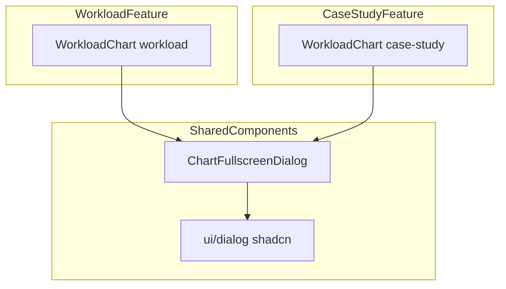
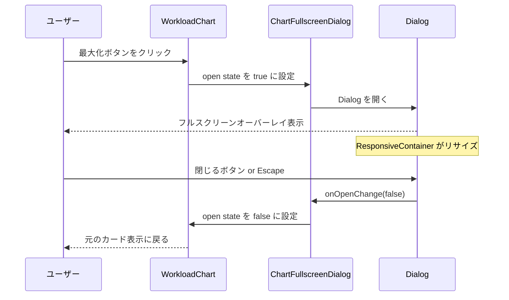

# チャートフルスクリーン表示

> **元spec**: chart-fullscreen-overlay

## 概要

山積グラフ（WorkloadChart）にフルスクリーン表示機能を追加し、データが密集している場合の視認性を向上させる。

- **ユーザー**: 事業部リーダー・プロジェクトマネージャーが工数チャートの詳細を確認する際に利用
- **影響範囲**: 既存の WorkloadChart コンポーネント 2 箇所に最大化ボタンと Dialog オーバーレイを追加。既存の表示・操作には影響しない
- **対象コンポーネント**:
  - `features/workload/components/WorkloadChart.tsx` -- ComposedChart（Area + Line）、高さ 400px
  - `features/case-study/components/WorkloadChart.tsx` -- AreaChart（単一系列）、高さ 256px

### Non-Goals

- グラフのズーム / パン操作
- フルスクリーン時の追加コントロール（フィルタ、期間選択等）
- 他のチャートコンポーネント（WorkloadChart 以外）への適用

## 要件

### 要件1: 最大化ボタン

グラフカードのヘッダー領域に `Maximize2` アイコンボタンを表示。`aria-label="グラフを全画面表示"` 付与。ホバー時に視覚的フィードバック。データが空の場合は非表示。

### 要件2: フルスクリーンオーバーレイ

最大化ボタンクリックで shadcn/ui Dialog ベースのフルスクリーンオーバーレイを表示。サイズ: `w-[95vw] h-[90vh]`。Recharts の ResponsiveContainer で自動リサイズ。半透明バックドロップで背景を覆う。

### 要件3: オーバーレイの閉じる操作

右上に `X` アイコンの閉じるボタン（`aria-label="全画面表示を閉じる"`）。クリックまたは Escape キーで閉じる。

### 要件4: 両コンポーネントでの一貫した動作

workload / case-study 両画面で同一の全画面表示体験。フルスクリーン時も同じデータ・設定を維持。再利用可能な共通コンポーネントとして実装。

### 要件5: アクセシビリティ

TypeScript エラーなし。既存テストに影響なし。Dialog のフォーカストラップ。キーボード操作対応。

## アーキテクチャ・設計



- **パターン**: Composition パターン -- 共通 Dialog コンポーネントが children として任意のグラフを受け取る
- **配置**: `ChartFullscreenDialog` は `components/shared/` に配置（DeleteConfirmDialog, UnsavedChangesDialog と同様）

| Layer | Technology | Notes |
|-------|-----------|-------|
| Dialog | shadcn/ui Dialog (@radix-ui/react-dialog@^1.1.15) | `npx shadcn@latest add dialog` で生成 |
| Icons | lucide-react@^0.513.0 | Maximize2, X |
| Charts | Recharts (ResponsiveContainer) | 既存利用 |

### フルスクリーン表示フロー



## コンポーネント設計

### dialog.tsx（UI Primitive）

`npx shadcn@latest add dialog` で生成する標準コンポーネント。Radix Dialog が Escape キー閉じとフォーカストラップを標準提供。既存の `alert-dialog.tsx` のスタイルパターンと一貫性を保つ。

### ChartFullscreenDialog

グラフの全画面表示を提供する共通コンポーネント（トリガーボタン + Dialog）。

```typescript
interface ChartFullscreenDialogProps {
  /** Dialog に表示するタイトル */
  title?: string;
  /** フルスクリーン表示するチャートコンテンツ */
  children: React.ReactNode;
}
```

- **State**: `open` (boolean) -- Dialog の開閉状態を内部 `useState` で管理
- **トリガーボタン**: `Maximize2` アイコン、`aria-label="グラフを全画面表示"`、Ghost variant の Button
- **閉じるボタン**: `X` アイコン、`aria-label="全画面表示を閉じる"`、Dialog 右上に absolute 配置
- **DialogContent**: `max-w-none w-[95vw] h-[90vh]` でフルスクリーン化
- children 内の ResponsiveContainer が Dialog サイズに合わせて自動リサイズ

### WorkloadChart (workload) への統合

- `data.length > 0` の場合のみ `ChartFullscreenDialog` をレンダリング
- 既存のチャート描画部分（ResponsiveContainer + ComposedChart）をそのまま children として渡す
- フルスクリーン表示時も `seriesConfig` / `activeMonth` / `dispatch` が同一データで動作

### WorkloadChart (case-study) への統合

- `data.length > 0` の場合のみ `ChartFullscreenDialog` をレンダリング
- 既存のチャート描画部分（ResponsiveContainer + AreaChart）をそのまま children として渡す
- 既存のカード構造のヘッダー領域にトリガーボタンを配置

## エラーハンドリング

Dialog のレンダリングエラーは Radix UI の標準エラーハンドリングに委ねる。グラフ表示エラーは既存の WorkloadChart のエラーハンドリングがそのまま適用される。

## ファイル構成

```
apps/frontend/src/
├── components/
│   ├── shared/
│   │   └── ChartFullscreenDialog.tsx   # 新規: フルスクリーン Dialog + トリガーボタン
│   └── ui/
│       └── dialog.tsx                  # 新規: shadcn/ui Dialog ラッパー
└── features/
    ├── workload/components/
    │   └── WorkloadChart.tsx            # 変更: ChartFullscreenDialog 統合
    └── case-study/components/
        └── WorkloadChart.tsx            # 変更: ChartFullscreenDialog 統合
```
