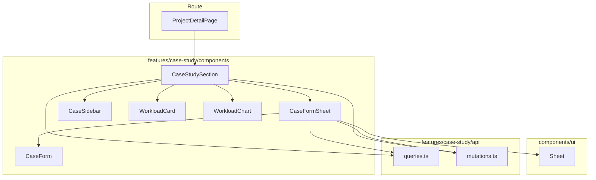

# ケーススタディ UI 改善（案件詳細画面統合）

> **元spec**: improve-case-study-ui

## 概要

**目的**: 案件詳細画面にケーススタディ機能を統合し、案件コンテキストを維持したまま、ケースの一覧・選択・工数確認・作成・編集・削除をシームレスに行える画面を提供する。

**ユーザー**: 事業部リーダーおよびプロジェクトマネージャーが、案件情報を参照しながらケーススタディのシミュレーション操作を行う。

**影響範囲**: 独立していたケーススタディ画面（`/master/projects/$projectId/case-study/`）を案件詳細画面に統合し、3 つのルートファイルを削除。

### 変更の要旨
- 案件詳細画面の基本情報カード下部にケーススタディセクションを追加
- ケース作成・編集を Sheet（スライドパネル）で実行（別画面遷移を廃止）
- 新規作成時に案件情報から初期値（開始年月・期間月数・総工数）を自動設定
- 不要になった独立ルートファイルを削除

## 要件

### 1. 案件詳細画面へのケーススタディセクション統合
- 案件基本情報カードの下部にケーススタディセクションを表示
- CaseSidebar でケース一覧、選択時に WorkloadCard + WorkloadChart を表示
- 案件基本情報は常時表示を維持
- 既存の「ケーススタディ」ボタン（別画面遷移）を削除

### 2. 新規ケース作成時の初期値自動設定
- 案件の `startYearMonth` → フォームの「開始年月」
- 案件の `durationMonths` → フォームの「期間月数」
- 案件の `totalManhour` → フォームの「総工数」
- 自動設定された初期値はユーザーが自由に変更可能
- 編集モードでは既存ケースデータを使用（案件情報で上書きしない）

### 3. 同一画面内でのケース作成・編集操作
- 新規作成・編集ともに Sheet（スライドパネル）で CaseForm を表示
- 完了後に Sheet を閉じ、ケース一覧を最新状態に更新
- 削除は確認ダイアログ → 一覧更新

### 4. 独立ルートの整理
- `case-study/index.tsx`, `case-study/new.tsx`, `case-study/$caseId/edit.tsx` を削除
- `routeTree.gen.ts` の更新
- TypeScript エラーなし、テスト通過を確認

### 5. 工数データの表示・編集の維持
- WorkloadCard による月別工数テーブル表示・編集
- WorkloadChart によるリアルタイムチャート更新
- 保存失敗時のエラー Toast 通知

## アーキテクチャ・設計

### アーキテクチャパターン

コンポーネント分離パターン。ルートコンポーネント 100 行ルールを遵守し、CaseStudySection が全状態を管理。



### 技術スタック

| Layer | Choice | Role |
|-------|--------|------|
| UI | React 19 + shadcn/ui Sheet | ケース作成・編集の Sheet 表示 |
| Routing | TanStack Router | ルート整理（不要ルート削除） |
| Data | TanStack Query | データフェッチ・キャッシュ |
| Form | TanStack Form + Zod v3 | フォームバリデーション |

新規ライブラリの追加なし。

## コンポーネント設計

### 主要コンポーネント

| Component | Layer | 役割 |
|-----------|-------|------|
| ProjectDetailPage | Route | 案件詳細 + CaseStudySection 配置 |
| CaseStudySection | case-study/components | ケーススタディの統合ビュー（新規） |
| CaseFormSheet | case-study/components | Sheet でケースフォーム表示（新規） |

### CaseStudySection 状態管理

```typescript
type CaseStudySectionState = {
  selectedCaseId: number | null
  chartData: Array<{ yearMonth: string; manhour: number }>
  formSheet: {
    open: boolean
    mode: 'create' | 'edit'
    editCaseId: number | null
  }
  caseToDelete: ProjectCase | null
}
```

- **selectedCaseId**: ケース選択時に更新、削除時にリセット
- **chartData**: WorkloadCard の `onWorkloadsChange` で更新、ケース切替時にリセット
- **formSheet**: `onNewCase` / `onEditCase` で open + mode を設定、完了時に close
- **caseToDelete**: 削除対象のケース（確認ダイアログ制御）

### CaseStudySection Props

```typescript
interface CaseStudySectionProps {
  projectId: number
  project: Project
}
```

### CaseFormSheet Props

```typescript
interface CaseFormSheetProps {
  open: boolean
  onOpenChange: (open: boolean) => void
  mode: 'create' | 'edit'
  projectId: number
  project: Project
  editCaseId: number | null
  onSuccess: () => void
}
```

### CaseFormSheet 動作

```typescript
// 作成モード
// - defaultValues: { startYearMonth: project.startYearMonth,
//     durationMonths: project.durationMonths,
//     totalManhour: project.totalManhour }
// - onSubmit: useCreateProjectCase.mutateAsync

// 編集モード
// - useQuery(projectCaseQueryOptions(projectId, editCaseId))
//   enabled: open && mode === 'edit' && editCaseId != null
// - defaultValues: 既存ケースデータ
// - onSubmit: useUpdateProjectCase.mutateAsync
```

## データフロー

### 操作フロー
1. CaseSidebar の `onNewCase` → formSheet を open (mode: 'create')
2. CaseSidebar の `onEditCase` → formSheet を open (mode: 'edit', editCaseId)
3. CaseFormSheet の `onSuccess` → formSheet を close + QueryClient キャッシュ自動無効化
4. CaseStudySection レイアウト: サイドバー（w-64）+ メインエリア（flex-1）

### エラーハンドリング

| カテゴリ | 状況 | 対応 |
|---------|------|------|
| 409 Conflict | ケース名重複（作成時）| toast.error '同一名称のケースが既に存在します' |
| 409 Conflict | 参照あり削除不可 | toast.error '他のデータから参照されているため削除できません' |
| 422 Validation | 入力エラー | toast.error '入力内容にエラーがあります' |
| 404 Not Found | ケース未発見（編集時） | toast.error 'ケースが見つかりません' |
| その他 | 作成/更新失敗 | toast.error '作成/更新に失敗しました' |

トースト通知は `duration: Infinity` で永続表示。

## ファイル構成

### 変更ファイル
- `routes/master/projects/$projectId/index.tsx` -- CaseStudySection を追加、ケーススタディボタンを削除

### 新規ファイル
- `features/case-study/components/CaseStudySection.tsx`
- `features/case-study/components/CaseFormSheet.tsx`

### 削除ファイル
- `routes/master/projects/$projectId/case-study/index.tsx`
- `routes/master/projects/$projectId/case-study/new.tsx`
- `routes/master/projects/$projectId/case-study/$caseId/edit.tsx`
