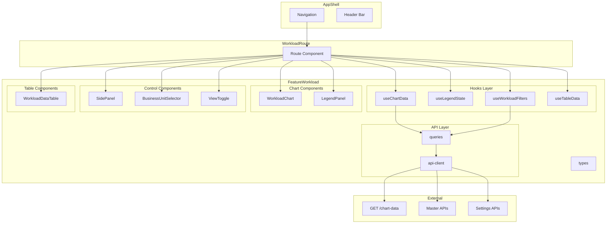
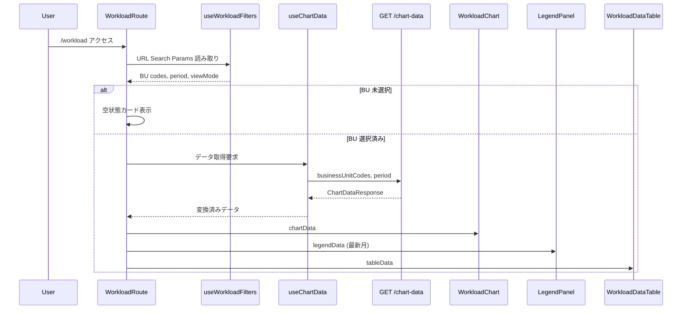
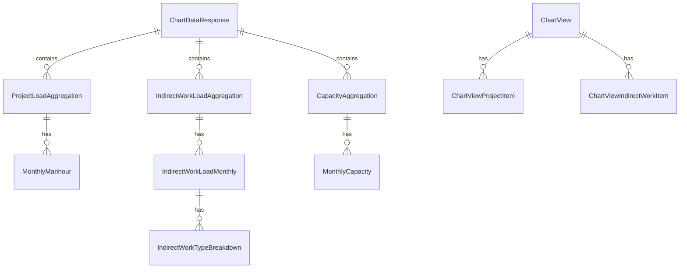

# メインダッシュボード（操業山積チャート）

> **元spec**: main-dashboard

## 概要

**目的**: 操業山積管理システムのメインダッシュボード画面を提供し、ビジネスユニットの案件工数・間接作業工数・キャパシティを時系列チャートとデータテーブルで可視化する。

**ユーザー**: 部門マネージャー、計画担当者、プロジェクトマネージャー、経営層が、リソースの需給バランス確認・案件別工数分析・シナリオ比較のワークフローで利用。

**影響範囲**: フロントエンドに新規ルート `/workload` と Feature モジュール `features/workload/` を追加。既存マスタ管理機能への影響なし。バックエンド API は実装済み。

## 要件

### 1. 積み上げエリアチャート表示
- 案件工数を案件タイプ（ProjectType）単位で集約し、積み上げエリアチャート（ComposedChart）で表示
- X 軸: 年月（YYYY/MM）、Y 軸: 工数（人時）
- スタック順序: 下から「間接作業 → 案件工数（案件タイプ displayOrder 昇順）」
- 案件エリア fillOpacity: 0.8、間接作業エリア fillOpacity: 0.7
- アニメーション無効（ちらつき防止）

### 2. キャパシティライン表示
- キャパシティシナリオごとに破線スタイル折れ線グラフを重畳
- ドットマーカー付き、青系グラデーションカラー
- 複数シナリオ同時表示

### 3. 固定凡例パネル
- チャート右側に幅 288px の固定パネル
- ヘッダー（選択年月 YYYY/MM）、案件タイプ（色ラベル+名称+工数値）、間接作業（色ラベル+ケース名+工数値）、キャパシティ（色ラベル+シナリオ名+値）、サマリー（合計工数・稼働率）
- ページロード時に最新月を初期表示
- コンテンツ領域スクロール可能

### 4. チャートクリック詳細表示
- クリックで凡例パネルにデータ固定表示（ピンアイコン）
- 同月再クリック/ピンクリックで固定解除
- 未固定時はホバーで一時表示、固定時はホバー無効
- 縦線カーソル（破線）表示、ツールチップボックスは非表示

### 5. 凡例パネル案件ドリルダウン
- 固定表示中に案件タイプクリック → 所属案件リストをアコーディオン展開
- ホバー中（未固定）はドリルダウン無効

### 6. ビジネスユニット選択
- ヘッダー右側にマルチセレクト（チェックボックス + 全選択/全解除 + 検索フィルタ + 選択数バッジ）
- BU 未選択時はデータ取得せず、空状態カード表示
- BU マスタはアプリ初期化時に取得、長期キャッシュ

### 7. 表示期間設定
- サイドパネル > 設定タブ > 期間設定セクション
- 開始/終了年月の YYYY/MM 入力 + プリセットボタン（12/24/36ヶ月）+ リセット
- バリデーション: 形式チェック、開始<=終了、60ヶ月以内
- デフォルト: データ存在年の1月 〜 3年後の12月

### 8. 案件選択
- サイドパネル > 案件タブ
- 案件名検索、ソート（案件名/工数/期間/開始日）、全選択/全解除、個別トグル
- 案件カード: 案件名、BU名、案件タイプ名、総工数、期間
- 日本語ロケール対応ソート

### 9. 間接作業設定
- サイドパネル > 間接作業タブ
- 表示/非表示トグル、上下ボタンによる積み上げ順序変更、プリセットカラーパレット（グレー系8色）
- 設定は chart_color_settings / chart_stack_order_settings に永続化
- デフォルト色リセット機能

### 10. 表示設定
- サイドパネル > 設定タブ > 表示設定セクション
- 案件タイプの並び順・色設定、キャパシティの表示/非表示・色設定
- 同一色割り当て許容（カラーブロック形成のため）
- 変更はリアルタイムにチャートへ反映

### 11. ビュー切替
- ヘッダーに切替 UI: チャートのみ / テーブルのみ / チャート&テーブル

### 12. データテーブル表示
- 行タイプ: キャパシティ（青系背景・太字）、間接作業（灰色系背景）、案件（白背景）
- 固定列: 案件名（280px・左ピン）、BU（80px）、案件タイプ（100px）、合計工数（100px）
- 月別列: 各 80px x 12 列
- 数値: 0→「-」、その他→カンマ区切り
- キャパシティ超過セル: 赤系背景警告
- 仮想スクロール（行高さ 48px 固定、最大1,000行）
- 列幅ドラッグ変更（最小60px〜最大400px）

### 13. テーブルフィルタリング
- 案件名部分一致検索（大文字小文字無視）
- 行タイプフィルタ（全体/案件/キャパシティ/間接作業）

### 14. 年単位表示切替
- 前年/翌年ボタン + 年表示
- データ存在年の範囲のみ切替可能

### 15. 表示プロファイル管理
- 表示順・配色を名前付きプロファイルとして保存・呼出
- chart-views API を使用

### 16. サイドパネルレイアウト
- 左側幅 600px の開閉式パネル、「案件」「間接作業」「設定」の 3 タブ
- 初期状態: 開、閉時にメインエリア全幅拡張

### 17. チャート上コンテキスト操作
- チャートエリア上で案件選択 → 案件属性編集画面への遷移オプション

### 18. データ取得・キャッシュ
- `GET /chart-data` API で BU コード・期間・シナリオ ID・ケース ID を指定して取得
- チャートデータ staleTime: 5分、マスタデータ staleTime: 30分

### 19. ローディング・エラー・空状態
- 初回: スケルトンローダー
- 再取得中: チャート上オーバーレイ + スピナー
- エラー: エラーカード + リトライボタン
- データなし: 空状態メッセージ
- フィルタ操作はクライアント即時反映

### 20. パフォーマンス
- チャート初回描画: 500ms 以内
- テーブル初回描画: 200ms 以内
- ホバー応答: 16ms 以内（60fps）
- データ更新反映: 200ms 以内
- テーブルスクロール: 60fps
- テーブルフィルタ反映: 50ms 以内

### 21. レスポンシブ対応
- 768px 未満: 凡例非表示（ツールチップ代替）、サイドパネル全画面オーバーレイ
- 768px〜1024px: 凡例縮小、サイドパネル 400px
- 1024px 超: フル機能表示

### 22. データ整合性
- チャートとテーブルを同一データソースから描画
- 直接工数+間接工数の合計 = 総工数

## アーキテクチャ・設計

### アーキテクチャパターン

Feature Module パターン。`features/workload/` がダッシュボード全機能を所有。



### 技術スタック

| Layer | Choice | Role |
|-------|--------|------|
| Chart | Recharts ^3.7.0 | 積み上げエリアチャート + キャパシティライン |
| Table | @tanstack/react-table ^8 | データテーブル（列ピン固定・リサイズ） |
| Virtualization | @tanstack/react-virtual ^3.x | テーブル行仮想スクロール（**新規インストール**） |
| Data Fetching | @tanstack/react-query ^5 | API データ取得・キャッシュ |
| Routing | @tanstack/react-router | `/workload` ルート・Search Params |
| Validation | Zod | Search Params・設定入力バリデーション |
| UI | shadcn/ui + Radix UI | ボタン・バッジ・スイッチ等 |
| Icons | lucide-react | UI アイコン |
| Styling | Tailwind CSS v4 | レスポンシブレイアウト |

## コンポーネント設計

### 主要コンポーネント

| Component | Layer | 役割 |
|-----------|-------|------|
| api-client | API | チャートデータ・マスタ・設定 API 呼び出し |
| queries | API | TanStack Query queryOptions 定義 |
| mutations | API | 設定保存 mutations |
| useChartData | Hooks | API データ取得と Recharts 形式変換 |
| useLegendState | Hooks | 凡例パネル状態マシン（initial/hovering/pinned） |
| useWorkloadFilters | Hooks | URL Search Params フィルタ管理 |
| useTableData | Hooks | テーブルデータ加工・年フィルタ |
| WorkloadChart | UI/Chart | ComposedChart ラッパー |
| LegendPanel | UI/Chart | 固定凡例パネル |
| LegendDrilldown | UI/Chart | 案件タイプドリルダウン |
| SidePanel | UI/Control | 600px 開閉式 3 タブパネル |
| SidePanelProjects | UI/Control | 案件選択タブ |
| SidePanelIndirect | UI/Control | 間接作業設定タブ |
| SidePanelSettings | UI/Control | 設定タブ（期間・表示設定） |
| BusinessUnitSelector | UI/Control | BU マルチセレクト |
| ViewToggle | UI/Control | ビュー切替セグメント |
| PeriodSelector | UI/Control | 表示期間設定 |
| WorkloadDataTable | UI/Table | 仮想化データテーブル |
| ProfileManager | UI/Control | プロファイル保存・呼出 |
| SkeletonChart | UI/Feedback | スケルトンローダー |
| EmptyState | UI/Feedback | 空状態・エラーカード |

### Hooks 設計

#### useChartData

```typescript
interface UseChartDataReturn {
  chartData: MonthlyDataPoint[]
  seriesConfig: ChartSeriesConfig
  legendDataByMonth: Map<string, LegendMonthData>
  latestMonth: string | null
  rawResponse: ChartDataResponse | undefined
  isLoading: boolean
  isError: boolean
  error: Error | null
  refetch: () => void
}
```

#### useLegendState

```mermaid
statediagram-v2
    [*] --> Initial: ページロード
    Initial --> Hovering: onMouseMove
    Hovering --> Initial: onMouseLeave
    Hovering --> Pinned: onClick
    Pinned --> Initial: 同月再クリック or ピン解除
    Pinned --> Pinned: 別月クリック

    state Initial {
        [*] --> ShowLatestMonth
    }

    state Hovering {
        [*] --> ShowHoverMonth
    }

    state Pinned {
        [*] --> ShowPinnedMonth
        ShowPinnedMonth --> DrilldownOpen: タイプクリック
        DrilldownOpen --> ShowPinnedMonth: 折りたたみ
    }
```

```typescript
type LegendMode = 'initial' | 'hovering' | 'pinned'

interface LegendState {
  mode: LegendMode
  activeMonth: string | null
  pinnedMonth: string | null
  expandedTypeCode: string | null
}

type LegendAction =
  | { type: 'HOVER'; yearMonth: string }
  | { type: 'HOVER_LEAVE' }
  | { type: 'CLICK'; yearMonth: string }
  | { type: 'UNPIN' }
  | { type: 'TOGGLE_DRILLDOWN'; typeCode: string }
```

#### useWorkloadFilters

```typescript
const workloadSearchSchema = z.object({
  bu: z.array(z.string()).catch([]).default([]),
  from: z.string().regex(/^\d{6}$/).optional().catch(undefined),
  to: z.string().regex(/^\d{6}$/).optional().catch(undefined),
  view: z.enum(['chart', 'table', 'both']).catch('both').default('both'),
  tab: z.enum(['projects', 'indirect', 'settings']).catch('projects').default('projects'),
})

interface UseWorkloadFiltersReturn {
  filters: WorkloadSearchParams
  setBusinessUnits: (codes: string[]) => void
  setPeriod: (from: string | undefined, to: string | undefined) => void
  setViewMode: (mode: 'chart' | 'table' | 'both') => void
  setSidePanelTab: (tab: 'projects' | 'indirect' | 'settings') => void
  hasBusinessUnits: boolean
  chartDataParams: ChartDataParams | null
}
```

#### useTableData

```typescript
type TableRowType = 'capacity' | 'indirect' | 'project'

interface TableRow {
  id: string
  rowType: TableRowType
  name: string
  businessUnitCode?: string
  projectTypeCode?: string | null
  projectTypeName?: string | null
  total: number
  monthly: Record<string, number>
}

interface UseTableDataReturn {
  rows: TableRow[]
  selectedYear: number
  availableYears: number[]
  setSelectedYear: (year: number) => void
  searchText: string
  setSearchText: (text: string) => void
  rowTypeFilter: TableRowType | 'all'
  setRowTypeFilter: (filter: TableRowType | 'all') => void
  filteredRows: TableRow[]
  monthColumns: ColumnDef<TableRow>[]
}
```

### パフォーマンス最適化（低スペック PC 対応・必須）

**Recharts 描画最適化**:
| 項目 | 設定 | 効果 |
|------|------|------|
| アニメーション全面禁止 | `isAnimationActive={false}` + `animationDuration={0}` | CPU 負荷削減 |
| ドット描画禁止 | `dot={false}` + `activeDot={false}` | 600+ `<circle>` 要素排除 |
| アクセシビリティ無効化 | `accessibilityLayer={false}` | 不要 ARIA 要素抑制 |
| カーブタイプ | `type="monotone"` 固定 | 軽量な補間計算 |
| CSS contain | `contain: content` | リフロー範囲制限 |

**React 最適化**:
| 項目 | 手法 | 効果 |
|------|------|------|
| データ安定化 | `useMemo` | 不要再計算防止 |
| ハンドラ安定化 | `useCallback` | 不要再レンダリング防止 |
| マウスイベント | `requestAnimationFrame` スロットリング | 16ms 未満の連続呼び出し排除 |
| メモ化 | WorkloadChart を `React.memo` | props 未変更時の再レンダリング防止 |

**テーブル最適化**:
- 仮想スクロール: `@tanstack/react-virtual` で最大 1,000 行を約 20 行の DOM に削減
- 列リサイズ: `columnResizeMode: 'onEnd'` でドラッグ中の再レンダリング回避

## データフロー

### チャートデータ取得・表示フロー



### API Client Interface

```typescript
interface ChartDataParams {
  businessUnitCodes: string[]
  startYearMonth: string
  endYearMonth: string
  capacityScenarioIds?: number[]
  indirectWorkCaseIds?: number[]
  chartViewId?: number
}

function fetchChartData(params: ChartDataParams): Promise<ChartDataApiResponse>
function fetchBusinessUnits(): Promise<PaginatedResponse<BusinessUnit>>
function fetchCapacityScenarios(): Promise<PaginatedResponse<CapacityScenario>>
function fetchIndirectWorkCases(): Promise<PaginatedResponse<IndirectWorkCase>>
function fetchProjects(params: { businessUnitCodes?: string[] }): Promise<PaginatedResponse<Project>>
function fetchProjectTypes(): Promise<PaginatedResponse<ProjectType>>
function fetchChartColorSettings(targetType?: string): Promise<PaginatedResponse<ChartColorSetting>>
function bulkUpsertChartColorSettings(items: ChartColorSettingInput[]): Promise<void>
function fetchChartStackOrderSettings(targetType?: string): Promise<PaginatedResponse<ChartStackOrderSetting>>
function bulkUpsertChartStackOrderSettings(items: ChartStackOrderSettingInput[]): Promise<void>
function fetchChartViews(): Promise<PaginatedResponse<ChartView>>
function createChartView(input: CreateChartViewInput): Promise<SingleResponse<ChartView>>
function updateChartView(id: number, input: UpdateChartViewInput): Promise<SingleResponse<ChartView>>
function deleteChartView(id: number): Promise<void>
```

### Query Key Factory

```typescript
const workloadKeys = {
  all: ['workload'] as const
  chartData: (params: ChartDataParams) => [...workloadKeys.all, 'chart-data', params] as const
  businessUnits: () => ['business-units', 'all'] as const
  capacityScenarios: () => ['capacity-scenarios', 'all'] as const
  indirectWorkCases: () => ['indirect-work-cases', 'all'] as const
  projects: (buCodes: string[]) => [...workloadKeys.all, 'projects', buCodes] as const
  projectTypes: () => ['project-types', 'all'] as const
  colorSettings: (targetType?: string) => [...workloadKeys.all, 'color-settings', targetType] as const
  stackOrderSettings: (targetType?: string) => [...workloadKeys.all, 'stack-order-settings', targetType] as const
  chartViews: () => [...workloadKeys.all, 'chart-views'] as const
}
```

### データモデル



```typescript
type ChartDataResponse = {
  projectLoads: ProjectLoadAggregation[]
  indirectWorkLoads: IndirectWorkLoadAggregation[]
  capacities: CapacityAggregation[]
  period: { startYearMonth: string; endYearMonth: string }
  businessUnitCodes: string[]
}

type ProjectLoadAggregation = {
  projectTypeCode: string | null
  projectTypeName: string | null
  monthly: Array<{ yearMonth: string; manhour: number }>
}

type IndirectWorkLoadAggregation = {
  indirectWorkCaseId: number
  caseName: string
  businessUnitCode: string
  monthly: Array<{
    yearMonth: string
    manhour: number
    source: 'calculated' | 'manual'
    breakdown: Array<{
      workTypeCode: string
      workTypeName: string
      manhour: number
    }>
    breakdownCoverage: number
  }>
}

type CapacityAggregation = {
  capacityScenarioId: number
  scenarioName: string
  monthly: Array<{ yearMonth: string; capacity: number }>
}

// Recharts 用変換型
interface MonthlyDataPoint {
  month: string       // "YYYY/MM" 表示用
  yearMonth: string   // "YYYYMM" 内部キー
  [seriesKey: string]: string | number
}

interface LegendMonthData {
  yearMonth: string
  month: string
  projectTypes: Array<{
    code: string | null
    name: string | null
    manhour: number
    projects?: Array<{ name: string; manhour: number }>
  }>
  indirectWorks: Array<{
    caseId: number
    caseName: string
    manhour: number
  }>
  capacities: Array<{
    scenarioId: number
    scenarioName: string
    capacity: number
  }>
  totalManhour: number
  totalCapacity: number
}
```

## 画面構成・遷移

| ルート | 画面 |
|--------|------|
| `/workload` | メインダッシュボード |

レイアウト構成:
- ヘッダー: BU セレクター + ビュー切替
- 左: サイドパネル（600px、3 タブ）
- 中央: チャート + テーブル（ビューモードに応じて表示切替）
- 右: 固定凡例パネル（288px）

## ファイル構成

```
apps/frontend/src/
├── routes/
│   └── workload/
│       └── index.tsx
├── features/workload/
│   ├── api/
│   │   ├── api-client.ts
│   │   ├── queries.ts
│   │   └── mutations.ts
│   ├── hooks/
│   │   ├── useChartData.ts
│   │   ├── useLegendState.ts
│   │   ├── useWorkloadFilters.ts
│   │   └── useTableData.ts
│   ├── components/
│   │   ├── WorkloadChart.tsx
│   │   ├── LegendPanel.tsx
│   │   ├── LegendDrilldown.tsx
│   │   ├── SidePanel.tsx
│   │   ├── SidePanelProjects.tsx
│   │   ├── SidePanelIndirect.tsx
│   │   ├── SidePanelSettings.tsx
│   │   ├── BusinessUnitSelector.tsx
│   │   ├── ViewToggle.tsx
│   │   ├── PeriodSelector.tsx
│   │   ├── WorkloadDataTable.tsx
│   │   ├── ProfileManager.tsx
│   │   ├── SkeletonChart.tsx
│   │   └── EmptyState.tsx
│   ├── types/
│   │   └── index.ts
│   └── index.ts
```
