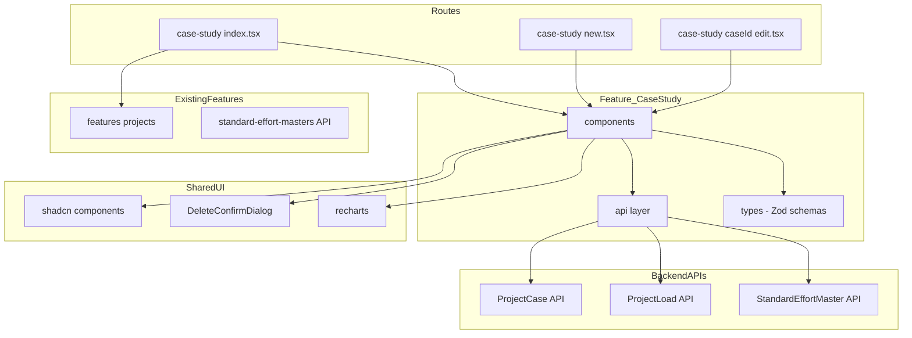
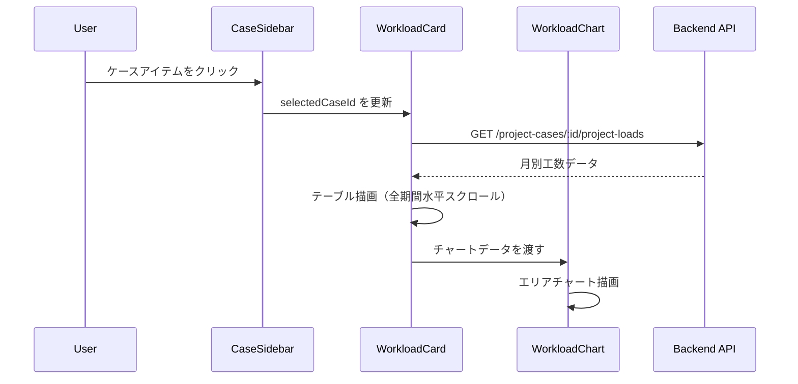
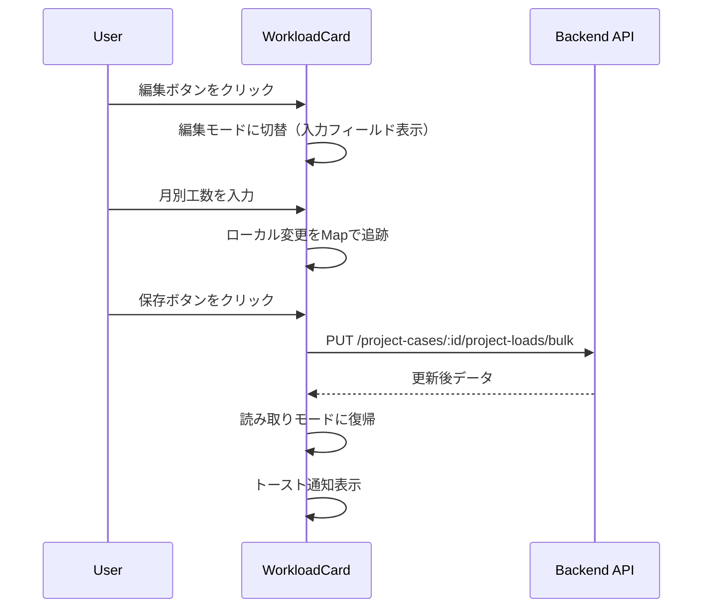
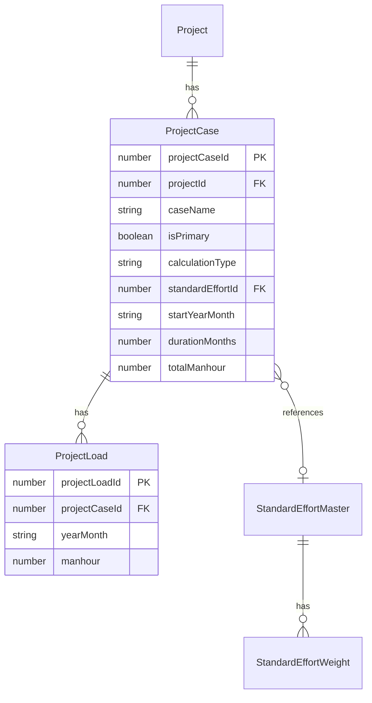

# プロジェクトケーススタディ UI

> **元spec**: project-case-study-ui

## 概要

**目的**: 案件（プロジェクト）の工数見積を複数のパターン（ケース）で作成・比較するためのフロントエンド画面を提供する。案件詳細画面のサブ画面として、STANDARD モード（標準工数マスタ活用）と MANUAL モード（手動入力）の 2 計算モードに対応し、月別工数の表示・編集・チャート可視化を行う。

**ユーザー**: プロジェクトマネージャーがケース作成・編集・比較を行い、計画担当者が標準工数マスタを活用した工数見積を実行する。

**影響範囲**: フロントエンド層にのみ変更。バックエンド API は全て実装済み。新規 feature モジュール `features/case-study/` とルートファイル 3 つを新規作成。既存の案件詳細画面にケーススタディへのリンクを追加。

## 要件

### 1. ケース一覧表示（サイドバー）
- 左サイドバーにケース一覧をリスト形式で表示（`GET /projects/:projectId/project-cases`）
- 各アイテム: ケース名（太字・truncate）、計算モードバッジ（STANDARD/MANUAL）、プライマリバッジ、説明（1行省略）、編集・削除ボタン
- 選択中アイテムはプライマリカラーの左ボーダー + 背景色変化
- 空状態・ローディング状態の表示
- 上部に「新規作成」ボタン

### 2. ケース新規作成
- `/master/projects/$projectId/case-study/new` に遷移
- 入力項目: ケース名（必須・1〜100文字）、計算モード（STANDARD/MANUAL）、標準工数マスタ（STANDARD 時必須）、説明（任意・500文字以内）、プライマリフラグ、開始年月（YYYYMM）、期間月数（正の整数）、総工数（0以上整数）
- MANUAL モード選択時は情報パネル表示
- 成功時: Toast + ケーススタディ画面に遷移

### 3. 標準工数プレビュー
- STANDARD モードで標準工数マスタ選択時に `GET /standard-effort-masters/:id` で詳細取得
- 進捗率(%)と重みの 2 列テーブルを表示（max-h-64 スクロール可能）

### 4. ケース編集
- `/master/projects/$projectId/case-study/$caseId/edit` に遷移
- 作成フォームと同一項目、現在値をプリセット
- 全項目オプショナル（部分更新対応）

### 5. ケース削除
- 削除確認 AlertDialog → 論理削除
- 409 Conflict（参照あり）エラーハンドリング

### 6. 月別工数テーブル表示
- ケース選択時に `GET /project-cases/:id/project-loads` で取得
- 全期間水平スクロールテーブル（YYYY/MM ヘッダー）
- 表示範囲: startYearMonth + durationMonths → データ範囲 → デフォルト 12 ヶ月
- 数値は日本語ロケール（カンマ区切り）、データなし月は 0 表示

### 7. 月別工数インライン編集
- 「編集」ボタンで全月を入力フィールドに切替
- 変更追跡: `Map<string, number>`（key: YYYYMM, value: 工数値）
- 「保存」で `PUT /project-cases/:id/project-loads/bulk` 一括送信
- 変更なし保存時は情報 Toast「変更がありません」
- blur バリデーション（不正値は元の値に復元）

### 8. 月別工数チャート表示
- エリアチャート（AreaChart、monotone 曲線、高さ 256px）
- X 軸: YYYY/MM、Y 軸: 工数値（カンマ区切り）
- グラデーション（上部60%→下部5%）、線幅 2px
- 編集モード中はリアルタイム反映

### 9. フォームバリデーション
- Zod スキーマによるバリデーション
- STANDARD モード時の標準工数マスタ必須チェック（refine）
- YYYYMM 形式チェック、数値範囲チェック

### 10. ルーティング・レイアウト
- `/master/projects/$projectId/case-study` -- メインルート
- `/master/projects/$projectId/case-study/new` -- 新規作成
- `/master/projects/$projectId/case-study/$caseId/edit` -- 編集
- 左サイドバー + 右メインエリアの 2 カラムレイアウト
- パンくずリスト（案件一覧 > {案件名} > ケーススタディ）

### 11. サーバー状態管理
- QueryKey: `["project-cases", projectId]`, `["project-case", projectId, caseId]`, `["project-loads", caseId]`, `["standard-effort-masters"]`, `["standard-effort-master", id]`
- CRUD 操作成功時にキャッシュ無効化

### 12. 操作フィードバック
- 各操作の成功/失敗 Toast 通知
- フォーム送信中のボタン無効化 + テキスト変更

## アーキテクチャ・設計

### アーキテクチャパターン

Feature-First モジュール構成。`features/case-study/` が ProjectCase + ProjectLoad のデータ管理を担当。



### 技術スタック

| Layer | Choice | Role |
|-------|--------|------|
| Frontend | React 19 + Vite 7 | SPA コンポーネント描画 |
| Routing | TanStack Router | ファイルベースルーティング（3ルート） |
| Data Fetching | TanStack Query | サーバー状態管理（5クエリ + 5ミューテーション） |
| Form | TanStack Form + Zod v3 | フォームバリデーション |
| UI | shadcn/ui + Radix UI | プリミティブ UI |
| Chart | recharts v3.7.0 | エリアチャート描画 |
| Notification | sonner | トースト通知 |

## コンポーネント設計

### 主要コンポーネント

| Component | Layer | 役割 |
|-----------|-------|------|
| CaseSidebar | UI | ケース一覧サイドバー・選択 |
| CaseForm | UI | ケース作成/編集フォーム（STANDARD/MANUAL 分岐） |
| StandardEffortPreview | UI | 標準工数プレビューテーブル |
| WorkloadCard | UI | 月別工数テーブル + インライン編集 |
| WorkloadChart | UI | 月別工数エリアチャート |
| DeleteCaseDialog | UI | ケース削除確認ダイアログ |

### Props 定義

```typescript
interface CaseSidebarProps {
  projectId: number
  selectedCaseId: number | null
  onSelectCase: (caseId: number) => void
  onEditCase: (caseId: number) => void
  onDeleteCase: (projectCase: ProjectCase) => void
}

interface CaseFormProps {
  mode: 'create' | 'edit'
  defaultValues?: Partial<CreateProjectCaseInput>
  onSubmit: (values: CreateProjectCaseInput | UpdateProjectCaseInput) => Promise<void>
  isSubmitting: boolean
  onCancel: () => void
}

interface WorkloadCardProps {
  projectCase: ProjectCase
  projectLoads: ProjectLoad[]
  onWorkloadsChange?: (workloads: Array<{ yearMonth: string; manhour: number }>) => void
}
```

### 状態管理（メイン画面）

```typescript
const [selectedCaseId, setSelectedCaseId] = useState<number | null>(null)
const [isDeleteDialogOpen, setIsDeleteDialogOpen] = useState(false)
const [caseToDelete, setCaseToDelete] = useState<ProjectCase | null>(null)
const [chartData, setChartData] = useState<Array<{ yearMonth: string; manhour: number }>>([])
```

## データフロー

### ケース選択 → 工数表示フロー



### 月別工数インライン編集フロー



### Service Interface

```typescript
// API Client
function fetchProjectCases(projectId: number, params: ProjectCaseListParams): Promise<PaginatedResponse<ProjectCase>>
function fetchProjectCase(projectId: number, projectCaseId: number): Promise<SingleResponse<ProjectCase>>
function createProjectCase(projectId: number, input: CreateProjectCaseInput): Promise<SingleResponse<ProjectCase>>
function updateProjectCase(projectId: number, projectCaseId: number, input: UpdateProjectCaseInput): Promise<SingleResponse<ProjectCase>>
function deleteProjectCase(projectId: number, projectCaseId: number): Promise<void>
function restoreProjectCase(projectId: number, projectCaseId: number): Promise<SingleResponse<ProjectCase>>
function fetchProjectLoads(projectCaseId: number): Promise<{ data: ProjectLoad[] }>
function bulkUpsertProjectLoads(projectCaseId: number, input: BulkProjectLoadInput): Promise<{ data: ProjectLoad[] }>
function fetchStandardEffortMasters(params?: StandardEffortMasterListParams): Promise<PaginatedResponse<StandardEffortMaster>>
function fetchStandardEffortMaster(id: number): Promise<SingleResponse<StandardEffortMasterDetail>>

// Query Key Factory
const caseStudyKeys = {
  all: ['case-study'] as const,
  projectCases: (projectId: number) => [...caseStudyKeys.all, 'project-cases', projectId] as const,
  projectCase: (projectId: number, caseId: number) => [...caseStudyKeys.all, 'project-case', projectId, caseId] as const,
  projectLoads: (caseId: number) => [...caseStudyKeys.all, 'project-loads', caseId] as const,
  standardEffortMasters: () => [...caseStudyKeys.all, 'standard-effort-masters'] as const,
  standardEffortMaster: (id: number) => [...caseStudyKeys.all, 'standard-effort-master', id] as const,
}

// Mutations
function useCreateProjectCase(): UseMutationResult<SingleResponse<ProjectCase>, Error, { projectId: number; input: CreateProjectCaseInput }>
function useUpdateProjectCase(): UseMutationResult<SingleResponse<ProjectCase>, Error, { projectId: number; projectCaseId: number; input: UpdateProjectCaseInput }>
function useDeleteProjectCase(): UseMutationResult<void, Error, { projectId: number; projectCaseId: number }>
function useRestoreProjectCase(): UseMutationResult<SingleResponse<ProjectCase>, Error, { projectId: number; projectCaseId: number }>
function useBulkUpsertProjectLoads(): UseMutationResult<{ data: ProjectLoad[] }, Error, { projectCaseId: number; input: BulkProjectLoadInput }>
```

### データモデル



```typescript
interface ProjectCase {
  projectCaseId: number
  projectId: number
  caseName: string
  isPrimary: boolean
  description: string | null
  calculationType: 'STANDARD' | 'MANUAL'
  standardEffortId: number | null
  startYearMonth: string | null
  durationMonths: number | null
  totalManhour: number | null
  createdAt: string
  updatedAt: string
  projectName: string
  standardEffortName: string | null
}

interface ProjectLoad {
  projectLoadId: number
  projectCaseId: number
  yearMonth: string
  manhour: number
  createdAt: string
  updatedAt: string
}

interface BulkProjectLoadInput {
  items: Array<{ yearMonth: string; manhour: number }>
}

interface StandardEffortMasterDetail {
  standardEffortId: number
  businessUnitCode: string
  projectTypeCode: string
  name: string
  weights: Array<{
    standardEffortWeightId: number
    progressRate: number
    weight: number
  }>
}
```

## 画面構成・遷移

| ルート | 画面 |
|--------|------|
| `/master/projects/$projectId/case-study` | メイン（サイドバー + 工数表示） |
| `/master/projects/$projectId/case-study/new` | ケース新規作成 |
| `/master/projects/$projectId/case-study/$caseId/edit` | ケース編集 |

## ファイル構成

```
apps/frontend/src/
├── routes/master/projects/$projectId/
│   ├── case-study/
│   │   ├── index.tsx     (メイン画面: サイドバー + 工数)
│   │   ├── new.tsx       (ケース新規作成)
│   │   └── $caseId/
│   │       └── edit.tsx  (ケース編集)
├── features/case-study/
│   ├── api/
│   │   ├── api-client.ts
│   │   ├── queries.ts
│   │   └── mutations.ts
│   ├── components/
│   │   ├── CaseSidebar.tsx
│   │   ├── CaseForm.tsx
│   │   ├── StandardEffortPreview.tsx
│   │   ├── WorkloadCard.tsx
│   │   ├── WorkloadChart.tsx
│   │   └── DeleteCaseDialog.tsx
│   ├── types/
│   │   └── index.ts
│   └── index.ts
```
