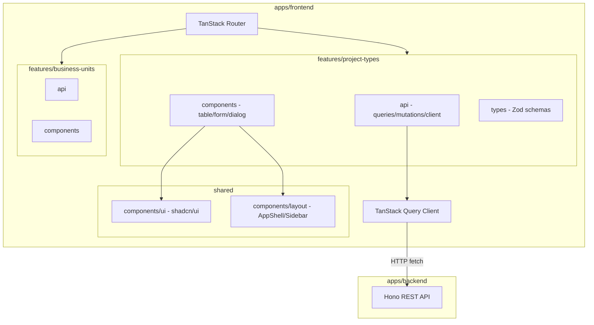
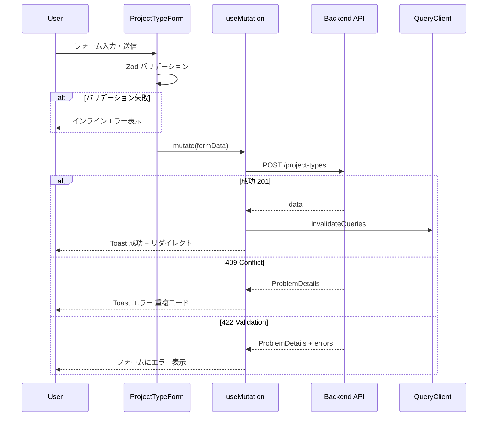

# 案件タイプ マスター管理画面

> **元spec**: project-types-master-ui

## 概要

**目的**: 案件タイプ（`project_types`）マスターデータの管理画面を提供し、管理者が案件種別の一覧閲覧・検索・詳細確認・新規登録・編集・削除・復元を行えるようにする。

**ユーザー**: 事業部リーダー・プロジェクトマネージャーが、案件種別マスターの日常的なメンテナンスに使用する。

**影響範囲**: 既存のバックエンド CRUD API（`/project-types`）に対するフロントエンド UI を新規構築。バックエンドの変更は不要。business-units マスタ UI と同一のアーキテクチャ・デザインパターンを踏襲。

## 要件

### 1. 一覧画面
- `GET /project-types` API を呼び出し、TanStack Table で一覧表示
- カラム: 案件タイプコード・名称・表示順・作成日時・更新日時
- ソート（各カラム昇順・降順）、ローディング状態、エラー表示

### 2. 検索・フィルタ
- テーブル上部に検索入力欄（コード/名称の部分一致、クライアントサイドフィルタ）
- 「削除済みを含む」トグル（`filter[includeDisabled]=true`）
- 削除済みレコードの視覚的区別（透明度低下 + ステータスバッジ）

### 3. 詳細表示
- 行クリックで `/master/project-types/$projectTypeCode` に遷移
- 全フィールド表示、「編集」「削除」ボタン、パンくずリスト
- 存在しないコードの場合は 404 エラー画面

### 4. 新規登録
- `/master/project-types/new` にて TanStack Form + Zod バリデーション
- フィールド: コード（必須・最大20文字・英数字+ハイフン+アンダースコア）、名称（必須・最大100文字）、表示順（任意・0以上整数・デフォルト0）
- 成功時: 一覧にリダイレクト + 成功 Toast
- エラー: 409（重複コード）、422（バリデーション）

### 5. 編集
- `/master/project-types/$projectTypeCode/edit` にて現在値をプリフィル
- コードは読み取り専用、名称・表示順は編集可能
- 成功時: 詳細画面にリダイレクト + 成功 Toast

### 6. 削除
- 確認ダイアログ → `DELETE` API で論理削除 → 一覧にリダイレクト
- 409（参照制約）、404 のエラーハンドリング

### 7. 復元
- 削除済みトグル有効時に「復元」ボタン表示
- 確認ダイアログ → `POST /project-types/:code/actions/restore` → テーブル再取得

### 8. ルーティング
- TanStack Router ファイルベースルーティング
- 検索条件を URL search params で管理

### 9. ビジュアルデザイン・フィードバック
- business-units マスタ管理画面と同一のデザインパターン踏襲
- Toast 通知（成功/エラー）、インラインバリデーション、送信中のボタン無効化+スピナー
- ステータスバッジ（アクティブ/削除済み）

## アーキテクチャ・設計

### アーキテクチャパターン

Feature-first SPA 構成。business-units と同一パターンで `features/project-types/` にドメインロジックを凝集。



### 技術スタック

| Layer | Choice | Role |
|-------|--------|------|
| Routing | @tanstack/react-router | ファイルベースルーティング |
| Data Fetching | @tanstack/react-query v5 | API データ取得・キャッシュ |
| Table | @tanstack/react-table v8 | ヘッドレス UI テーブル |
| Form | @tanstack/react-form v1 | フォーム状態管理 |
| UI | shadcn/ui | デザインシステムプリミティブ |
| Styling | Tailwind CSS v4 | ユーティリティファースト CSS |
| Validation | Zod v3 | スキーマ定義・型導出 |

## コンポーネント設計

### 主要コンポーネント

| Component | Layer | 役割 |
|-----------|-------|------|
| ProjectTypeListPage | Route/Page | 一覧画面 |
| ProjectTypeDetailPage | Route/Page | 詳細画面 |
| ProjectTypeNewPage | Route/Page | 新規登録画面 |
| ProjectTypeEditPage | Route/Page | 編集画面 |
| DataTable | Feature/UI | TanStack Table ラッパー |
| DataTableToolbar | Feature/UI | 検索・フィルタ・新規登録ボタン |
| ProjectTypeForm | Feature/UI | 新規登録・編集共通フォーム |
| DeleteConfirmDialog | Feature/UI | 削除確認ダイアログ |
| RestoreConfirmDialog | Feature/UI | 復元確認ダイアログ |
| DebouncedSearchInput | Feature/UI | IME 対応デバウンス検索入力 |

### Props 定義

```typescript
type ProjectTypeFormProps = {
  mode: 'create' | 'edit'
  defaultValues?: ProjectTypeFormValues
  onSubmit: (values: ProjectTypeFormValues) => Promise<void>
  isSubmitting: boolean
}

type ProjectTypeFormValues = {
  projectTypeCode: string
  name: string
  displayOrder: number
}
```

### 状態管理

```typescript
type DataTableState = {
  sorting: SortingState
  globalFilter: string
}
```

## データフロー

### 作成フロー



### API Contract

| Method | Endpoint | Request | Response | Errors |
|--------|----------|---------|----------|--------|
| GET | /project-types | `ProjectTypeListParams` | `PaginatedResponse<ProjectType>` | 422 |
| GET | /project-types/:code | - | `SingleResponse<ProjectType>` | 404 |
| POST | /project-types | `CreateProjectTypeInput` | `SingleResponse<ProjectType>` | 409, 422 |
| PUT | /project-types/:code | `UpdateProjectTypeInput` | `SingleResponse<ProjectType>` | 404, 422 |
| DELETE | /project-types/:code | - | 204 No Content | 404, 409 |
| POST | /project-types/:code/actions/restore | - | `SingleResponse<ProjectType>` | 404, 409 |

### Service Interface

```typescript
// Query Key Factory
const projectTypeKeys = {
  all: ['project-types'] as const,
  lists: () => [...projectTypeKeys.all, 'list'] as const,
  list: (params: ProjectTypeListParams) => [...projectTypeKeys.lists(), params] as const,
  details: () => [...projectTypeKeys.all, 'detail'] as const,
  detail: (code: string) => [...projectTypeKeys.details(), code] as const,
}

// queries.ts
function projectTypesQueryOptions(params: ProjectTypeListParams): QueryOptions<PaginatedResponse<ProjectType>>
function projectTypeQueryOptions(code: string): QueryOptions<SingleResponse<ProjectType>>

// mutations.ts
function useCreateProjectType(): UseMutationResult<ProjectType, ProblemDetails, CreateProjectTypeInput>
function useUpdateProjectType(code: string): UseMutationResult<ProjectType, ProblemDetails, UpdateProjectTypeInput>
function useDeleteProjectType(): UseMutationResult<void, ProblemDetails, string>
function useRestoreProjectType(): UseMutationResult<ProjectType, ProblemDetails, string>
```

### データモデル

```typescript
type ProjectType = {
  projectTypeCode: string
  name: string
  displayOrder: number
  createdAt: string
  updatedAt: string
  deletedAt?: string | null
}
```

### Zod スキーマ

```typescript
const createProjectTypeSchema = z.object({
  projectTypeCode: z.string().min(1).max(20).regex(/^[a-zA-Z0-9_-]+$/),
  name: z.string().min(1).max(100),
  displayOrder: z.number().int().min(0).default(0),
})

const updateProjectTypeSchema = z.object({
  name: z.string().min(1).max(100),
  displayOrder: z.number().int().min(0).optional(),
})

const projectTypeSearchSchema = z.object({
  search: fallback(z.string(), '').default(''),
  includeDisabled: fallback(z.boolean(), false).default(false),
})
```

## 画面構成・遷移

| ルート | 画面 |
|--------|------|
| `/master/project-types` | 一覧 |
| `/master/project-types/new` | 新規登録 |
| `/master/project-types/$projectTypeCode` | 詳細 |
| `/master/project-types/$projectTypeCode/edit` | 編集 |

## ファイル構成

```
apps/frontend/src/
├── routes/master/project-types/
│   ├── index.tsx
│   ├── new.tsx
│   ├── $projectTypeCode/
│   │   ├── index.tsx
│   │   └── edit.tsx
├── features/project-types/
│   ├── api/
│   │   ├── api-client.ts
│   │   ├── queries.ts
│   │   └── mutations.ts
│   ├── components/
│   │   ├── columns.tsx
│   │   ├── DataTable.tsx
│   │   ├── DataTableToolbar.tsx
│   │   ├── ProjectTypeForm.tsx
│   │   ├── DeleteConfirmDialog.tsx
│   │   └── RestoreConfirmDialog.tsx
│   ├── types/
│   │   └── index.ts
│   └── index.ts
```
