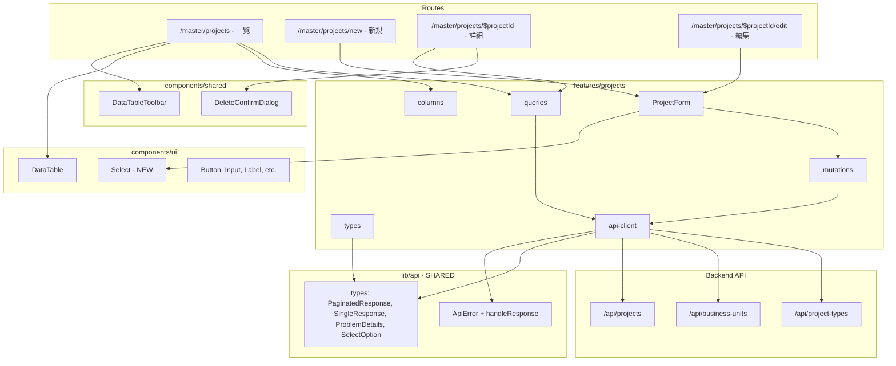
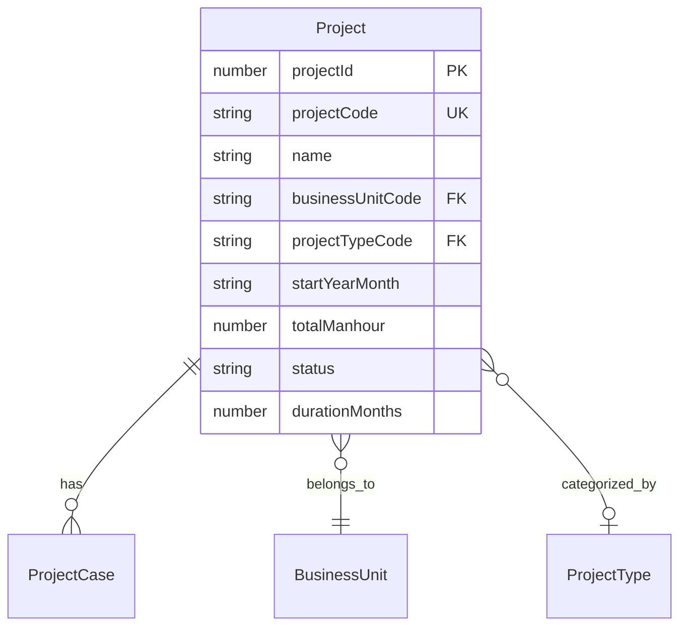

# 案件 マスター管理画面

> **元spec**: projects-master-ui

## 概要

**目的**: 案件（Projects）マスター管理画面を提供し、PM・事業部リーダーが案件データの CRUD 操作を行えるようにする。

**ユーザー**: PM・事業部リーダーが案件の登録・編集・検索・削除・復元のワークフローで利用。

**影響範囲**: 既存のフロントエンドに `features/projects/` と `/master/projects` ルートを追加。`DataTableToolbar` と `DeleteConfirmDialog` を共通化し、既存の business-units 管理画面にも適用。また、API 共通型（`PaginatedResponse`, `SingleResponse`, `ProblemDetails`）と共通ユーティリティ（`ApiError`, `handleResponse`）を `lib/api/` に抽出。

### 他マスタ画面との差分
- 案件は事業部（`business_units`）および案件タイプ（`project_types`）と外部キーで関連
- FK 参照先の「名前」表示、ドロップダウン選択が必要
- shadcn/ui Select コンポーネントを新規導入
- `lib/api/` への共通型・ユーティリティ抽出

## 要件

### 1. 一覧表示
- `/master/projects` にページネーション付きテーブルで表示
- カラム: 案件コード、案件名、事業部名、案件タイプ名、開始年月、総工数、ステータス、作成日時、更新日時
- FK は名前を表示（コードではなく）、null 値はハイフン表示
- ソート、行クリック → 詳細遷移

### 2. 検索・フィルタリング
- デバウンス付きキーワード検索（案件コード・案件名）
- 「削除済みを含む」トグル、削除済み行は `opacity-50` で区別
- 検索条件を URL Search Params で管理

### 3. 詳細表示
- 全フィールド読み取り専用表示（FK は名前表示）
- 「編集」「削除」ボタン
- 削除: 確認ダイアログ → ソフトデリート → 一覧遷移
- 409（参照制約）エラーのユーザー通知

### 4. 新規作成
- フィールド: 案件コード（テキスト・必須）、案件名（テキスト・必須）、事業部（ドロップダウン・必須）、案件タイプ（ドロップダウン・任意）、開始年月（YYYYMM・必須）、総工数（数値・必須）、ステータス（計画/確定・必須）、期間月数（数値・任意）
- 事業部・案件タイプの選択肢はそれぞれ API から取得（アクティブのみ）
- 成功: 一覧遷移 + Toast、エラー: 409（重複）、422（バリデーション）

### 5. 編集
- 案件コードは編集不可（disabled）
- FK ドロップダウンに現在値を初期選択
- 成功: 詳細遷移 + Toast

### 6. 復元
- 削除済みフィルタ有効時に「復元」ボタン → 確認ダイアログ → 復元 API

### 7. ナビゲーション
- パンくずリスト（一覧 → 詳細 → 編集、一覧 → 新規作成）
- ツールバーに「新規作成」ボタン

### 8. 外部キー参照の選択 UI
- アクティブなマスタのみ表示（ソフトデリート済み除外）
- 名前をラベル、コードを内部値
- ローディング・エラー状態のハンドリング

## アーキテクチャ・設計

### アーキテクチャパターン

Feature-first + 共通レイヤー抽出。`features/projects/` が案件ドメインを所有。`lib/api/` が API 通信の共通基盤を所有。`components/shared/` がドメイン横断 UI を所有。



### 技術スタック

| Layer | Choice | Role |
|-------|--------|------|
| UI Framework | React 19 + TanStack Router | ルーティング・画面 |
| State / Cache | TanStack Query v5 | サーバー状態管理 |
| Table | TanStack Table v8 | 一覧テーブル |
| Form | TanStack Form v1 | フォーム管理 |
| Validation | Zod v3 | クライアントバリデーション |
| UI Primitives | shadcn/ui + Radix UI | Select 新規追加 |
| Notification | sonner | トースト通知 |
| Styling | Tailwind CSS v4 | ユーティリティ CSS |

## コンポーネント設計

### 主要コンポーネント

| Component | Layer | 役割 |
|-----------|-------|------|
| lib/api/types.ts | lib/api | API 共通型定義 |
| lib/api/client.ts | lib/api | ApiError + handleResponse |
| types/index.ts | projects/types | 案件固有の型・スキーマ |
| api-client.ts | projects/api | API 通信 |
| queries.ts | projects/api | queryOptions |
| mutations.ts | projects/api | ミューテーション |
| columns.tsx | projects/components | カラム定義（FK 名前表示） |
| ProjectForm.tsx | projects/components | 作成・編集フォーム |
| Select | ui | ドロップダウン UI（新規） |
| DataTableToolbar | shared | ツールバー共通 |
| DeleteConfirmDialog | shared | 削除確認共通 |

### Props 定義

```typescript
type ProjectFormValues = {
  projectCode: string
  name: string
  businessUnitCode: string
  projectTypeCode: string      // 空文字 = 未選択
  startYearMonth: string
  totalManhour: number
  status: string
  durationMonths: number | null
}

interface ProjectFormProps {
  mode: 'create' | 'edit'
  defaultValues?: ProjectFormValues
  onSubmit: (values: ProjectFormValues) => Promise<void>
  isSubmitting: boolean
}
```

### 共通コンポーネント

```typescript
interface DataTableToolbarProps {
  search: string
  onSearchChange: (value: string) => void
  includeDisabled: boolean
  onIncludeDisabledChange: (value: boolean) => void
  newItemHref: string
  searchPlaceholder?: string
}

interface DeleteConfirmDialogProps {
  open: boolean
  onOpenChange: (open: boolean) => void
  onConfirm: () => void
  entityLabel: string       // 例: "案件"
  entityName: string        // 例: "プロジェクトA"
  isDeleting: boolean
}
```

### 共通 API 型

```typescript
type PaginatedResponse<T> = {
  data: T[]
  meta: {
    pagination: {
      currentPage: number
      pageSize: number
      totalItems: number
      totalPages: number
    }
  }
}

type SingleResponse<T> = { data: T }

type ProblemDetails = {
  type: string
  status: number
  title: string
  detail: string
  instance?: string
  errors?: Array<{ field: string; message: string }>
}

type SelectOption = { value: string; label: string }
```

## データフロー

### API Contract

| Method | Endpoint | Request | Response | Errors |
|--------|----------|---------|----------|--------|
| GET | /api/projects | ProjectListParams (query) | PaginatedResponse\<Project\> | - |
| GET | /api/projects/:id | id (path) | SingleResponse\<Project\> | 404 |
| POST | /api/projects | CreateProjectInput (body) | SingleResponse\<Project\> | 409, 422 |
| PUT | /api/projects/:id | UpdateProjectInput (body) | SingleResponse\<Project\> | 404, 409, 422 |
| DELETE | /api/projects/:id | id (path) | void (204) | 404, 409 |
| POST | /api/projects/:id/actions/restore | id (path) | SingleResponse\<Project\> | 404, 409 |
| GET | /api/business-units | page, pageSize (query) | PaginatedResponse\<BusinessUnit\> | - |
| GET | /api/project-types | page, pageSize (query) | PaginatedResponse\<ProjectType\> | - |

### Service Interface

```typescript
// Query Key Factory
const projectKeys = {
  all: ['projects'] as const
  lists: () => [...projectKeys.all, 'list'] as const
  list: (params: ProjectListParams) => [...projectKeys.lists(), params] as const
  details: () => [...projectKeys.all, 'detail'] as const
  detail: (id: number) => [...projectKeys.details(), id] as const
}

// Query Options
function projectsQueryOptions(params: ProjectListParams): QueryOptions<PaginatedResponse<Project>>
function projectQueryOptions(id: number): QueryOptions<SingleResponse<Project>>
function businessUnitsForSelectQueryOptions(): QueryOptions<SelectOption[]>
function projectTypesForSelectQueryOptions(): QueryOptions<SelectOption[]>

// Mutations
function useCreateProject(): UseMutationResult<SingleResponse<Project>, ApiError, CreateProjectInput>
function useUpdateProject(id: number): UseMutationResult<SingleResponse<Project>, ApiError, UpdateProjectInput>
function useDeleteProject(): UseMutationResult<void, ApiError, number>
function useRestoreProject(): UseMutationResult<SingleResponse<Project>, ApiError, number>
```

### データモデル



```typescript
type Project = {
  projectId: number
  projectCode: string
  name: string
  businessUnitCode: string
  businessUnitName: string
  projectTypeCode: string | null
  projectTypeName: string | null
  startYearMonth: string
  totalManhour: number
  status: string
  durationMonths: number | null
  createdAt: string
  updatedAt: string
  deletedAt?: string | null
}
```

### カラム構成
1. `projectCode` -- ソート可、Link で詳細遷移
2. `name` -- ソート可
3. `businessUnitName` -- ソート可
4. `projectTypeName` -- ソート可、null → "--"
5. `startYearMonth` -- ソート可、YYYY/MM 表示
6. `totalManhour` -- ソート可、数値表示
7. `status` -- Badge 表示（計画/確定）
8. `createdAt` -- ソート可、日時フォーマット
9. `updatedAt` -- ソート可、日時フォーマット
10. `actions` -- 復元ボタン（条件付き）

## 画面構成・遷移

| ルート | 画面 |
|--------|------|
| `/master/projects` | 一覧 |
| `/master/projects/new` | 新規作成 |
| `/master/projects/$projectId` | 詳細 |
| `/master/projects/$projectId/edit` | 編集 |

## ファイル構成

```
apps/frontend/src/
├── lib/api/
│   ├── types.ts           (PaginatedResponse, SingleResponse, ProblemDetails, SelectOption)
│   └── client.ts          (ApiError, handleResponse, API_BASE_URL)
├── components/shared/
│   ├── DataTableToolbar.tsx  (共通化)
│   └── DeleteConfirmDialog.tsx (共通化)
├── components/ui/
│   └── select.tsx          (shadcn/ui Select - 新規)
├── routes/master/projects/
│   ├── index.tsx
│   ├── new.tsx
│   ├── $projectId/
│   │   ├── index.tsx
│   │   └── edit.tsx
├── features/projects/
│   ├── api/
│   │   ├── api-client.ts
│   │   ├── queries.ts
│   │   └── mutations.ts
│   ├── components/
│   │   ├── columns.tsx
│   │   └── ProjectForm.tsx
│   ├── types/
│   │   └── index.ts
│   └── index.ts
```
