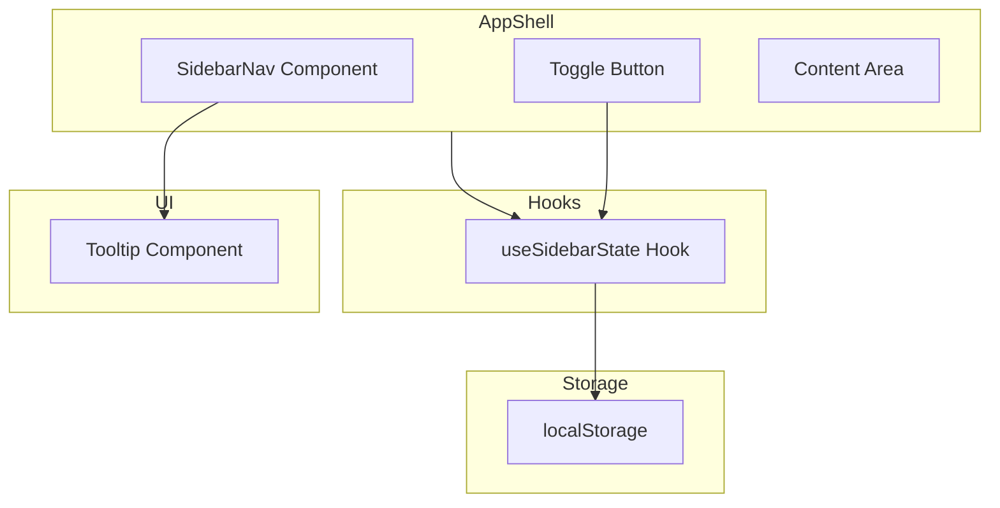
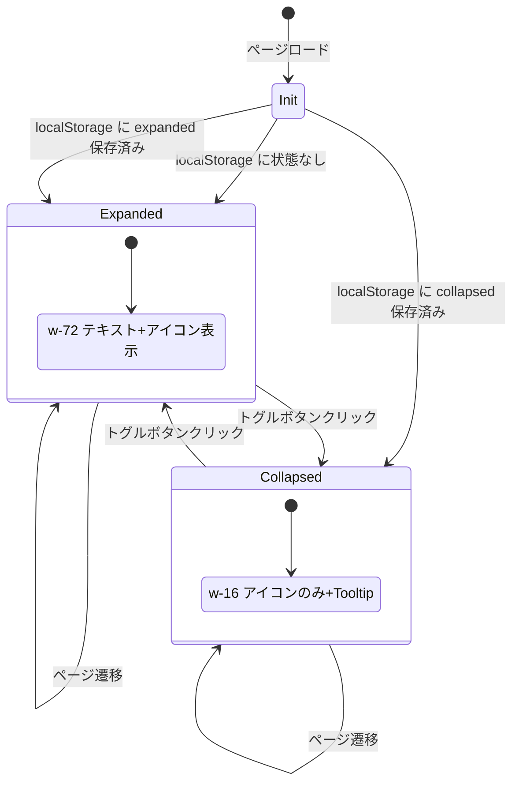

# サイドバートグル機能

> **元spec**: sidebar-toggle

## 概要

デスクトップ表示時のグローバルナビゲーション（サイドバー）に折りたたみ/展開トグル機能を提供し、コンテンツ領域の最大化を可能にする。

- **ユーザー**: すべてのデスクトップユーザーがチャート表示・一覧表示時に作業エリアを広く確保するために利用
- **影響範囲**: 既存の `AppShell.tsx` のサイドバーを固定幅（w-72）から動的幅（w-72 / w-16）に変更し、`SidebarNav` を独立コンポーネントに分離

### Non-Goals

- shadcn/ui 公式 Sidebar コンポーネントへの移行
- キーボードショートカットによるサイドバー開閉
- サイドバー幅のドラッグリサイズ
- サブメニュー・アコーディオン展開

## 要件

### 要件1: トグルボタン

ワンクリックでサイドバーの折りたたみ/展開を切り替え可能。展開時は w-72（テキスト+アイコン）、折りたたみ時はアイコンのみの狭い幅（w-16）で表示。ボタンは `PanelLeftClose` / `PanelLeftOpen` アイコンで現在の状態を示す。

### 要件2: 折りたたみ時のナビゲーション

折りたたみ時はアイコンのみ表示。ホバー時に Tooltip でメニュー名を表示。アイコンクリックで通常通りページ遷移可能。アクティブページのハイライト表示を維持。

### 要件3: 状態の永続化

localStorage（キー: `sidebar-collapsed`）に開閉状態を保存。リロード後も状態を復元。ページ遷移時も維持。初回アクセス時はデフォルト展開。

### 要件4: 表示切替

幅の変更は即時切替（アニメーションなし）。テキストの表示/非表示も即時。低スペック PC でも問題なく動作する軽量実装。

### 要件5: モバイル表示との共存

モバイル表示時は既存の Sheet コンポーネントによる開閉動作を維持。デスクトップ用トグルボタンはモバイルで非表示。

### 要件6: コンテンツ領域のレイアウト適応

サイドバー幅の変更に応じてコンテンツ領域が `flex-1` で自動追従（変更不要）。

## アーキテクチャ・設計



| Layer | Technology | Notes |
|-------|-----------|-------|
| Frontend UI | React 19 + Tailwind CSS v4 | 既存 |
| Tooltip | @radix-ui/react-tooltip ^1.2.8 | shadcn/ui ラッパー作成のみ |
| Icons | lucide-react ^0.513.0 | PanelLeftClose / PanelLeftOpen |
| Persistence | localStorage (Web API) | 追加依存なし |

### 状態遷移



## コンポーネント設計

### useSidebarState

サイドバー開閉状態の管理と localStorage 永続化を担うカスタムフック。

```typescript
type UseSidebarStateReturn = {
  collapsed: boolean;
  toggle: () => void;
};

function useSidebarState(): UseSidebarStateReturn;
```

- **State model**: `collapsed: boolean`（`true` = 折りたたみ、`false` = 展開）
- **Persistence**: `localStorage.setItem("sidebar-collapsed", JSON.stringify(collapsed))` -- toggle 呼び出し時に同期書き込み
- **Initialization**: `useState(() => { try { return localStorage.getItem("sidebar-collapsed") === "true" } catch { return false } })`
- **Default**: `false`（展開状態）
- localStorage アクセスは try-catch でラップ（プライベートブラウジング等での例外対策）
- `useCallback` で `toggle` をメモ化

### SidebarNav

ナビゲーションメニューを展開/折りたたみモードで描画するコンポーネント。

```typescript
interface SidebarNavProps {
  collapsed: boolean;
}
```

- `collapsed` prop に応じてアイコンのみ / テキスト+アイコン表示を即時切替
- 折りたたみ時は各メニュー項目を `Tooltip` でラップしメニュー名を表示
- `menuItems` 定数はこのファイルに配置（AppShell から移動）
- アクティブ状態のハイライトは展開/折りたたみ両方で維持
- グループラベル（「ダッシュボード」「マスタ管理」）は折りたたみ時に `Separator` に置換
- 折りたたみ時のアイコンは中央揃え（`justify-center`）
- モバイル Sheet 内での利用時は常に `collapsed={false}`

### AppShell（既存変更）

- `useSidebarState` フックから `collapsed` と `toggle` を取得
- デスクトップサイドバーの幅: `collapsed ? "lg:w-16" : "lg:w-72"` で即時切替
- サイドバー下部にトグルボタンを配置（`mt-auto`）
- サイドバーヘッダー（「操業管理システム」）は折りたたみ時に非表示（ヘッダー領域自体は維持し高さを揃える）
- モバイル表示（Sheet）は変更なし -- SidebarNav に `collapsed={false}` を渡す
- コンテンツ領域は `flex-1` で自動追従（変更不要）

### Tooltip（新規）

`npx shadcn@latest add tooltip` で生成する標準的な shadcn/ui ラッパー。`@radix-ui/react-tooltip` は依存済み。

## エラーハンドリング

- **localStorage アクセス失敗**: try-catch でデフォルト値（展開状態）にフォールバック。ユーザーへのエラー表示は不要
- **Tooltip レンダリングエラー**: 補助的な UI であり、失敗時もナビゲーション機能には影響しない

## ファイル構成

```
apps/frontend/src/
├── components/
│   ├── layout/
│   │   ├── AppShell.tsx          # 既存変更: サイドバー幅の動的制御
│   │   └── SidebarNav.tsx        # 新規: ナビゲーション表示コンポーネント
│   └── ui/
│       └── tooltip.tsx           # 新規: shadcn/ui Tooltip ラッパー
└── hooks/
    └── useSidebarState.ts        # 新規: 開閉状態管理フック
```
