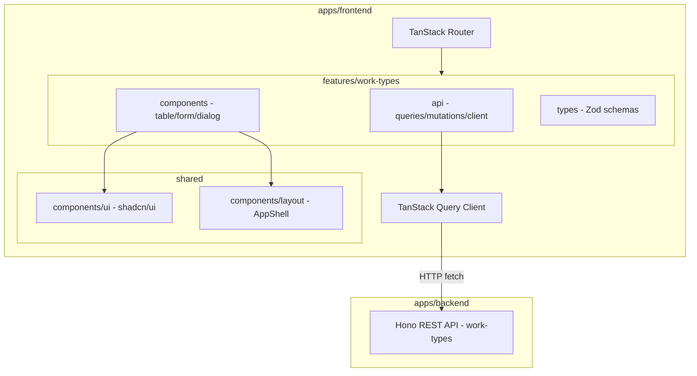

# 作業種類 マスター管理画面

> **元spec**: work-types-master-ui

## 概要

**目的**: 作業種類（`work_types`）マスターデータの管理画面を提供し、管理者が作業種類の一覧閲覧・検索・詳細確認・新規登録・編集・削除・復元を行えるようにする。

**ユーザー**: 事業部リーダー・管理者が、間接作業分類のマスターデータメンテナンスに使用する。

**影響範囲**: 既存の `work-types` CRUD API（Hono バックエンド）に対するフロントエンド UI を新規構築。バックエンドの変更は不要。business-units の実装パターンを踏襲し、`color` フィールド対応（カラースウォッチ・カラーピッカー）を追加。

### business-units との差分
- `color` フィールド（`string | null`）の追加
- 一覧テーブルにカラースウォッチ列
- フォームにカラーピッカー UI（ネイティブ `<input type="color">`）

## 要件

### 1. 一覧画面
- `GET /work-types` API を呼び出し、TanStack Table で一覧表示
- カラム: 作業種類コード・名称・カラー（カラースウォッチ）・表示順・作成日時・更新日時
- ソート、ローディング状態、エラー表示

### 2. 検索・フィルタ
- テーブル上部に検索入力欄（コード/名称の部分一致、クライアントサイドフィルタ）
- 「削除済みを含む」トグル
- 削除済みレコードの視覚的区別

### 3. 詳細表示
- 行クリックで `/master/work-types/$workTypeCode` に遷移
- 全フィールド表示（カラースウォッチ付き）、「編集」「削除」ボタン、パンくずリスト
- 存在しないコードの場合は 404 エラー画面

### 4. 新規登録
- `/master/work-types/new` にて TanStack Form + Zod バリデーション
- フィールド: コード（必須・最大20文字）、名称（必須・最大100文字）、表示順（任意）、カラー（任意・#RRGGBB 形式のカラーピッカー）
- 成功時: 一覧にリダイレクト + 成功 Toast
- エラー: 409（重複コード）、422（バリデーション）

### 5. 編集
- `/master/work-types/$workTypeCode/edit` にて現在値をプリフィル
- コードは読み取り専用、名称・表示順・カラーは編集可能

### 6. 削除
- 確認ダイアログ → 論理削除 → 一覧にリダイレクト

### 7. 復元
- 削除済みトグル有効時に「復元」ボタン表示 → 復元 API 呼び出し

### 8. ルーティング
- 検索条件・削除済みトグルを URL search params で管理

## アーキテクチャ・設計

### アーキテクチャパターン



### 技術スタック

| Layer | Choice | Role |
|-------|--------|------|
| Routing | @tanstack/react-router | ファイルベースルーティング |
| Data Fetching | @tanstack/react-query v5 | API データ取得・キャッシュ |
| Table | @tanstack/react-table v8 | ヘッドレス UI テーブル |
| Form | @tanstack/react-form v1 | フォーム状態管理 |
| UI | shadcn/ui | デザインシステムプリミティブ |
| Styling | Tailwind CSS v4 | ユーティリティファースト CSS |
| Validation | Zod v3 | スキーマ定義・型導出 |
| カラーピッカー | ネイティブ `<input type="color">` | カラー選択 UI（外部ライブラリ不要） |

## コンポーネント設計

### 主要コンポーネント

| Component | Layer | 役割 |
|-----------|-------|------|
| WorkTypeListPage | Route/Page | 一覧画面 |
| WorkTypeDetailPage | Route/Page | 詳細画面（カラースウォッチ付き） |
| WorkTypeNewPage | Route/Page | 新規登録画面 |
| WorkTypeEditPage | Route/Page | 編集画面 |
| DataTable | Feature/UI | TanStack Table ラッパー |
| DataTableToolbar | Feature/UI | 検索・フィルタ・新規登録ボタン |
| columns.tsx | Feature/Config | カラム定義（カラースウォッチ列含む） |
| WorkTypeForm | Feature/UI | 新規登録・編集共通フォーム（カラーピッカー含む） |

### Props 定義

```typescript
type WorkTypeFormProps = {
  mode: 'create' | 'edit'
  defaultValues?: WorkTypeFormValues
  onSubmit: (values: WorkTypeFormValues) => Promise<void>
  isSubmitting: boolean
}

type WorkTypeFormValues = {
  workTypeCode: string
  name: string
  displayOrder: number
  color: string | null
}
```

### カラー UI 実装
- カラーピッカー: `<input type="color">` + `<Input>` で #RRGGBB テキスト入力を横並び配置
- color が null の場合、デフォルト値（#000000）を表示し、「クリア」ボタンで null に戻せる
- カラーカラム: `color` 値が存在する場合は `w-6 h-6 rounded-full border` の div に `backgroundColor` を設定。null の場合は「-」テキスト

## データフロー

### API Contract

| Method | Endpoint | Request | Response | Errors |
|--------|----------|---------|----------|--------|
| GET | /work-types | `WorkTypeListParams` | `PaginatedResponse<WorkType>` | 422 |
| GET | /work-types/:code | - | `SingleResponse<WorkType>` | 404 |
| POST | /work-types | `CreateWorkTypeInput` | `SingleResponse<WorkType>` | 409, 422 |
| PUT | /work-types/:code | `UpdateWorkTypeInput` | `SingleResponse<WorkType>` | 404, 422 |
| DELETE | /work-types/:code | - | 204 No Content | 404, 409 |
| POST | /work-types/:code/actions/restore | - | `SingleResponse<WorkType>` | 404, 409 |

### Service Interface

```typescript
// Query Key Factory
const workTypeKeys = {
  all: ['work-types'] as const
  lists: () => [...workTypeKeys.all, 'list'] as const
  list: (params: WorkTypeListParams) => [...workTypeKeys.lists(), params] as const
  details: () => [...workTypeKeys.all, 'detail'] as const
  detail: (code: string) => [...workTypeKeys.details(), code] as const
}

// queries.ts
function workTypesQueryOptions(params: WorkTypeListParams): QueryOptions<PaginatedResponse<WorkType>>
function workTypeQueryOptions(code: string): QueryOptions<SingleResponse<WorkType>>

// mutations.ts
function useCreateWorkType(): UseMutationResult<WorkType, ProblemDetails, CreateWorkTypeInput>
function useUpdateWorkType(code: string): UseMutationResult<WorkType, ProblemDetails, UpdateWorkTypeInput>
function useDeleteWorkType(): UseMutationResult<void, ProblemDetails, string>
function useRestoreWorkType(): UseMutationResult<WorkType, ProblemDetails, string>
```

### データモデル

```typescript
type WorkType = {
  workTypeCode: string
  name: string
  displayOrder: number
  color: string | null
  createdAt: string
  updatedAt: string
  deletedAt?: string | null
}
```

### Zod スキーマ

```typescript
const colorSchema = z.string().regex(/^#[0-9A-Fa-f]{6}$/, 'カラーコードは #RRGGBB 形式で入力してください').nullable().optional()

const createWorkTypeSchema = z.object({
  workTypeCode: z.string()
    .min(1, '作業種類コードは必須です')
    .max(20, '作業種類コードは20文字以内で入力してください')
    .regex(/^[a-zA-Z0-9_-]+$/, '英数字・ハイフン・アンダースコアのみ使用できます'),
  name: z.string()
    .min(1, '名称は必須です')
    .max(100, '名称は100文字以内で入力してください'),
  displayOrder: z.number()
    .int('表示順は整数で入力してください')
    .min(0, '表示順は0以上で入力してください')
    .default(0),
  color: colorSchema,
})

const updateWorkTypeSchema = z.object({
  name: z.string().min(1).max(100),
  displayOrder: z.number().int().min(0).optional(),
  color: colorSchema,
})

const workTypeSearchSchema = z.object({
  search: z.string().catch('').default(''),
  includeDisabled: z.boolean().catch(false).default(false),
})
```

## 画面構成・遷移

| ルート | 画面 |
|--------|------|
| `/master/work-types` | 一覧 |
| `/master/work-types/new` | 新規登録 |
| `/master/work-types/$workTypeCode` | 詳細 |
| `/master/work-types/$workTypeCode/edit` | 編集 |

## ファイル構成

```
apps/frontend/src/
├── routes/master/work-types/
│   ├── index.tsx
│   ├── new.tsx
│   ├── $workTypeCode/
│   │   ├── index.tsx
│   │   └── edit.tsx
├── features/work-types/
│   ├── api/
│   │   ├── api-client.ts
│   │   ├── queries.ts
│   │   └── mutations.ts
│   ├── components/
│   │   ├── columns.tsx       (カラースウォッチ列含む)
│   │   ├── DataTable.tsx
│   │   ├── DataTableToolbar.tsx
│   │   ├── WorkTypeForm.tsx  (カラーピッカー含む)
│   │   ├── DeleteConfirmDialog.tsx
│   │   └── RestoreConfirmDialog.tsx
│   ├── types/
│   │   └── index.ts
│   └── index.ts
```
