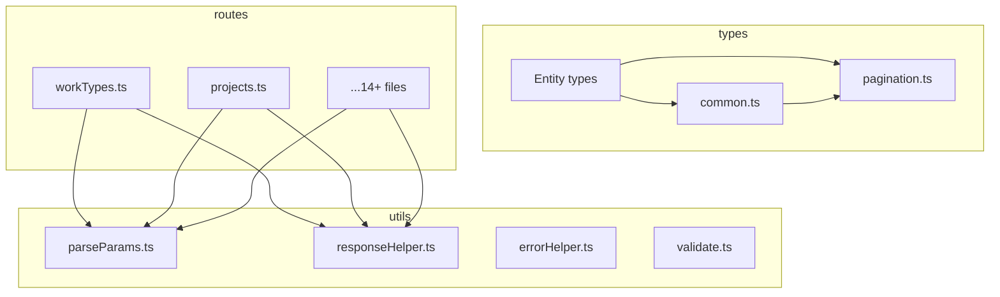

# Backend 共通ユーティリティ

> **元spec**: backend-common-utils

## 概要

Backend ルートファイルおよび型ファイルに散在する共通パターン（パスパラメータ解析、ページネーション応答構築、Location ヘッダー設定、Zod スキーマ定義）を共通ユーティリティモジュールに集約し、重複コードを解消する。

- **対象ユーザー**: バックエンド開発者（ルートハンドラ・型定義の実装時に共通モジュールを利用）
- **影響範囲**: 14+ ルートファイルと 10+ 型ファイルの import を変更。API レスポンスの外部契約は一切変更しない
- **削減効果**: `parseIntParam` ~110行、ページネーション応答 ~96行、Location ヘッダー ~14行、共通 Zod スキーマ ~200行（合計 ~420行）

### Non-Goals

- サービス層・データ層のリファクタリング（Phase 3）
- Transform 層の簡素化（Phase 2）
- フロントエンドの共通化（別 spec）
- API レスポンス形式の変更・新規エンドポイント追加

## 要件

### 1. パスパラメータのパースユーティリティ統一

- `utils/parseParams.ts` に `parseIntParam` 関数を単一定義
- `string | undefined` を受け付け、undefined/空文字/NaN/0以下で HTTPException(422) をスロー
- 14 ルートファイルのローカル定義を削除し、共通モジュールに置換

### 2. ページネーション応答ヘルパー

- `utils/responseHelper.ts` に `buildPaginatedResponse` 関数を提供
- `items`, `totalCount`, `page`, `pageSize` から `{ data, meta: { pagination } }` 構造を生成
- 12 ルートファイルの一覧エンドポイントを置換

### 3. Location ヘッダー設定ヘルパー

- `utils/responseHelper.ts` に `setLocationHeader` 関数を提供
- Hono Context、ベースパス、リソース識別子を受け取り Location ヘッダーを設定
- 7 ルートファイルの POST ハンドラを置換

### 4. 共通 Zod スキーマの集約

- `types/common.ts` に以下のスキーマを単一定義:
  - `yearMonthSchema`: YYYYMM 形式（月範囲 01-12 検証）- 7 ファイルから集約
  - `businessUnitCodeSchema`: 1-20文字、`/^[a-zA-Z0-9_-]+$/` - 4 ファイルから集約
  - `colorCodeSchema`: `#` + 6桁16進数 - 2 ファイルから集約
  - `includeDisabledFilterSchema`: `z.coerce.boolean().default(false)` - 10 ファイルから集約

### 5. 後方互換性と品質保証

- 全既存テストのパス維持
- 新規ユニットテストの追加
- TypeScript strict mode での型エラーなし
- API レスポンス形式（JSON 構造、HTTP ステータスコード、ヘッダー）の完全維持

## アーキテクチャ・設計

### レイヤー構成



- **パターン**: Extract Method（既存関数をユーティリティモジュールに抽出）
- **境界**: `utils/` は横断的関心事、`types/` はスキーマ定義
- **維持**: レイヤード構造、`@/` インポート、RFC 9457 エラー処理
- **新規追加**: parseParams.ts, responseHelper.ts, common.ts の3ファイル

### 技術スタック

| Layer | Choice / Version | 備考 |
|-------|------------------|------|
| Backend | Hono v4 | 既存依存。新規追加なし |
| Validation | Zod v4 | 既存依存。新規追加なし |
| Testing | Vitest v4 | 既存依存。新規追加なし |

## コンポーネント・モジュール

### utils/parseParams.ts

パスパラメータの整数パースと妥当性検証。

```typescript
/**
 * パスパラメータを正の整数にパースする。
 * undefined、空文字、NaN、0以下の場合は HTTPException(422) をスローする。
 */
function parseIntParam(value: string | undefined, name: string): number;
```

- 返り値は 1 以上の整数
- HTTPException(422) のメッセージ形式: `"Invalid {name}: must be a positive integer"` / `"Missing required parameter: {name}"`
- 14 ルートファイルのローカル定義を `import { parseIntParam } from "@/utils/parseParams"` に置換

### utils/responseHelper.ts

ページネーション応答構築と Location ヘッダー設定。

```typescript
interface PaginationParams {
  page: number;
  pageSize: number;
}

interface PaginatedResult<T> {
  items: T[];
  totalCount: number;
}

interface PaginatedResponse<T> {
  data: T[];
  meta: {
    pagination: {
      currentPage: number;
      pageSize: number;
      totalItems: number;
      totalPages: number;
    };
  };
}

function buildPaginatedResponse<T>(
  result: PaginatedResult<T>,
  params: PaginationParams
): PaginatedResponse<T>;

function setLocationHeader(
  c: Context,
  basePath: string,
  resourceId: string | number
): void;
```

- `totalPages` = `Math.ceil(totalCount / pageSize)`
- `data` は `result.items` と同一参照
- Location ヘッダーは `${basePath}/${resourceId}` に設定
- 12 ルートの `c.json({ data, meta: { pagination } })` を `buildPaginatedResponse` に置換
- 7 ルートの `c.header("Location", ...)` を `setLocationHeader` に置換

## データモデル・型定義

### types/common.ts

```typescript
import { z } from "zod";

/** YYYYMM 形式の年月スキーマ。6桁数字 + 月範囲 01-12 を検証。 */
const yearMonthSchema: z.ZodString; // with .regex() and .refine()

/** 事業部コードスキーマ。1-20文字、英数字・ハイフン・アンダースコアのみ。 */
const businessUnitCodeSchema: z.ZodString; // with .min(1).max(20).regex()

/** カラーコードスキーマ。# + 6桁16進数。 */
const colorCodeSchema: z.ZodString; // with .regex()

/** ソフトデリート済みレコード包含フィルタ。デフォルト false。 */
const includeDisabledFilterSchema: z.ZodDefault<z.ZodBoolean>;

// 導出型
type YearMonth = z.infer<typeof yearMonthSchema>;
type BusinessUnitCode = z.infer<typeof businessUnitCodeSchema>;
type ColorCode = z.infer<typeof colorCodeSchema>;
```

- `yearMonthSchema` は最も厳密なバリアント（regex + refine）に統一
- `businessUnitCodeSchema` は regex パターン付きに統一
- エラーメッセージは英語で統一（既存パターンに準拠）
- 各スキーマは `safeParse` / `parse` で使用可能

## ファイル構成

```
apps/backend/src/
  utils/
    parseParams.ts       # parseIntParam（新規）
    responseHelper.ts    # buildPaginatedResponse, setLocationHeader（新規）
    errorHelper.ts       # 既存
    validate.ts          # 既存
  types/
    common.ts            # yearMonthSchema, businessUnitCodeSchema, colorCodeSchema, includeDisabledFilterSchema（新規）
    pagination.ts        # 既存（paginationQuerySchema）
    [entity].ts          # 既存（common.ts からの import に変更）
  routes/
    [entity].ts          # 既存（utils/ からの import に変更）
```
