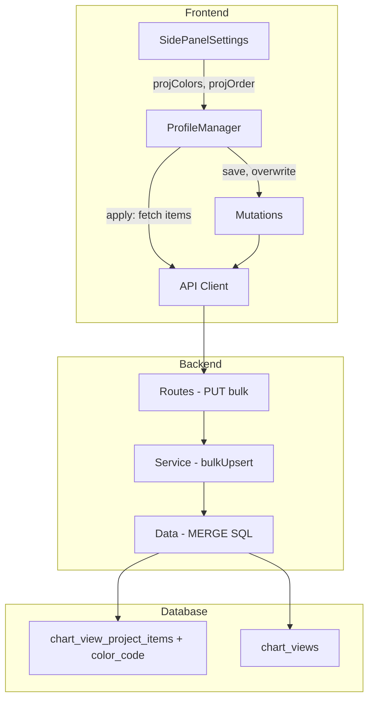
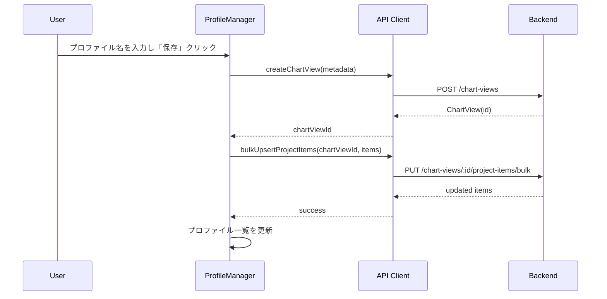
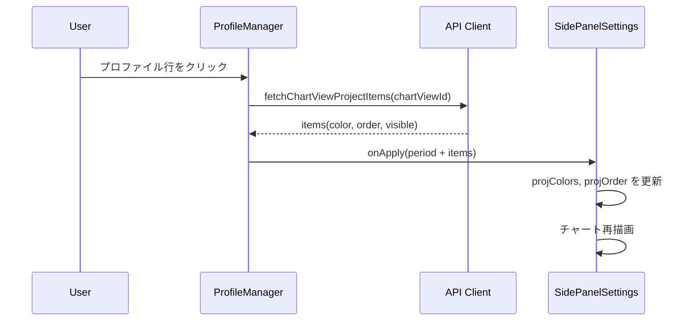
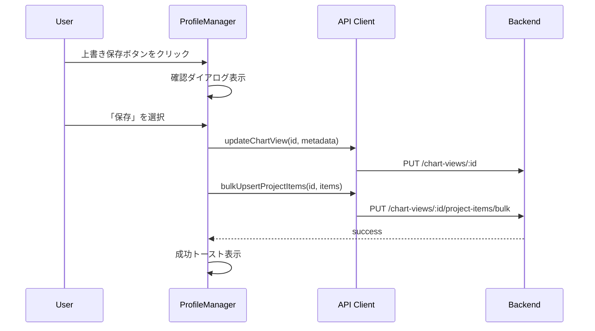

# Workload プロファイル管理の拡張（色・並び順・表示状態の保存）

> **元spec**: color-profiling-extend

## 概要

Workload のプロファイル（ChartView）管理機能を拡張し、案件ごとの色・並び順・表示/非表示をプロファイルに紐づけて保存・復元・上書きできるようにする。

- **ユーザー**: 事業部リーダー・プロジェクトマネージャーが Workload 画面でチャート表示設定をプロファイルとして管理
- **影響範囲**: `chart_view_project_items` テーブルに `color_code` カラムを追加。バックエンドに一括更新 API を追加。フロントエンドの ProfileManager に保存・適用・上書きフローを実装

### Non-Goals

- `chart_color_settings` テーブル（グローバル色設定）の廃止やリファクタリング
- キャパシティシナリオの色・表示設定のプロファイル化
- プロファイルの共有機能（ユーザー間）
- プロファイルのインポート/エクスポート

## 要件

### 要件1: ChartViewProjectItem への色情報の追加

`color` フィールドを VARCHAR（NULL 許容）として追加。CRUD API で `color` の受取・保存・更新・返却を行う。未指定時は `null` として保存。

### 要件2: プロジェクトアイテムの一括登録・更新 API

`PUT /chart-views/:id/project-items/bulk` エンドポイントを提供。配列内の各アイテムを upsert（存在すれば更新、なければ作成）し、リクエストに含まれない既存アイテムを削除（完全同期方式）。各アイテムは `projectId`, `projectCaseId`, `displayOrder`, `isVisible`, `color` を含む。

### 要件3: プロファイル新規保存時のプロジェクトアイテム同時保存

プロファイル新規保存時、ChartView 作成直後にプロジェクトアイテム一覧（色・並び順・表示/非表示）を一括登録 API で保存。保存失敗時はエラートーストを表示。

### 要件4: プロファイル適用時の画面状態の完全復元

プロファイル適用時に `startYearMonth`, `endYearMonth`, `chartType` に加え、各案件の `color`, `displayOrder`, `isVisible` を復元。旧プロファイル（color 未保存）の場合は期間設定のみ復元し、現在の画面状態を維持。

### 要件5: プロファイルの上書き保存機能

プロファイル一覧の各行に上書き保存ボタン（`Save` アイコン）を表示。確認ダイアログ後に ChartView 情報 + プロジェクトアイテムを現在の画面状態で更新。成功/失敗トーストを表示。

### 要件6: フロントエンド型定義とAPIクライアント

`ChartViewProjectItem` 型に `color: string | null` を追加。一括更新 API クライアント関数と mutation hook を提供。成功時に関連クエリを無効化。

## アーキテクチャ・設計



- 既存のレイヤードアーキテクチャ（routes → services → data）を踏襲
- ChartViewProjectItem エンティティの拡張。新規エンティティは不要
- SQL MERGE bulkUpsert パターン、TanStack Query mutations パターンを維持

| Layer | Technology | Notes |
|-------|-----------|-------|
| Frontend | React 19 + TanStack Query | mutation / query パターンを拡張 |
| Frontend UI | shadcn/ui + Lucide Icons | Button / AlertDialog |
| Backend | Hono v4 + Zod v4 | 一括更新 API エンドポイント |
| Database | SQL Server (mssql) | MERGE ベースの bulkUpsert |

### プロファイル新規保存フロー



### プロファイル適用フロー



### プロファイル上書き保存フロー



## APIコントラクト

| Method | Endpoint | Request | Response | Errors |
|--------|----------|---------|----------|--------|
| PUT | `/chart-views/:chartViewId/project-items/bulk` | `{ items: BulkUpsertItem[] }` | `{ data: ChartViewProjectItem[] }` | 400, 404, 422, 500 |

### リクエスト

```typescript
{
  items: Array<{
    projectId: number
    projectCaseId: number | null
    displayOrder: number
    isVisible: boolean
    color: string | null
  }>
}
```

### レスポンス (200)

```typescript
{
  data: Array<{
    chartViewProjectItemId: number
    chartViewId: number
    projectId: number
    projectCaseId: number | null
    displayOrder: number
    isVisible: boolean
    color: string | null
    createdAt: string
    updatedAt: string
    project: { projectCode: string; projectName: string }
    projectCase: { caseName: string } | null
  }>
}
```

### バリデーションスキーマ

```typescript
const bulkUpsertChartViewProjectItemSchema = z.object({
  items: z.array(
    z.object({
      projectId: z.number().int().positive(),
      projectCaseId: z.number().int().positive().nullable().optional(),
      displayOrder: z.number().int().min(0).default(0),
      isVisible: z.boolean().default(true),
      color: z.string().max(7).nullable().optional(),
    })
  ),
})
```

## コンポーネント設計

### Backend / Data -- bulkUpsert

トランザクション内で MERGE + DELETE NOT IN による完全同期。

```typescript
interface ChartViewProjectItemDataBulkUpsert {
  bulkUpsert(
    chartViewId: number,
    items: Array<{
      projectId: number
      projectCaseId: number | null
      displayOrder: number
      isVisible: boolean
      color: string | null
    }>
  ): Promise<ChartViewProjectItemRow[]>
}
```

- MERGE ON 条件: `(chart_view_id, project_id, project_case_id)`
- MATCHED: `display_order`, `is_visible`, `color_code`, `updated_at` を更新
- NOT MATCHED: 新規レコード挿入
- MERGE 後: リクエストに含まれない組み合わせを DELETE
- `color_code` が `NULL` の場合、DB に `NULL` を格納

### Backend / Service -- bulkUpsert

```typescript
interface ChartViewProjectItemServiceBulkUpsert {
  bulkUpsert(
    chartViewId: number,
    items: Array<{
      projectId: number
      projectCaseId: number | null
      displayOrder: number
      isVisible: boolean
      color: string | null
    }>
  ): Promise<
    | { success: true; data: ChartViewProjectItem[] }
    | { success: false; status: 404 | 422; error: ProblemDetails }
  >
}
```

- chartViewId の存在バリデーション（404）
- projectId の存在バリデーション（422）
- projectCaseId 指定時は projectId との関連バリデーション

### Backend / Transform

`toChartViewProjectItemResponse` に `color: row.color_code ?? null` を追加。`ChartViewProjectItemRow` 型に `color_code: string | null` を追加。

### Frontend / API & Mutations

```typescript
async function bulkUpsertChartViewProjectItems(
  chartViewId: number,
  items: Array<{
    projectId: number
    projectCaseId: number | null
    displayOrder: number
    isVisible: boolean
    color: string | null
  }>
): Promise<ApiResponse<ChartViewProjectItem[]>>
```

`useBulkUpsertChartViewProjectItems` mutation hook:
- onSuccess: `chartViewProjectItems` クエリキーを無効化

### Frontend / ProfileManager

```typescript
interface ProfileManagerProps {
  chartType: string
  startYearMonth: string
  endYearMonth: string
  projectItems: Array<{
    projectId: number
    projectCaseId: number | null
    displayOrder: number
    isVisible: boolean
    color: string | null
  }>
  onApply?: (profile: {
    chartViewId: number
    startYearMonth: string
    endYearMonth: string
    projectItems: Array<{
      projectId: number
      projectCaseId: number | null
      displayOrder: number
      isVisible: boolean
      color: string | null
    }>
  }) => void
}
```

- 新規保存: ChartView 作成 → bulkUpsert 呼び出し
- 適用: ChartViewProjectItems を fetch → onApply コールバックで色・並び順・表示状態を返す
- 上書き保存: 確認ダイアログ → ChartView 更新 + bulkUpsert
- 上書き保存ボタン: Lucide `Save` アイコン、各プロファイル行の削除ボタン左に配置

## データモデル

**chart_view_project_items テーブル変更:**

| Column | Type | Nullable | Default | Notes |
|--------|------|----------|---------|-------|
| color_code | VARCHAR(7) | YES | NULL | CSS hex カラーコード（例: #FF5733）。新規追加 |

```sql
ALTER TABLE chart_view_project_items
ADD color_code VARCHAR(7) NULL;
```

## エラーハンドリング

| Category | Condition | Status | Response |
|----------|----------|--------|----------|
| User Error | 無効なリクエストボディ | 400 | Zod バリデーションエラー詳細 |
| User Error | chartViewId が存在しない | 404 | RFC 9457 Problem Details |
| User Error | projectId が存在しない | 422 | RFC 9457 Problem Details |
| System Error | DB 接続エラー・トランザクション失敗 | 500 | RFC 9457 Problem Details |
| Frontend | API 呼び出し失敗 | - | `toast.error()` でユーザーに通知 |

## ファイル構成

```
apps/backend/src/
├── types/chartViewProjectItem.ts       # スキーマに color + bulkUpsert 追加
├── data/chartViewProjectItemData.ts    # bulkUpsert メソッド追加
├── services/chartViewProjectItemService.ts  # bulkUpsert ロジック追加
├── routes/chartViewProjectItems.ts     # PUT /bulk エンドポイント追加
└── transform/chartViewProjectItemTransform.ts  # color 変換追加

apps/frontend/src/features/workload/
├── types/index.ts                      # ChartViewProjectItem に color 追加
├── api/chart-views.ts                  # bulkUpsert API 関数追加
├── hooks/mutations.ts                  # useBulkUpsertChartViewProjectItems 追加
└── components/
    ├── ProfileManager.tsx              # 保存・適用・上書き拡張
    └── SidePanelSettings.tsx           # projectItems props 構築
```
