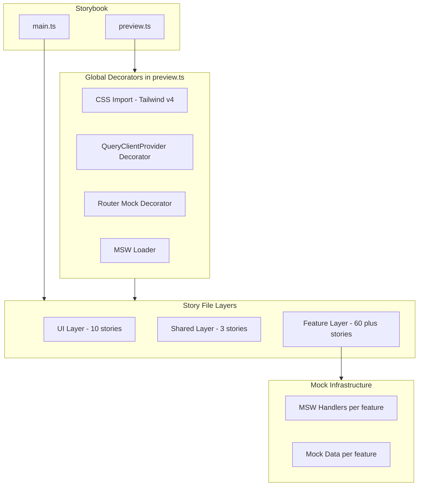

# デザインシステム - UI インベントリ（Storybook カタログ化）

> **元spec**: design-system

## 概要

操業管理システムの全 UI コンポーネント（約70以上）を Storybook でカタログ化し、UI インベントリ（棚卸し）基盤を構築する。UIスタイルの不整合・重複を可視化し、後続のリデザインフェーズの判断材料を提供する。

- **対象ユーザー**: フロントエンド開発者（コンポーネントの現状確認・バリアント比較・アクセシビリティ検証・スタイル改善の影響範囲評価）
- **影響範囲**: 既存の Storybook v10.2.7 セットアップを拡張。アプリケーションコード自体への変更はない
- **スコープ**: 「棚卸し（カタログ化）」フェーズに限定。リデザイン・全体展開は後続仕様で扱う

### Non-Goals

- コンポーネントのリデザイン・スタイル変更
- E2E テストやビジュアルリグレッションテストの CI/CD 統合
- デザイントークンの体系化
- feature コンポーネントのリファクタリングや共通化の実施

## 要件

### 1. コアUIコンポーネントのストーリー作成

`components/ui/` 配下の全10コンポーネント（button, input, label, select, separator, sheet, switch, table, badge, alert-dialog）の全バリアント・状態をストーリーとして網羅する。

- Button: 全バリアント（default, destructive, outline, secondary, ghost, link）x 全サイズ（default, sm, lg, icon）
- Input: デフォルト、placeholder、disabled、エラー状態
- Select: 閉じた/開いた/選択済み/disabled 状態
- Alert Dialog: 開閉操作、アクション・キャンセルボタン動作
- Sheet: 各方向（top, right, bottom, left）からのスライドイン
- Badge: 全バリアント（default, secondary, destructive, outline, success）
- Switch: オン/オフ切替、disabled 状態
- Label, Separator, Table: 基本表示

### 2. ストーリーファイルの構成と命名規約

- コンポーネントと同ディレクトリに `[ComponentName].stories.tsx` で配置
- CSF3（Component Story Format 3）形式で記述
- `title` の階層構造: `UI/`, `Shared/`, `Layout/`, `Features/[FeatureName]/`
- `args` による props のインタラクティブ変更を有効化

### 3. サンプルストーリーの整理

`src/stories/` 配下のサンプルストーリー・コンポーネント・関連ファイルを削除し、プロダクションコンポーネントのみのカタログにする。

### 4. 共有・レイアウトコンポーネントのストーリー作成

- DataTableToolbar: 検索入力・フィルター・アクションボタンの各状態
- DeleteConfirmDialog: ダイアログの開閉・確認・キャンセル操作
- AppShell: サイドバー展開・折りたたみ・メインコンテンツ領域のレイアウト

### 5. feature コンポーネントのストーリー作成

- **フォーム系**: BusinessUnitForm, ProjectForm, CaseForm, CaseFormSheet, ProjectTypeForm, WorkTypeForm, ScenarioFormSheet（新規作成モード・編集モード）
- **データテーブル系**: 各 feature の DataTable（空/少量/大量データ状態）、WorkloadDataTable、CalculationResultTable、ツールバー
- **チャート系**: WorkloadChart（workload/case-study）、StandardEffortPreview（モックデータ描画）
- **ダイアログ・パネル系**: DeleteConfirmDialog, RestoreConfirmDialog, BulkInputDialog, UnsavedChangesDialog, SidePanel, BusinessUnitSelector, PeriodSelector, ViewToggle, LegendPanel, ProfileManager, ProjectEditSheet, CaseSidebar, CaseStudySection, WorkloadCard, FeedbackStates（8コンポーネント）
- **間接工数管理系**: MonthlyHeadcountGrid, IndirectWorkRatioMatrix, CapacityScenarioList, HeadcountPlanCaseList, IndirectWorkCaseList, ResultPanel, SettingsPanel

### 6. モック・デコレータ基盤

- QueryClientProvider デコレータで全ストーリーに TanStack Query コンテキストを提供
- MSW（msw-storybook-addon）でネットワークリクエストをモック
- TanStack Form/Table/Router 依存のストーリーが独立動作
- 型安全なモックデータを feature 単位で管理

### 7. アクセシビリティ検証・ドキュメント

- addon-a11y による axe-core 自動検証を全ストーリーで有効化
- addon-docs による Props テーブル自動生成・使用例コード表示
- Controls パネルでのリアルタイムプレビュー

### 8. UI インベントリレポート

全ストーリー完了後、UIの不整合・重複・共通化候補をレポートに記録（`.kiro/specs/design-system/ui-inventory.md`）。

## アーキテクチャ・設計

### アーキテクチャ構成



### 技術スタック

| Layer | Choice / Version | 備考 |
|-------|------------------|------|
| Storybook | v10.2.7 | インストール済み |
| Addon - Docs | @storybook/addon-docs | Props テーブル自動生成 |
| Addon - A11y | @storybook/addon-a11y | axe-core アクセシビリティ検証 |
| Addon - Vitest | @storybook/addon-vitest | ストーリーベースのテスト |
| MSW | msw + msw-storybook-addon | ネットワークモック（新規追加） |
| CSS | Tailwind CSS v4 | preview.ts での CSS インポート |

## コンポーネント・モジュール

### インフラ層

#### StorybookGlobalConfig（preview.ts）

グローバルデコレータ・ローダー・CSS インポートを設定し、全ストーリーの実行基盤を提供。

```typescript
import type { Preview } from '@storybook/react-vite'
import { QueryClient, QueryClientProvider } from '@tanstack/react-query'
import { initialize, mswLoader } from 'msw-storybook-addon'

import '../src/styles/globals.css'

initialize()

const withQueryClient: Decorator = (Story) => {
  const queryClient = new QueryClient({
    defaultOptions: {
      queries: { retry: false, staleTime: Infinity },
    },
  })
  return (
    <QueryClientProvider client={queryClient}>
      <Story />
    </QueryClientProvider>
  )
}

const preview: Preview = {
  decorators: [withQueryClient],
  loaders: [mswLoader],
  parameters: {
    controls: {
      matchers: {
        color: /(background|color)$/i,
        date: /Date$/i,
      },
    },
  },
}
```

- ストーリーごとに新規 QueryClient を生成（状態共有を防止）
- `@/` パスエイリアスは Vite 設定の自動継承で解決

#### Router デコレータ（per-story）

AppShell・DataTableToolbar 等のルーター依存コンポーネント用。

```typescript
import { createMemoryHistory, createRootRoute, createRouter, RouterProvider } from '@tanstack/react-router'

const withRouter: Decorator = (Story) => {
  const rootRoute = createRootRoute({ component: Story })
  const router = createRouter({
    routeTree: rootRoute,
    history: createMemoryHistory({ initialEntries: ['/'] }),
  })
  return <RouterProvider router={router} />
}
```

#### MSW ハンドラ

feature ごとにハンドラファイルを管理。`parameters.msw.handlers` でストーリー単位で注入。

```typescript
// features/business-units/components/__mocks__/handlers.ts
import { http, HttpResponse } from 'msw'

export const businessUnitsHandlers = [
  http.get('/api/business-units', () => {
    return HttpResponse.json({ data: mockBusinessUnits })
  }),
  http.get('/api/business-units/:id', ({ params }) => {
    const unit = mockBusinessUnits.find(u => u.id === params.id)
    return unit
      ? HttpResponse.json({ data: unit })
      : new HttpResponse(null, { status: 404 })
  }),
]
```

#### モックデータファクトリ

`satisfies` 演算子で型安全性を検証。

```typescript
// features/business-units/components/__mocks__/data.ts
import type { BusinessUnit } from '@/features/business-units/types'

export const mockBusinessUnit = {
  id: '1',
  businessUnitCode: 'BU001',
  businessUnitName: 'エンジニアリング事業部',
  isDisabled: false,
} satisfies BusinessUnit
```

### ストーリーのパターン

#### コアUI（CSF3テンプレート）

```typescript
import type { Meta, StoryObj } from '@storybook/react-vite'
import { Button } from './button'

const meta = {
  title: 'UI/Button',
  component: Button,
  tags: ['autodocs'],
  argTypes: {
    variant: { control: 'select', options: ['default', 'destructive', 'outline', 'secondary', 'ghost', 'link'] },
    size: { control: 'select', options: ['default', 'sm', 'lg', 'icon'] },
  },
} satisfies Meta<typeof Button>
```

#### フォーム系（MSW + QueryClient）

```typescript
const meta = {
  title: 'Features/Projects/ProjectForm',
  component: ProjectForm,
  tags: ['autodocs'],
  parameters: {
    msw: {
      handlers: [
        http.get('/api/business-units/select', () => HttpResponse.json({ data: mockBusinessUnitsForSelect })),
      ],
    },
  },
} satisfies Meta<typeof ProjectForm>

export const CreateMode: Story = { args: { mode: 'create' } }
export const EditMode: Story = { args: { mode: 'edit', initialValues: mockProject } }
```

#### チャート系（固定高さラッパー）

```typescript
const meta = {
  title: 'Features/Workload/WorkloadChart',
  component: WorkloadChart,
  tags: ['autodocs'],
  decorators: [(Story) => (<div style={{ width: '100%', height: 500 }}><Story /></div>)],
} satisfies Meta<typeof WorkloadChart>
```

## ファイル構成

```
.storybook/
  main.ts            # ストーリー検出パターン・アドオン設定
  preview.ts          # グローバルデコレータ・ローダー・CSS
public/
  mockServiceWorker.js # MSW ServiceWorker
src/
  components/
    ui/*.stories.tsx           # コアUI ストーリー（10件）
    shared/*.stories.tsx       # 共有コンポーネント ストーリー
    layout/*.stories.tsx       # レイアウトコンポーネント ストーリー
  features/
    [feature]/components/
      *.stories.tsx            # feature ストーリー（60件以上）
      __mocks__/
        handlers.ts            # MSW ハンドラ
        data.ts                # モックデータ
```
