# Frontend 共通ユーティリティ

> **元spec**: frontend-common-utils

## 概要

Frontend コードベースに散在する重複ユーティリティ関数・マジックナンバー・ローカルコンポーネントを共通モジュールに集約し、保守性と一貫性を向上させる。

- **対象ユーザー**: 開発者（日時フォーマット・フォームバリデーション・キャッシュ設定・詳細画面表示の実装時に利用）
- **影響範囲**: 4つの feature（work-types, business-units, project-types, projects）と 4つの detail route のローカル定義を共通モジュールへの import に置換。外部から観測可能な振る舞いは変更しない
- **削減対象**: formatDateTime x4、displayOrder validator x3、staleTime マジックナンバー x31箇所、DetailRow x4、NotFoundState x4

### Non-Goals

- columns.tsx のカラムファクトリ化（Phase 2）
- フォームフィールドラッパーの抽出（Phase 2）
- API クライアント・Query Key・Mutation Hook のファクトリ化（Phase 2）
- 共有コンポーネントの barrel export（index.ts）導入

## 要件

### 1. formatDateTime 共通ユーティリティ [F-C1]

- `lib/format-utils.ts` に `formatDateTime` 関数をエクスポート
- `ja-JP` ロケールで `yyyy/MM/dd HH:mm` 形式にフォーマット
- 4つの columns.tsx のローカル定義を削除し、4つの detail route のインライン `toLocaleString` 呼び出しも置換

### 2. displayOrder バリデータの共通化 [F-C4]

- `lib/validators.ts` に `displayOrderValidators` オブジェクトをエクスポート
- `onChange` / `onBlur` の両方で整数チェック・非負チェックを検証
- 3つのフォームコンポーネントのインラインバリデーションロジックを置換

### 3. staleTime 定数の一元管理 [F-A4]

- `lib/api/constants.ts` に `STALE_TIMES` 定数オブジェクトをエクスポート
- 全 `queries.ts` ファイルのマジックナンバーを置換

### 4. DetailRow 共有コンポーネント [F-RO2]

- `components/shared/DetailRow.tsx` に `DetailRow` コンポーネントをエクスポート
- `label` と `value` を `grid grid-cols-3 gap-4` レイアウトで表示
- 4つの detail route のローカル定義を置換

### 5. NotFoundState 共有コンポーネント [F-RO3]

- `components/shared/NotFoundState.tsx` に `NotFoundState` コンポーネントをエクスポート
- `entityName`, `backTo`, `backLabel?` props を受け取り、リソース未検出 UI を表示
- 4つの detail route の `notFoundComponent` と `isError || !data` 時表示を置換

### 6. 後方互換性

- 全画面の表示内容・バリデーション動作・キャッシュ動作が同一
- 既存テスト全パス
- `@/` エイリアスを使用した import パス

## アーキテクチャ・設計

### レイヤー構成

```mermaid
graph TB
    subgraph SharedModules[共通モジュール - 新規作成]
        FU[lib/format-utils.ts]
        VA[lib/validators.ts]
        CO[lib/api/constants.ts]
        DR[components/shared/DetailRow.tsx]
        NF[components/shared/NotFoundState.tsx]
    end

    subgraph Features[feature レイヤー]
        WT[work-types/columns.tsx]
        BU[business-units/columns.tsx]
        PT[project-types/columns.tsx]
        PJ[projects/columns.tsx]
        WTF[work-types/WorkTypeForm.tsx]
        BUF[business-units/BusinessUnitForm.tsx]
        PTF[project-types/ProjectTypeForm.tsx]
    end

    subgraph Queries[queries レイヤー]
        Q1[work-types/queries.ts]
        Q2[business-units/queries.ts]
        Q3[project-types/queries.ts]
        Q4[projects/queries.ts]
        Q5[case-study/queries.ts]
        Q6[indirect-case-study/queries.ts]
        Q7[workload/queries.ts]
    end

    subgraph Routes[route レイヤー]
        R1[business-units detail]
        R2[project-types detail]
        R3[work-types detail]
        R4[projects detail]
    end

    WT --> FU
    BU --> FU
    PT --> FU
    PJ --> FU
    WTF --> VA
    BUF --> VA
    PTF --> VA
    Q1 --> CO
    Q2 --> CO
    Q3 --> CO
    Q4 --> CO
    Q5 --> CO
    Q6 --> CO
    Q7 --> CO
    R1 --> DR
    R2 --> DR
    R3 --> DR
    R4 --> DR
    R1 --> NF
    R2 --> NF
    R3 --> NF
    R4 --> NF
    R1 --> FU
    R2 --> FU
    R3 --> FU
    R4 --> FU
```



- **パターン**: Extract Method（ローカル定義を共通モジュールに抽出）
- **依存方向**: features/routes -> lib/shared のみ。feature 間依存禁止を維持
- **既存パターン**: `lib/` の小ファイル構成、`components/shared/` の名前付きエクスポート

### 技術スタック

| Layer | Choice / Version | 備考 |
|-------|------------------|------|
| Frontend | React 19 + TypeScript 5.9 | strict mode |
| Routing | TanStack Router | notFoundComponent, Link |
| Forms | TanStack Form | validators prop 型互換 |
| Query | TanStack Query | staleTime 定数参照 |

## コンポーネント・モジュール

### lib/format-utils.ts

```typescript
/**
 * 日時文字列を ja-JP ロケールでフォーマットする
 * @param dateStr - ISO 8601 形式の日時文字列
 * @returns "yyyy/MM/dd HH:mm" 形式の文字列
 */
export function formatDateTime(dateStr: string): string;
```

- 内部実装: `new Date(dateStr).toLocaleString("ja-JP", { year: "numeric", month: "2-digit", day: "2-digit", hour: "2-digit", minute: "2-digit" })`
- React に依存しない純粋関数

### lib/validators.ts

```typescript
type FieldValidateFn<T> = (params: { value: T }) => string | undefined;

interface FieldValidators<T> {
  onChange: FieldValidateFn<T>;
  onBlur: FieldValidateFn<T>;
}

/**
 * displayOrder フィールド用バリデータ
 * - 整数チェック: "表示順は整数で入力してください"
 * - 非負チェック: "表示順は0以上で入力してください"
 */
export const displayOrderValidators: FieldValidators<number>;
```

- `onChange` と `onBlur` は同一ロジック
- TanStack Form の `validators` prop と型互換

### lib/api/constants.ts

```typescript
/**
 * TanStack Query staleTime 定数
 * データ更新頻度に応じたカテゴリ別キャッシュ時間
 */
export const STALE_TIMES: {
  /** 1分 -- 頻繁に更新されるデータ */
  readonly SHORT: 60_000;
  /** 2分 -- 一覧/詳細クエリ */
  readonly STANDARD: 120_000;
  /** 5分 -- 関連データ/月次データ */
  readonly MEDIUM: 300_000;
  /** 30分 -- マスタデータ */
  readonly LONG: 1_800_000;
} as const;
```

- 置換マッピング: `60 * 1000` -> `STALE_TIMES.SHORT`, `2 * 60 * 1000` -> `STALE_TIMES.STANDARD`, `5 * 60 * 1000` -> `STALE_TIMES.MEDIUM`, `30 * 60 * 1000` -> `STALE_TIMES.LONG`
- `lib/api/index.ts` から re-export

### components/shared/DetailRow.tsx

```typescript
interface DetailRowProps {
  label: string;
  value: string;
  className?: string;
}

export function DetailRow(props: DetailRowProps): React.ReactElement;
```

- Stateless（props のみ）
- レイアウト: `grid grid-cols-3 gap-4`
  - `dt`: `text-sm font-medium text-muted-foreground`
  - `dd`: `col-span-2 text-sm`
- `className` は `cn()` で外側の `div` にマージ

### components/shared/NotFoundState.tsx

```typescript
interface NotFoundStateProps {
  entityName: string;
  backTo: string;
  backLabel?: string; // デフォルト: "一覧に戻る"
  className?: string;
}

export function NotFoundState(props: NotFoundStateProps): React.ReactElement;
```

- Stateless（props のみ）
- レイアウト: `flex flex-col items-center justify-center py-16 space-y-4`
  - メッセージ: `"{entityName}が見つかりません"`
  - リンク: TanStack Router `Link`
- 4つの detail route の `notFoundComponent` と `isError || !data` 時の表示を統合

## ファイル構成

```
apps/frontend/src/
  lib/
    format-utils.ts           # formatDateTime（新規）
    validators.ts             # displayOrderValidators（新規）
    api/
      constants.ts            # STALE_TIMES（新規）
      index.ts                # re-export 追加
  components/
    shared/
      DetailRow.tsx           # DetailRow（新規）
      NotFoundState.tsx       # NotFoundState（新規）
  features/
    [feature]/
      components/columns.tsx  # formatDateTime import に変更
      components/[Form].tsx   # displayOrderValidators import に変更
      api/queries.ts          # STALE_TIMES import に変更
  routes/
    master/[entity]/detail    # DetailRow, NotFoundState, formatDateTime import に変更
```
