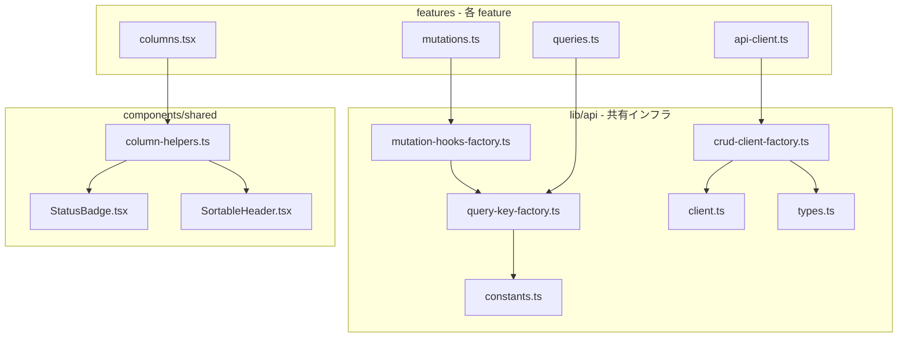

# Frontend CRUD インフラストラクチャ

> **元spec**: frontend-crud-infrastructure

## 概要

フロントエンドの CRUD ボイラープレート（API クライアント・Query Key Factory・Mutation Hook・カラム定義）をファクトリ関数に抽象化し、feature 間の重複コードを削減する。

- **対象ユーザー**: フロントエンド開発者（新規エンティティ追加時や既存パターン修正時に、ファクトリ呼び出しのみで CRUD インフラを構築）
- **影響範囲**: 対象4 feature（`work-types`, `business-units`, `project-types`, `projects`）の `api-client.ts`, `queries.ts`, `mutations.ts`, `columns.tsx` をファクトリ呼び出しに置換し、約435行の重複を解消
- **前提**: Phase 1（`frontend-common-utils` spec）で導入済みの共有ユーティリティを基盤として活用

### 対応コードスメル

| ID | スメル | 推定重複行数 |
|----|--------|-------------|
| F-A1 | API クライアントの CRUD パターン重複 | ~180行 |
| F-A2 | Query Key Factory の重複 | ~63行 |
| F-A3 | Mutation Hook の重複 | ~192行 |
| F-C2 | ステータスバッジカラムの重複 | ~30行 |
| F-C3 | 復元アクションカラムの重複 | ~50行 |

### Non-Goals

- リンクカラムの汎用化（feature ごとにルートパス・パラメータが異なる）
- `case-study`, `indirect-case-study`, `workload` 等の非マスター feature への適用
- Select クエリ（Projects 固有）のファクトリ化
- トースト通知の統一（Phase 4）
- Backend 側の変更

## 要件

### 1. CRUD API クライアントファクトリ

- `createCrudClient` がリソースパスと設定から `fetchList`, `fetchDetail`, `create`, `update`, `delete`, `restore` の6関数を型安全に生成
- `string` / `number` 型ID、ページネーション有無の両方をサポート
- 既存の `API_BASE_URL`, `ApiError`, `handleResponse` を内部使用

### 2. Query Key Factory ジェネレータ

- `createQueryKeys` がリソース名から `all`, `lists`, `list(params)`, `details`, `detail(id)` の5キー生成関数を返す
- TanStack Query の階層的無効化（プレフィックスマッチング）に対応

### 3. 標準 queryOptions ファクトリ

- リスト用・詳細用の `queryOptions` を生成する関数を提供
- `STALE_TIMES` 定数をデフォルト値として使用し、呼び出し側でオーバーライド可能

### 4. CRUD Mutation Hook ファクトリ

- `createCrudMutations` が `useCreate`, `useUpdate`, `useDelete`, `useRestore` の4 Hook を一括生成
- 各 Hook は成功時に適切なキーを自動無効化
- 呼び出し側で `onSuccess` コールバックを追加可能

### 5. カラム定義ヘルパー関数群

- `createStatusColumn`: `deletedAt` に基づく StatusBadge 表示
- `createRestoreActionColumn`: 削除済みレコードの復元ボタン（`stopPropagation` 付き）
- `createDateTimeColumn`: `formatDateTime` + `SortableHeader` 付きカラム
- `createSortableColumn`: `SortableHeader` 付き基本カラム

### 6. 既存 feature への適用

- 対象4 feature の api-client/queries/mutations/columns をファクトリ呼び出しに置換
- エクスポートの型互換性を維持
- feature 固有のカスタムロジックはファクトリ出力に追加する形で実装
- 対象外 feature には変更を加えない

### 7. 型安全性

- TypeScript strict mode でコンパイルエラーなし
- `any` 型を使用しない
- ジェネリクスによる型推論

## アーキテクチャ・設計

### レイヤー構成



- **パターン**: ファクトリ関数パターン（設定オブジェクト -> 型付きオブジェクト返却）
- **配置**: `lib/api/` に API インフラファクトリ、`components/shared/` にカラムヘルパー
- **維持**: feature-first 構成、`@/` エイリアス、re-export パターン

### 技術スタック

| Layer | Choice / Version | 備考 |
|-------|------------------|------|
| Frontend | React 19 + TypeScript 5.9 | strict mode 必須 |
| Data Fetching | TanStack Query v5 | queryOptions / useMutation |
| Table | TanStack Table v8 | ColumnDef 型 |
| Routing | TanStack Router | Link（カラム内） |

## コンポーネント・モジュール

### lib/api/crud-client-factory.ts

```typescript
interface BaseListParams {
  includeDisabled?: boolean;
}

interface PaginatedListParams extends BaseListParams {
  page: number;
  pageSize: number;
}

interface CrudClientConfig<
  TEntity,
  TCreateInput,
  TUpdateInput,
  TId extends string | number,
  TListParams extends BaseListParams,
> {
  resourcePath: string;           // e.g. "work-types"
  paginated?: boolean;            // default: false
}

interface CrudClient<
  TEntity,
  TCreateInput,
  TUpdateInput,
  TId extends string | number,
  TListParams extends BaseListParams,
> {
  fetchList(params: TListParams): Promise<PaginatedResponse<TEntity>>;
  fetchDetail(id: TId): Promise<SingleResponse<TEntity>>;
  create(input: TCreateInput): Promise<SingleResponse<TEntity>>;
  update(id: TId, input: TUpdateInput): Promise<SingleResponse<TEntity>>;
  delete(id: TId): Promise<void>;
  restore(id: TId): Promise<SingleResponse<TEntity>>;
}

function createCrudClient<
  TEntity,
  TCreateInput,
  TUpdateInput,
  TId extends string | number = string,
  TListParams extends BaseListParams = BaseListParams,
>(
  config: CrudClientConfig<TEntity, TCreateInput, TUpdateInput, TId, TListParams>,
): CrudClient<TEntity, TCreateInput, TUpdateInput, TId, TListParams>;
```

- `fetchList`: `paginated: true` の場合は `page[number]`, `page[size]` を URLSearchParams に追加。`includeDisabled` は `filter[includeDisabled]` として追加
- `fetchDetail` / `update` / `delete`: `encodeURIComponent(String(id))` で一律エンコード
- `restore`: `/{id}/actions/restore` に POST
- `create`: `Content-Type: application/json` 付き POST
- `update`: `Content-Type: application/json` 付き PUT

### lib/api/query-key-factory.ts

```typescript
interface QueryKeys<TId extends string | number, TListParams> {
  all: readonly [string];
  lists: () => readonly [string, "list"];
  list: (params: TListParams) => readonly [string, "list", TListParams];
  details: () => readonly [string, "detail"];
  detail: (id: TId) => readonly [string, "detail", TId];
}

function createQueryKeys<
  TId extends string | number = string,
  TListParams = unknown,
>(
  resourceName: string,
): QueryKeys<TId, TListParams>;

function createListQueryOptions<TEntity, TListParams>(options: {
  queryKeys: QueryKeys<unknown, TListParams>;
  fetchList: (params: TListParams) => Promise<PaginatedResponse<TEntity>>;
  staleTime?: number;
}): (params: TListParams) => ReturnType<typeof queryOptions>;

function createDetailQueryOptions<TEntity, TId extends string | number>(options: {
  queryKeys: QueryKeys<TId, unknown>;
  fetchDetail: (id: TId) => Promise<SingleResponse<TEntity>>;
  staleTime?: number;
}): (id: TId) => ReturnType<typeof queryOptions>;
```

- `staleTime` デフォルト値は `STALE_TIMES.STANDARD`（2分）
- 各 feature の `queries.ts` では生成されたキーとヘルパーを使用し、カスタムクエリは個別定義

### lib/api/mutation-hooks-factory.ts

```typescript
interface CrudMutationConfig<
  TEntity,
  TCreateInput,
  TUpdateInput,
  TId extends string | number,
  TListParams,
> {
  client: CrudClient<TEntity, TCreateInput, TUpdateInput, TId, BaseListParams>;
  queryKeys: QueryKeys<TId, TListParams>;
}

interface CrudMutations<
  TEntity,
  TCreateInput,
  TUpdateInput,
  TId extends string | number,
> {
  useCreate: (options?: {
    onSuccess?: (data: SingleResponse<TEntity>) => void;
  }) => UseMutationResult<SingleResponse<TEntity>, Error, TCreateInput>;

  useUpdate: (
    id: TId,
    options?: {
      onSuccess?: (data: SingleResponse<TEntity>) => void;
    },
  ) => UseMutationResult<SingleResponse<TEntity>, Error, TUpdateInput>;

  useDelete: (options?: {
    onSuccess?: () => void;
  }) => UseMutationResult<void, Error, TId>;

  useRestore: (options?: {
    onSuccess?: (data: SingleResponse<TEntity>) => void;
  }) => UseMutationResult<SingleResponse<TEntity>, Error, TId>;
}

function createCrudMutations<
  TEntity,
  TCreateInput,
  TUpdateInput,
  TId extends string | number,
  TListParams,
>(
  config: CrudMutationConfig<TEntity, TCreateInput, TUpdateInput, TId, TListParams>,
): CrudMutations<TEntity, TCreateInput, TUpdateInput, TId>;
```

- `useCreate`: `onSuccess` -> `invalidate(queryKeys.lists())`
- `useUpdate(id)`: `onSuccess` -> `invalidate(queryKeys.lists())` + `invalidate(queryKeys.detail(id))`
- `useDelete`: `onSuccess` -> `invalidate(queryKeys.lists())`
- `useRestore`: `onSuccess` -> `invalidate(queryKeys.lists())`
- 呼び出し側の `onSuccess` は組み込み無効化ロジックの**後**に実行

### components/shared/column-helpers.ts

```typescript
function createStatusColumn<TData extends { deletedAt?: string | null }>(options?: {
  id?: string;              // default: "status"
  header?: string;          // default: "ステータス"
  activeLabel?: string;     // default: "アクティブ"
  deletedLabel?: string;    // default: "削除済み"
}): ColumnDef<TData>;

function createRestoreActionColumn<
  TData extends { deletedAt?: string | null },
  TId extends string | number = string,
>(options: {
  idKey: keyof TData;
  onRestore?: (id: TId) => void;
}): ColumnDef<TData>;

function createDateTimeColumn<TData>(options: {
  accessorKey: keyof TData & string;
  label: string;
}): ColumnDef<TData>;

function createSortableColumn<TData>(options: {
  accessorKey: keyof TData & string;
  label: string;
}): ColumnDef<TData>;
```

- `createStatusColumn`: `StatusBadge` に `!!row.original.deletedAt` を渡す
- `createRestoreActionColumn`: `deletedAt` が truthy かつ `onRestore` 提供時のみボタン表示、`e.stopPropagation()` 付与
- `createDateTimeColumn`: `formatDateTime(row.original[accessorKey])` でセル値を整形
- `createSortableColumn`: `SortableHeader` のみの最小カラム定義

## データモデル・型定義

データモデルに変更なし。既存の `PaginatedResponse<T>`, `SingleResponse<T>`, 各エンティティ型をそのまま使用。

新たに導入する型（`CrudClientConfig`, `CrudClient`, `QueryKeys`, `CrudMutationConfig`, `CrudMutations`）はすべてファクトリの設定・戻り値型であり、API レスポンスやデータ構造には影響しない。

## ファイル構成

```
apps/frontend/src/
  lib/api/
    crud-client-factory.ts      # createCrudClient（新規）
    query-key-factory.ts        # createQueryKeys, createListQueryOptions, createDetailQueryOptions（新規）
    mutation-hooks-factory.ts   # createCrudMutations（新規）
    client.ts                   # 既存（API_BASE_URL, handleResponse）
    constants.ts                # 既存（STALE_TIMES）
    types.ts                    # 既存（PaginatedResponse, SingleResponse）
  components/shared/
    column-helpers.ts           # createStatusColumn, createRestoreActionColumn, createDateTimeColumn, createSortableColumn（新規）
    StatusBadge.tsx             # 既存
    SortableHeader.tsx          # 既存
  features/
    [feature]/api/
      api-client.ts             # createCrudClient 呼び出しに変更
      queries.ts                # createQueryKeys + createListQueryOptions/createDetailQueryOptions に変更
      mutations.ts              # createCrudMutations 呼び出しに変更
    [feature]/components/
      columns.tsx               # カラムヘルパー使用に変更
```
