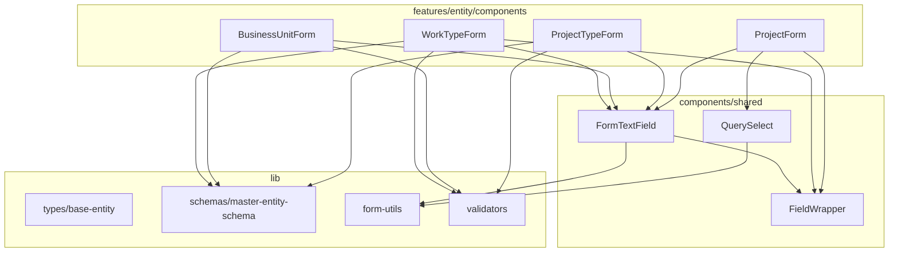

# Frontend フォーム・型インフラストラクチャ

> **元spec**: frontend-form-type-infrastructure

## 概要

フロントエンドのフォームフィールド構造（Label + Input + Error）と非同期 Select の状態管理、およびエンティティ型・Zod スキーマの共通基盤を提供し、各 feature の重複コードを削減する。

- **対象ユーザー**: フロントエンド開発者（マスターデータ管理画面やフォーム実装時に使用）
- **影響範囲**: 4つのフォームコンポーネント（WorkTypeForm, BusinessUnitForm, ProjectTypeForm, ProjectForm）と4つの型定義ファイルを簡素化。今後の新規フォーム実装のテンプレートを確立

### Non-Goals

- TanStack Form の `useForm` フック自体の抽象化
- `form.Field` コンポーネント自体のラップ（型推論の複雑化を回避）
- フォームの送信ロジック（onSubmit, エラーハンドリング）の共通化
- バックエンド型定義の変更

## 要件

### 1. FormField ラッパーコンポーネント

- FieldWrapper: Label + children + Error メッセージの統一レイアウト（`form.Field` の render prop 内で使用）
- FormTextField: FieldWrapper + Input のショートカット（TanStack Form の field オブジェクトと自動接続）
- `mode === "create"` 時に必須マーク（`*`）を表示
- `getErrorMessage()` によるエラーメッセージ表示
- `children` / `render` prop によるカスタムコンテンツ描画対応
- `disabled` prop による無効状態

### 2. QuerySelect コンポーネント

- TanStack Query の結果を受け取り、Loading/Error/Success の3状態を自動切替
- Loading 中: `Loader2` スピナー + 「読み込み中...」
- Error 時: エラーメッセージ + 「再試行」ボタン（`refetch()` 実行）
- Success 時: shadcn/ui Select による選択肢表示
- `allowEmpty` + `emptyLabel` で任意 Select パターンに対応

### 3. 共通基底型インターフェース

- `SoftDeletableEntity`: createdAt, updatedAt, deletedAt の共通タイムスタンプ
- `MasterEntity extends SoftDeletableEntity`: name, displayOrder を追加
- 既存マスターエンティティ型が `extends` する形に変更（後方互換性維持）

### 4. 共通 Zod スキーマヘルパー

- `codeSchema`: 英数字・ハイフン・アンダースコア、1-20文字
- `nameSchema`: 1-100文字
- `displayOrderSchema`: 0以上の整数
- `colorCodeSchema`: `#RRGGBB` 形式（nullable/optional 対応）
- 日本語エラーメッセージ付き

### 5. 既存フォームへの適用

- WorkTypeForm, BusinessUnitForm, ProjectTypeForm: FormTextField に置換
- ProjectForm: QuerySelect に置換（事業部・プロジェクトタイプ Select）
- 各フォームスキーマで共通スキーマヘルパーを使用
- ビルドエラー・型エラーなし

## アーキテクチャ・設計

### レイヤー構成



- **パターン**: レイアウトラッパー + フィールドヘルパー
- **境界**: `components/shared/` に共有コンポーネント、`lib/` に型・スキーマ。feature 層から import のみ
- **維持**: feature-first 構成、`@/` エイリアス import、shadcn/ui 利用

### 技術スタック

| Layer | Choice / Version | 備考 |
|-------|------------------|------|
| Frontend UI | React 19 + shadcn/ui | Label, Input, Select |
| Form | @tanstack/react-form ^1.12.2 | v1.x API |
| Data Fetching | @tanstack/react-query | QuerySelect の状態管理 |
| Validation | Zod v3 | フロントエンド側は v3 |
| Icons | lucide-react | Loader2 スピナー |

## コンポーネント・モジュール

### components/shared/FieldWrapper.tsx

```typescript
interface FieldWrapperProps {
  /** フィールドラベルテキスト */
  label: string;
  /** HTML id / htmlFor 属性 */
  htmlFor?: string;
  /** 必須マーク表示 */
  required?: boolean;
  /** TanStack Form の field.state.meta.errors */
  errors?: unknown[];
  /** Label 横のカスタムコンテンツ（カラープレビュー等） */
  labelSuffix?: React.ReactNode;
  /** フィールド入力コンテンツ */
  children: React.ReactNode;
  /** 追加 CSS クラス */
  className?: string;
}
```

- DOM 構造: `div.space-y-2 > Label > children > ErrorMessage`
- `getErrorMessage()` で errors を表示。空配列/undefined の場合はエラー非表示
- `form.Field` の render prop 内で使用（form.Field 自体はラップしない）

### components/shared/FormTextField.tsx

```typescript
interface FormTextFieldProps {
  /** TanStack Form の field オブジェクト */
  field: AnyFieldApi;
  /** フィールドラベル */
  label: string;
  /** 必須マーク表示 */
  required?: boolean;
  /** プレースホルダー */
  placeholder?: string;
  /** 無効状態 */
  disabled?: boolean;
  /** Input の type 属性 */
  type?: "text" | "number";
  /** Label 横のカスタムコンテンツ */
  labelSuffix?: React.ReactNode;
  /** Input の追加属性（min, max, step, maxLength 等） */
  inputProps?: React.ComponentPropsWithoutRef<typeof Input>;
}
```

- `field.state.value` -> Input value、`field.handleChange` -> onChange、`field.handleBlur` -> onBlur
- `type="number"` の場合は `Number(e.target.value)` で変換
- `field.state.meta.errors` を FieldWrapper の errors prop に渡す

### components/shared/QuerySelect.tsx

```typescript
interface SelectOption {
  value: string;
  label: string;
}

interface QuerySelectProps {
  value: string | undefined;
  onValueChange: (value: string) => void;
  placeholder?: string;
  id?: string;
  queryResult: {
    isLoading: boolean;
    isError: boolean;
    data: SelectOption[] | undefined;
    refetch: () => void;
  };
  allowEmpty?: boolean;
  emptyLabel?: string;
  disabled?: boolean;
}
```

- 3状態切替: Loading（Loader2 + テキスト）/ Error（メッセージ + 再試行ボタン）/ Success（shadcn/ui Select）
- `allowEmpty: true` の場合、先頭に sentinel 値 `"__none__"` の SelectItem を追加。`onValueChange` で `"__none__"` 受信時は空文字列に変換
- TanStack Form に依存しない独立コンポーネント（FieldWrapper と組み合わせて使用）

## データモデル・型定義

### lib/types/base-entity.ts

```typescript
/** ソフトデリート対応エンティティの共通タイムスタンプ */
export interface SoftDeletableEntity {
  createdAt: string;
  updatedAt: string;
  deletedAt?: string | null;
}

/** マスターデータエンティティの共通フィールド */
export interface MasterEntity extends SoftDeletableEntity {
  name: string;
  displayOrder: number;
}
```

既存型の移行例:
- `WorkType extends MasterEntity { workTypeCode: string; color: string | null; }`
- `BusinessUnit extends MasterEntity { businessUnitCode: string; }`
- `ProjectType extends MasterEntity { projectTypeCode: string; }`
- `Project extends SoftDeletableEntity`（displayOrder がないため MasterEntity ではない）

### lib/schemas/master-entity-schema.ts

```typescript
import { z } from "zod";

/** マスターコードフィールド: 英数字・ハイフン・アンダースコア、1-20文字 */
export const codeSchema = z
  .string()
  .min(1, "コードは必須です")
  .max(20, "コードは20文字以内で入力してください")
  .regex(
    /^[a-zA-Z0-9_-]+$/,
    "英数字・ハイフン・アンダースコアのみ使用できます"
  );

/** 名称フィールド: 1-100文字 */
export const nameSchema = z
  .string()
  .min(1, "名称は必須です")
  .max(100, "名称は100文字以内で入力してください");

/** 表示順フィールド: 0以上の整数 */
export const displayOrderSchema = z
  .number()
  .int("表示順は整数で入力してください")
  .min(0, "表示順は0以上で入力してください");

/** カラーコードフィールド: #RRGGBB 形式、nullable/optional */
export const colorCodeSchema = z
  .string()
  .regex(
    /^#[0-9A-Fa-f]{6}$/,
    "カラーコードは #RRGGBB 形式で入力してください"
  )
  .nullable()
  .optional();
```

- `codeSchema` のエラーメッセージは汎用形（feature 固有メッセージから統一）
- 各 feature の create スキーマで合成: `z.object({ workTypeCode: codeSchema, name: nameSchema, displayOrder: displayOrderSchema.default(0) })`
- update スキーマは `displayOrderSchema.optional()` で optional 化

## ファイル構成

```
apps/frontend/src/
  components/shared/
    FieldWrapper.tsx           # Label + children + Error レイアウト（新規）
    FormTextField.tsx          # FieldWrapper + Input ショートカット（新規）
    QuerySelect.tsx            # Loading/Error/Success 3状態 Select（新規）
  lib/
    types/
      base-entity.ts           # SoftDeletableEntity, MasterEntity（新規）
    schemas/
      master-entity-schema.ts  # codeSchema, nameSchema, displayOrderSchema, colorCodeSchema（新規）
    form-utils.ts              # 既存（getErrorMessage）
    validators.ts              # 既存（displayOrderValidators）
  features/
    [feature]/
      types/index.ts           # 基底型を extends する形に変更
      components/[Form].tsx    # FormTextField / QuerySelect 使用に変更
```
