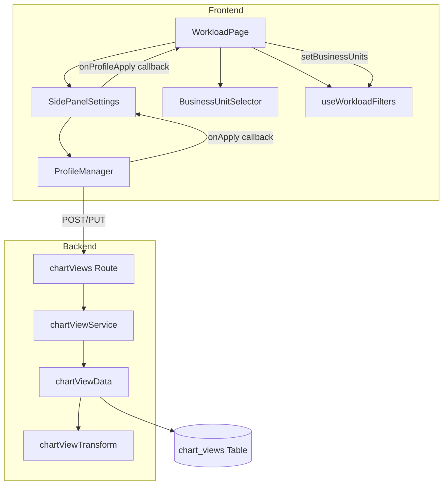
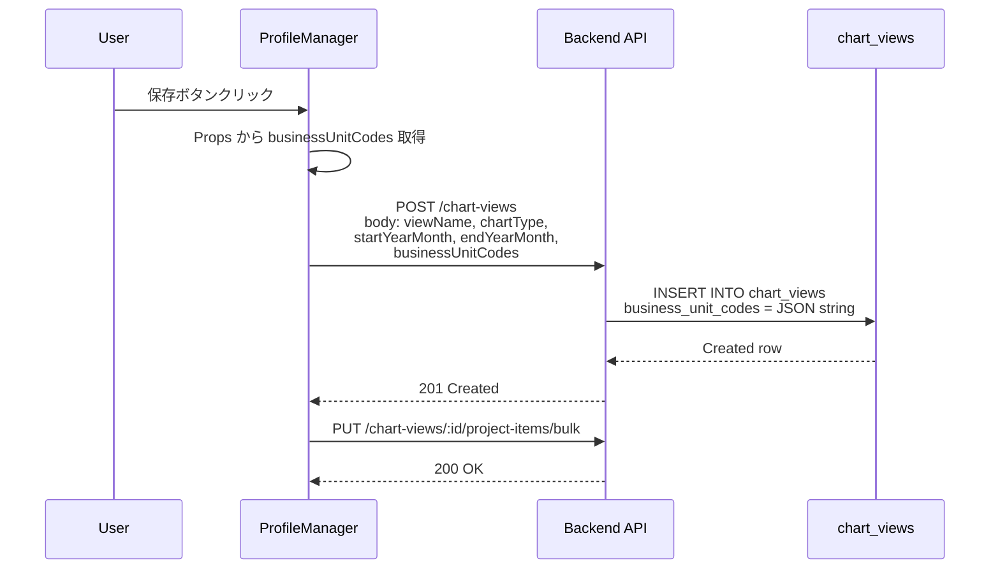
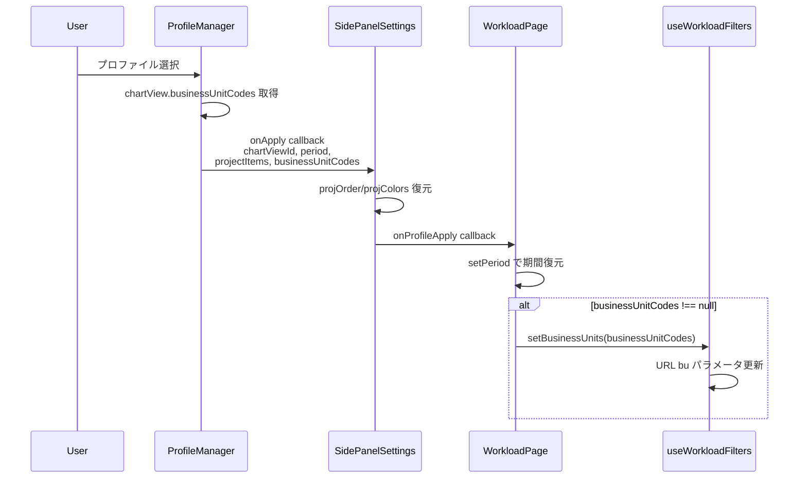
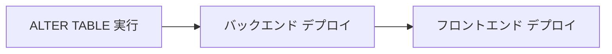

# Workload プロファイルの BU 選択状態同期

> **元spec**: workload-profile-bu-sync

## 概要

workload 画面のプロファイル（chart_views）に Business Unit 選択状態を保存・復元する機能を追加し、プロファイル1つの操作で以前の表示状態を完全に再現可能にする。

- **ユーザー**: 操業管理者・事業部リーダーが workload チャートのプロファイル管理で利用
- **影響範囲**: 既存の chart_views テーブルに `business_unit_codes` カラムを追加し、フロントエンド〜バックエンドの CRUD スタック全体で BU コードを受け渡す。既存プロファイルへの後方互換性を維持
- **本機能はフィールド追加であり、アーキテクチャの変更は発生しない**

### Non-Goals

- BU コードによるプロファイルのフィルタリング・検索機能
- プロファイルのユーザー間共有・権限管理
- BU マスタの存在チェックバリデーション（フロントエンドが選択肢を制御するため不要）

## 要件

### 要件1: プロファイル保存時の BU 選択状態の永続化

新規保存時に現在選択中の BU コード一覧をプロファイルデータに含めて保存。上書き保存時も BU コード一覧を更新。BU が1つも選択されていない場合は空配列として保存。

### 要件2: プロファイル適用時の BU 選択状態の復元

BU コードを含むプロファイル適用時に BusinessUnitSelector の選択状態を復元。URL Search Params（`bu` パラメータ）にも反映。BU 変更により TanStack Query がチャートデータを自動再取得。

### 要件3: 後方互換性

`businessUnitCodes` が null の既存プロファイル適用時は、現在の BU 選択状態を変更せずに維持。API は `businessUnitCodes` をオプショナル（nullable）として扱う。旧データの上書き保存時に現在の BU 選択状態を新たに追加保存。

### 要件4: データストレージの拡張

`chart_views` テーブルに `business_unit_codes` カラム（NVARCHAR(MAX)、NULL 許容）を追加。API は JSON 文字列配列として受け取り、DB 保存時に JSON 文字列にシリアライズ。取得時はデシリアライズして配列で返却。Zod スキーマでバリデーション。

### 要件5: 型安全性の維持

バックエンド・フロントエンド双方の型定義に `businessUnitCodes` フィールドを追加。Zod スキーマは `z.array(z.string()).optional()` として定義。

## アーキテクチャ・設計



- 既存レイヤードアーキテクチャの拡張（新規コンポーネントなし）
- workload feature 内で完結。他 feature への影響なし

| Layer | Technology | Notes |
|-------|-----------|-------|
| Frontend | React 19 + TanStack Query | ProfileManager Props 拡張 |
| Backend | Hono v4 + Zod v4 | スキーマにフィールド追加 |
| Data | SQL Server (mssql) | ALTER TABLE + CRUD SQL 更新、NVARCHAR(MAX) JSON |

### プロファイル保存フロー



### プロファイル適用フロー



## コンポーネント設計

### Backend / Types

```typescript
// createChartViewSchema / updateChartViewSchema への追加フィールド
// businessUnitCodes: z.array(z.string()).optional()

// ChartViewRow への追加
interface ChartViewRow {
  // ...existing fields...
  business_unit_codes: string | null; // JSON string in DB
}

// ChartView への追加
interface ChartView {
  // ...existing fields...
  businessUnitCodes: string[] | null;
}
```

### Backend / Data

- `BASE_SELECT` に `business_unit_codes` を追加
- `create()` の INSERT 文に `business_unit_codes` パラメータを追加（`JSON.stringify()` で文字列化）
- `update()` の動的 SET 句に `business_unit_codes` を追加
- `businessUnitCodes` が undefined の場合は null を INSERT

### Backend / Transform

```typescript
function toChartViewResponse(row: ChartViewRow): ChartView {
  // ...existing mapping...
  // businessUnitCodes: row.business_unit_codes
  //   ? JSON.parse(row.business_unit_codes)
  //   : null
}
```

- null の場合は null をそのまま返す
- JSON パースエラーの場合は null にフォールバック（防御的プログラミング）

### Frontend / Types

```typescript
interface ChartView {
  // ...existing fields...
  businessUnitCodes: string[] | null;
}

interface CreateChartViewInput {
  // ...existing fields...
  businessUnitCodes?: string[];
}

interface UpdateChartViewInput {
  // ...existing fields...
  businessUnitCodes?: string[];
}
```

### Frontend / ProfileManager

```typescript
interface ProfileManagerProps {
  chartType: string;
  startYearMonth: string;
  endYearMonth: string;
  projectItems: BulkUpsertProjectItemInput[];
  businessUnitCodes: string[];  // 追加
  onApply?: (profile: {
    chartViewId: number;
    startYearMonth: string;
    endYearMonth: string;
    projectItems: BulkUpsertProjectItemInput[];
    businessUnitCodes: string[] | null;  // 追加
  }) => void;
}
```

- 保存時: `businessUnitCodes` が空配列の場合もそのまま送信
- 適用時: ChartView レスポンスの `businessUnitCodes` をそのまま返す（null の場合あり）

### Frontend / WorkloadPage

```typescript
const handleProfileApply = useCallback(
  (profile: {
    // ...existing fields...
    businessUnitCodes: string[] | null;
  }) => {
    setPeriod(profile.startYearMonth, months);
    if (profile.businessUnitCodes !== null) {
      setBusinessUnits(profile.businessUnitCodes);
    }
  },
  [setPeriod, setBusinessUnits],
);
```

- `setBusinessUnits` → URL 更新 → TanStack Query 自動再取得
- `businessUnitCodes === null` の場合は BU 選択状態を維持（後方互換）

## データモデル

```sql
ALTER TABLE chart_views
ADD business_unit_codes NVARCHAR(MAX) NULL;
```

- **型**: NVARCHAR(MAX) -- JSON 文字列を格納
- **NULL 許容**: 既存レコードとの後方互換性
- **格納形式**: `'["BU001","BU002"]'` または `NULL`
- **インデックス**: 不要

### API データ転送

| Field | Type | Required | Description |
|-------|------|----------|-------------|
| businessUnitCodes (Request) | string[] | No | 各要素が string |
| businessUnitCodes (Response) | string[] \| null | - | null は旧データ |

**シリアライズ**:
- Request → DB: `JSON.stringify(businessUnitCodes)` → NVARCHAR(MAX)
- DB → Response: `JSON.parse(business_unit_codes)` → string[] | null

### マイグレーション戦略



1. ALTER TABLE: NULL 許容のため既存データに影響なし
2. バックエンドデプロイ: 旧フロントエンドからの businessUnitCodes なしリクエストも受付
3. フロントエンドデプロイ: businessUnitCodes を送信・復元する UI をデプロイ

## エラーハンドリング

| Category | Condition | Response |
|----------|----------|----------|
| User Error | businessUnitCodes に不正な型 | Zod バリデーションエラー（400） |
| System Error | JSON パースエラー（DB の不正データ） | Transform 層で null にフォールバック |

## ファイル構成

```
apps/backend/src/
├── types/chartView.ts                  # スキーマに businessUnitCodes 追加
├── data/chartViewData.ts               # CRUD SQL に カラム追加
└── transform/chartViewTransform.ts     # JSON ↔ 配列変換追加

apps/frontend/src/
├── features/workload/
│   ├── types/index.ts                  # ChartView 型に businessUnitCodes 追加
│   └── components/
│       ├── ProfileManager.tsx          # Props + 保存/適用ロジック更新
│       └── SidePanelSettings.tsx       # BU コード受け渡し追加
└── routes/workload/index.tsx           # handleProfileApply に BU 復元追加
```
